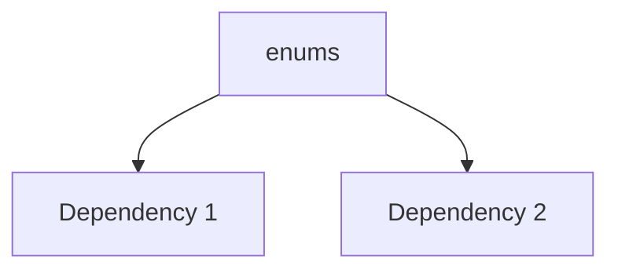

---
tags:
  - secinterp
  - code-walkthrough
  - core      # core | gui | exporters
  - general     # services | managers | renderers | adapters | validation | etc.
aliases:
  - enums.py  # e.g. path_resolver.py
  - enums     # e.g. resolve_export_path
cssclass: secinterp-note
# note_lines: 700      # optional: ceiling > 500 for high-importance modules (max 700)
---

# `core/domain/enums.py`

> [!abstract] One-line summary
> Package `core/domain/` (2 files): `enums`, `spatial_meta` — what this module does in one sentence, without touching QGIS if it is core.

**Path**: `core/domain/enums.py` (22 lines)
**Main class/function**: `enums`
**Layer**: core (QGIS-agnostic / GUI · Type)
**Tags**: #secinterp #core #general

---

## 🎯 Why does this file exist?

| Problem | Solution |
|---------|----------|
| (pending) | (pending) |
| (pending) | (pending) |

> [!important] Architectural note
> QGIS-agnóstico (e.g. "QGIS-agnostic", "Extract Adapter", "Factory").

---

## 🧬 Relationship diagram



> [!tip] How to read
> Solid arrow = imports/delegates; dashed = callback/injected.

---

## 📦 Imports — architectural reading

```python
# enums.py
from __future__ import annotations
from enum import IntEnum
```

| # | Observation |
|---|-------------|
| ① | (pending) |
| ② | (pending) |

---

## 🏗️ Structure inventory

**Clases:** `class FieldType` — 0 métodos

---

## 📁 Files in the package

| File | Lines | Role |
|---|--:|---|
| `enums.py` | 22 | Package `core/domain/` (2 files): `enums`, `spatial_meta` |
| `spatial_meta.py` | 48 | Spatial Meta Data for 3D and 2D projections. |

---

## 📖 Method-by-method walkthrough

### `method_1`

```python
# (enriquecer)
```

_(enriquecer leyendo el fuente)_

### `method_2`

```python
# (enriquecer)
```

_(enriquecer leyendo el fuente)_

<!-- Add one subsection per public method of the module -->

---

## 🔄 Data flow

| Phase | Input | Transformation | Output |
|-------|-------|----------------|--------|
| - | - | - | - |
| - | - | - | - |

---

## 🏛️ Design patterns present

| Pattern | Where | Purpose |
|---------|-------|---------|
| - | - | - |

---

## 🧾 API summary

| Symbol | Signature / Inherits | Typical use |
|--------|----------------------|-------------|
| (no symbols) | `-` | - |

---

## 🛡️ Error handling

_(pending)_

---

## 🧪 Associated tests

_(pending)_

---

## 👀 Observations and notes

> [!success] Strengths
> - (skeleton)

> [!warning] Points of attention
> - (skeleton)

> [!question] Open questions
> - (skeleton)

---

## 🔗 Related notes

- [[Index]] — vault index
- [[Index]] — index
- [[controller]] — orchestrator

---

*Note of the SecInterp Code Walkthrough v2 vault — v3.8.0*
