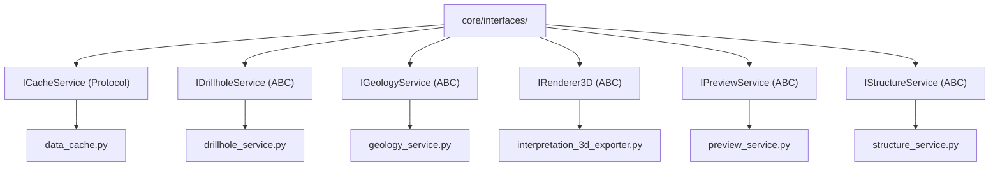

---
tags:
  - secinterp
  - code-walkthrough
  - core
  - interfaces
  - ports
aliases:
  - core/interfaces/
  - ICacheService
  - IDrillholeService
  - IGeologyService
  - IRenderer3D
  - IPreviewService
  - IStructureService
cssclass: secinterp-note
---

# `core/interfaces/` — Service Contracts (Ports)

> [!abstract] One-line summary
> Package declaring the core **ports** (contracts): ABCs and Protocols that define *what* each service must be able to do, so that `controller`, GUI and exporters depend on contracts rather than implementations.

**Path**: `core/interfaces/` (7 files, ~148 lines)
**Main classes**: `ICacheService`, `IDrillholeService`, `IGeologyService`, `IRenderer3D`, `IPreviewService`, `IStructureService`
**Layer**: Core (QGIS-agnostic)
**Tags**: #secinterp #core #interfaces #ports

---

## 🎯 Why does this package exist?

Clean Architecture demands that the core **not depend** on concrete classes. The
interfaces are the dependency-inversion boundary:

| Problem | Solution |
|---------|----------|
| The `controller` must not couple to concrete services | It depends on `I*Service` (abstraction) |
| Exporters/renderers need a stable contract | `IRenderer3D`, and services via `I*` |
| The cache must be replaceable without breaking consumers | `ICacheService` as a `Protocol` |

> [!important] Layer rule
> No file imports `qgis.*`. Types are `Any` or domain DTOs (`DrillholeContext`,
> `GeologyContext`, `PreviewResult`). They are **ports** in the Port/Adapter pattern.

---

## 🧬 Relationship diagram



> [!tip] How to read
> The (dashed) implementation arrows point from the contract to the **real
> implementor**. Consumers import only the contract (`from ...interfaces import I...`).

---

## 📦 Imports — architectural reading

```python
# core/interfaces/cache_interface.py
from typing import Any, Protocol, runtime_checkable

# core/interfaces/drillhole_interface.py
from abc import ABC, abstractmethod
from sec_interp.core.domain.task_inputs import DrillholeContext

# core/interfaces/structure_interface.py
from collections.abc import Callable
```

| # | Observation |
|---|-------------|
| ① | `Protocol` + `runtime_checkable` (only `ICacheService`) → **structural** typing. |
| ② | `ABC` + `abstractmethod` (the rest) → **nominal** typing with inheritance. |
| ③ | Signatures use domain DTOs and `Callable` (elevation callback), not QGIS types. |

> [!note] Two contract styles coexist
> `ICacheService` is a `Protocol` (no inheritance required), while the rest are `ABC`.
> This mix is intentional: the cache is more flexible (composable).

---

## 🏗️ Structure inventory

**Classes (contracts):**
- `class ICacheService` — `Protocol`, 5 methods
- `class IDrillholeService` — `ABC`, 1 method
- `class IGeologyService` — `ABC`, 1 method
- `class IRenderer3D` — `ABC`, 2 methods
- `class IPreviewService` — `ABC`, 1 method
- `class IStructureService` — `ABC`, 1 method

**Functions/Methods:**
- `ICacheService.get(...)`, `.set(...)`, `.invalidate(...)`, `.clear()`, `.get_metadata(...)`
- `IDrillholeService.process_context(...)`
- `IGeologyService.build_segments(...)`
- `IRenderer3D.render_3d(...)`, `.clear()`
- `IPreviewService.generate_all(...)`
- `IStructureService.project_structures(...)`

---

## 📁 Files in the package

| File | Lines | Role |
|---|--:|---|
| `__init__.py` | 3 | Package docstring; no re-exports |
| [[#ICacheService\|cache_interface.py]] | 62 | `ICacheService` — cache Protocol |
| [[#IDrillholeService\|drillhole_interface.py]] | 26 | `IDrillholeService` — drillhole processing |
| [[#IGeologyService\|geology_interface.py]] | 26 | `IGeologyService` — geological segments |
| [[#IRenderer3D\|i_renderer_3d.py]] | 31 | `IRenderer3D` — 3D rendering |
| [[#IPreviewService\|preview_interface.py]] | 25 | `IPreviewService` — consolidated preview |
| [[#IStructureService\|structure_interface.py]] | 37 | `IStructureService` — structural projection |

---

## 📖 Contract-by-contract walkthrough

### ICacheService

```python
@runtime_checkable
class ICacheService(Protocol):
    def get(self, bucket: str, key: str) -> Any | None: ...
    def set(self, bucket: str, key: str, data: Any, metadata: dict | None = None) -> None: ...
    def invalidate(self, bucket: str | None = None, key: str | None = None) -> None: ...
    def clear(self) -> None: ...
    def get_metadata(self, bucket: str, key: str) -> dict[str, Any] | None: ...
```

Contract for the **bucket**-based cache (namespaces: `topo`, `geol`, `struct`, `drill`).
`runtime_checkable` enables `isinstance(obj, ICacheService)` at runtime.

> [!tip] `get`/`set`/`invalidate` is the cache-aside pattern
> `invalidate(bucket=None, key=None)` supports granularity: everything, one bucket, or
> a specific key. `layer_notification_manager` uses it when a layer changes.

### IDrillholeService

```python
class IDrillholeService(ABC):
    @abstractmethod
    def process_context(self, context: DrillholeContext, feedback: Any | None = None) -> Any: ...
```

Receives an already-detached `DrillholeContext` (output of the Extract phase) and
returns `(geol_data, drillhole_data)`. The `feedback` parameter propagates
**progress/cancellation**.

### IGeologyService

```python
class IGeologyService(ABC):
    @abstractmethod
    def build_segments(self, context: GeologyContext, feedback: Any | None = None) -> Any: ...
```

Builds `GeologySegment`s from a pure `GeologyContext`. Reinforces
**Extract-then-Compute**.

### IRenderer3D

```python
class IRenderer3D(ABC):
    @abstractmethod
    def render_3d(self, data: PreviewResult, **kwargs: Any) -> bool: ...
    @abstractmethod
    def clear(self) -> None: ...
```

Contract for 3D rendering engines. Receives the `PreviewResult` (with `SpatialMeta`)
and delegates options via `**kwargs`. `clear()` releases the scene.

### IPreviewService

```python
class IPreviewService(ABC):
    @abstractmethod
    def generate_all(self, params: Any, transform_context: Any, **kwargs: Any) -> Any: ...
```

Preview orchestrator. `transform_context` is a `QgsCoordinateTransformContext`
(map settings) typed as `Any` to **avoid importing QGIS** in the contract.

### IStructureService

```python
class IStructureService(ABC):
    @abstractmethod
    def project_structures(
        self,
        line_points: list[tuple[float, float]],
        struct_data: list[dict[str, Any]],
        elevation_sampler: Callable[[float, float], float],
        line_az: float,
        dip_field: str,
        strike_field: str,
    ) -> Any: ...
```

The richest contract. Receives section vertices, detached structures and an
**`elevation_sampler`** (callback) that the core invokes without knowing the raster.

> [!important] `elevation_sampler` = Strategy/callback
> The core does not know how to sample elevations from a raster; it only calls
> `elevation_sampler(x, y)`. The GUI injects a closure. See [[structure_service]] and [[controller]].

---

## 🔄 Data flow

| Phase | Input | Transformation | Output |
|-------|-------|----------------|--------|
| Contract | — (only defines shape) | method signature | — |
| Implementation (GUI) | QGIS layers | Extract → context/DTO | `DrillholeContext`, `GeologyContext`, `PreviewResult` |
| Implementation (Core) | context/DTO | Pure Compute | `GeologySegment`, `StructureData`, `PreviewResult` |

---

## 🧩 How to implement each port

Each contract has a **real implementor** today in the code, and a **direction** in the
architecture:

| Contract | Real implementor | Side | Note |
|----------|------------------|------|------|
| `ICacheService` | `core/data_cache.py::DataCache` | Core | The only `Protocol`; satisfied by shape |
| `IDrillholeService` | `core/services/drillhole_service.py::DrillholeService` | Core | Receives detached `DrillholeContext` |
| `IGeologyService` | `core/services/geology_service.py::GeologyService` | Core | `build_segments` is pure Compute |
| `IStructureService` | `core/services/structure_service.py::StructureService` | Core | `elevation_sampler` injected by GUI |
| `IPreviewService` | `core/services/preview_service.py::PreviewService` | Core | Orchestrates topo + structures |
| `IRenderer3D` | `exporters/interpretation_3d_exporter.py` | Exporters | Renders `PreviewResult` in 3D |

> [!tip] Golden rule
> The **context** (`DrillholeContext`, `GeologyContext`) is the boundary: the GUI
> produces it (Extract), the core consumes it (Compute). A `QgsVectorLayer` never crosses.

---

## 🔬 `Protocol` vs `ABC` — selection criterion

| Criterion | `Protocol` (`ICacheService`) | `ABC` (rest) |
|-----------|------------------------------|--------------|
| Typing | Structural (shape is enough) | Nominal (must inherit) |
| `isinstance` | Yes, with `runtime_checkable` | Yes, always |
| Multiple inheritance | Not required | Possible via ABC |
| When to use | Replaceable by composition (cache, mocks) | Service contracts with a rigid signature |

> [!note] `runtime_checkable` only in `ICacheService`
> It enables `isinstance(obj, ICacheService)` at runtime. The rest, being `ABC`,
> already support `isinstance` natively.

---

## 🏛️ Design patterns present

| Pattern | Where | Purpose |
|---------|-------|---------|
| **Port / Adapter (Hexagonal)** | whole package | Decouple the core from implementations |
| **Dependency Inversion** | `I*` consumers | Depend on abstractions |
| **Protocol (structural typing)** | `ICacheService` | Contract without mandatory inheritance |
| **Template (abstract base)** | `IDrillholeService`, etc. | Fix the signature the service must fulfil |
| **Strategy (callback)** | `elevation_sampler` | Inject elevation sampling |

---

## 🧾 API summary

| Symbol | Signature / Inherits | Typical use |
|--------|----------------------|-------------|
| `ICacheService` | `Protocol` | `get/set/invalidate/clear/get_metadata` |
| `IDrillholeService.process_context` | `(context, feedback=None) -> Any` | Process drillholes |
| `IGeologyService.build_segments` | `(context, feedback=None) -> Any` | Geological segments |
| `IRenderer3D.render_3d` / `.clear` | `(data, **kwargs) -> bool` | 3D rendering |
| `IPreviewService.generate_all` | `(params, transform_context, **kwargs) -> Any` | Consolidated preview |
| `IStructureService.project_structures` | `(line_points, struct_data, elevation_sampler, ...) -> Any` | Structural projection |

---

## 🛡️ Error handling

The contracts **handle no errors**: they only declare signatures. The implicit contract is:

- The implementor must raise the `SecInterpError` hierarchy on domain failures.
- `feedback` enables **cooperative cancellation** without control-flow exceptions.

---

## 🧪 Associated tests

Tests exercise implementations with **mocks** of the contracts (Mock-first):

- `tests/core/test_data_cache.py` — verifies `DataCache` satisfies `ICacheService`.
- `tests/core/test_structure_service.py` — injected `elevation_sampler` mock.
- `tests/core/test_geology_service.py` — mock `GeologyContext` (no QGIS).

---

## 🔄 Feedback and cooperative cancellation

Three contracts (`IDrillholeService`, `IGeologyService` and, in practice, the others)
accept a `feedback: Any | None`:

| Aspect | Detail |
|--------|--------|
| **Origin** | The GUI injects the real `QgsTask`/feedback, typed as `Any` |
| **Progress** | The service reports progress (`setProgress`) without importing Qt |
| **Cancellation** | The service checks `isCanceled()` and returns partial results |
| **Thread-safety** | The core never creates the feedback; it only queries it ⇒ safe for `QgsTask` |

> [!important] Why `Any` and not `QgsTask`
> Typing it as `QgsTask` would force importing `qgis.core` in the contract, breaking the
> core's QGIS-agnostic rule. `Any` + duck typing keeps the boundary clean.

---

## ✅ Contract conformance verification

| Verification | Mechanism |
|--------------|-----------|
| Inherits from `ABC` | `issubclass(DrillholeService, IDrillholeService)` |
| Satisfies `Protocol` | `isinstance(DataCache(), ICacheService)` (with `runtime_checkable`) |
| Correct signature | `inspect.signature` / resolved-`abstractmethod` test |
| No QGIS in core | import analysis (ruff / analyzer) |

> [!tip] Mock-first
> In tests, consumers (e.g. `controller`) are tested by injecting **mocks** that satisfy
> the contract, not the real implementations. See `tests/base_test.py`.

---

## 📐 Contracts ↔ domain DTOs

Each contract "signs" its parameters with **a domain DTO**:

| Contract | Input DTO | Output DTO (implicit) |
|----------|-----------|-----------------------|
| `IDrillholeService` | `DrillholeContext` | `(geol_data, drillhole_data)` |
| `IGeologyService` | `GeologyContext` | `GeologyData` (list of `GeologySegment`) |
| `IStructureService` | `struct_data` + `Callable` | `StructureData` (list of `StructureMeasurement`) |
| `IPreviewService` | `PreviewParams` (`Any`) | `PreviewResult` |
| `IRenderer3D` | `PreviewResult` | `bool` (render success) |
| `ICacheService` | `bucket` + `key` (primitives) | `Any` / `None` |

> [!note] DTOs are the core's currency
> See [[domain]] (`DrillholeContext`, `GeologyContext` in `task_inputs.py`;
> `PreviewResult`, `SpatialMeta` in `dtos.py`). No contract mentions a QGIS layer.

---

## 🧩 When to create a new contract

A rule of thumb for deciding whether a new service deserves its own interface:

| Criterion | Interface | Concrete class |
|-----------|:---:|:---:|
| Has multiple implementations | ✅ | — |
| Is mocked in consumer tests | ✅ | — |
| Is an external extension point | ✅ | — |
| Is a single-use internal utility | — | ✅ |

> [!tip] Keep the list small
> One interface per class generates noise. Only add `I*` when there is a concrete
> reason (substitution, mock, extension). That is why the package has only 6 contracts.

---

## 👀 Observations and notes

> [!success] Strengths
> - Clean Core/GUI separation: contracts use DTOs and `Any`, never QGIS.
> - `ICacheService` as `Protocol` allows trivial mocks and substitutes.
> - Consistent, complete per-method documentation (docstrings).

> [!warning] Points of attention
> - Mixing `Protocol` and `ABC` may confuse: no explicit criterion for when to use each.
> - `Any` in returns (`process_context -> Any`) dilutes typing; they could be concrete DTOs.
> - `transform_context` (a QGIS object) crosses into the core typed as `Any`.

> [!question] Open questions
> - Unify all contracts to `Protocol` (or to `ABC`) for consistency?
> - Type the returns with concrete DTOs (`GeologyData`, `StructureData`) instead of `Any`?

---

## 🔗 Related notes

- [[Index]] — vault index
- [[layer_core_interfaces]] — layer note for this package
- [[data_cache]] — implements `ICacheService`
- [[drillhole_service]] / [[geology_service]] / [[structure_service]] / [[preview_service]] — implementors
- [[controller]] — main consumer of the contracts
- [[domain]] — DTOs used in the signatures (`DrillholeContext`, `GeologyContext`, `PreviewResult`)

---

*Note of the SecInterp Code Walkthrough v2 vault — v3.8.0*
