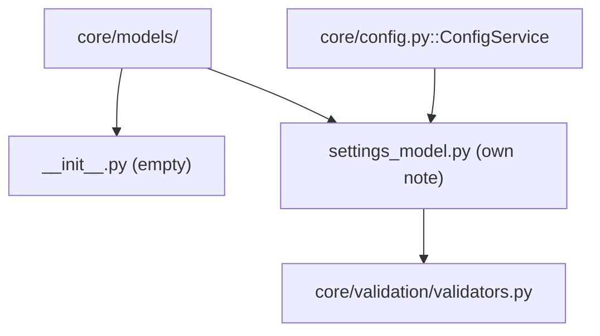

---
tags:
  - secinterp
  - code-walkthrough
  - core
  - models
aliases:
  - core/models/
  - core/models/__init__.py
  - models
cssclass: secinterp-note
---

# `core/models/` — Models Namespace

> [!abstract] One-line summary
> Package `core/models/` (1 file): `__init__.py` — the **namespace** of the core's configuration models; today it only contains an empty `__init__.py` because its only real module, `settings_model.py`, has its own note.

**Path**: `core/models/` (1 file, 0 lines)
**Main class/function**: *(none — empty `__init__.py`)*
**Layer**: Core (QGIS-agnostic)
**Tags**: #secinterp #core #models

---

## 🎯 Why does this package exist?

`core/models/` exists for **semantic organization**, not functional need: it groups the
types that represent the plugin's **state/data models**, distinguishing them from the core's
services, utilities and validators.

| Problem | Solution |
|---------|----------|
| Separate "data models" from "logic" | `core/models/` folder as a namespace |
| The configuration model needs a home | `settings_model.py` lives here |
| Avoid mixing settings with services/utils | Division by responsibility |
| Allow growth (more models) without moving anything | Empty package ready to grow |

> [!important] Architectural note — namespace, not implementation
> The `__init__.py` is **empty on purpose**: the package is not a facade (unlike
> `core/domain/__init__.py`, which re-exports 24 symbols). Its value is purely
> **structural**: to declare that the core's data models live here.

---

## 🧬 Relationship diagram



> [!tip] How to read
> Solid = contains/imports. The package contains `__init__.py` (empty) and
> `settings_model.py` (which depends on `validators`). `ConfigService` imports
> `PluginSettings` directly from `settings_model.py`, **without** going through `__init__`.

---

## 📦 Imports — architectural reading

```python
# core/models/__init__.py
# (empty — 0 lines, no imports, no docstring)
```

| # | Observation |
|---|-------------|
| ① | No `from __future__ import annotations` — not even that (truly empty file). |
| ② | No re-exports — consumers import `from ...settings_model import ...` directly. |
| ③ | No package docstring — unlike `core/domain/__init__.py` and `core/__init__.py`. |

> [!note] Contrast with `core/domain/__init__.py`
> `domain/__init__.py` (68 lines) is a **facade** with `__all__`. `models/__init__.py`
> (0 lines) is a **pure namespace**. Two package styles coexist in the core intentionally.

---

## 🏗️ Structure inventory

**Classes:** none (the `__init__.py` defines nothing).

**Functions/Methods:** none.

**Re-exports:** none.

> [!warning] Do not fabricate symbols
> This package does **not** define `PluginSettings` or any other symbol in its
> `__init__.py`. All real symbols live in `settings_model.py` and are documented in
> [[settings_model]]. Any `from sec_interp.core.models import ...` would fail today.

---

## 📁 Files in the package

| File | Lines | Role |
|------|--:|---|
| [[#__init__.py|__init__.py]] | 0 | Package marker (namespace), empty |

> [!note] `settings_model.py` is in [[settings_model]]
> On disk, `core/models/` also contains `settings_model.py` (179 lines), but that module is
> documented in its own note (Tier A). This package note lists only the `__init__.py`
> (0 lines) to avoid duplicating content.

---

## 📖 Walkthrough

### `__init__.py`

```python
# (empty file — 0 lines)
```

The file is **literally empty**: no imports, no `__all__`, no docstring. Its only function
is to make `core/models/` recognized as an importable Python **package** (namespace marker).

> [!important] Why empty is correct here
> There is nothing to "re-export": there is only one real module (`settings_model.py`) and
> consumers import it by its full name. An `__init__` with re-exports would be redundant and
> add a layer of indirection without benefit.

### What lives here (on disk)?

Although the `__init__.py` is empty, the package on disk contains:

```
core/models/
└── settings_model.py     # 179 lines → own note [[settings_model]]
```

`settings_model.py` defines 9 dataclasses (`PluginSettings` and 8 sub-models), documented
in depth in its note. It is only referenced here.

### Relationship with `settings_model.py`

| Aspect | Detail |
|--------|--------|
| **Belonging** | `settings_model.py` is the only module of the `core/models/` namespace |
| **Dependency** | `settings_model` imports `validate_and_clamp` from `core/validation/validators` |
| **Consumer** | `ConfigService` (in `core/config.py`) builds `PluginSettings` |
| **Typical import** | `from sec_interp.core.models.settings_model import PluginSettings` |

> [!tip] Direct import, not via package
> Unlike the domain (`from sec_interp.core.domain import GeologyContext`), here you import
> **the full module**: `from ...models.settings_model import PluginSettings`. It is the
> natural consequence of not having a facade in `__init__`.

---

## 🔄 Data flow

| Phase | Input | Transformation | Output |
|-------|-------|----------------|--------|
| (conceptual) | — | — | — |

> [!note] No data flow of its own
> Having no code, the package transforms no data. The real flow (configuration →
> validated `PluginSettings`) belongs to [[config]] and [[settings_model]].

---

## 🏛️ Design patterns present

| Pattern | Where | Purpose |
|---------|-------|---------|
| **Namespace package (marker)** | empty `__init__.py` | Declare `core/models/` as a package |
| **Package-by-layer** | `core/models/` | Group models separate from logic |
| **(absence of) Facade** | no `__all__` | No re-exports: direct module imports |

> [!note] Package-by-layer vs package-by-feature
> `core/` organizes by **layer/responsibility** (`models/`, `services/`, `utils/`,
> `validation/`, `interfaces/`), not by feature. `core/models/` is one more piece of that
> strategy: "data" goes here, not "logic".

---

## 🧾 API summary

| Symbol | Signature / Inherits | Typical use |
|--------|----------------------|-------------|
| *(none)* | — | — |

> [!warning] Empty API by design
> This package **exposes no API**. The real models API is in [[settings_model]]
> (`PluginSettings`, `SectionSettings`, `DemSettings`, …). Nothing should be imported from
> `core.models` directly.

---

## 🛡️ Error handling

No code → no error handling. The only "risk" is **misuse** by a developer who assumes that
`core.models` re-exports `PluginSettings` (as `core.domain` does). That import would raise
`ImportError`.

---

## 🧪 Associated tests

No `test_core_models.py` for the empty `__init__.py` (nothing to test). The package's real
behavior is covered in:

- `tests/core/test_settings_model.py` — validates `PluginSettings` and sub-models.
- `tests/core/test_config.py` / `test_config_integration.py` — use `PluginSettings` via `ConfigService`.

---

## 📐 `__init__.py` conventions in the core

Comparing the core's `__init__.py` files to understand when a package is a facade and when
it is a namespace:

| Package | `__init__.py` | Style |
|---------|--------------|-------|
| `core/` | 6 lines (docstring) | Package docstring, no re-exports |
| `core/domain/` | 68 lines (`__all__`) | **Facade** (re-exports 24 symbols) |
| `core/models/` | 0 lines (empty) | **Namespace** (pure marker) |
| `core/interfaces/` | 3 lines (docstring) | Docstring, no re-exports |

> [!tip] Practical rule
> - **Facade** if the package groups many types that consumers want to import at once
>   (domain).
> - **Namespace** if there is only one module or consumers import concrete modules
>   (models, interfaces).
> - **Docstring** if it is worth describing the package's purpose itself (root core).

---

## 🔮 Growth directions

Today there is only one model. If the plugin grows, `core/models/` could host:

- `export_settings.py` — if `ExportSettings` splits from `settings_model.py`.
- `project_settings.py` — per-project (vs global) settings.
- An `__init__.py` with a facade **only if** multiple models arise that consumers want to
  import grouped.

> [!question] When would it stop being a namespace?
> The moment there are **2+ models** with common consumers, an `__init__.py` with `__all__`
> (facade) might be justified, following the `core/domain/` pattern. While there is only
> one, the empty `__init__` is the right choice (YAGNI).

---

## 👀 Observations and notes

> [!success] Strengths
> - Maximum simplicity: an empty namespace is impossible to break.
> - Clearly separates "data" (models) from "logic" (services/utilities).
> - No API surface to maintain.

> [!warning] Points of attention
> - Asymmetry with `core/domain/` (which is a facade) can confuse new developers:
>   `from core.models import X` does not work, but `from core.domain import X` does.
> - `__init__.py` without a package docstring (unlike `core/` and `core/domain/`).

> [!question] Open questions
> - Add a docstring to `__init__.py` (still without re-exports) to document the package's
>   purpose?
> - Document this facade-vs-namespace asymmetry in `docs/ARCHITECTURE_EN.md`?

---

## 📐 Namespace or facade? The design decision

The key question when maintaining this package is: **should `core/models/__init__.py`
re-export `PluginSettings` as `core/domain/` does?** The arguments:

| Argument | Facade (`__all__`) | Namespace (empty) |
|----------|:---:|:---:|
| Number of modules | Justified if 2+ | Correct with 1 module |
| Type usage frequency | High → facade helps | Low/medium → direct import suffices |
| Refactor risk | Facade reduces it | Namespace exposes it |
| Maintenance cost | Must maintain `__all__` | Zero |

> [!note] The current choice is Namespace (YAGNI)
> With a single module (`settings_model.py`), an `__init__` with re-exports would add a layer
> of indirection without tangible benefit. If more models appear in the future, it can
> migrate to a facade following the pattern already proven in `core/domain/`.

---

## 📦 How `settings_model` is imported in the real code

Consumers import **the full module**, not the package. Real repo examples:

```python
# core/config.py
from sec_interp.core.models.settings_model import PluginSettings

# tests/core/test_settings_model.py
from sec_interp.core.models.settings_model import (
    DemSettings,
    PluginSettings,
    PreviewSettings,
    SectionSettings,
    StructureSettings,
)
```

| Consumer | Imported symbols |
|----------|------------------|
| `core/config.py` | `PluginSettings` |
| `tests/core/test_settings_model.py` | `DemSettings`, `PluginSettings`, `PreviewSettings`, `SectionSettings`, `StructureSettings` |

> [!tip] Import the module, never the package
> Note that **nobody** writes `from sec_interp.core.models import PluginSettings` (it would
> fail). The canonical pattern is `from ...models.settings_model import ...`, consistent with
> an empty `__init__.py`.

---

## 📐 The term "model" in SecInterp

Do not confuse `core/models/` with other uses of "model" in the project:

| Use of "model" | Where | Meaning |
|----------------|-------|---------|
| **Configuration models** | `core/models/settings_model.py` | Settings dataclasses |
| **Domain data model** | `core/domain/` | Entities and DTOs (`GeologySegment`, …) |
| **"model" as MVC layer** | GUI | View/controller vs data |

> [!note] `core/models/` ≠ `core/domain/`
> `models/` groups **persistent state** (settings), while `domain/` groups the **business
> types** (entities, DTOs, contexts). They are distinct namespaces with distinct purposes,
> even though both live under `core/`.

---

## 🧭 Comparison with other project namespaces

| Package | Role | `__init__.py` |
|---------|------|---------------|
| `core/models/` | Configuration models | Empty (namespace) |
| `core/domain/` | Business types | Facade (`__all__`) |
| `core/interfaces/` | Service contracts | Docstring, no re-exports |
| `core/` | Layer root | Docstring |

> [!tip] Three `__init__.py` conventions coexist
> The project does not force a single convention: it uses **facade** (domain), **namespace**
> (models) and **docstring** (root, interfaces). The choice depends on the package's content,
> not on a rigid rule.

---

## 🌐 i18n and migration notes

- **No user strings**: the empty `__init__.py` translates nothing.
- **No API surface**: adding models does not break this package; modules are simply added.
- **Possible evolution**: if `export_settings.py`, `project_settings.py`, etc. are created
  with common consumers, migrate to a facade (`__all__`) following `core/domain/`.
- **Documentation**: the emptiness is intentional, but a future developer could mistake it
  for a "leftover TODO"; a package docstring would help avoid that.

---

## 📂 On-disk package tree

View of the package's real state (including the module documented separately):

```
core/models/
├── __init__.py          # 0 lines — namespace marker (this note)
└── settings_model.py    # 179 lines — 9 dataclasses (note: [[settings_model]])
```

> [!note] Only 2 files, one of them empty
> The package is minimal: an empty `__init__.py` and a module with 9 dataclasses. There is no
> versioned `__pycache__` or other modules. All the "substance" is in `settings_model.py`.

---

## 🔬 Why a package and not a loose module?

One might ask: if there is only `settings_model.py`, why not leave it as
`core/settings_model.py` (a loose module) instead of creating a sub-package? Reasons:

| Argument | Detail |
|----------|--------|
| **Semantics** | "models" is a category distinct from "services"/"utils" |
| **Future growth** | More models will land here without reorganizing |
| **Symmetry** | `core/` already organizes by layer (`models/`, `services/`, `validation/`, …) |
| **Readable import** | `...models.settings_model` expresses intent better than `...settings_model` |

> [!tip] Cost of an empty package
> The cost of maintaining an empty `__init__.py` is nearly zero, and the organizational
> benefit is real. Hence the sub-package decision is reasonable even with a single module.

---

## 🔗 Related notes

- [[Index]] — vault index
- [[settings_model]] — the package's only real module (`PluginSettings` and 8 sub-models)
- [[config]] — `ConfigService`, consumer of `PluginSettings`
- [[domain]] — the counterpart: `core/domain/__init__.py` is a facade, not a namespace
- [[core]] — the root `core/` package (another `__init__.py` convention)
- [[core_interfaces]] — another package with a re-export-free `__init__.py`

---

*Note of the SecInterp Code Walkthrough v2 vault — v3.9.1*
