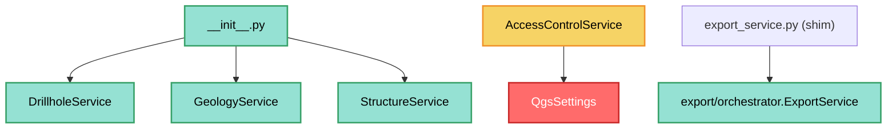

---
tags:
  - secinterp
  - code-walkthrough
  - core
  - services
aliases:
  - core/services/
  - services
  - AccessControlService
  - ExportService
cssclass: secinterp-note
---

# `core/services/` — Domain services

> [!abstract] One-line summary
> Package `core/services/` (3 files): the `__init__` re-exports the main services (`DrillholeService`, `GeologyService`, `StructureService`), `access_control_service` manages permissions via `QgsSettings`, and `export_service` is a compatibility shim.

**Path**: `core/services/` (3 files, ~68 lines)
**Main classes**: `DrillholeService`, `GeologyService`, `StructureService`, `AccessControlService`, `ExportService`
**Layer**: Core (mostly QGIS-agnostic; 1 documented exception)
**Tags**: #secinterp #core #services

---

## 🎯 Why does this package exist?

It groups the geological processing services. These 3 files are the package's
**grouping and compatibility** layer, not the logic itself:

| Problem | Solution |
|---------|----------|
| Expose the main services | `__init__.py` re-exports 3 classes |
| Manage permissions for restricted features | `AccessControlService.can_export_3d()` |
| Keep legacy imports working | `export_service.py` (shim) |

> [!important] Architectural note
> The package is **mostly QGIS-agnostic**, but `access_control_service.py` imports
> `qgis.core.QgsSettings` — a **documented exception** in
> `tests/core/test_architecture_boundary.py`. The other files of the package do not touch QGIS.

---

## 🧬 Relationship diagram



> [!tip] How to read
> `ACS --> QS` (solid, red) marks the only QGIS coupling in the group. The
> `export_service` shim redirects to the real `export/orchestrator`.

---

## 📦 Imports — architectural reading

```python
# core/services/__init__.py
from .drillhole_service import DrillholeService
from .geology_service import GeologyService
from .structure_service import StructureService

# core/services/access_control_service.py
from qgis.core import QgsSettings

# core/services/export_service.py
from sec_interp.core.services.export.orchestrator import ExportService
```

| # | Observation |
|---|-------------|
| ① | `__init__.py` re-exports only 3 services (not `PreviewService` nor `VerticalExaggerationService`). |
| ② | `access_control_service.py` imports `QgsSettings` → **real coupling to `qgis.core`**. |
| ③ | `export_service.py` is a **shim**: re-exports `ExportService` from `export/orchestrator.py`. |
| ④ | The re-exported services live in their own modules (individual notes). |

---

## 🏗️ Structure inventory

**Classes:**
- `class AccessControlService` — 2 methods
- (re-exports) `DrillholeService`, `GeologyService`, `StructureService`, `ExportService`

**Methods of `AccessControlService`:**
- `__init__()` — instantiates `QgsSettings`
- `can_export_3d() -> bool`

**Re-exports (`__init__.py`):**
- `DrillholeService`, `GeologyService`, `StructureService`

---

## 📁 Files in the package

| File | Lines | Role |
|---|--:|---|
| [[#__init__.py\|__init__.py]] | 19 | Re-exports the 3 main services |
| [[#access_control_service.py\|access_control_service.py]] | 36 | `AccessControlService` — permissions via `QgsSettings` |
| [[#export_service.py\|export_service.py]] | 13 | Compatibility shim to `export/orchestrator` |

---

## 📖 File-by-file walkthrough

### __init__.py

```python
"""Services package for geological data processing.
- GeologyService: Geological profile generation
- StructureService: Structural data projection
- DrillholeService: Drillhole projection
"""
from .drillhole_service import DrillholeService
from .geology_service import GeologyService
from .structure_service import StructureService

__all__ = ["DrillholeService", "GeologyService", "StructureService"]
```

Re-exports the 3 services with a descriptive docstring. Allows `from
sec_interp.core.services import DrillholeService` instead of importing the exact module.

> [!note] Why not `PreviewService` / `VerticalExaggerationService`?
> They are not in `__all__`: they are imported by module (`from ...preview_service import
> PreviewService`). This reflects that the package's "canonical" API is the 3 domains.

### access_control_service.py

```python
class AccessControlService:
    def __init__(self) -> None:
        self.settings = QgsSettings()

    def can_export_3d(self) -> bool:
        allowed = self.settings.value("SecInterp/enable_3d", True, type=bool)
        if not allowed:
            logger.info("Access denied for restricted feature: 3D Export")
        return bool(allowed)
```

Reads the `SecInterp/enable_3d` flag from `QgsSettings` (default `True`) and decides
whether the user may export 3D. It is a **permission gate** tied to the UI toggle.

> [!warning] Architectural gray area
> This is the **only** file in the group that imports `qgis.core`. It is listed as a
> **known** exception in `tests/core/test_architecture_boundary.py` (line 49:
> `services/access_control_service.py: {qgis.core}`). It is tolerated because
> `QgsSettings` is the canonical way to persist plugin settings.

### export_service.py

```python
"""Export service shim — maintains backward compatibility."""
from sec_interp.core.services.export.orchestrator import ExportService

__all__ = ["ExportService"]
```

**Pure shim**: defines no logic, only re-exports `ExportService` from the real module
(`export/orchestrator.py`) so that legacy imports
`from sec_interp.core.services.export_service import ExportService` keep working.

---

## 🔄 Data flow

| Phase | Input | Transformation | Output |
|-------|-------|----------------|--------|
| Service import | internal modules | `__init__` re-export | `DrillholeService`, etc. |
| 3D permission | `QgsSettings` | `can_export_3d` | `bool` |
| Export | (shim) | re-export | real `ExportService` |

---

## 🏛️ Design patterns present

| Pattern | Where | Purpose |
|---------|-------|---------|
| **Facade (module)** | `__init__.py` | Package public API |
| **Shim / Adapter** | `export_service.py` | Import compatibility |
| **Feature flag / gate** | `AccessControlService` | 3D export permission |

---

## 🧾 API summary

| Symbol | Signature / Inherits | Typical use |
|--------|----------------------|-------------|
| `DrillholeService` (re-export) | — | Drillholes |
| `GeologyService` (re-export) | — | Geology |
| `StructureService` (re-export) | — | Structures |
| `AccessControlService` | — | Permissions |
| `AccessControlService.can_export_3d` | `() -> bool` | 3D export gate |
| `ExportService` (shim) | — | Export |

---

## 🛡️ Error handling

| Situation | Behaviour |
|-----------|-----------|
| Missing `SecInterp/enable_3d` flag | default `True` (enabled) |
| Flag disabled | `logger.info(...)` + `return False` |

> [!note] No exceptions
> The permission gate is tolerant: in the absence of settings it assumes enabled and
> never raises. The shim also handles no errors (it only re-exports).

---

## 🧪 Associated tests

Mapped (mock-first, no QGIS except the gate):

- `tests/core/services/test_access_control.py` — `can_export_3d` with a mocked `QgsSettings`.
- `tests/core/test_export_service.py` — the shim re-exports `ExportService`.
- `tests/core/test_architecture_boundary.py` — verifies that `access_control_service.py` is the documented `qgis.core` exception.

---

## 👀 Observations and notes

> [!success] Strengths
> - `__init__.py` keeps a stable, minimal API.
> - The `export_service.py` shim preserves import compatibility without duplicating logic.
> - The permission gate centralizes the 3D export policy.

> [!warning] Points of attention
> - `access_control_service.py` breaks the core's "100% QGIS-agnostic" rule (tolerated exception).
> - `PreviewService` and `VerticalExaggerationService` are not in `__all__` (asymmetric API).
> - The shim forces a legacy import path to be kept indefinitely.

> [!question] Open questions
> - Move `AccessControlService` to `gui/` or inject an abstract `settings` to remove the coupling?
> - Add `PreviewService`/`VerticalExaggerationService` to `__all__`?

---

## 🗂️ The full services package

The `core/services/` directory contains **many more** files than the 3 in this group. This
group covers only the grouping/compatibility layer:

| File / subpackage | In this group? | Role |
|-------------------|:---:|------|
| `__init__.py` | ✅ | Re-exports 3 services |
| `access_control_service.py` | ✅ | 3D permissions (gray area) |
| `export_service.py` | ✅ | Compatibility shim |
| `drillhole_service.py` | ❌ | Note [[drillhole_service]] |
| `geology_service.py` | ❌ | Note [[geology_service]] |
| `structure_service.py` | ❌ | Note [[structure_service]] |
| `preview_service.py` | ❌ | Note [[preview_service]] |
| `vertical_exaggeration_service.py` | ❌ | Note [[vertical_exaggeration_service]] |
| `drillhole/` (subpackage) | ❌ | Note [[core_services_drillhole]] |
| `export/` (subpackage) | ❌ | Note [[core_services_export]] |
| `geology/` (subpackage) | ❌ | — |

> [!note] Why only 3 files
> The documented group is the "facade + compatibility + gate". The other services have
> individual notes because of their geological relevance.

## 🔐 3D access and the settings flag

`AccessControlService` implements a semantically low-coupling **permission gate**:

| Aspect | Detail |
|--------|--------|
| **Key** | `"SecInterp/enable_3d"` |
| **Default** | `True` (enabled) |
| **Persistence** | `QgsSettings` (plugin settings) |
| **Consumer** | 3D export button/toggle in the UI |
| **Log** | `logger.info("Access denied...")` only when denied |

> [!warning] The price of the gate
> To read `QgsSettings` the service imports `qgis.core`, making it the only QGIS exception
> in the core (see [[#📦 Imports — architectural reading]]). `test_architecture_boundary.py`
> lists it explicitly as a tolerated exception.

## 📦 The export shim

`export_service.py` redirects to `core/services/export/orchestrator.py`, which is the real
implementation. The full chain:

```text
sec_interp_plugin.py
  └─ from sec_interp.core.services.export_service import ExportService   (legacy)
       └─ from sec_interp.core.services.export.orchestrator import ExportService  (real)
```

| File | Lines | Role |
|------|-------|-----|
| `export_service.py` | 13 | Shim (re-export) |
| `export/orchestrator.py` | — | real `ExportService` |
| `export/map_settings_factory.py` | — | `create_map_settings` (uses `qgis.core`) |
| `export/path_resolver.py` | — | `resolve_export_path`, `get_profile_name` |

> [!tip] Incremental migration
> The shim allows moving the export logic to `export/` without breaking existing imports.
> Once all consumers are migrated, `export_service.py` can be removed.

## 🔄 Comparison of the main services

The 3 re-exported services illustrate three distinct core-service styles:

| Service | State | Contract | Collaborators |
|---------|-------|----------|---------------|
| `GeologyService` | stateless | `IGeologyService` | none (pure utilities) |
| `StructureService` | stateless | `IStructureService` | `elevation_sampler` callback |
| `DrillholeService` | with DI | `IDrillholeService` | 4 processors |

> [!tip] From simple to composite
> Geology is the minimal case; drillholes the orchestrator case; structures the
> "dependency inversion" case. All three comply with **zero QGIS**.

## 🧭 QGIS 4.x migration

| File | QGIS coupling | Migration note |
|------|---------------|----------------|
| `__init__.py` | none | ready for 4.x |
| `export_service.py` | none (shim) | ready for 4.x |
| `access_control_service.py` | `qgis.core.QgsSettings` | review whether `QgsSettings` changes in 4.x |

> [!note] `QgsSettings` is stable
> `QgsSettings` persists settings with Qt; its API is unlikely to change, but as the only
> coupling it is worth watching in the 4.x migration (see `qgis-migration-4x`).

## 🌐 i18n notes

- `AccessControlService` does not use `self.tr()`: the `"Access denied..."` log message is
  in plain English (it is a log, not UI).
- The `__init__.py` docstring is descriptive but not translated (internal).
- The shim contains no user texts.

> [!tip] i18n vs log boundary
> Technical logs are not translated; only visible UI texts are. This group produces no UI
> texts directly.

## 🧭 When to add a service to `__all__`

A practical rule to decide whether a service should be re-exported in `__init__.py`:

| Criterion | Re-export? |
|-----------|:---:|
| It is a central domain (topo/geol/struct/drill) | ✅ |
| It is imported from many consumers | ✅ |
| It is an internal orchestrator (preview) | ❌ (import by module) |
| It is a specialized utility (VE) | ❌ (import by module) |

> [!tip] Keep `__all__` small
> Re-exporting everything creates a noisy API and couples consumers to internal details.
> That is why only 3 services are in `__all__`.

## 🧾 The docstring as a contract

The `__init__.py` docstring informally documents what each service does:

```text
- GeologyService: Geological profile generation
- StructureService: Structural data projection
- DrillholeService: Drillhole projection
```

> [!note] Docstring = package map
> Although `__init__` has no logic, its docstring serves as a readable index for anyone
> exploring `core/services/` without opening each module.

## 🔗 Related notes

- [[Index]] — vault index
- [[drillhole_service]] / [[geology_service]] / [[structure_service]] — re-exported services
- [[preview_service]] / [[vertical_exaggeration_service]] — non-re-exported services
- [[core_services_export]] — the real `export/orchestrator` module
- [[core_services_drillhole]] — the `drillhole/` subsystem
- [[config]] — `ConfigService` (plugin settings)

---

*Note of the SecInterp Code Walkthrough v2 vault — v3.9.0*
