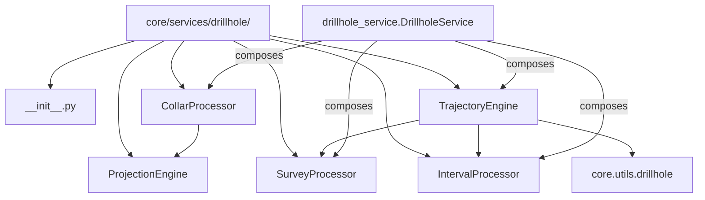

---
tags:
  - secinterp
  - code-walkthrough
  - core
  - services
aliases:
  - core/services/drillhole/
  - drillhole
  - ProjectionEngine
  - SurveyProcessor
  - project_point_to_line
  - determine_final_depth
cssclass: secinterp-note
---

# `core/services/drillhole/` — Drillhole processors package

> [!abstract] One-line summary
> Package `core/services/drillhole/` (6 files): groups the **pure processors** of the drillhole domain — collar projection, final depth, interval interpolation and trajectory orchestration — all QGIS-agnostic and consumed by [[drillhole_service]].

**Path**: `core/services/drillhole/` (6 files, 309 lines)
**Main classes**: `ProjectionEngine`, `SurveyProcessor` (+ `CollarProcessor`, `IntervalProcessor`, `TrajectoryEngine` with their own notes)
**Layer**: Core (QGIS-agnostic)
**Tags**: #secinterp #core #services

---

## 🎯 Why does this package exist?

Processing drillholes is a **four-stage pipeline** (collar → depth → trajectory →
intervals). A single monolithic service would be unreadable and hard to test; splitting
it into small, composable processors lets each stage be tested in isolation:

| Problem | Solution |
|---------|----------|
| Each stage has a distinct responsibility | one class per stage (processors) |
| Trigonometry must not mix with orchestration | `ProjectionEngine` isolates the geometric math |
| The consumer only wants "process a context" | `DrillholeService` composes the processors |

> [!important] Layer rule
> **100 % QGIS-agnostic**: no file imports `qgis.*`. Types are primitives, tuples and
> domain DTOs (`DrillholeProjection`, `GeologySegment`, `SpatialMeta`). The package
> implements the "Compute" side of **Extract-then-Compute**: the GUI extracts the
> `DrillholeContext` (see [[task_inputs]]) and these processors compute it.

---

## 🧬 Relationship diagram



> [!tip] How to read
> Solid arrow = imports/delegates; dashed = composition. `ProjectionEngine` is used by
> `CollarProcessor`; `SurveyProcessor` and `IntervalProcessor` are used by
> `TrajectoryEngine`; `DrillholeService` composes all four.

---

## 📦 Imports — architectural reading

```python
# __init__.py (the only package content besides the docstring)
from __future__ import annotations

# projection_engine.py
import math
from sec_interp.core.utils.geometry_utils.measurement import project_point_onto_polyline

# survey_processor.py
from __future__ import annotations
```

| # | Observation |
|---|-------------|
| ① | `__init__.py` **re-exports nothing**: consumers import each module explicitly (`from ...collar_processor import CollarProcessor`). |
| ② | `projection_engine.py` is the **only** file in the package with `math`: it is the only "own" math (the rest delegates to `core.utils`). |
| ③ | `project_point_onto_polyline` is imported from `geometry_utils.measurement`, reusing the already-tested 2D projection (see [[measurement]]). |
| ④ | `survey_processor.py` imports nothing: pure `max` arithmetic over lists. |

> [!note] Deliberate granularity
> The six files total 309 lines. The split is not by size but by **responsibility**:
> each processor is a replaceable, independently testable unit.

---

## 🏗️ Structure inventory

**Classes (processors):**
- `class ProjectionEngine` — 1 `@staticmethod` (point-to-line projection)
- `class SurveyProcessor` — 1 method (final depth)
- `class CollarProcessor` — 4 methods (collar projection) → [[collar_processor]]
- `class IntervalProcessor` — 1 method (interval interpolation) → [[interval_processor]]
- `class TrajectoryEngine` — 3 methods (per-hole orchestration) → [[trajectory_engine]]

**Functions/Methods (documented in this note):**
- `ProjectionEngine.project_point_to_line(pt, line_points) -> tuple[float, float]`
- `SurveyProcessor.determine_final_depth(given_depth, survey_data, intervals) -> float`

---

## 📁 Files in the package

| File | Lines | Role |
|---|--:|---|
| `__init__.py` | 3 | Package docstring; no re-exports |
| [[#ProjectionEngine\|projection_engine.py]] | 30 | `ProjectionEngine.project_point_to_line` — point-to-line projection |
| [[#SurveyProcessor\|survey_processor.py]] | 15 | `SurveyProcessor.determine_final_depth` — final depth |
| [[collar_processor\|collar_processor.py]] | 100 | `CollarProcessor` — collar projection (own note) |
| [[interval_processor\|interval_processor.py]] | 50 | `IntervalProcessor` — interval interpolation (own note) |
| [[trajectory_engine\|trajectory_engine.py]] | 111 | `TrajectoryEngine` — per-hole orchestration (own note) |

---

## 📖 Method-by-method walkthrough

### ProjectionEngine

```python
class ProjectionEngine:
    @staticmethod
    def project_point_to_line(
        pt: tuple[float, float],
        line_points: list[tuple[float, float]],
    ) -> tuple[float, float]:
        dist_along, nearest = project_point_onto_polyline(pt, line_points)
        offset = math.hypot(pt[0] - nearest[0], pt[1] - nearest[1])
        return dist_along, offset
```

Pure static method: given a section as a list of `(x, y)` vertices and a point, it
returns `(dist_along, offset)`.

| Component | Role |
|-----------|------|
| `project_point_onto_polyline` | computes the **foot** of the perpendicular and the distance travelled along the line |
| `math.hypot(dx, dy)` | Euclidean distance between the point and its foot = perpendicular **offset** |

> [!important] Horizontal projection, basis of the vertical profile
> This is a **Cartesian XY-plane projection**: it does not touch `z`. The resulting
> `dist_along` becomes the profile's horizontal axis and the `offset` is used to discard
> deviated holes far from the section (compared against `buffer_width` in
> [[collar_processor]] and [[trajectory_engine]]). It is the geometric foundation on
> which deviated holes are drawn on the vertical section.

### SurveyProcessor

```python
class SurveyProcessor:
    def determine_final_depth(
        self, given_depth: float, survey_data: list[tuple], intervals: list[tuple]
    ) -> float:
        max_s_depth = max([s[0] for s in survey_data]) if survey_data else 0.0
        max_i_depth = max([i[1] for i in intervals]) if intervals else 0.0
        return max(given_depth, max_s_depth, max_i_depth)
```

Computes the hole's final depth as the **maximum** of three sources:

| Source | Index used | Meaning |
|--------|------------|---------|
| `given_depth` | — | depth declared on the collar |
| `survey_data` | `s[0]` | deepest survey depth |
| `intervals` | `i[1]` | deepest interval `to` |

> [!note] *Downhole* (measured) depth, not true vertical
> These depths are **measured along the hole** (*measured depth*), not true vertical
> depths (*true vertical depth*). TVD is obtained afterwards, in the trajectory, by
> trigonometry (decreasing `z` in `calculate_drillhole_trajectory`, see [[drillhole]]).
> `determine_final_depth` only fixes **how far the hole reaches** so the trajectory can
> be extrapolated/closed.

---

## 🔄 Data flow

| Phase | Input | Transformation | Output |
|-------|-------|----------------|--------|
| Point-to-line projection | `pt` + `line_points` | `project_point_onto_polyline` + `hypot` | `(dist_along, offset)` |
| Final depth | `given_depth`, `survey_data`, `intervals` | `max(...)` | `final_depth` |
| (downstream) | `final_depth`, `point` | `TrajectoryEngine` | `DrillholeProjection` |

> [!tip] Division of responsibilities
> `ProjectionEngine` answers "where does this point fall on the section?" and
> `SurveyProcessor` "how far does this hole reach?". Neither knows the full context nor
> the other. `DrillholeService` and `TrajectoryEngine` combine them.

---

## 🔬 *Downhole* vs true vertical depth

The domain distinguishes two depth concepts that must not be confused:

| Concept | Handled in | Definition |
|---------|-----------|------------|
| **Measured depth (downhole)** | `SurveyProcessor.determine_final_depth` | Length travelled **along** the hole (survey `s[0]`, interval `i[1]`) |
| **True vertical depth (TVD)** | `core/utils/drillhole.py` (trigonometry) | Resulting **vertical** depth (decreasing `z`) |

> [!important] The `max` is over *measured depth*
> `determine_final_depth` returns the maximum **measured** depth. That figure closes
> the trajectory (`total_depth`), and the true vertical (`z`) emerges afterwards by
> trigonometry: in a vertical `-90°` hole, measured and vertical coincide; in a deviated
> one, the vertical is smaller than the measured. See [[drillhole]].

---

## 📐 Relationship to the domain DTOs

The package consumes and produces **only pure DTOs** (see [[dtos]] and [[entities]]):

| DTO | Produced/consumed | Relevant fields |
|-----|-------------------|-----------------|
| `DrillholeProjection` | produced by `CollarProcessor` / `TrajectoryEngine` | `distance`, `elevation`, `offset`, `total_depth`, `points_3d`, `segments` |
| `SpatialMeta` | produced by `TrajectoryEngine` | `dist_along`, `offset`, `z`, `x_3d`, `y_3d`, `x_proj`, `y_proj` |
| `GeologySegment` | produced by `IntervalProcessor` | `unit_name`, `points`, `points_3d`, `points_3d_projected` |

> [!note] No QGIS layer crosses the boundary
> `project_point_to_line` receives `(x, y)` as a tuple and `line_points` as a list of
> tuples: the extractor already flattened all QGIS geometry. This is what lets the
> package be tested without QGIS (see Associated tests).

---

## 🔢 Numeric example

**Projection** — `pt = (50, 10)`, `line_points = [(0,0), (100,0)]`:

1. `project_point_onto_polyline((50,10), line)` → `dist_along = 50.0`, `nearest = (50,0)`.
2. `offset = hypot(50-50, 10-0) = 10.0`.
3. Return: `(50.0, 10.0)`.

**Final depth** — `given_depth = 100`, `survey_data = [(120, 45, 90)]`,
`intervals = [(0, 150, "LithA")]`:

1. `max_s_depth = 120`, `max_i_depth = 150`.
2. `max(100, 120, 150) = 150.0` → the trajectory will be extrapolated to 150 m.

---

## 🧩 Fit into Extract-then-Compute

| Stage | Layer | Artifact |
|-------|-------|----------|
| **Extract** | GUI (`DrillholeExtractor`) | `DrillholeContext` with `collar_data`, `survey_data`, `interval_data`, `line_points`, config fields |
| **Compute** | this package | `ProjectionEngine` → `SurveyProcessor` → `TrajectoryEngine` → `IntervalProcessor` |
| **Consolidate** | `DrillholeService` | `(geol_data, drillhole_data)` → `PreviewResult` (see [[dtos]]) |

> [!tip] The context is the boundary
> `DrillholeContext` (documented in [[task_inputs]]) carries the **fields**
> (`collar_id_field`, `collar_z_field`, `collar_depth_field`, `buffer_width`,
> `section_azimuth`) that these processors receive as parameters. A `QgsVectorLayer`
> never crosses over.

---

## 🏛️ Design patterns present

| Pattern | Where | Purpose |
|---------|-------|---------|
| **Static utility (method)** | `ProjectionEngine.project_point_to_line` | Stateless math, no instance |
| **Specialist (SRP)** | each processor | One responsibility per class |
| **Composition** | `TrajectoryEngine` / `DrillholeService` | Compose processors into a pipeline |
| **Facade** | `DrillholeService` (consumer) | One API over the package |

---

## 🧾 API summary

| Symbol | Signature / Inherits | Typical use |
|--------|----------------------|-------------|
| `ProjectionEngine.project_point_to_line` | `@staticmethod (pt, line_points) -> (float, float)` | Point-to-line projection + offset |
| `SurveyProcessor.determine_final_depth` | `(given_depth, survey_data, intervals) -> float` | Hole's final depth |

---

## 🧩 When to add a new processor

Rule of thumb for deciding whether a pipeline stage deserves its own class:

| Criterion | Own processor | Private method |
|-----------|:---:|:---:|
| It is a distinct domain responsibility (collar, survey, interval, trajectory) | ✅ | — |
| It is tested or mocked in isolation | ✅ | — |
| Another processor composes it | ✅ | — |
| It is an internal single-use auxiliary step | — | ✅ |

> [!tip] Keep the package small
> Today there are 5 classes across 6 files (counting `__init__`). Adding a processor
> only makes sense if it introduces a new, testable responsibility; otherwise a private
> method inside an existing processor suffices.

---

## 🛡️ Error handling

Both modules follow the **safe degradation** philosophy:

| Case | Behavior |
|------|----------|
| `survey_data` or `intervals` empty | `max(...)` uses `0.0` as substitute (ternary guard) |
| `line_points` without vertices | `project_point_onto_polyline` delegates its own handling (see [[measurement]]) |
| Non-numeric data | not validated here; errors bubble up to `DrillholeService` |

> [!note] No local logging or custom exceptions
> Neither raises nor logs: their contract is to return a number. Catching
> (`ValueError`/`TypeError`/`KeyError`/`SecInterpError`) happens in
> `DrillholeService.process_context`.

---

## 🧪 Associated tests

Mapping to the real tests under `tests/core/`:

- `tests/core/services/drillhole/test_processors.py::TestSurveyProcessor::test_determine_final_depth` —
  the three `max` branches (all sources, only `given`, only survey).
- `tests/core/test_drillhole_service.py::test_process_context_projects_collar` —
  `ProjectionEngine` exercised indirectly via `CollarProcessor`.
- `tests/core/test_drillhole_utils.py` — covers `project_point_onto_polyline` (the util
  `ProjectionEngine` delegates to).

> [!note] Indirect coverage of `ProjectionEngine`
> There is no dedicated `test_projection_engine.py`; `project_point_to_line` is covered
> through `CollarProcessor` and the full pipeline. It is a candidate for a direct unit
> test (offset and hypotenuse).

---

## ⚡ Performance and complexity

| Aspect | Analysis |
|--------|----------|
| **`project_point_to_line`** | `O(m)` in line vertices; `math.hypot` constant |
| **`determine_final_depth`** | `O(s + i)` with two `max` comprehensions; trivial |
| **Stateless** | both classes are reentrant and shareable across `QgsTask` |

---

## 🌐 i18n and migration notes

- **No user-facing strings**: the package does not inherit `TranslatableMixin` (that
  lives in [[drillhole_service]]). No translatable messages.
- **Thread-safety**: stateless processors ⇒ safe in `QgsTask`.
- **Empty `__init__.py`**: deliberate; the absence of re-exports forces explicit imports
  and avoids accidental coupling.

---

## 👀 Observations and notes

> [!success] Strengths
> - Separation by responsibility: each processor is trivial to read and test.
> - `ProjectionEngine` as a `@staticmethod` removes any implicit state.
> - The whole package is 100 % QGIS-agnostic and thread-safe.

> [!warning] Points of attention
> - `ProjectionEngine` has no direct test (only indirect via `CollarProcessor`).
> - `determine_final_depth` does not distinguish "absent depth" from "real zero".
> - `survey_data`/`intervals` typed as `list[tuple]` (no alias) dilute the typing.

> [!question] Open questions
> - Add a `test_projection_engine.py` with offset/hypotenuse cases?
> - Type `survey_data`/`intervals` with aliases (`list[SurveyReading]`, `list[Interval]`)?
> - Expose `densify_step` (fixed today at 1 m inside [[trajectory_engine]])?

---

## 🔗 Related notes

- [[Index]] — vault index
- [[drillhole_service]] — orchestrates this package's processors
- [[collar_processor]] — uses `ProjectionEngine` and has its own note
- [[interval_processor]] / [[trajectory_engine]] — processors with their own notes
- [[drillhole]] — pure utilities the package consumes (`scu.*`)
- [[measurement]] — `project_point_onto_polyline` (`ProjectionEngine`'s delegate)
- [[task_inputs]] — `DrillholeContext`, the package's detached input

---

*Note of the SecInterp Code Walkthrough v2 vault — v3.8.0*
