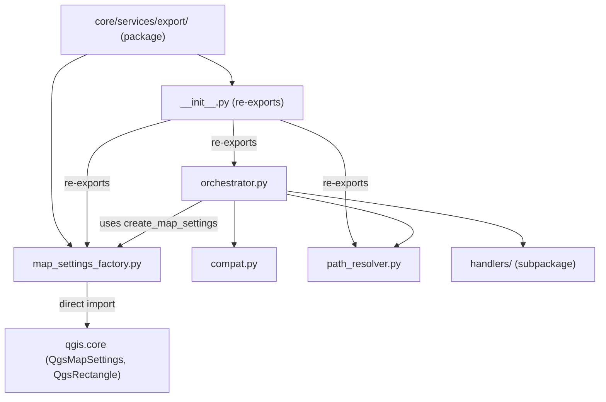
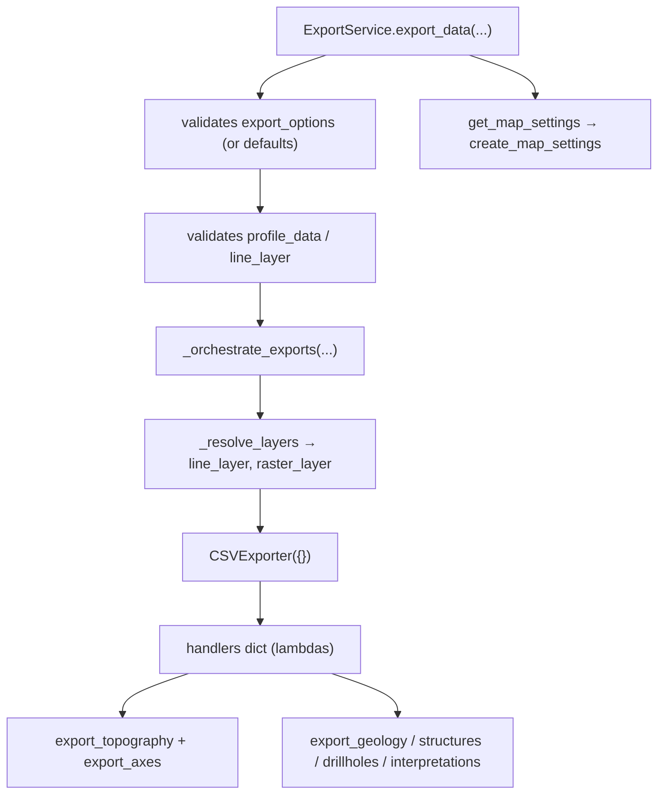

---
tags:
  - secinterp
  - code-walkthrough
  - core
  - export
  - services
aliases:
  - core/services/export/
  - export
  - create_map_settings
  - ExportService
cssclass: secinterp-note
---

# `core/services/export/` — Export package

> [!abstract] One-line summary
> Package `core/services/export/` (2 files): `__init__.py` re-exports the public API (`ExportService`, `create_map_settings`, `get_profile_name`, `resolve_export_path`) and `map_settings_factory.py` isolates the construction of `QgsMapSettings` in a single module.

**Path**: `core/services/export/` (2 files, ~43 lines)
**Main function**: `create_map_settings`
**Layer**: Core (mostly QGIS-agnostic; one isolated QGIS module)
**Tags**: #secinterp #core #export #services

---

## 🎯 Why does this package exist?

All SecInterp exporting (CSV, shapefile, GeoPackage, DXF, image, SVG, PDF and map
render) is coordinated from this package. It groups the orchestrator, the handlers, the
path resolution, the compatibility shims and a `QgsMapSettings` factory.

| Problem | Solution |
|---------|----------|
| Export data to multiple formats from one point | `ExportService` (in `orchestrator.py`) |
| Avoid importing QGIS across the whole core | Isolate it in `map_settings_factory.py` |
| Keep compatibility with old imports | `__init__.py` re-exports the public API |

> [!important] Architectural note
> This package concentrates the **only gray area** of the core: `map_settings_factory.py`
> imports `qgis.core` (needed for map render). The rest (`orchestrator.py` except
> `QCoreApplication`, `compat.py`, `path_resolver.py`, `handlers/`) is QGIS-agnostic. The
> Tier C group documented here covers `__init__.py` and `map_settings_factory.py`; the
> remaining modules have their own note.

---

## 🧬 Relationship diagram



> [!tip] How to read
> `__init__.py` is a facade re-exporting symbols from the internal modules. The only arrow
> to `qgis.core` comes from `map_settings_factory.py`, the gray module of the core.

---

## 📦 Imports — architectural reading

```python
# core/services/export/__init__.py
from __future__ import annotations

from .map_settings_factory import create_map_settings
from .orchestrator import ExportService
from .path_resolver import get_profile_name, resolve_export_path

__all__ = ["ExportService", "create_map_settings", "get_profile_name", "resolve_export_path"]
```

```python
# core/services/export/map_settings_factory.py
from __future__ import annotations

from typing import Any

from qgis.core import QgsMapSettings, QgsRectangle
```

| # | Observation |
|---|-------------|
| ① | `__init__.py` defines an explicit `__all__`: it controls what the package exposes. |
| ② | `__init__.py` uses **relative** imports (`.map_settings_factory`, …): internal cohesion. |
| ③ | `map_settings_factory.py` is the **only** module in the package importing `qgis.core`. |
| ④ | `create_map_settings`'s signature uses `Any` for `size`/`background_color` (QSize/QColor). |

---

## 🏗️ Structure inventory

**Modules in the Tier C group:**
- `__init__.py` — re-exports of the public API (9 lines).
- `map_settings_factory.py` — function `create_map_settings` (34 lines).

**Public function (in `map_settings_factory.py`):**
- `create_map_settings(layers, extent, size, background_color) -> QgsMapSettings`

**Siblings (own note, not in this group):**
- `orchestrator.py` → `ExportService`
- `compat.py` → `ExportServiceCompatMixin`
- `path_resolver.py` → `get_profile_name`, `resolve_export_path`
- `handlers/` → handler subpackage (own note)

---

## 📁 Files in the package

| File | Lines | Role |
|---|--:|---|
| [[#__init__.py|__init__.py]] | 9 | Re-exports the public API with `__all__` |
| [[#map_settings_factory.py|map_settings_factory.py]] | 34 | `QgsMapSettings` factory; isolates the QGIS import |

> [!note] Sibling modules with their own note
> `orchestrator.py`, `compat.py`, `path_resolver.py` and the `handlers/` subpackage are
> part of `export/` but are documented in their own notes (see Related notes).

---

## 📖 Module-by-module walkthrough

### __init__.py

```python
"""Export package — re-exports ExportService and factories."""

from __future__ import annotations

from .map_settings_factory import create_map_settings
from .orchestrator import ExportService
from .path_resolver import get_profile_name, resolve_export_path

__all__ = ["ExportService", "create_map_settings", "get_profile_name", "resolve_export_path"]
```

**Public facade of the package.** It exposes four symbols that are the stable contract
towards the rest of the system:

| Symbol | Real origin | Typical consumer |
|--------|-------------|------------------|
| `ExportService` | `orchestrator.py` | GUI (`QgsTask`) and `export_service.py` (shim) |
| `create_map_settings` | `map_settings_factory.py` | `orchestrator.get_map_settings` |
| `get_profile_name` | `path_resolver.py` | handlers and compat |
| `resolve_export_path` | `path_resolver.py` | handlers and compat |

> [!note] Explicit `__all__`
> Even though there is no `import *` in the project, `__all__` documents the intent:
> these are the symbols considered public and stable API.

### map_settings_factory.py

```python
"""Factory for QgsMapSettings — isolates QGIS import to one module."""

from __future__ import annotations

from typing import Any

from qgis.core import QgsMapSettings, QgsRectangle


def create_map_settings(
    layers: list[Any],
    extent: QgsRectangle,
    size: Any | None,
    background_color: Any,
) -> QgsMapSettings:
    map_settings = QgsMapSettings()
    map_settings.setLayers(layers)
    map_settings.setExtent(extent)
    if size is not None:
        map_settings.setOutputSize(size)
    map_settings.setBackgroundColor(background_color)
    return map_settings
```

**The gray area of the core.** It is the only module in `export/` importing `qgis.core`,
and it does so on purpose: building a `QgsMapSettings` for map render requires the real
type. The rest of the core does not know QGIS.

| Step | Call | Note |
|------|------|------|
| 1 | `QgsMapSettings()` | creates the configuration object |
| 2 | `setLayers(layers)` | list of layers to render |
| 3 | `setExtent(extent)` | spatial extent of the view |
| 4 | `setOutputSize(size)` | output size (only if not `None`) |
| 5 | `setBackgroundColor(background_color)` | background color |
| 6 | `return map_settings` | hands over the ready configuration |

> [!important] Why isolate the QGIS import
> By confining `from qgis.core import ...` to a single module, the rest of the package (and
> of the core) remains testable without QGIS. Whoever needs a `QgsMapSettings` goes
> through this factory instead of importing QGIS on their own.

> [!warning] `size`/`background_color` typed as `Any`
> They are `QSize` and `QColor` respectively, but declared `Any` to avoid dragging the
> Qt/QGIS imports into the signature. It is the same trade-off as in `orchestrator.py`.

---

## 🔄 Data flow

| Phase | Input | Transformation | Output |
|-------|-------|----------------|--------|
| Map render | `layers`, `extent`, `size`, `background_color` | `create_map_settings` | `QgsMapSettings` |
| Export | `output_folder`, `params`, data | `ExportService.export_data` | files + `list[str]` |
| Path resolution | `folder`, `base_name`, … | `get_profile_name`/`resolve_export_path` | `(Path, logical_name)` |

---

## 🏛️ Design patterns present

| Pattern | Where | Purpose |
|---------|-------|---------|
| **Facade** | `__init__.py` | expose a stable public API |
| **Factory** | `map_settings_factory.create_map_settings` | create a configured `QgsMapSettings` |
| **Isolation layer** | `map_settings_factory.py` | confine the QGIS dependency |
| **Facade (orchestrator)** | `orchestrator.ExportService` | coordinate handlers and exporters |
| **Adapter (compat)** | `compat.py` | keep the `_export_*` private API |

---

## 🧾 API summary

| Symbol | Signature / Inherits | Typical use |
|--------|----------------------|-------------|
| `create_map_settings` | `(layers, extent, size, background_color) -> QgsMapSettings` | Configure map render |
| `ExportService` | `(ExportServiceCompatMixin)` | Orchestrate all exports |
| `get_profile_name` | `(controller) -> str` | Sanitized profile name |
| `resolve_export_path` | `(folder, base_name, profile_name, naming_pattern, ext) -> (Path, str)` | Physical path + logical name |

---

## 🛡️ Error handling

| Module | Behaviour |
|--------|-----------|
| `__init__.py` | No error handling (only re-exports) |
| `map_settings_factory.py` | No validation: trusts `layers`/`extent`/`color` to be correct |

> [!warning] Factory without validation
> `create_map_settings` assumes `extent` is a valid `QgsRectangle` and that `size`/
> `background_color` are of the correct type. A `None` `background_color` or a malformed
> `extent` will surface as a QGIS error, not as `ExportError`.

---

## 🔬 Full module map of the package

The real package has more than the two Tier C files; the others have their own note. This
is the full map:

| Module | Lines | Role | Note |
|--------|--:|---|------|
| [[#__init__.py\|__init__.py]] | 9 | Re-exports of the public API | this note |
| [[#map_settings_factory.py\|map_settings_factory.py]] | 34 | `QgsMapSettings` factory (QGIS gray area) | this note |
| `orchestrator.py` | 207 | `ExportService` (facade delegating to handlers) | [[orchestrator]] |
| `compat.py` | 129 | `ExportServiceCompatMixin` (`_export_*` wrappers) | [[compat]] |
| `path_resolver.py` | 60 | `get_profile_name` / `resolve_export_path` | [[path_resolver]] |
| `handlers/` | ~436 | 7 `export_*` handlers per entity | [[core_services_export_handlers]] |

> [!note] `__init__.py` does not re-export `compat.py` nor `handlers/`
> Only `ExportService`, `create_map_settings`, `get_profile_name` and
> `resolve_export_path` are public API. The compatibility mixin and the handlers are
> imported internally.

## 🔁 Full export flow

How the package's modules coordinate in a real export:



**Narrative sequence:**

1. `export_data` applies the default `export_options` (all `True`) if none arrive.
2. If no option is active, it returns a warning message without exporting.
3. Validates that `profile_data` exists (`DataMissingError`) and that `params.line_layer`
   is present.
4. Delegates to `_orchestrate_exports`, which resolves the layers and the CRS.
5. Instantiates **one** shared `CSVExporter` and registers the lambdas in `handlers`.
6. Iterates `handlers` and runs only the active options.
7. `get_map_settings` (public API) delegates to the factory for map render.

## 📐 Public vs internal API

| Symbol | Visibility | Note |
|--------|------------|------|
| `ExportService` | public (`__init__`) | export entry point |
| `create_map_settings` | public (`__init__`) | map/image/PDF/SVG render |
| `get_profile_name` | public (`__init__`) | sanitized profile name |
| `resolve_export_path` | public (`__init__`) | physical path + logical name |
| `ExportServiceCompatMixin` | internal | tests/compatibility only |
| `handlers/` | internal | imported per module, not per package |

> [!important] Stable boundary
> The `__all__` fixes the contract. Any internal refactor (e.g. moving handlers) must not
> break these four public symbols.

## ✅ Core-layer compliance

How the package aligns with the `core/AGENTS.md` rules:

| Rule | Status | Where |
|------|--------|-------|
| No `from qgis.core import *` | ⚠️ punctual exception | `map_settings_factory.py` (concrete types) |
| No `QgsProject.instance()` | ✅ | no module |
| No `iface.mapCanvas()` | ✅ | no module |
| No direct `PyQt5`/`PyQt6` | ⚠️ `QCoreApplication` | `orchestrator.py` (via `qgis.PyQt`) |
| Thread-safe | ✅ | the core never creates GUI objects; only delegates |

> [!warning] The "gray area" is intentional
> `map_settings_factory.py` and the `QCoreApplication` of `orchestrator.py` are minimal,
> documented concessions for render and translation. The rest of the package meets the
> agnostic ideal.

---

## 🌐 i18n and migration notes

- **Translation**: `ExportService.tr` delegates to `QCoreApplication.translate` with
  context `"ExportService"`; user messages are translated in the orchestrator, not in the
  handlers nor in the factory.
- **QGIS in core**: `map_settings_factory.py` is the documented exception; the rest of
  the package avoids `qgis.*` (except `QCoreApplication` in `orchestrator.py`).
- **Compatibility**: `export_service.py` (outside this package) re-exports `ExportService`
  for old imports; `compat.py` keeps `_export_*`.
- **4.x migration**: the package uses `from qgis.PyQt.QtCore import QCoreApplication`,
  already aligned with the QGIS 4.x style.

---

## 🧪 Associated tests

- `tests/core/test_export_service.py::test_get_map_settings` — verifies that
  `ExportService.get_map_settings` delegates to `create_map_settings`.
- `tests/core/test_export_service.py::test_export_data_*` — cover the orchestration that
  starts in this package.
- `tests/integration/test_export_service_e2e.py` — real export end-to-end.
- `tests/exporters/test_image_exporter.py` / `test_svg_exporter.py` / `test_pdf_exporter.py` —
  consume the `QgsMapSettings` produced by the factory.

---

## 👀 Observations and notes

> [!success] Strengths
> - `__init__.py` with `__all__` gives a clear and stable package boundary.
> - Isolating `qgis.core` in `map_settings_factory.py` keeps the rest of the core pure.
> - Coherent structure: orchestrator, handlers, resolver, compat and factory separated.

> [!warning] Points of attention
> - The QGIS import, although confined, is still **inside** `core/` (breaks the ideal
>   "100% agnostic" of `AGENTS.md`).
> - `size`/`background_color` as `Any` dilute the factory's typing.
> - `create_map_settings` without argument validation.

> [!question] Open questions
> - Move `map_settings_factory.py` to the `exporters/` layer to purify the core?
> - Type `size`/`background_color` with `QSize`/`QColor` and accept the import?

---

## 🔗 Related notes

- [[Index]] — vault index
- [[orchestrator]] — `ExportService`, consumer of `create_map_settings`
- [[compat]] — compatibility mixin with the `_export_*` API
- [[path_resolver]] — `get_profile_name` / `resolve_export_path`
- [[core_services_export_handlers]] — `handlers/` subpackage
- [[dtos]] — `PreviewParams` feeding `ExportService.export_data`
- [[controller]] — orchestrates the export flow from the GUI

---

*Note of the SecInterp Code Walkthrough v2 vault — v3.9.0*
