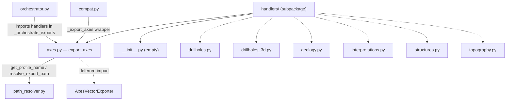

---
tags:
  - secinterp
  - code-walkthrough
  - core
  - export
  - handlers
aliases:
  - core/services/export/handlers/
  - handlers
  - export_axes
cssclass: secinterp-note
---

# `core/services/export/handlers/` — Export handlers

> [!abstract] One-line summary
> Package `core/services/export/handlers/` (2 files): groups the **profile axes** handler (`axes.py`) and an empty `__init__.py`; the six per-entity handlers (drillholes, geology, interpretations, structures, topography, 3D drillholes) are documented in individual notes.

**Path**: `core/services/export/handlers/` (2 files, ~39 lines)
**Main function**: `export_axes`
**Layer**: Core (QGIS-agnostic)
**Tags**: #secinterp #core #export #handlers

---

## 🎯 Why does this package exist?

The export orchestrator needs a **stable place** to put the handlers that turn
decoupled datasets into files. Separating them into their own subpackage keeps
`orchestrator.py` as a thin facade and gives each entity its own module.

| Problem | Solution |
|---------|----------|
| `orchestrator.py` would grow with 8 export blocks | One module per handler in `handlers/` |
| Each entity (geology, drillholes, structures…) has a distinct output | Handler per entity ("one handler per entity" pattern) |
| Import handlers into the orchestrator without noise | Deferred import inside `_orchestrate_exports` |

> [!important] Architectural note
> This subpackage forms the **handler pattern**: one `export_*` function per entity, all
> with the same "silhouette" (resolve path → instantiate exporter → export → annotate
> `msg`). The Tier C group documented here covers `axes.py`; the six remaining handlers
> have their own note (see Related notes).

---

## 🧬 Relationship diagram



> [!tip] How to read
> The dashed nodes (`drillholes.py`, `geology.py`, …) are siblings with their own note,
> not part of the Tier C group. `axes.py` is the only module documented in depth here.

---

## 📦 Imports — architectural reading

```python
# core/services/export/handlers/__init__.py
# (empty — 0 lines)
```

```python
# core/services/export/handlers/axes.py
from __future__ import annotations

from pathlib import Path
from typing import Any

from sec_interp.core.exceptions import ExportError
from sec_interp.core.services.export.path_resolver import get_profile_name, resolve_export_path
from sec_interp.logger_config import get_logger
```

```python
# deferred import (inside export_axes)
from sec_interp.exporters import AxesVectorExporter
```

| # | Observation |
|---|-------------|
| ① | Empty `__init__.py`: handlers are imported **directly** (`from .handlers import axes as axes_h`). |
| ② | `axes.py` imports only `ExportError` (not `DataMissingError`): does not validate empty data. |
| ③ | No `qgis.*` import: the `crs` travels as `Any`, like throughout the package. |
| ④ | `AxesVectorExporter` deferred import, consistent with the rest of the handlers. |

---

## 🏗️ Structure inventory

**Modules in the Tier C group:**
- `__init__.py` — empty (0 lines), no re-exports.
- `axes.py` — one public function `export_axes`.

**Public function (in `axes.py`):**
- `export_axes(folder, data, crs, msg, controller, settings, ext) -> None`

**Siblings (own note, not in this group):**
- `drillholes.py` → `export_drillholes`
- `drillholes_3d.py` → `export_drillholes_3d`
- `geology.py` → `export_geology`
- `interpretations.py` → `export_interpretations`
- `structures.py` → `export_structures`
- `topography.py` → `export_topography`

---

## 📁 Files in the package

| File | Lines | Role |
|---|--:|---|
| [[#__init__.py|__init__.py]] | 0 | Empty: handlers are imported per module, no re-exports |
| [[#axes.py|axes.py]] | 39 | `export_axes` — exports the profile axes as a vector layer |

> [!note] The 6 per-entity handlers live here, with their own note
> `drillholes.py`, `drillholes_3d.py`, `geology.py`, `interpretations.py`,
> `structures.py` and `topography.py` belong to this same subpackage, but are documented
> in their own notes (see Related notes).

---

## 📖 Module-by-module walkthrough

### axes.py

`axes.py` implements the handler for the **profile axes** (the reference lines with
elevations that frame the section). It is the companion of `topography.py`: the
orchestrator invokes them together under the `exp_topo` flag.

```python
def export_axes(
    folder: Path,
    data: list[tuple],
    crs: Any,
    msg: list[str],
    controller: Any | None,
    settings: Any | None,
    ext: str,
) -> None:
    """Export profile axes."""
    from sec_interp.exporters import AxesVectorExporter

    logger.info("✓ Saving profile axes...")
    try:
        profile_name = get_profile_name(controller)
        pattern = getattr(settings, "naming_pattern", None) if settings else None
        path, path_layer = resolve_export_path(folder, "profile_axes", profile_name, pattern, ext)
        exporter = AxesVectorExporter({})
        ok = exporter.export(path, {"profile_data": data, "crs": crs}, layer_name=path_layer)
        if ok:
            msg.append(f"  - {path.relative_to(folder)}")
        else:
            logger.warning(f"Failed to write profile axes to {path}")
    except Exception as e:
        raise ExportError(f"Profile axes export failed: {e!s}") from e
```

**Step-by-step analysis:**

1. **No guard clause** — like `topography.py`, it trusts that the orchestrator already
   validated that there is data. The first instruction is the deferred import.
2. **Path resolution** — `base_name="profile_axes"`, the only dataset it exports.
3. **Payload** — `{"profile_data": data, "crs": crs}`: the axes are built from the same
   `ProfileData` as the topography.
4. **Report** — annotates `msg` with the relative path on success, `warning` otherwise.

> [!warning] `except Exception` without logging
> `export_axes` is the only handler in the package whose `except` does **not** call
> `logger.exception(...)`: it only re-raises `ExportError`. The original traceback is lost
> in the log (though preserved via `from e`).

### __init__.py

```python
# (empty file — 0 lines)
```

No docstring nor re-exports. This choice is deliberate: the orchestrator imports the
handlers **per module** (`from .handlers import axes as axes_h`), not as a package API.
There is no public interface to expose here.

---

## 🔄 Data flow

| Phase | Input | Transformation | Output |
|-------|-------|----------------|--------|
| Delegation | `exp_topo` in `options` | `orchestrator` calls `topo_handler` | `export_topography` + `export_axes` |
| Axes | `ProfileData` (`data`), `crs` | `AxesVectorExporter.export` | axes layer + `msg` |
| Errors | raw exception | `except → ExportError` | domain exception |

---

## 🏛️ Design patterns present

| Pattern | Where | Purpose |
|---------|-------|---------|
| **Handler (one per entity)** | whole subpackage | one module per exportable entity type |
| **Facade** | `export_*` functions | hide the orchestration behind one signature |
| **Lazy import (deferred)** | `AxesVectorExporter` | save loading when unnecessary |
| **Exception translation** | `except → ExportError` | normalize failures |
| **Package by feature** | `handlers/` structure | group by export domain |

---

## 🧾 API summary

| Symbol | Signature / Inherits | Typical use |
|--------|----------------------|-------------|
| `export_axes` | `(folder, data, crs, msg, controller, settings, ext) -> None` | Export profile axes |
| `export_drillholes` | `(folder, data, crs, msg, controller, settings, ext) -> None` | 2D drillholes (own note) |
| `export_drillholes_3d` | `(folder, data, crs, msg, options, controller, settings, ext) -> None` | 3D drillholes (own note) |
| `export_geology` | `(folder, data, crs, csv_exporter, msg, controller, settings, ext) -> None` | Geology (own note) |
| `export_interpretations` | `(folder, data, line_layer, crs, msg, controller, settings, ext, access_control) -> None` | Interpretations (own note) |
| `export_structures` | `(folder, data, raster_layer, crs, csv_exporter, msg, options, controller, settings, ext) -> None` | Structures (own note) |
| `export_topography` | `(folder, data, crs, csv_exporter, msg, controller, settings, ext) -> None` | Topography (own note) |

---

## 🛡️ Error handling

Each handler follows its own contract (see individual notes), but the subpackage's
constant is **translating failures to `ExportError`**:

| Handler | Guard `if not data` | `try/except` | Logging in `except` |
|---------|:---:|:---:|:---:|
| `axes.py` | ❌ | single `Exception` | ❌ (only re-raises) |
| `topography.py` | ❌ | double (`OSError/...` + `Exception`) | ✅ |
| `drillholes.py` | ✅ | double | ✅ |
| `geology.py` | ✅ | double | ✅ |
| `structures.py` | ✅ | double | ✅ |
| `interpretations.py` | ✅ (with `logger.info`) | single `Exception` | ✅ |
| `drillholes_3d.py` | ✅ | ❌ (no wrapper) | ⚠️ result warning only |

> [!important] Real heterogeneity
> The table shows that, despite the common "silhouette", there are variations: `axes.py`
> does not log in the `except` and `drillholes_3d.py` does not wrap in `ExportError`. They
> are candidates for homogenization.

---

## 🔬 Full handler matrix of the subpackage

Each handler maps to an `options` flag, a set of `base_name`, exporters and payloads. It
is the quick guide to the subpackage:

| Module | Flag(s) in `options` | `base_name`(s) | Exporter(s) | Payload | Formats |
|--------|----------------------|----------------|-------------|---------|----------|
| `drillholes.py` | `exp_drill` | `drillhole_traces`, `drillhole_intervals` | `DrillholeTraceVectorExporter`, `DrillholeIntervalVectorExporter` | `drillhole_data`, `crs` | vector (`ext`) |
| `drillholes_3d.py` | `exp_drill_3d` + `drill_3d_traces/intervals` + `drill_3d_original/projected` | `drillhole_traces_3d_real/projected`, `drillhole_intervals_3d_real/projected` | `DrillholeTrace3DExporter`, `DrillholeInterval3DExporter` | `drillhole_data`, `crs`, `use_projected` | 3D (`ext`) |
| `geology.py` | `exp_geol` | `geol_profile` | `CSVExporter` (injected) + `GeologyVectorExporter` | `headers`/`rows` (CSV), `geology_data`/`crs` (vec) | `.csv` + vector |
| `interpretations.py` | `exp_interp` (+ `can_export_3d`) | `interpretations`, `interpretations_3d` | `Interpretation2DExporter`, `Interpretation3DExporter` | `interpretations`, `crs`; + `section_line` (3D) | vector + 3D |
| `structures.py` | `exp_struct` | `structural_profile`, `structural_measurements` | `CSVExporter` + `StructureVectorExporter` | `headers`/`rows`; `structural_data`, `crs`, `dip_scale_factor`, `raster_res` | `.csv` + vector |
| `topography.py` | `exp_topo` | `topo_profile`, `profile_line` | `CSVExporter` + `ProfileLineVectorExporter` | `headers`/`rows`; `profile_data`, `crs` | `.csv` + vector |
| `axes.py` | `exp_topo` (alongside topo) | `profile_axes` | `AxesVectorExporter` | `profile_data`, `crs` | vector |

> [!note] Shared CSV vs own vector
> The handlers with CSV output receive the **injected** `CSVExporter` (a single shared
> instance); the vector ones are imported and instantiated deferred inside each handler.

## 🧩 The handler silhouette (shared contract)

Although each handler differs in parameters, all follow the same four-step sequence.
Knowing it allows reading any of them in seconds:

```python
def export_<entity>(folder, data, crs, ...) -> None:
    if not data:                 # 1. guard clause
        return
    from sec_interp.exporters import <Exporter>   # 2. deferred import
    try:
        profile_name = get_profile_name(controller)
        pattern = getattr(settings, "naming_pattern", None) if settings else None
        path, layer = resolve_export_path(folder, base_name, profile_name, pattern, ext)
        ok = <Exporter>({}).export(path, {payload}, layer_name=layer)  # 3. export
        if ok:
            msg.append(f"  - {path.relative_to(folder)}")             # 4. report
        else:
            logger.warning(f"Failed to write <entity> to {path}")
    except Exception as e:
        raise ExportError(f"<entity> export failed: {e!s}") from e
```

| Step | Detail | Possible variation |
|------|---------|--------------------|
| 1. Guard | `if not data: return` | `topography.py` and `axes.py` omit it (the orchestrator already validates) |
| 2. Deferred import | load the exporter only with data | — |
| 3. Export | `resolve_export_path` → `export` → `bool` | payload and exporters differ per entity |
| 4. Report | `msg.append` (success) or `logger.warning` (failure) | `drillholes_3d.py` adds a `label` to the message |

> [!tip] The silhouette is the subpackage's "vocabulary"
> Once this pattern is memorized, any new handler only contributes its payload and its
> `base_name`. See [[orchestrator]] for how they are registered in the `handlers` dict.

## 🌐 i18n and migration notes

- **No translated strings**: the handlers do not use `QCoreApplication.translate`; log and
  warning messages are in English (only seen in the log, not the UI).
- **User-facing messages**: the ones that are shown (`msg`) are translated by the
  orchestrator (`self.tr(...)`); the handlers only append relative paths
  (`path.relative_to(folder)`).
- **Compatibility**: the `_export_*` wrappers in [[compat]] keep the old calls to these
  handlers; there is no need to touch the handlers when migrating consumers.
- **Extension**: adding an exportable entity = new module in `handlers/` + registering its
  flag in the orchestrator's `handlers` dict.

## ✅ Subpackage conventions

| Convention | Rule |
|-----------|-------|
| Naming | one `export_<entity>` module per exportable entity type |
| `base_name` | stable logical name, not the final file name |
| Payload | dict with a `*_data` key (or `profile_data`/`structural_data`) + `crs` |
| Return | `None`; the result is communicated by mutating `msg` and via the exporter's `bool` |
| Errors | translate to `ExportError` (with the exceptions already noted) |
| QGIS | only via `Any`; no handler imports `qgis.*` |

> [!note] Golden rule of the subpackage
> Handlers **never** return files nor lists: they only mutate `msg` and delegate the real
> writing to the exporters (`sec_interp.exporters`). They keep the core free of QGIS by
> transporting everything as DTOs/primitives + `Any` for external objects.

---

## 🧪 Associated tests

The handlers are exercised through the `ExportService` (mocking the exporters) and, in
integration, end-to-end:

- `tests/core/test_export_service.py::test_export_data_minimal` — topo + axes (calls
  `AxesVectorExporter`).
- `tests/core/test_export_service.py::test_export_axes_error` — axes exporter failure →
  `ExportError`.
- `tests/core/test_profile_exporters.py::test_axes_exporter_success` — real logic of
  `AxesVectorExporter`.
- `tests/core/test_profile_exporters.py::test_axes_exporter_single_point` — a single
  point (edge case).
- `tests/integration/test_export_service_e2e.py` — real export of all types.

---

## 👀 Observations and notes

> [!success] Strengths
> - Clean separation per entity: each handler is small and single-responsibility.
> - Consistent silhouette (resolve → instantiate → export → annotate `msg`) that makes it
>   easy to understand any handler after seeing just one.
> - Empty `__init__.py` avoids coupling an unnecessary package API.

> [!warning] Points of attention
> - Heterogeneity in error handling (`axes.py` without logging, `drillholes_3d.py` without
>   `ExportError`).
> - `axes.py` depends on `data` without a guard clause; called in isolation it may break.
> - Several handlers duplicate the "resolve path + instantiate + export" sequence.

> [!question] Open questions
> - Extract a shared helper `_export_layer(...)` to remove duplication?
> - Unify the error contract (double `except` + `logger.exception`) across all 7?

---

## 🔗 Related notes

- [[Index]] — vault index
- [[orchestrator]] — main consumer; delegates to these handlers
- [[compat]] — `_export_*` wrappers invoking these handlers
- [[path_resolver]] — `get_profile_name` / `resolve_export_path`
- [[topography]] — sibling handler of the same `exp_topo` flag
- [[drillholes]] / [[drillholes_3d]] / [[geology]] / [[interpretations]] / [[structures]] — sibling handlers
- [[core_services_export]] — containing `export/` package

---

*Note of the SecInterp Code Walkthrough v2 vault — v3.9.0*
