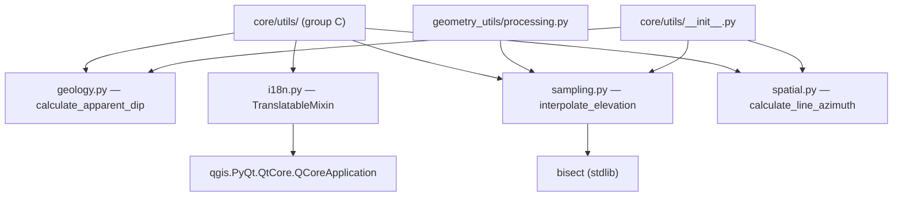

---
tags:
  - secinterp
  - code-walkthrough
  - core
  - utils
aliases:
  - core/utils/
  - geology.py
  - i18n.py
  - sampling.py
  - spatial.py
  - TranslatableMixin
  - interpolate_elevation
  - calculate_apparent_dip
  - calculate_line_azimuth
cssclass: secinterp-note
---

# `core/utils/` — Pure core utilities

> [!abstract] One-line summary
> Package `core/utils/` (4 group-C files): `geology` (apparent dip), `i18n` (translation mixin), `sampling` (elevation interpolation) and `spatial` (line azimuth) — atomic helpers reused by services and GUI.

**Path**: `core/utils/` (8 files total; this group covers `geology.py`, `i18n.py`, `sampling.py`, `spatial.py`)
**Key symbols**: `calculate_apparent_dip`, `TranslatableMixin`, `interpolate_elevation`, `calculate_line_azimuth`
**Layer**: Core (mostly QGIS-agnostic; `i18n` is the exception)
**Tags**: #secinterp #core #utils

---

## 🎯 Why does this package exist?

Pure core utilities concentrate the reusable math and glue that services should not
duplicate:

| Problem | Solution |
|---------|----------|
| Repeating geological trigonometry in every service | centralized `calculate_apparent_dip` |
| Classes without `QObject` lack `tr()` for i18n | `TranslatableMixin` provides `self.tr(...)` |
| Efficiently sample elevation in a profile | `interpolate_elevation` with `bisect` |
| Compute a section line orientation | `calculate_line_azimuth` |

> [!important] Architectural note
> The core rule is "100% QGIS-agnostic", and it holds for `geology`, `sampling` and
> `spatial` (only `math`/`bisect`). **`i18n.py` is the deliberate exception**: it imports
> `qgis.PyQt.QtCore.QCoreApplication` to translate. The full package (`__init__.py`) is
> documented in [[core_utils___init___py]].

---

## 🧬 Relationship diagram



> [!tip] How to read
> Three of the four files are pure leaves; `i18n` is the only one crossing the QGIS boundary
> (arrow to `QCoreApplication`). `processing` imports `sampling` locally; `__init__`
> re-exports `geology`, `sampling` and `spatial` (but **not** `i18n`).

---

## 📦 Imports — architectural reading

```python
# core/utils/geology.py
import math

# core/utils/i18n.py
from qgis.PyQt.QtCore import QCoreApplication

# core/utils/sampling.py
import bisect

# core/utils/spatial.py
import math
```

| # | Observation |
|---|-------------|
| ① | `geology`, `sampling` and `spatial` use **only stdlib** (`math`, `bisect`). |
| ② | `i18n` imports `QCoreApplication` — the group's only QGIS dependency. |
| ③ | None imports another project module: they are leaves with no internal coupling. |

> [!warning] `i18n` breaks the core rule
> Placing `TranslatableMixin` in `core/` (instead of `gui/`) forces the Qt import into a
> layer that declares itself agnostic. See [[core_utils___init___py]] for how the `__init__` decides **not** to
> re-export it.

---

## 🏗️ Structure inventory

**Classes (1):**

- `class TranslatableMixin` (`i18n.py`) — mixin with a `tr()` method.

**Functions (3):**

- `calculate_apparent_dip(true_strike, true_dip, line_azimuth) -> float` (`geology.py`)
- `interpolate_elevation(topo_data, distance) -> float` (`sampling.py`)
- `calculate_line_azimuth(points) -> float` (`spatial.py`)

> [!note] Pure subset
> Of the package's 8 files, these 4 are the **most atomic** (one function or class each).
> The remaining 4 (`drillhole`, `io`, `parsing`, `rendering`) are larger and have more
> responsibilities, documented separately.

---

## 📁 Files in the package

| File | Lines | Role |
|---|--:|---|
| [[#calculate_apparent_dip\|geology.py]] | 40 | Apparent dip in section (pure) |
| [[#TranslatableMixin\|i18n.py]] | 30 | `tr()` mixin for classes without `QObject` |
| [[#interpolate_elevation\|sampling.py]] | 43 | Linear elevation interpolation (pure) |
| [[#calculate_line_azimuth\|spatial.py]] | 30 | Line azimuth (pure) |

> [!note] The full package has 8 files
> Besides this group, `core/utils/` includes `drillhole.py`, `io.py`, `parsing.py` and
> `rendering.py`, documented in their own notes ([[drillhole]], [[io]], [[parsing]],
> [[rendering]]) and re-exported in [[core_utils___init___py]].

---

## 📖 File-by-file walkthrough

### `calculate_apparent_dip`

```python
def calculate_apparent_dip(
    true_strike: float, true_dip: float, line_azimuth: float
) -> float:
    alpha = math.radians(true_strike)
    beta = math.radians(true_dip)
    theta = math.radians(line_azimuth)
    app_dip = math.degrees(math.atan(math.tan(beta) * math.sin(alpha - theta)))
    return app_dip
```

Apparent dip: the inclination of a plane measured in a direction not perpendicular to its
strike. Formula `tan(app) = tan(dip) · sin(strike − azimuth)`. Returns degrees; the sign can
be negative depending on the quadrant (the caller normalizes if needed).

> [!tip] Perpendicular vs parallel section
> If the section is perpendicular to strike (`strike − azimuth ≈ 90°`), the apparent dip
> approaches the true dip; if parallel (`≈ 0°`), it tends to `0`.

### `TranslatableMixin`

```python
class TranslatableMixin:
    def tr(self, message: str) -> str:
        return QCoreApplication.translate(self.__class__.__name__, message)
```

Mixin giving a standard `tr()` to classes that **do not inherit from `QObject`** (e.g. DTOs
or validators). It uses the class name as the **translation context** and
`QCoreApplication` as the engine. The `# type: ignore[no-any-return]` acknowledges that
`translate` returns `str`.

> [!important] Why it exists
> In QGIS, `QObject` already brings `tr()`; pure classes do not. This mixin enables
> `self.tr(...)` in services/core without inheriting `QObject`, preserving the structural
> decoupling.

### `interpolate_elevation`

```python
def interpolate_elevation(
    topo_data: list[tuple[float, float]], distance: float
) -> float:
    if not topo_data:
        return 0.0

    distances = [pt[0] for pt in topo_data]
    idx = bisect.bisect_left(distances, distance)

    if idx == 0:
        return topo_data[0][1]
    if idx >= len(topo_data):
        return topo_data[-1][1]

    dist1, elev1 = topo_data[idx - 1]
    dist2, elev2 = topo_data[idx]

    if dist2 == dist1:
        return elev1

    ratio = (distance - dist1) / (dist2 - dist1)
    return elev1 + (elev2 - elev1) * ratio
```

Linear elevation interpolation over a sorted `(dist, elev)` profile. `bisect_left` locates
the interval in `O(log n)`. Edge cases: empty profile → `0.0`; out of range → nearest
endpoint; coincident distances → `elev1` (avoids division by zero).

### `calculate_line_azimuth`

```python
def calculate_line_azimuth(points: list[tuple[float, float]]) -> float:
    MIN_REQUIRED_POINTS = 2
    if len(points) < MIN_REQUIRED_POINTS:
        return 0

    p1 = points[0]
    p2 = points[1]
    azimuth = math.degrees(math.atan2(p2[0] - p1[0], p2[1] - p1[1]))
    if azimuth < 0:
        azimuth += 360
    return azimuth
```

Compass azimuth (0–360) of a line using its **first two** points. `atan2(dx, dy)` respects
all four quadrants; the `+360` adjustment normalizes negative values. Fewer than 2 points
returns `0`.

---

## 🧩 How these helpers combine

These four modules do not call each other, but they **compose** in the profile pipeline:

| Scenario | Helpers involved | Sequence |
|----------|------------------|----------|
| Build a section | `calculate_line_azimuth` → `calculate_apparent_dip` | orient the line, then dips |
| Topographic profile | `interpolate_elevation` (via [[processing]]) | sample elevation at each distance |
| User messages | `TranslatableMixin.tr` | translate core labels |

> [!tip] Extract-then-Compute
> The GUI extracts coordinates/attributes from layers and hands over primitives
> (`list[tuple]`, `float`). These helpers compute **without** knowing QGIS, except `i18n`,
> which translates strings.

---

## 🔬 `i18n.py` in detail — the exception to the rule

`core/AGENTS.md` forbids `import PyQt5/PyQt6` in core. `i18n.py` uses
`qgis.PyQt.QtCore.QCoreApplication`, which deserves justification:

| Aspect | Detail |
|--------|--------|
| **Reason** | Pure classes (DTOs, validators) need `tr()` without inheriting `QObject`. |
| **Context** | `self.__class__.__name__` fixes the per-class translation context. |
| **Cost** | Core stops being 100% agnostic once `i18n` is imported. |
| **Mitigation** | Not re-exported in [[core_utils___init___py]] `__all__`; imported explicitly where used. |

> [!warning] Standalone-test implication
> Importing `sec_interp.core.utils.i18n` outside QGIS may fail if `qgis.PyQt` is
> unavailable. That is why non-QGIS tests import pure submodules directly.

---

## 🔄 Data flow

| Phase | Input | Transformation | Output |
|-------|-------|----------------|--------|
| Geology | strike/dip/azimuth | `atan(tan·sin)` | apparent dip (degrees) |
| i18n | `message` | `QCoreApplication.translate` | translated string |
| Sampling | `(dist, elev)` profile + `distance` | `bisect` + interpolation | elevation (float) |
| Spatial | line points | `atan2` + normalization | azimuth (degrees) |

---

## 🏛️ Design patterns present

| Pattern | Where | Purpose |
|---------|-------|---------|
| **Pure function** | `geology`, `sampling`, `spatial` | determinism and thread-safety |
| **Mixin** | `TranslatableMixin` | provide `tr()` without `QObject` inheritance |
| **Binary search** | `sampling` (`bisect`) | `O(log n)` interpolation |
| **Class-name context** | `i18n` (`__class__.__name__`) | stable translation context |

---

## 🧾 API summary

| Symbol | Signature | Typical use |
|--------|-----------|-------------|
| `calculate_apparent_dip` | `(true_strike, true_dip, line_azimuth) -> float` | section dip |
| `TranslatableMixin.tr` | `(message) -> str` | translate in non-`QObject` classes |
| `interpolate_elevation` | `(topo_data, distance) -> float` | interpolated elevation |
| `calculate_line_azimuth` | `(points) -> float` | section orientation |

---

## 📐 Mathematical detail

### Apparent dip

```
apparent_dip = degrees(atan(tan(dip) · sin(strike − azimuth)))
```

| Variable | Range | Meaning |
|----------|-------|---------|
| `true_strike` | 0–360 | plane strike |
| `true_dip` | 0–90 | true dip |
| `line_azimuth` | 0–360 | section line azimuth |

### Line azimuth

```
azimuth = degrees(atan2(x2 − x1, y2 − y1))  mod 360
```

- `atan2(dx, dy)` returns `(−180, 180]`; the `+360` adjustment for negatives maps it to `[0, 360)`.

### Linear interpolation

```
elev(d) = elev1 + (elev2 − elev1) · (d − dist1) / (dist2 − dist1)
```

- `bisect_left` guarantees `dist1 <= d < dist2` (or the endpoint if `d` falls outside).

### Worked example

| Helper | Input | Result |
|--------|-------|--------|
| `calculate_apparent_dip` | strike=90, dip=45, azimuth=0 | ≈ 45° (perpendicular section) |
| `calculate_line_azimuth` | `[(0,0), (0,10)]` | 0° (north bearing) |
| `interpolate_elevation` | `[(0,100),(100,150)]`, d=50 | 125.0 |

---

## 🛡️ Error handling

| File | Behaviour |
|------|-----------|
| `geology` | no range validation (strike 0–360, dip 0–90); `math` accepts any float |
| `i18n` | delegates to `QCoreApplication`; no exception capture |
| `sampling` | empty profile → `0.0`; out of range → endpoint; `dist2 == dist1` → `elev1` |
| `spatial` | `< 2` points → `0` |

> [!note] Delegated validation
> None raises `ValidationError`: they are low-level functions. Geological range validation
> belongs to the invoking services (see [[geology_service]]).

---

## 🧪 Associated tests

- `tests/core/test_utils.py` → `TestApparentDip`, `TestInterpolation`.
- `tests/core/test_utils_standalone.py` → `TestApparentDipStandalone`,
  `TestInterpolationStandalone` (no QGIS).
- `tests/core/test_spatial_utils.py` → `TestSpatialUtils` (north/east/south/west azimuth).

> [!note] No direct `i18n` test
> `TranslatableMixin` is exercised through the classes that use it; there is no dedicated
> `test_i18n.py`. Its verification requires a `QCoreApplication` (QGIS environment).

---

## 👀 Observations and notes

> [!success] Strengths
> - Three of four modules are pure and trivially testable.
> - `interpolate_elevation` is `O(log n)` thanks to `bisect`.
> - `TranslatableMixin` elegantly solves i18n in pure classes.

> [!warning] Points of attention
> - `i18n.py` imports Qt in the core, breaking the QGIS-agnostic rule.
> - `calculate_apparent_dip` does not validate input ranges.
> - `calculate_line_azimuth` only looks at the first two points (ignores the rest).

> [!question] Open questions
> - Move `TranslatableMixin` to `gui/` or a `compat` module to keep core pure?
> - Validate `true_dip` in `[0, 90]` and `line_azimuth` in `[0, 360]`?
> - Unify the constants criterion (`MIN_REQUIRED_POINTS`, `MIN_*`) in a common section?

---

## 🔗 Related notes

- [[Index]] — vault index
- [[core_utils___init___py]] — `__init__.py` facade that re-exports part of this group
- [[drillhole]] / [[io]] / [[parsing]] / [[rendering]] — remaining package submodules
- [[processing]] — imports `sampling.interpolate_elevation`
- [[geology_service]] — consumer of `calculate_apparent_dip` and `interpolate_elevation`

---

*Note of the SecInterp Code Walkthrough v2 vault — v3.9.1*
