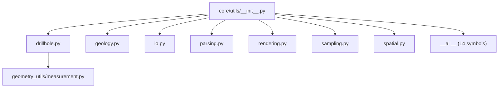

---
tags:
  - secinterp
  - code-walkthrough
  - core
  - utils
aliases:
  - utils
  - core/utils/
  - interpolate_elevation
  - parse_strike
  - calculate_apparent_dip
cssclass: secinterp-note
---

# `core/utils/__init__.py`

> [!abstract] One-line summary
> **Facade** of the `core/utils/` package: re-exports 14 pure helpers (geology, drillholes, parsing, rendering, sampling and spatial) and defines `__all__` so consumers can do `from sec_interp.core import utils as scu`.

**Path**: `core/utils/__init__.py` (82 lines)
**Main symbol**: `__all__` (14 re-exports)
**Layer**: Core (QGIS-agnostic, with delegated exceptions)
**Tags**: #secinterp #core #utils

---

## 🎯 Why does this file exist?

Services and the GUI need access to dozens of scattered utilities without importing each
submodule. The `__init__.py` centralizes access:

| Problem | Solution |
|---------|----------|
| Importing each submodule separately is verbose | re-exports 14 symbols in a single package |
| The import order must be stable and explicit | `__all__` fixes the public API |
| Consumers must be able to do `scu.parse_strike(...)` | short package alias notation |

> [!important] Architectural note
> It is a **Facade** over 7 submodules. The file itself imports no `qgis.*`, but two of the
> re-exported submodules do (`io` → `qgis.core`, `parsing` → feature objects). The "core 100%
> QGIS-agnostic" rule holds **for the pure helpers**; the I/O adapters are confined to
> `io.py`/`parsing.py`.

---

## 🧬 Relationship diagram



> [!tip] How to read
> `__init__` contains no logic: it only groups and re-exports. The solid arrows are the
> `from .submodule import ...`; `__all__` is the whitelist defining what is public.

---

## 📦 Imports — architectural reading

```python
# core/utils/__init__.py
from __future__ import annotations

from .drillhole import (
    calculate_drillhole_trajectory,
    interpolate_intervals_on_trajectory,
    project_trajectory_to_section,
)
from .geology import calculate_apparent_dip
from .io import create_shapefile_writer
from .parsing import (
    cardinal_to_azimuth,
    extract_feature_attributes,
    parse_dip,
    parse_strike,
)
from .rendering import (
    calculate_bounds,
    calculate_interval,
    create_coordinate_transform,
)
from .sampling import interpolate_elevation
from .spatial import calculate_line_azimuth
```

| # | Observation |
|---|-------------|
| ① | **Relative** imports (`from .x import ...`): the package is self-contained and portable. |
| ② | `i18n.py` is **not** re-exported (used via `from ...utils.i18n import TranslatableMixin`). |
| ③ | `create_shapefile_writer` is a deprecated shim of `io.create_vector_writer`. |

> [!warning] Outdated docstring
> The module docstring lists `drillhole, geology, io, parsing, rendering, sampling, spatial`
> but **omits `i18n`** (which exists as a submodule, though it is not re-exported).

---

## 🏗️ Structure inventory

**No classes or functions of its own** — only re-exports.

**`__all__` (14 symbols, alphabetical order):**

| # | Symbol | Origin | Domain |
|---|--------|--------|--------|
| 1 | `calculate_apparent_dip` | `geology.py` | Geology |
| 2 | `calculate_bounds` | `rendering.py` | Rendering |
| 3 | `calculate_drillhole_trajectory` | `drillhole.py` | Drillholes |
| 4 | `calculate_interval` | `rendering.py` | Rendering |
| 5 | `calculate_line_azimuth` | `spatial.py` | Spatial |
| 6 | `cardinal_to_azimuth` | `parsing.py` | Parsing |
| 7 | `create_coordinate_transform` | `rendering.py` | Rendering |
| 8 | `create_shapefile_writer` | `io.py` | I/O |
| 9 | `extract_feature_attributes` | `parsing.py` | Parsing |
| 10 | `interpolate_elevation` | `sampling.py` | Sampling |
| 11 | `interpolate_intervals_on_trajectory` | `drillhole.py` | Drillholes |
| 12 | `parse_dip` | `parsing.py` | Parsing |
| 13 | `parse_strike` | `parsing.py` | Parsing |
| 14 | `project_trajectory_to_section` | `drillhole.py` | Drillholes |

---

## 📁 Files in the package

| File | Lines | Role |
|---|--:|---|
| [[#utils|__init__.py]] | 82 | Package facade and `__all__` |

> [!note] The rest of the package
> The 7 re-exported submodules are documented in their own notes: [[drillhole]], [[io]],
> [[parsing]], [[rendering]], and in the package note [[core_utils]] (group
> `geology`/`i18n`/`sampling`/`spatial`).

---

## 📖 Symbol-by-symbol walkthrough

### Geology — `calculate_apparent_dip`

```python
calculate_apparent_dip(true_strike: float, true_dip: float, line_azimuth: float) -> float
```

Converts true dip to **apparent dip** in the section plane:
`atan(tan(dip) · sin(strike − azimuth))`. Pure, only `math`.

### Drillholes — `calculate_drillhole_trajectory`, `project_trajectory_to_section`, `interpolate_intervals_on_trajectory`

```python
calculate_drillhole_trajectory(collar_point, collar_z, survey_data, section_azimuth, densify_step=1.0, total_depth=0.0)
project_trajectory_to_section(trajectory, line_points)
interpolate_intervals_on_trajectory(trajectory, intervals, buffer_width)
```

Triad to build a drillhole's 3D trajectory, project it onto the section and distribute
lithological intervals. See [[drillhole]].

### Parsing — `parse_strike`, `parse_dip`, `cardinal_to_azimuth`, `extract_feature_attributes`

```python
parse_strike(value) -> float | None
parse_dip(value) -> tuple[float | None, float | None]
cardinal_to_azimuth(text) -> float | None
extract_feature_attributes(feature) -> dict[str, Any]
```

Normalize strike/dip notations (numeric, quadrant `"N 30 E"`) and sanitize feature
attributes to Python primitives. See [[parsing]].

### Rendering — `calculate_bounds`, `calculate_interval`, `create_coordinate_transform`

```python
calculate_bounds(topo_data, geol_data=None) -> dict[str, float]
calculate_interval(data_range) -> float
create_coordinate_transform(bounds, view_w, view_h, margin, vert_exag=1.0)
```

Bounding-box computation, "nice" axis intervals and data→pixel transformation. See
[[rendering]].

### Sampling — `interpolate_elevation`

```python
interpolate_elevation(topo_data: list[tuple[float, float]], distance: float) -> float
```

Linear elevation interpolation over a topographic profile using `bisect`. Pure.

### Spatial — `calculate_line_azimuth`

```python
calculate_line_azimuth(points: list[tuple[float, float]]) -> float
```

Compass azimuth of a line from its first two points. Pure.

### I/O — `create_shapefile_writer`

```python
create_shapefile_writer(*args, **kwargs) -> QgsVectorFileWriter
```

Deprecated *shim* delegating to `io.create_vector_writer`. See [[io]].

---

## 🔄 Data flow

| Phase | Input | Transformation | Output |
|-------|-------|----------------|--------|
| Import | `from sec_interp.core import utils as scu` | `__init__.py` resolution | 14 accessible symbols |
| Use | `scu.parse_strike("N 30 E")` | submodule logic | `30` |
| Boundary | DTO/primitives (GUI) | pure helpers | DTO/primitives |

> [!tip] The `scu.` pattern
> Tests use `from sec_interp.core import utils as scu` and call `scu.parse_strike(...)`.
> The short alias is the internal convention to access the whole toolbox.

---

## 🏛️ Design patterns present

| Pattern | Where | Purpose |
|---------|-------|---------|
| **Facade** | `__init__.py` | unify access to 7 submodules |
| **Re-export / barrel** | `from .x import ...` | public API in one place |
| **Whitelist** | `__all__` | control what counts as public |
| **Compatibility shim** | `create_shapefile_writer` | keep backward compatibility |

---

## 🧾 API summary

| Symbol | Signature | Typical use |
|--------|-----------|-------------|
| `calculate_apparent_dip` | `(true_strike, true_dip, line_azimuth) -> float` | apparent dip |
| `calculate_drillhole_trajectory` | `(collar_point, collar_z, survey_data, section_azimuth, ...) -> list` | 3D trajectory |
| `project_trajectory_to_section` | `(trajectory, line_points) -> list` | section projection |
| `interpolate_intervals_on_trajectory` | `(trajectory, intervals, buffer_width) -> list` | lithological intervals |
| `parse_strike` / `parse_dip` / `cardinal_to_azimuth` | `(value) -> ...` | normalize strike/dip |
| `extract_feature_attributes` | `(feature) -> dict` | sanitize attributes |
| `calculate_bounds` / `calculate_interval` / `create_coordinate_transform` | `(...)` | bounds and projection |
| `interpolate_elevation` | `(topo_data, distance) -> float` | interpolated elevation |
| `calculate_line_azimuth` | `(points) -> float` | line azimuth |
| `create_shapefile_writer` | `(*args, **kwargs)` | vector writing shim |

---

## 🛡️ Error handling

The `__init__.py` handles no errors: it only imports. Handling depends on each submodule:

| Submodule | Behaviour |
|-----------|-----------|
| `parsing` | returns `None` on failed parsing |
| `sampling` | returns `0.0` for an empty profile |
| `spatial` | returns `0` for short lines |
| `io` | raises `ValueError`/`OSError` on write errors |

> [!warning] Importing `io` in non-QGIS environments
> `from sec_interp.core import utils` **does** execute `io.py`, which imports `qgis.core`.
> That is why *standalone* tests (`test_utils_standalone.py`) import functions directly from
> the pure submodules instead of the full package.

---

## 🧪 Associated tests

- `tests/core/test_utils.py` — uses `scu.*` for `parse_strike`, `parse_dip`,
  `cardinal_to_azimuth`, `calculate_apparent_dip`, `interpolate_elevation`.
- `tests/core/test_utils_standalone.py` — same functions without touching `io.py` (no QGIS).
- `tests/core/test_spatial_utils.py` — `calculate_line_azimuth`.
- `tests/core/test_rendering_utils.py` — `calculate_bounds`, `calculate_interval`,
  `create_coordinate_transform`.
- `tests/core/test_drillhole_utils.py` — drillhole trajectory and projection.

---

## 👀 Observations and notes

> [!success] Strengths
> - Clean facade: 14 helpers accessible with a single import and a short `scu.`.
> - Explicit `__all__` avoids accidentally exporting internal symbols.
> - The docstring groups by domain, aiding discovery.

> [!warning] Points of attention
> - The docstring omits `i18n.py` (exists but not re-exported): documentation mismatch.
> - `create_shapefile_writer` is a deprecated shim hiding `create_vector_writer`.
> - Importing the full package pulls in `qgis.core` (via `io.py`).

> [!question] Open questions
> - Re-export `TranslatableMixin` to unify i18n access?
> - Remove the `create_shapefile_writer` shim and migrate to `create_vector_writer`?
> - Document `i18n` in the docstring or remove it from the package?

---

## 🔗 Related notes

- [[Index]] — vault index
- [[core_utils]] — package note (group `geology`/`i18n`/`sampling`/`spatial`)
- [[drillhole]] / [[io]] / [[parsing]] / [[rendering]] — re-exported submodules
- [[geology_service]] / [[controller]] — typical consumers via `scu.*`
- [[core_utils_geometry_utils]] — sibling `geometry_utils/` sub-package

---

*Note of the SecInterp Code Walkthrough v2 vault — v3.9.0*
