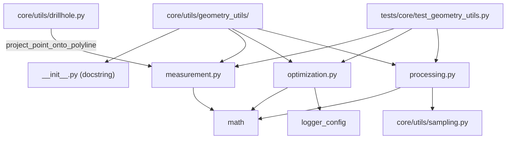

---
tags:
  - secinterp
  - code-walkthrough
  - core
  - utils
aliases:
  - core/utils/geometry_utils/
  - geometry_utils
  - measurement
  - optimization
  - processing
cssclass: secinterp-note
---

# `core/utils/geometry_utils/` — Pure geometry namespace

> [!abstract] One-line summary
> Package `core/utils/geometry_utils/` (4 files): `__init__` (namespace marker), `measurement` (measurement), `optimization` (simplification) and `processing` (densification/interpolation) — pure planar geometry for profiles, with no re-exports in `__init__`.

**Path**: `core/utils/geometry_utils/` (4 files, ~416 lines)
**Own symbol**: none — `__init__.py` is a package marker
**Layer**: Core (QGIS-agnostic)
**Tags**: #secinterp #core #utils

---

## 🎯 Why does this package exist?

The `core/utils/` package was growing with geometry utilities mixed with I/O, parsing and
rendering. `geometry_utils/` groups them under a single domain:

| Problem | Solution |
|---------|----------|
| Geometry utilities scattered across `utils/` | dedicated `geometry_utils/` sub-package |
| Need for a stable namespace | `__init__.py` as a marker (docstring) |
| Keep each concern in its own module | `measurement` / `optimization` / `processing` |

> [!important] Architectural note
> The `__init__.py` **re-exports nothing**: consumers import each submodule by its full path
> (`from ...geometry_utils.measurement import ...`). It is 100% QGIS-agnostic; its only
> "content" is one docstring line.

---

## 🧬 Relationship diagram



> [!tip] How to read
> The `__init__` connects nothing: the three modules are independent leaves. `drillhole`
> imports `measurement` by direct path; `processing` imports `sampling` locally. The test
> `test_geometry_utils.py` is the consumer demonstrating the import paths.

---

## 📦 Imports — architectural reading

```python
# core/utils/geometry_utils/__init__.py
from __future__ import annotations

"""Utilities for geometry extraction, processing, and filtering."""
```

```python
# real import examples in the project
from sec_interp.core.utils.geometry_utils.measurement import project_point_onto_polyline
from sec_interp.core.utils.geometry_utils.optimization import PreviewOptimizer
from sec_interp.core.utils.geometry_utils.processing import densify_line_points
```

| # | Observation |
|---|-------------|
| ① | The `__init__` only declares `from __future__ import annotations` and a docstring. |
| ② | **No re-exports**: consumers use the full submodule path. |
| ③ | No `qgis.*` import in any of the three submodules. |

> [!note] Package marker
> In Python, an `__init__.py` (even 3 lines) turns the directory into an **importable
> package**. Here it also fixes the namespace docstring.

---

## 🏗️ Structure inventory

**The `__init__.py` defines no classes or functions.** The package's real API is the sum of
its three submodules:

| Submodule | Public symbols | Domain |
|-----------|----------------|--------|
| `measurement.py` | `project_point_onto_polyline`, `calculate_polyline_metrics` | measurement |
| `optimization.py` | `PreviewOptimizer` (`.decimate`, `.calculate_curvature`, `.adaptive_sample`) | simplification |
| `processing.py` | `densify_line_points`, `interpolate_segment_points` | densification |

> [!note] 7 public symbols in total
> Two functions in `measurement`, one class with 3 methods in `optimization`, and two
> functions in `processing`. None is re-exported by the package.

---

## 📁 Files in the package

| File | Lines | Role |
|---|--:|---|
| [[#__init__\|__init__.py]] | 3 | Package marker + docstring (no re-exports) |
| [[measurement\|measurement.py]] | 136 | Point-to-polyline projection and profile metrics |
| [[optimization\|optimization.py]] | 197 | Douglas-Peucker, curvature and adaptive sampling |
| [[processing\|processing.py]] | 80 | Densification and segment interpolation |

> [!note] The three submodules have their own notes
> `measurement`, `optimization` and `processing` are documented in detail in their
> individual notes. This package note describes the **namespace** and the `__init__` role.

---

## 📖 The `__init__.py` in detail

### `__init__`

```python
from __future__ import annotations

"""Utilities for geometry extraction, processing, and filtering."""
```

| Element | Purpose |
|---------|---------|
| `from __future__ import annotations` | evaluate annotations lazily (PEP 563) |
| Docstring | describes the domain: geometry *extraction, processing and filtering* |

> [!important] Why it does not re-export
> Re-exporting here would create unnecessary coupling and a duplicated API with [[core_utils___init___py]].
> The choice is **full-path imports**, which also avoid loading all three modules when only
> one is needed.

---

## 📖 Overview of the three submodules

### `measurement.py` — measure

```python
project_point_onto_polyline(point, polyline) -> tuple[float, tuple[float, float]]
calculate_polyline_metrics(points) -> dict[str, Any]
```

Point-to-segment projection and profile summary (total/horizontal distance, elevation
change, average slope). It is the base `drillhole.py` uses to project trajectories. See
[[measurement]].

### `optimization.py` — simplify

```python
PreviewOptimizer.decimate(data, tolerance=None, max_points=1000)
PreviewOptimizer.calculate_curvature(data)
PreviewOptimizer.adaptive_sample(data, ...)
```

Vertex reduction with **Douglas-Peucker**, angular curvature and adaptive sampling for LOD
in rendering. See [[optimization]].

### `processing.py` — densify and interpolate

```python
densify_line_points(points, interval)
interpolate_segment_points(dist_start, dist_end, master_grid_dists, master_profile_data, tolerance)
```

Polyline densification and conversion of interval boundaries into `(dist, elev)` points.
See [[processing]].

---

## 🧭 How to import correctly

Since there are no re-exports, the canonical form is to import **by full path**:

```python
# ✅ correct — full submodule path
from sec_interp.core.utils.geometry_utils.measurement import (
    project_point_onto_polyline,
    calculate_polyline_metrics,
)
from sec_interp.core.utils.geometry_utils.optimization import PreviewOptimizer
from sec_interp.core.utils.geometry_utils.processing import densify_line_points

# ❌ incorrect — the __init__ exposes none of these names
from sec_interp.core.utils.geometry_utils import PreviewOptimizer  # ImportError
```

| Import | Works | Why |
|--------|:---:|-----|
| `from ...geometry_utils.measurement import X` | ✅ | direct submodule |
| `from ...geometry_utils import X` | ❌ | the `__init__` re-exports nothing |
| `from ...geometry_utils import measurement` | ✅ | imports the submodule, not its symbols |

> [!tip] Mnemonic rule
> `geometry_utils` is a **namespace**, not an API. Import the file, not the package.

---

## 🔬 Comparing the three modules

| Criterion | `measurement` | `optimization` | `processing` |
|-----------|---------------|----------------|--------------|
| **Question it answers** | where is the nearest point / how long is it? | which points can I drop without losing shape? | which points lie between two distances? |
| **Typical input** | point + polyline | dense polyline | distances + grid |
| **Typical output** | `(dist, nearest)` / dict | reduced polyline | `[(dist, elev)]` |
| **Key algorithm** | parametric projection | Douglas-Peucker | `ceil` subdivision + `bisect` |
| **Complexity** | `O(n)` | `O(n log n)` | `O(n)` |
| **Main consumer** | `drillhole.py` | preview render | `geology_service` |
| **Imports other core modules** | no | no | `sampling` (local) |

> [!note] Deliberate independence
> None imports the other two. This allows testing and reusing them separately, and avoids
> coupling that would complicate the package's evolution.

---

## 🧩 How to extend the package

To add a fourth module (e.g. `filtering.py`), the inclusion criteria are:

| Criterion | Rule |
|-----------|------|
| Domain | pure planar geometry (no QGIS, no I/O) |
| Size | one responsibility per module |
| `__init__` | stays a marker; **no** re-exports are added |
| Test | new case in `tests/core/test_geometry_utils.py` or its own file |

> [!warning] Do not break the QGIS-agnostic rule
> If a future module needs `QgsGeometry`, it does not belong to `geometry_utils/`: it should
> go to an adapter layer (GUI) or accept WKT/primitives. See [[core_interfaces]].

---

## 🧪 Package test strategy

The package's only test is `tests/core/test_geometry_utils.py`, structured per module:

| Test class | Submodule covered | Focus |
|------------|-------------------|-------|
| `TestGeometryMeasurement` | `measurement` | metrics (empty, 3-4-5 triangle) |
| `TestGeometryOptimization` | `optimization` | decimation, curvature, sampling |
| `TestGeometryProcessing` | `processing` | densification, interpolation |

- **Mock-first / no QGIS**: tests inherit `BaseTestCase` and require no QGIS.
- Indirect coverage comes via `tests/core/test_drillhole_utils.py` (uses `measurement`).

---

## 🔄 Data flow

| Phase | Input | Transformation | Output |
|-------|-------|----------------|--------|
| Measurement | point + polyline | parametric projection | `(dist, nearest)` |
| Simplification | dense polyline | Douglas-Peucker / LOD | reduced polyline |
| Densification | polyline + `interval` | `ceil` subdivision | densified polyline |

> [!tip] A typical pipeline
> `drillhole` → `measurement` (project) → `optimization` (simplify for render) →
> `processing` (densify the geological profile). Each module solves one link.

---

## 🏛️ Design patterns present

| Pattern | Where | Purpose |
|---------|-------|---------|
| **Namespace package** | `__init__.py` | group by domain without coupling |
| **Full-path import** | consumers | load only what is needed |
| **Pure function / leaf** | the 3 modules | no side effects, thread-safe |
| **Responsibility split** | 3 modules | measure / simplify / densify |

---

## 🧾 API summary

| Symbol | Origin | Typical use |
|--------|--------|-------------|
| `project_point_onto_polyline` | `measurement` | project onto section |
| `calculate_polyline_metrics` | `measurement` | summarize profile shape |
| `PreviewOptimizer.decimate` | `optimization` | simplify polyline |
| `PreviewOptimizer.calculate_curvature` | `optimization` | estimate bends |
| `PreviewOptimizer.adaptive_sample` | `optimization` | shape-sensitive sampling |
| `densify_line_points` | `processing` | guarantee vertex density |
| `interpolate_segment_points` | `processing` | profile of an interval |

---

## 🧪 How to run the tests

```bash
PYTHONPATH=.. uv run python3 -m unittest \
    tests.core.test_geometry_utils -v
```

- Single class: `tests.core.test_geometry_utils` groups the three submodules.
- Requires no QGIS (Mock-first): runs like the rest of `tests/core/`.
- `BaseTestCase` provides the environment and automatic cleanup.

---

## 🔎 The docstring as an implicit contract

```python
"""Utilities for geometry extraction, processing, and filtering."""
```

| Word | What it points to today |
|------|-------------------------|
| `extraction` | `measurement` (projection/point extraction) |
| `processing` | `processing` (densification/interpolation) |
| `filtering` | `optimization` (vertex filtering via DP) |

> [!note] Approximate mapping
> The docstring does not name the modules, but describes **three verbs** that correspond to
> the three responsibilities. It is a design hint, not a formal contract (empty `__all__`,
> no re-exports).

---

## 🛡️ Error handling

The package handles no errors (it has no logic). At the submodule level:

| Module | Behaviour |
|--------|-----------|
| `measurement` | defensive returns (empty/one vertex → `0.0`) |
| `optimization` | `try/except` fail-safe in `decimate` |
| `processing` | intact return on invalid inputs |

---

## 🧪 Associated tests

`tests/core/test_geometry_utils.py` covers the three submodules:

- `TestGeometryMeasurement` — `calculate_polyline_metrics` (empty and 3-4-5 triangle).
- `TestGeometryOptimization` — `decimate`, `calculate_curvature`, `adaptive_sample`.
- `TestGeometryProcessing` — `densify_line_points`, `interpolate_segment_points`.

> [!note] The test imports by full path
> `test_geometry_utils.py` demonstrates the package's import pattern:
> `from ...geometry_utils.measurement import ...` (nothing via the `__init__`).

---

## 👀 Observations and notes

> [!success] Strengths
> - Clean domain grouping; each module has a single responsibility.
> - Minimal `__init__` (no re-exports) avoids coupling and a duplicated API.
> - 100% QGIS-agnostic and testable without a QGIS environment.

> [!warning] Points of attention
> - The docstring ("extraction, processing, and filtering") does not mention `optimization`.
> - Without re-exports, API discovery depends on knowing the file names.
> - The `__init__` defines no `__all__` (not needed since it re-exports nothing).

> [!question] Open questions
> - Update the docstring to reflect the three current modules?
> - Add a selective re-export in `core/utils/__init__.py` for the most-used helpers?

---

## 🔗 Related notes

- [[Index]] — vault index
- [[measurement]] / [[optimization]] / [[processing]] — the three submodules
- [[core_utils___init___py]] — facade of the parent `core/utils/` package
- [[core_utils]] — package note for the `geology`/`i18n`/`sampling`/`spatial` group
- [[drillhole]] — consumer of `measurement.project_point_onto_polyline`

---

*Note of the SecInterp Code Walkthrough v2 vault — v3.8.0*
