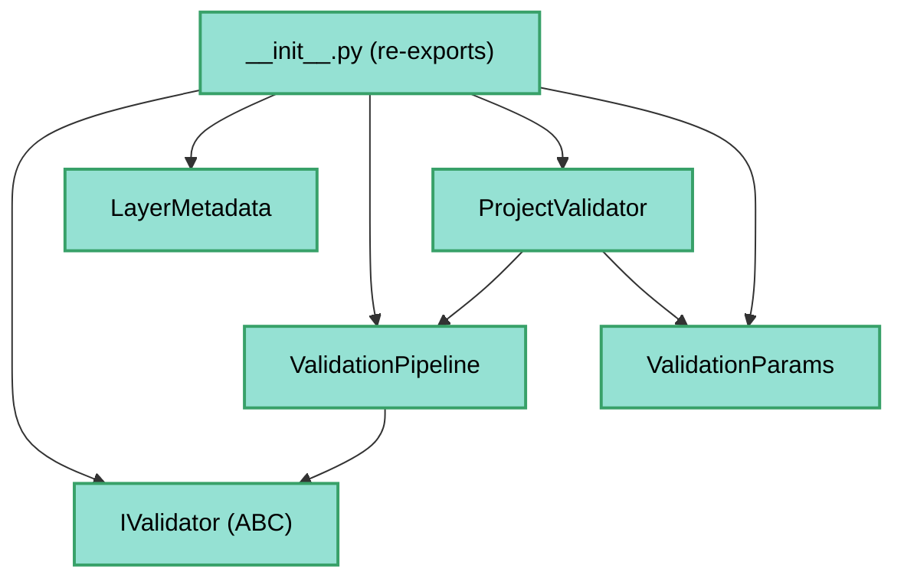

---
tags:
  - secinterp
  - code-walkthrough
  - core
  - validation
aliases:
  - core/validation/
  - validation
  - IValidator
  - LayerMetadata
  - ValidationPipeline
cssclass: secinterp-note
---

# `core/validation/` — Validation framework

> [!abstract] One-line summary
> Package `core/validation/` (4 files): declares the `IValidator` interface, the `LayerMetadata` DTO, the `ValidationPipeline` orchestrator and the `__init__` that re-exports the public validation API, all QGIS-agnostic.

**Path**: `core/validation/` (4 files, ~148 lines)
**Main classes**: `IValidator`, `LayerMetadata`, `ValidationPipeline`, `ProjectValidator`, `ValidationParams`
**Layer**: Core (QGIS-agnostic)
**Tags**: #secinterp #core #validation

---

## 🎯 Why does this package exist?

Validating a QGIS project (layers, fields, ranges) must be executable without a QGIS
environment. This package defines the decoupled validation **infrastructure**:

| Problem | Solution |
|---------|----------|
| Validate without touching QGIS objects | `LayerMetadata` (detached metadata produced by the GUI) |
| Common contract for validators | `IValidator` (ABC with `validate`) |
| Run many validators in a chain | `ValidationPipeline` |
| Stable public API | `__init__.py` re-exports 15 symbols |

> [!important] Layer rule
> The 4 files in this group do **not import `qgis.*`**. `LayerMetadata` uses `FieldType`
> (a domain enum) instead of `QVariant`. The rest of the package (`field_validator`,
> `layer_validator`, `project_validator`, etc.) consumes this infrastructure.

---

## 🧬 Relationship diagram



> [!tip] How to read
> `pipeline.py` composes `IValidator`s; `project_validator.py` (outside the group)
> instantiates the pipeline with concrete validators. `__init__.py` is the export facade.

---

## 📦 Imports — architectural reading

```python
# core/validation/__init__.py
from .field_validator import (validate_angle_range, validate_field_exists, ...)
from .layer_validator import (validate_crs_compatibility, validate_layer_geometry, ...)
from .path_validator import (validate_output_path, validate_safe_output_path)
from .project_validator import (ProjectValidator, ValidationParams)
from .validation_helpers import validate_reasonable_ranges

# core/validation/base_validator.py
from abc import ABC, abstractmethod
from typing import TYPE_CHECKING

# core/validation/layer_metadata.py
from dataclasses import dataclass, field
from sec_interp.core.domain import FieldType

# core/validation/pipeline.py
from collections.abc import Iterable
from .base_validator import IValidator
```

| # | Observation |
|---|-------------|
| ① | **Zero `qgis.*`** across the 4 files of the group. |
| ② | `base_validator.py` uses `TYPE_CHECKING` for circular imports (typing only). |
| ③ | `layer_metadata.py` imports `FieldType` from the domain (enum, not `QVariant`). |
| ④ | `pipeline.py` depends only on `IValidator` (dependency inversion). |
| ⑤ | `__init__.py` re-exports functions from concrete validators (outside the group). |

---

## 🏗️ Structure inventory

**Classes:**
- `class IValidator(ABC)` — 1 abstract method
- `@dataclass class LayerMetadata` — 9 fields
- `class ValidationPipeline` — 3 methods

**Constants (in `layer_metadata.py`):**
- `GEOMETRY_POINT` / `GEOMETRY_LINE` / `GEOMETRY_POLYGON` / `GEOMETRY_UNKNOWN`
- `KIND_VECTOR` / `KIND_RASTER` / `KIND_UNKNOWN`

**Re-exports (in `__init__.py`):**
- `ProjectValidator`, `ValidationParams`
- `validate_angle_range`, `validate_crs_compatibility`, `validate_field_exists`, `validate_field_type`, `validate_integer_input`, `validate_layer_geometry`, `validate_layer_has_features`, `validate_numeric_input`, `validate_output_path`, `validate_raster_band`, `validate_reasonable_ranges`, `validate_safe_output_path`, `validate_structural_requirements`

---

## 📁 Files in the package

| File | Lines | Role |
|---|--:|---|
| [[#__init__.py\|__init__.py]] | 45 | Export facade (15 public symbols) |
| [[#base_validator.py\|base_validator.py]] | 25 | `IValidator` — base validator interface |
| [[#layer_metadata.py\|layer_metadata.py]] | 49 | `LayerMetadata` — detached layer metadata |
| [[#pipeline.py\|pipeline.py]] | 29 | `ValidationPipeline` — chained execution |

---

## 📖 File-by-file walkthrough

### __init__.py

```python
from .field_validator import (
    validate_angle_range, validate_field_exists, validate_field_type,
    validate_integer_input, validate_numeric_input,
)
from .layer_validator import (
    validate_crs_compatibility, validate_layer_geometry,
    validate_layer_has_features, validate_raster_band,
    validate_structural_requirements,
)
from .path_validator import validate_output_path, validate_safe_output_path
from .project_validator import ProjectValidator, ValidationParams
from .validation_helpers import validate_reasonable_ranges
```

Defines the package's **public API**. Consumers (`gui/`, `controller`) import
`from sec_interp.core.validation import ProjectValidator`, not the internal modules. The
modules `field_validator`, `layer_validator`, `path_validator`, `project_validator`,
`validation_helpers` are **not part of this group** (they have their own notes).

### base_validator.py

```python
class IValidator(ABC):
    @abstractmethod
    def validate(self, params: ValidationParams, context: ValidationContext) -> None:
        """Execute validation logic."""
        pass
```

Minimal contract of a validator: receives `ValidationParams` (data) and
`ValidationContext` (error accumulator), and returns nothing (errors accumulate in the
context). Uses `TYPE_CHECKING` to type without coupling.

> [!tip] "Void" interface with accumulator
> The validator does not return `bool` nor raise: it **writes** into `ValidationContext`.
> This lets the pipeline accumulate *all* errors before presenting them.

### layer_metadata.py

```python
@dataclass
class LayerMetadata:
    name: str = ""
    is_valid: bool = False
    kind: str = KIND_UNKNOWN
    geometry_type: str | None = None
    field_names: list[str] = field(default_factory=list)
    field_types: dict[str, FieldType] = field(default_factory=dict)
    band_count: int = 0
    feature_count: int = 0
    crs_authid: str | None = None
```

DTO describing a QGIS layer **without** the QGIS object: name, validity, kind
(vector/raster), geometry, fields (with `FieldType`), bands, feature count and CRS. It is
produced by the GUI's `ValidationExtractor` adapter so the core never touches `QgsMapLayer`.

### pipeline.py

```python
class ValidationPipeline:
    def __init__(self, validators: Iterable[IValidator] | None = None) -> None:
        self._validators: list[IValidator] = list(validators) if validators else []

    def add_validator(self, validator: IValidator) -> None:
        self._validators.append(validator)

    def execute(self, params: ValidationParams, context: ValidationContext) -> None:
        for validator in self._validators:
            validator.validate(params, context)
```

**Composite/Iterator** orchestrator: runs a list of `IValidator` in sequence over the
same context. `ProjectValidator.validate_all` uses it with 6 concrete validators
(`SectionValidator`, `DEMValidator`, `GeologyValidator`, `StructureValidator`,
`DrillholeValidator`, `OutputValidator`).

---

## 🔄 Data flow

| Phase | Input | Transformation | Output |
|-------|-------|----------------|--------|
| Extraction (GUI) | QGIS layers | `ValidationExtractor` | `LayerMetadata` |
| Preparation | metadata + fields | constructor | `ValidationParams` |
| Execution | `ValidationParams` | `pipeline.execute` | errors in `ValidationContext` |
| Verification | `context` | `raise_if_errors` | `ValidationError` |

---

## 🏛️ Design patterns present

| Pattern | Where | Purpose |
|---------|-------|---------|
| **Composite/Iterator** | `ValidationPipeline` | Run validators in a chain |
| **Template (ABC)** | `IValidator` | Fixes the `validate` signature |
| **Detached DTO** | `LayerMetadata` | Metadata without QGIS objects |
| **Facade (module)** | `__init__.py` | Stable public API |
| **Null Object** | `LayerMetadata` defaults | Safe default values |

---

## 🧾 API summary

| Symbol | Signature / Inherits | Typical use |
|--------|----------------------|-------------|
| `IValidator` | `ABC` | Validator base |
| `IValidator.validate` | `(params, context) -> None` | Run validation |
| `LayerMetadata` | `@dataclass` | Layer metadata |
| `ValidationPipeline` | — | Orchestrate validators |
| `ValidationPipeline.add_validator` | `(validator) -> None` | Add validator |
| `ValidationPipeline.execute` | `(params, context) -> None` | Run in a chain |

---

## 🛡️ Error handling

Validators **do not raise**: they accumulate in `ValidationContext`. The pattern is:

- `context.add_error(...)` / `context.add_warning(...)` — accumulate
- `context.raise_if_errors()` — raise `ValidationError` with all errors together

> [!tip] Fail-fast vs accumulation
> `ProjectValidator.validate_all` accumulates everything and raises at the end; the
> legacy helpers (`is_dem_complete`, etc.) only consult `context.has_errors` without
> raising.

---

## 🧪 Associated tests

Mapped to the validation framework tests (mock-first, no QGIS):

- `tests/core/validation/test_validation_helpers.py` — `ValidationContext` and accumulation.
- `tests/core/validation/test_validators.py` — concrete validators.
- `tests/core/validation/test_service_validation.py` — service validation.
- `tests/core/test_validation.py` / `test_validation_refactor.py` — framework regression.
- `tests/core/test_project_validator.py` — `ProjectValidator.validate_all`.

---

## 👀 Observations and notes

> [!success] Strengths
> - **Zero QGIS**: all layer validation is done over `LayerMetadata`.
> - Error accumulation (not fail-fast) improves UX.
> - `FieldType` (enum) replaces `QVariant` without losing semantics.
> - `__init__.py` centralizes the public API (consumers do not import internals).

> [!warning] Points of attention
> - The documented group (4 files) is only the **infrastructure**; concrete validators live in other modules.
> - `IValidator.validate` returns `None` and types `ValidationContext` only in `TYPE_CHECKING`.
> - `LayerMetadata` mixes magic strings (`"point"`, `"vector"`) instead of an enum.

> [!question] Open questions
> - Convert `geometry_type`/`kind` of `LayerMetadata` to enums (`FieldType`-like)?
> - Type the `__init__.py` re-exports more strictly (it already uses `__all__`)?

---

## 🧩 The `ValidationContext` accumulator

`IValidator.validate` writes into a `ValidationContext` (defined in
`validation_helpers.py`, outside the group). Its key members:

| Member | Type | Use |
|--------|------|-----|
| `add_error(message, field_name, **kwargs)` | method | accumulate a hard error |
| `add_warning(message, field_name, **kwargs)` | method | accumulate a warning |
| `has_errors` | property | any hard errors? |
| `has_warnings` | property | any warnings? |
| `errors` / `warnings` | property | `RichValidationError` lists |
| `merge(other)` | method | combine contexts |
| `raise_if_errors()` | method | raise `ValidationError` |

> [!tip] Accumulate, don't fail
> The context lets you collect **all** form errors before presenting them, instead of
> failing on the first invalid field.

## 🧭 The 3 validation levels

The `geological-logic` skill documents validation in 3 levels; this package is the
**infrastructure** of level 2:

| Level | What it validates | Where |
|-------|-------------------|-------|
| 1. Primitives | types and ranges (`buffer_dist`, `band_num`) | `PreviewParams.validate()` (in `dtos.py`) |
| 2. Business | dependencies between layers/fields | `ProjectValidator` + `ValidationPipeline` + `ValidationContext` |
| 3. Cross-layer | consistency between selected layers | `project_validators.py` (concrete) |

> [!important] Layers → `LayerMetadata`
> At levels 2/3, QGIS layers arrive as `LayerMetadata`, not `QgsMapLayer`. This is what
> makes `ProjectValidator.validate_all` runnable without a QGIS environment.

## 🗂️ Concrete validators (outside the group)

`ProjectValidator.validate_all` composes 6 concrete validators via the pipeline:

| Validator | Module | Goal |
|-----------|--------|------|
| `SectionValidator` | `project_validators.py` | Section line |
| `DEMValidator` | `project_validators.py` | DEM raster + band |
| `GeologyValidator` | `project_validators.py` | Outcrop layer/field |
| `StructureValidator` | `project_validators.py` | Structural layer/fields |
| `DrillholeValidator` | `project_validators.py` | Collar/survey/interval |
| `OutputValidator` | `project_validators.py` | Output path |

> [!note] Infrastructure vs rules separation
> This group (4 files) defines the *how* (interface, DTO, pipeline); the concrete
> validators define the *what* (business rules). See [[project_validators]].

## 🧾 Re-exported validation surface

`__init__.py` groups the functional API by family:

| Family | Functions | Purpose |
|--------|-----------|---------|
| `field_validator` | `validate_angle_range`, `validate_field_exists`, `validate_field_type`, `validate_integer_input`, `validate_numeric_input` | Validate fields |
| `layer_validator` | `validate_crs_compatibility`, `validate_layer_geometry`, `validate_layer_has_features`, `validate_raster_band`, `validate_structural_requirements` | Validate layers |
| `path_validator` | `validate_output_path`, `validate_safe_output_path` | Validate paths |
| `project_validator` | `ProjectValidator`, `ValidationParams` | Orchestration |
| `validation_helpers` | `validate_reasonable_ranges` | Extreme-range warnings |

> [!tip] "Functional" + "class" API
> Loose functions (unit validations) coexist with classes (`ProjectValidator`). Consumers
> typically use `ProjectValidator.validate_all`, not the loose functions.

## 🌐 i18n notes

- Validator error messages are translated **at the point of raising** (with `self.tr(...)`
  in the GUI or in the validators), not in the infrastructure of this group.
- `RichValidationError.__str__` prefixes `[WARNING]`/`[ERROR]` and the `field_name`,
  easing presentation in the UI without coupling to Qt.

> [!note] No magic strings in the infrastructure
> `base_validator.py`, `layer_metadata.py` and `pipeline.py` contain no user texts: the
> infrastructure is neutral; the messages live in the concrete validators.

## 🧭 Consistency with `PreviewParams.validate()`

Project validation coexists with the **native** primitive validation in `dtos.py`:

| Validation | Where | Error type |
|------------|-------|------------|
| `buffer_dist >= 0` | `PreviewParams.validate()` | `ValueError` |
| `band_num >= 1` | `PreviewParams.validate()` | `ValueError` |
| Cross-layer (level 2/3) | `ProjectValidator` + pipeline | `ValidationError` |

> [!note] `ValueError` vs `ValidationError`
> `PreviewParams.validate()` raises `ValueError` (historical), while the validation
> framework uses `ValidationError` (see [[exceptions]]). This is a known inconsistency.

## 🔗 Related notes

- [[Index]] — vault index
- [[field_validator]] / [[layer_validator]] / [[path_validator]] — re-exported validators
- [[project_validator]] — `ProjectValidator` and `ValidationParams` (pipeline consumer)
- [[validation_helpers]] — `ValidationContext`, `RichValidationError`
- [[validators]] / [[project_validators]] — concrete validators
- [[domain]] — `FieldType` (enum used in `LayerMetadata`)
- [[exceptions]] — `ValidationError`
- [[controller]] — validates `PreviewParams` before computing

---

*Note of the SecInterp Code Walkthrough v2 vault — v3.9.0*
