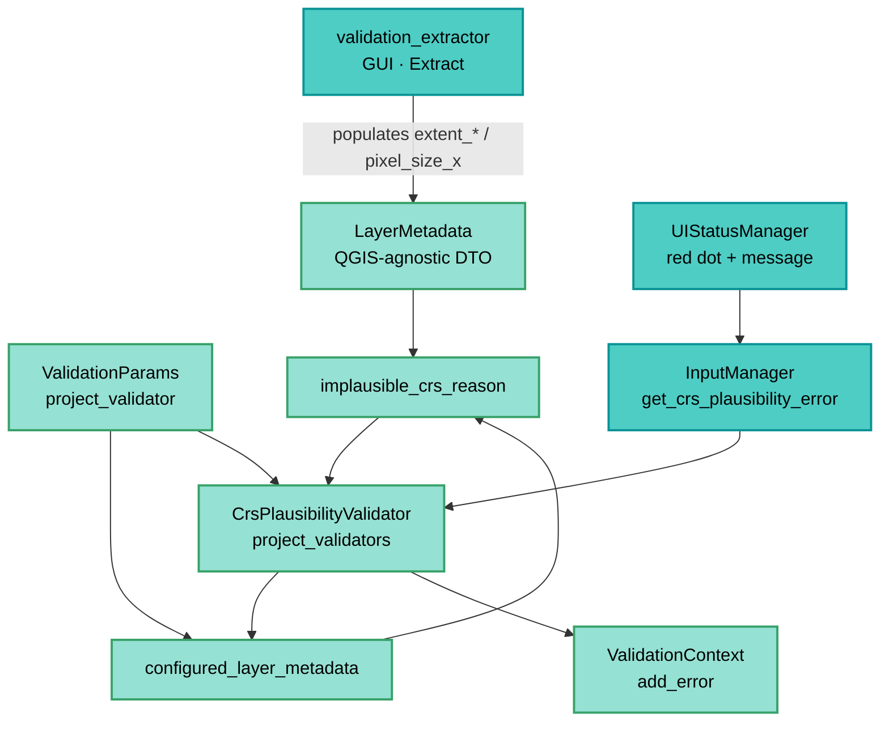

---
tags:
  - secinterp
  - code-walkthrough
  - core
  - validation
aliases:
  - crs_plausibility.py
  - implausible_crs_reason
  - configured_layer_metadata
cssclass: secinterp-note
---

# `core/validation/crs_plausibility.py`

> [!abstract] One-line summary
> Conservative, 100% QGIS-agnostic heuristic that detects mislabelled CRS by comparing a `LayerMetadata` extent (or raster pixel size) against the declared CRS kind.

**Path**: `core/validation/crs_plausibility.py` (99 lines)
**Main functions**: `configured_layer_metadata`, `implausible_crs_reason`
**Layer**: core (QGIS-agnostic · Validation)
**Tags**: #secinterp #core #validation

---

## 🎯 Why does this file exist?

A wrong CRS label **cannot be read from metadata**: QGIS trusts the declaration. But it
usually gives itself away in the coordinate values. This module turns that intuition
into a conservative rule that prevents silently wrong profiles:

| Problem | Solution |
|---------|----------|
| Metadata declares a CRS, but the declaration is wrong and QGIS believes it | Infer from the extent: outside lon/lat bounds, or impossible sizes in projected units |
| On-the-fly reprojection hides the error and produces wrong output silently | A hard error that blocks preview/export before anything is generated |
| Hand-checking the extent of 7 layers is tedious and easily forgotten | `configured_layer_metadata` walks the configured layers and filters out the missing ones |
| Incomplete metadata must not block legitimate work | The heuristic stays silent (`return ""`) when it cannot judge: *fail-open* |

> [!important] Architectural note
> **Pure QGIS-agnostic decision.** It consumes the [[layer_metadata]] DTO, already
> extracted by the GUI adapter [[validation_extractor]]. No `qgis.*`, no Qt, no I/O: a
> decision function testable without QGIS. `ValidationParams` is imported only under
> `TYPE_CHECKING` to avoid a cycle with [[project_validator]].

---

## 🧬 Relationship diagram



> [!tip] How to read
> The GUI extractor fills `LayerMetadata`; the core only reads primitives (`extent_*`,
> `pixel_size_x`, `crs_is_geographic`) and returns a `str`. The validator turns a
> non-empty reason into a context error, and the GUI presents it as a block.

---

## 📦 Imports — architectural reading

```python
# core/validation/crs_plausibility.py
from __future__ import annotations

from typing import TYPE_CHECKING

from sec_interp.core.validation.layer_metadata import LayerMetadata

if TYPE_CHECKING:
    from .project_validator import ValidationParams
```

| # | Observation |
|---|-------------|
| ① | Imports only the `LayerMetadata` DTO: zero `qgis.*` or Qt dependencies. |
| ② | `ValidationParams` under `TYPE_CHECKING`: the annotation exists, the runtime import does not (avoids a cycle). |
| ③ | `from __future__ import annotations` keeps the project standard for compound types. |
| ④ | No logger, no state, no side effects: a total decision function. |

> [!note] Core/UI boundary
> This module is the canonical *Extract-then-Compute* example: the GUI extracts
> (`extent_xmin`, `crs_is_geographic`, `pixel_size_x`) and the core only compares numbers.

---

## 🏗️ Structure inventory

**Constants** (plausibility thresholds):

| Constant | Value | Meaning |
|----------|-------|---------|
| `GEOGRAPHIC_X_LIMIT` | `180.0` | Maximum believable longitude in degrees |
| `GEOGRAPHIC_Y_LIMIT` | `90.0` | Maximum believable latitude in degrees |
| `MIN_PROJECTED_SPAN` | `1.0` | Minimum believable projected span (map units) |
| `MIN_PROJECTED_PIXEL` | `1e-3` | Minimum believable projected pixel (map units) |

**Functions:**

- `configured_layer_metadata(params: ValidationParams) -> list[LayerMetadata]`
- `_extent(metadata: LayerMetadata) -> tuple[float, float, float, float] | None`
- `implausible_crs_reason(metadata: LayerMetadata | None) -> str`

---

## 📁 Files in the package

| File | Role relative to the heuristic |
|---|---|
| `gui/adapters/validation_extractor.py` | GUI Extract: fills `extent_*` and `pixel_size_x` in the DTO |
| `core/validation/layer_metadata.py` | Consumed DTO (see [[layer_metadata]]) |
| `core/validation/project_validators.py` | `CrsPlausibilityValidator` (see [[project_validators]]) |
| `core/validation/project_validator.py` | `ValidationParams` + pipelines + `crs_plausibility_error` |
| `gui/ui_status_manager.py` | Presents the block: red dot and critical message |

---

## 📖 Method-by-method walkthrough

### `configured_layer_metadata` — the layer filter

```python
def configured_layer_metadata(params: ValidationParams) -> list[LayerMetadata]:
    """Return the detached metadata of every configured layer."""
    candidates = (
        params.raster_layer,
        params.line_layer,
        params.outcrop_layer,
        params.struct_layer,
        params.collar_layer,
        params.survey_layer,
        params.interval_layer,
    )
    return [m for m in candidates if m is not None]
```

| Decision | Detail |
|----------|--------|
| Fixed 7-item tuple | Same order as the rest of `ValidationParams`: DEM, line, geology, structure, collar, survey, intervals |
| `is not None` filter | Unconfigured layers are skipped: a missing layer is not an error |
| No CRS logic | It only picks candidates; the heuristic decides afterwards |

### `_extent` — the all-or-nothing gate

```python
def _extent(metadata: LayerMetadata) -> tuple[float, float, float, float] | None:
    """Return the populated extent tuple, or None when incomplete."""
    xmin = metadata.extent_xmin
    ymin = metadata.extent_ymin
    xmax = metadata.extent_xmax
    ymax = metadata.extent_ymax
    if xmin is None or ymin is None or xmax is None or ymax is None:
        return None
    return xmin, ymin, xmax, ymax
```

A partial extent (`xmin` present, `ymax` missing) is discarded entirely: the heuristic
requires all four corners to compute the span and the maximum.

### `implausible_crs_reason` — the heuristic

```python
def implausible_crs_reason(metadata: LayerMetadata | None) -> str:
    if metadata is None or metadata.crs_is_geographic is None:
        return ""
    extent = _extent(metadata)
    if extent is None:
        return ""
    xmin, ymin, xmax, ymax = extent

    span_x = abs(xmax - xmin)
    span_y = abs(ymax - ymin)
    if span_x == 0 and span_y == 0:
        return ""

    max_x = max(abs(xmin), abs(xmax))
    max_y = max(abs(ymin), abs(ymax))
    within_geographic_bounds = max_x <= GEOGRAPHIC_X_LIMIT and max_y <= GEOGRAPHIC_Y_LIMIT

    if metadata.crs_is_geographic:
        if max_x > GEOGRAPHIC_X_LIMIT or max_y > GEOGRAPHIC_Y_LIMIT:
            return (
                f"Layer '{metadata.name}' is declared with a geographic CRS but its "
                f"coordinates exceed lon/lat bounds (x up to {max_x:.3g}, y up to "
                f"{max_y:.3g}); the data may actually be projected."
            )
        return ""

    tiny_span = max(span_x, span_y) < MIN_PROJECTED_SPAN
    tiny_pixel = (
        metadata.pixel_size_x is not None and 0 < metadata.pixel_size_x < MIN_PROJECTED_PIXEL
    )
    if within_geographic_bounds and (tiny_span or tiny_pixel):
        return (
            f"Layer '{metadata.name}' is declared with a projected CRS but its extent "
            f"({xmin:.4g}, {ymin:.4g} : {xmax:.4g}, {ymax:.4g}) looks like degrees; "
            "the data may be geographic (e.g. EPSG:4326) with a wrong CRS label. "
            "Fix it with 'Assign Projection' (not 'Reproject')."
        )
    return ""
```

#### Prior guards — *fail-open*

| Guard | Effect |
|-------|--------|
| `metadata is None` | Silence: there is nothing to judge |
| `crs_is_geographic is None` | The CRS could not be classified in the extractor → silence |
| `_extent(...) is None` | Incomplete or empty extent → silence |
| `span_x == 0 and span_y == 0` | Degenerate extent (a point) is not evidence → silence |

> [!important] Only fires on a contradiction
> The message never speculates: it is emitted only when the declaration and the observed
> values contradict each other. When in doubt, `""` (does not block).

#### Geographic branch — declared degrees, projected values

If `crs_is_geographic=True` and `max_x > 180` **or** `max_y > 90`, the values do not fit
lon/lat and the "may actually be projected" reason is returned. Test example:
`extent = (500000, 4000000 : 510000, 4010000)` with a geographic CRS → blocked.

#### Projected branch — declared metres, values in degrees

For a projected CRS, two "these are degrees" signals are computed:

- `tiny_span`: the larger span is `< 1.0` map unit (a real projected layer would span
  hundreds/thousands of units).
- `tiny_pixel`: `0 < pixel_size_x < 1e-3` (a raster pixel smaller than 1 mm is absurd).

Only if **additionally** the extent falls within lon/lat bounds
(`within_geographic_bounds`) is the reason emitted. The test pins it down:
`(0, 0 : 2, 2)` with pixel `1e-4` is flagged; `(0, 0 : 200, 200)` is accepted.

> [!warning] 0–360 caveat and other false positives
> - **0–360 convention**: some legitimate geographic layers use longitudes 0–360
>   (Pacific). `max_x` can reach 360 > 180 and a false positive would be flagged.
> - **Non-metric units**: `MIN_PROJECTED_PIXEL = 1e-3` and `MIN_PROJECTED_SPAN = 1.0`
>   are interpreted in map units. A CRS in kilometres or feet with a small pixel could
>   graze the threshold.
> - **Tiny local grid**: a projected layer with coordinates near zero and a
>   sub-millimetre pixel (e.g. a synthetic mesh) would fall into the projected branch.

---

## 🔄 Data flow

| Phase | Input | Transformation | Output |
|-------|-------|----------------|--------|
| Extract (GUI) | `QgsMapLayer` | `validation_extractor` fills `extent_*`, `crs_is_geographic`, `pixel_size_x` | `LayerMetadata` |
| Selection | `ValidationParams` | `configured_layer_metadata` filters `None` | list of DTOs |
| Normalization | `LayerMetadata` | `_extent` requires all 4 corners | tuple or `None` |
| Decision | tuple + CRS | geographic/projected branches | reason `str` or `""` |
| Aggregation | reasons | `CrsPlausibilityValidator` adds an error per reason | `ValidationContext` |
| Presentation | context error | `UIStatusManager` paints red and warns | preview/export blocked |

---

## 🏛️ Design patterns present

| Pattern | Where | Purpose |
|---------|-------|---------|
| **Extract-then-Compute** | whole module | The core consumes only DTOs, never QGIS |
| **Fail-open / conservative** | `implausible_crs_reason` guards | When in doubt, do not block legitimate work |
| **Predicate returning reason** | `implausible_crs_reason` | `""` = plausible; text = human reason |
| **Single-responsibility** | `configured_layer_metadata` vs `_extent` | Selection, normalization and decision are separate |
| **Named constants** | thresholds | The plausibility policy is auditable and tunable |

---

## 🧾 API summary

| Symbol | Signature | Typical use |
|--------|-----------|-------------|
| `configured_layer_metadata` | `(params: ValidationParams) -> list[LayerMetadata]` | Configured layers to validate |
| `implausible_crs_reason` | `(metadata: LayerMetadata \| None) -> str` | Mislabel reason, or `""` |
| `_extent` | `(metadata) -> tuple[float, float, float, float] \| None` | Normalize a complete extent |
| `GEOGRAPHIC_X_LIMIT` … | `float` constants | Plausibility thresholds |

---

## 🛡️ Error handling

| Situation | Behavior |
|-----------|----------|
| `metadata=None` | `""` (silence) |
| `crs_is_geographic=None` | `""` (not classifiable) |
| Partial/empty extent | `""` (no evidence) |
| Degenerate extent (span 0) | `""` (a point proves nothing) |
| Clear contradiction | Non-empty reason → **hard error** in the pipeline |

> [!note] No custom exceptions
> The module raises no exceptions: all uncertainty is represented as an empty string.
> Severity (blocking) is decided by `CrsPlausibilityValidator`.

---

## 🧪 Associated tests

- `tests/core/test_crs_plausibility.py` — 8 cases over `implausible_crs_reason`.

| Case | Input | Expected |
|------|-------|----------|
| Projected with degree extent | `extent ≈ (-99, 22.7 : -98.99, 23)` | flagged (`"degrees"`) |
| Projected with tiny pixel | `pixel=1e-4`, `extent=(0,0:2,2)` | flagged |
| Normal projected | `extent=(500000, 4e6 : 510000, 4.01e6)` | `""` |
| Projected outside lon/lat | `extent=(0,0:200,200)` | `""` |
| Correct geographic | `extent ≈ (-99, 22.7 : -98.99, 23)` | `""` |
| Geographic with projection | `extent=(500000, 4e6 : 510000, 4.01e6)` | flagged |
| Missing extent / CRS | various | `""` |
| Degenerate extent | `extent=(0,0:0,0)` | `""` |

> [!tip] Natural coverage
> Pure function: `assertEqual`/`assertIn` over a `LayerMetadata` built with kwargs. No
> QGIS required (see [[layer_metadata]] for the DTO).

---

## 👀 Observations and notes

> [!success] Strengths
> - Zero QGIS dependencies: portable and testable with `tests/core`.
> - Conservative by design: it only blocks on an evident contradiction.
> - Explicit remediation message ("Assign Projection", not "Reproject").
> - Named thresholds: the policy is readable and tunable in one place.

> [!warning] Points of attention
> - The 0–360 convention can produce false positives in the geographic branch.
> - The thresholds assume metric units; CRS in km/feet are more fragile.
> - It does not detect both symmetric errors at once, nor layers without a valid extent.
> - An unreliable raster pixel (`pixel_size_x=None`) disables that signal silently.

> [!question] Open questions
> - Normalize longitudes to −180..180 before comparing to tolerate 0–360?
> - Scale `MIN_PROJECTED_PIXEL`/`MIN_PROJECTED_SPAN` according to the CRS units?
> - Turn detection into a warning when certainty is low instead of a hard error?

---

## 🔗 Related notes

- [[Index]] — vault index
- [[layer_metadata]] — consumed DTO (`extent_*`, `crs_is_geographic`, `pixel_size_x`)
- [[project_validators]] — `CrsPlausibilityValidator` that turns the reason into an error
- [[project_validator]] — `ValidationParams` and the `validate_all` / `validate_preview_requirements` pipelines
- [[validation_extractor]] — GUI adapter that populates the DTO
- [[ui_status_manager]] — presentation of the block (red dot + message)

---

*Note of the SecInterp Code Walkthrough v2 vault — v3.9.1*
