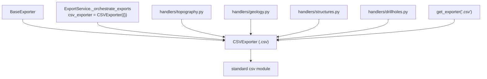

---
tags:
  - secinterp
  - code-walkthrough
  - exporters
  - tabular
aliases:
  - csv_exporter.py
  - CSVExporter
cssclass: secinterp-note
---

# `exporters/csv_exporter.py`

> [!abstract] One-line summary
> Pure-standard-Python tabular exporter: writes `headers` + `rows` to UTF-8 `.csv` without touching QGIS, and is the exact backup accompanying every vector file from the handlers.

**Path**: `exporters/csv_exporter.py` (58 lines)
**Main class**: `CSVExporter(BaseExporter)`
**Layer**: Exporters (100% QGIS-agnostic: only `csv` + `pathlib`)
**Tags**: #secinterp #exporters #tabular

---

## 🎯 Why does this file exist?

Every exported entity (topography, geology, structures, drillholes, interpretations)
needs a **readable, auditable** representation alongside the geospatial binary.
CSV fills that role:

| Problem | Solution |
|---------|----------|
| Inspect numbers without opening a GIS | `headers` + `rows` table in plain UTF-8 text |
| SHP truncates fields to 10 chars; DXF truncates widths | CSV keeps the **exact** values as backup |
| Traceability of core-computed values | Each handler dumps its DTOs to CSV next to the vector file |
| Export without initialised QGIS | Standard `csv` module: zero QGIS imports |

> [!important] Architectural note
> This is the **only 100% pure exporter** in the package (not even `qgis.PyQt`). The
> orchestrator instantiates it once (`CSVExporter({})`) and shares it across all
> handlers in a run (see [[orchestrator]]), so its `export()` must be reentrant and
> stateless.

---

## 🧬 Relationship diagram



> [!tip] How to read
> One `CSVExporter` instance serves every handler in the run: handler arrows are
> shared uses, not ownership. `layer_name` is accepted per contract but ignored
> (a CSV has no layers).

---

## 📦 Imports — architectural reading

```python
# exporters/csv_exporter.py
from __future__ import annotations

import csv
from pathlib import Path
from typing import Any

from sec_interp.logger_config import get_logger

from .base_exporter import BaseExporter
```

| # | Observation |
|---|-------------|
| ① | Standard `csv`: no dependencies, no QGIS, testable in any interpreter. |
| ② | Not even `qgis.PyQt`: the most portable module in all of `exporters/`. |
| ③ | `get_logger(__name__)`: the only permitted side effect is the failure log. |
| ④ | `BaseExporter` inheritance purely for **contract** (`export`, `validate_path`, `get_setting`); it never uses `validate_export_path` internally. |

---

## 🏗️ Structure inventory

**Classes:** `class CSVExporter(BaseExporter)` — 1 class, 2 methods.

**Methods:**

- `get_supported_extensions() -> list[str]` — `[".csv"]`
- `export(output_path: Path, data: dict[str, Any], layer_name: str | None = None) -> bool` — tabular write (`layer_name` ignored per contract)

**`data` contract:**

| Key | Type | Role |
|-----|------|------|
| `headers` | `list[str]` | Header row |
| `rows` | `list[tuple] \| list[list]` | One row per domain record |

---

## 📁 Files in the package

| File | Lines | Role |
|---|--:|---|
| `__init__.py` | 81 | `get_exporter()`: `.csv` → `CSVExporter` |
| `base_exporter.py` | 137 | Inherited contract (see [[base_exporter]]) |
| `csv_exporter.py` | 58 | `CSVExporter` (this note) |
| `vector_exporter.py` | 122 | Vector twin: each SHP/GPKG has its sibling CSV |
| `dxf_exporter.py` | 126 | DXF also ships with its exact CSV |

> [!note] Inseparable pair
> In the handlers, each `export_topography` / `export_geology` / `export_structures`
> writes **two** files: the vector one (via `VectorExporter`) and the tabular one (via
> this class). When DBF truncates a name, the CSV keeps the original.

---

## 📖 Method-by-method walkthrough

### `get_supported_extensions`

```python
def get_supported_extensions(self) -> list[str]:
    """Get supported CSV extension."""
    return [".csv"]
```

A single extension. The inherited `validate_path()` rejects anything else, and the
`get_exporter(".csv", {})` factory returns this class directly.

### `export` — tabular writing

```python
def export(
    self, output_path: Path, data: dict[str, Any], layer_name: str | None = None
) -> bool:
    """Export tabular data to CSV.

    Args:
        output_path: Output file path.
        data: A dictionary containing 'headers' (list of strings)
              and 'rows' (list of tuples or lists).
        layer_name: Optional conceptual name for the layer (ignored for CSV).

    Returns:
        True if export successful, False otherwise

    """
    if not data:
        return False

    try:
        headers = data.get("headers")
        rows = data.get("rows")
        if not headers or not rows:
            return False

        with output_path.open("w", newline="", encoding="utf-8") as f:
            writer = csv.writer(f)
            writer.writerow(headers)
            writer.writerows(rows)

    except Exception:
        logger.exception(f"CSV export failed for {output_path}")
        return False
    else:
        return True
```

| Step | Detail |
|------|--------|
| Guard 1 | Empty/`None` `data` → `False` without touching disk |
| Guard 2 | Missing or empty `headers`/`rows` → `False` (a CSV with no header or no rows is not written) |
| Open | `"w"`, `newline=""` (required by the `csv` module to avoid doubled `\r`), `encoding="utf-8"` |
| Writing | `writerow(headers)` + `writerows(rows)`; tuples or lists alike |
| Close | The `with` block guarantees flush even if `writerows` fails halfway |
| Failure | `logger.exception` with traceback + `False`; the handler raises it as `ExportError` |

> [!tip] `newline=""` is load-bearing
> Without it, every row ends in `\r\r\n` on Windows. It is a documented requirement
> of the `csv` module, not a cosmetic detail.

> [!warning] No header means no file
> When `rows` exists but `headers` is `[]`, the result is `False`. Handlers must
> guarantee headers even for minimal data.

---

## 🔄 Data flow

| Phase | Input | Transformation | Output |
|-------|-------|----------------|--------|
| DTOs | `PreviewResult` / domain lists | handler flattens to `headers` + `rows` | tabular `dict` |
| Guards | `data`, `headers`, `rows` | two emptiness checks | early `False` or continue |
| Writing | `(headers, rows)` | `csv.writer` with UTF-8 | `.csv` file |
| Result | success/failure | `bool` (+ handler `ExportError`) | message in `result_msg` |

---

## 🧩 CSV as the accuracy backup

| Vector-format risk | How the CSV covers it |
|--------------------|-----------------------|
| SHP truncates field names to 10 chars | Full headers in the first row |
| DBF without real `NULL` or 64-bit ints | Original values as text |
| DXF flattens Z and truncates attribute widths | Exact elevations in columns |
| GPKG needs a geospatial viewer | CSV opens in any spreadsheet |

---

## 🏛️ Design patterns present

| Pattern | Where | Purpose |
|---------|-------|---------|
| **Template Method** | `export()` over [[base_exporter]] | Same skeleton, tabular writing |
| **Shared instance** | Single `CSVExporter({})` in `_orchestrate_exports` | Stateless: reentrant across handlers |
| **Guard Clauses** | Double emptiness guard | Reject incomplete `data` without nesting |
| **Fail-soft** | `except Exception → False` | Never break the run over one CSV |

---

## 🧾 API summary

| Symbol | Signature / Inherits | Typical use |
|--------|----------------------|-------------|
| `CSVExporter` | `(BaseExporter)` | Shared `CSVExporter({})` |
| `export` | `(output_path: Path, data: dict[str, Any], layer_name: str \| None = None) -> bool` | `export(path, {"headers": h, "rows": r})` |
| `get_supported_extensions` | `() -> list[str]` | `[".csv"]` |

---

## 🛡️ Error handling

| Situation | Behaviour |
|-----------|-----------|
| Empty/`None` `data` | `return False` |
| Missing/empty `headers` or `rows` | `return False` |
| Missing folder or no permission | `logger.exception` + `False` (`open` raises) |
| Row with a non-serialisable type | `logger.exception` + `False` (may leave a partial file) |
| `False` upstream | The handler raises `ExportError` (see [[compat]]) |

> [!warning] Partial file possible
> If `writerows` fails halfway through the rows, `with` closes the file but whatever
> was written stays. There is no atomic write (temp + rename): a candidate
> improvement if CSVs ever grow large.

---

## 🧪 Associated tests

Direct coverage in `tests/exporters/test_exporters.py`:

- `test_get_supported_extensions` — declares `[".csv"]`.
- `test_export_valid_data` — valid `headers` + `rows` → `True` with correct content.
- `test_export_empty_data` — empty `data` → `False`.
- `test_export_missing_headers` — no `headers` → `False`.
- `test_export_missing_rows` — no `rows` → `False`.

Contract and integration coverage:

- `test_get_setting_with_default` / `test_get_setting_no_default` — inherited helpers.
- `tests/integration/test_export_service_e2e.py` — `test_export_topography_creates_csv` and siblings: real CSVs written by the orchestrator.
- `tests/integration/test_export_workflow.py` — full per-entity flow with CSVs.

---

## 👀 Observations and notes

> [!success] Strengths
> - Zero QGIS dependencies: the simplest, fastest, most testable exporter in the package.
> - Shared stateless instance: reentrant and safe across handlers.
> - UTF-8 + `newline=""`: portable across Linux and Windows.
> - Exact backup against SHP/DXF truncation: genuine forensic value.

> [!warning] Points of attention
> - No atomic write: a halfway failure leaves a partial CSV behind (never returned as `True`, but the file exists).
> - `rows` is consumed at once (`writerows`): huge datasets live fully in memory (the handler builds them anyway).
> - `layer_name` silently ignored: a caller expecting multi-layer gets no warning.
> - No delimiter option (`;` for European Excel): `csv.writer` uses a fixed `,`.

> [!question] Open questions
> - Atomic write (temp + `os.replace`) to avoid partials?
> - `delimiter` via settings for locales with a decimal `,`?
> - Validate `len(row) == len(headers)` per row before writing?

---

## 🔗 Related notes

- [[Index]] — vault index
- [[base_exporter]] — inherited contract
- [[exporters]] — package layer note
- [[orchestrator]] — single shared `CSVExporter({})` instance
- [[compat]] — legacy wrappers receiving the `csv_exporter`
- [[vector_exporter]] — vector twin of every CSV
- [[dtos]] — `PreviewResult`, source of `headers`/`rows`
- [[controller]] — provides the data handlers flatten
- [[dialog_export_manager]] — GUI triggering the run
- [[exceptions]] — `ExportError` destination of `False`

---

*Note of the SecInterp Code Walkthrough v2 vault — v3.9.0*
