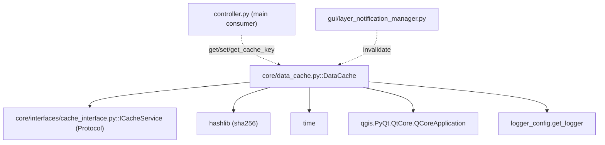

---
tags:
  - secinterp
  - code-walkthrough
  - core
  - cache
aliases:
  - data_cache.py
  - DataCache
cssclass: secinterp-note
---

# `core/data_cache.py`

> [!abstract] One-line summary
> `DataCache` is the core's **in-memory cache**: an `ICacheService` implementation organized by buckets (`topo`, `geol`, `struct`, `drill`) with TTL expiration, deterministic hash keys and arbitrary metadata (LOD).

**Path**: `core/data_cache.py` (169 lines)
**Main class/function**: `DataCache`
**Layer**: Core (with a narrow `QCoreApplication` dependency only for `tr()`)
**Tags**: #secinterp #core #cache

---

## 🎯 Why does this file exist?

Processing a profile (topography, geology, structure, drillholes) is expensive. If the
user changes a parameter that does not affect an already-computed domain, there is no
reason to recompute it. `DataCache` avoids that redundant work:

| Problem | Solution |
|---------|----------|
| Recomputing expensive domains unnecessarily | Cache by `bucket` (`topo`/`geol`/`struct`/`drill`) |
| Selectively invalidating when a layer changes | Granular `invalidate(bucket=None, key=None)` |
| Stable keys independent of dict order | `get_cache_key()` with `sorted()` + SHA-256 |
| Stale entries | TTL with `expiry` and lazy sweep in `get()` |
| Decoupled contract | Implements `ICacheService` (`Protocol`) |

> [!important] Architectural note — implements a port
> `DataCache(ICacheService)` is the **real implementer** of the `ICacheService` `Protocol`
> (defined in `core/interfaces/cache_interface.py`). It satisfies the contract by
> **structural shape**, not nominal inheritance. Consumers like `controller` depend on the
> contract, not on this concrete class.

---

## 🧬 Relationship diagram



> [!tip] How to read
> Solid = imports; dashed = used by. `DataCache` **implements** `ICacheService`
> (conformance arrow) and is consumed by the `controller` (saves/retrieves profile
> results) and `layer_notification_manager` (invalidates when a layer changes).

---

## 📦 Imports — architectural reading

```python
# core/data_cache.py
from __future__ import annotations

import hashlib
import time
from typing import Any

from qgis.PyQt.QtCore import QCoreApplication

from sec_interp.core.interfaces.cache_interface import ICacheService
from sec_interp.logger_config import get_logger

logger = get_logger(__name__)
```

| # | Observation |
|---|-------------|
| ① | `hashlib` + `time` — stdlib only: key hashing and TTL timestamps. |
| ② | `QCoreApplication` — the only QGIS dependency, for `tr()` (log translation). |
| ③ | `ICacheService` — the `Protocol` contract this class implements. |
| ④ | No DTO or entity imports: the cache is **generic** (stores `Any`). |

> [!warning] Another gray area: `QCoreApplication`
> Like `config.py`, `data_cache.py` imports `QCoreApplication` for `tr()`. It is the
> smallest possible exception: it touches no geometry or layers, only translates log
> messages. The cache logic itself is 100% agnostic.

---

## 🏗️ Structure inventory

**Classes:** `class DataCache(ICacheService)` — 9 methods

**Class constants:** `DEFAULT_TTL_SECONDS = 3600` (1 hour)

**Internal state:**
- `_buckets: dict[str, dict[str, dict[str, Any]]]` — `bucket → key → entry` structure.
- Initial buckets: `"topo"`, `"geol"`, `"struct"`, `"drill"`.
- Each `entry` has: `data`, `expiry`, `metadata`, `timestamp`.

**Methods:**
- `tr()`, `__init__(default_ttl=3600)`, `get_cache_key(params)`, `get(bucket, key)`
- `set(bucket, key, data, metadata=None)`, `invalidate(bucket=None, key=None)`
- `clear()`, `get_metadata(bucket, key)`, `get_cache_size()`

---

## 📁 Files in the package

- `data_cache.py` — individual note for this file (root module, not a package).

---

## 📖 Method-by-method walkthrough

### `__init__(default_ttl=3600)`

```python
def __init__(self, default_ttl: int = DEFAULT_TTL_SECONDS) -> None:
    self._buckets: dict[str, dict[str, dict[str, Any]]] = {
        "topo": {}, "geol": {}, "struct": {}, "drill": {},
    }
    self.default_ttl = default_ttl
```

Creates the **4 predefined buckets** (one per geological domain) and stores the default
TTL. `set()` can also create new buckets on the fly when it receives an unknown one.

### `tr(message)`

```python
def tr(self, message: str) -> str:
    return QCoreApplication.translate("DataCache", message)  # type: ignore[no-any-return]
```

Translates messages with the `"DataCache"` context. The only use of QGIS in the module.

### `get_cache_key(params)`

```python
def get_cache_key(self, params: dict[str, Any]) -> str:
    key_parts = []
    for k, v in sorted(params.items()):
        if hasattr(v, "id"):
            key_parts.append(f"{k}:{v.id()}")
        elif hasattr(v, "source"):
            key_parts.append(f"{k}:{v.source()}")
        else:
            key_parts.append(f"{k}:{v!s}")
    return hashlib.sha256("".join(key_parts).encode("utf-8")).hexdigest()
```

Generates a **deterministic hash key** from a parameter dict:

1. **Stable order** — `sorted(params.items())` makes the key order-independent.
2. **Object normalization** — if a value has `.id()` (a QGIS layer) use its id; if it has
   `.source()` use its path; otherwise its `str()`.
3. **SHA-256** — hashes the concatenation of `"k:v"`.

> [!warning] Docstring vs implementation
> The docstring says *"MD5 hash key"*, but the code uses `hashlib.sha256`. It is a minor
> documentation bug (the real algorithm is SHA-256, which is more secure).

### `get(bucket, key)`

```python
def get(self, bucket: str, key: str) -> Any | None:
    if bucket not in self._buckets:
        return None
    entry = self._buckets[bucket].get(key)
    if not entry:
        return None
    expiry = entry.get("expiry")
    if expiry and time.time() > expiry:
        logger.debug(f"Cache miss (TTL expired): {bucket}/{key}")
        del self._buckets[bucket][key]
        return None
    return entry.get("data")
```

Retrieval with **lazy sweep**: if the entry is expired, it deletes it and returns `None`.
There is no cleanup thread; expiration happens on read.

> [!tip] `expiry = None` means "no expiration"
> If the entry's TTL was `<= 0`, `expiry` is stored as `None` and the entry **never**
> expires (kept until `invalidate`/`clear`).

### `set(bucket, key, data, metadata=None)`

```python
def set(self, bucket: str, key: str, data: Any, metadata: dict | None = None) -> None:
    if bucket not in self._buckets:
        self._buckets[bucket] = {}
    ttl = (metadata or {}).get("ttl", self.default_ttl)
    expiry = time.time() + ttl if ttl > 0 else None
    self._buckets[bucket][key] = {
        "data": data,
        "expiry": expiry,
        "metadata": metadata or {},
        "timestamp": time.time(),
    }
```

Stores the entry with 4 fields. The TTL can come **per entry** via `metadata["ttl"]`
(useful for LOD: more detailed entries with a different TTL). Creates the bucket if missing.

### `invalidate(bucket=None, key=None)`

```python
def invalidate(self, bucket: str | None = None, key: str | None = None) -> None:
    if bucket and bucket in self._buckets:
        if key:
            if key in self._buckets[bucket]:
                del self._buckets[bucket][key]
        else:
            self._buckets[bucket].clear()
    elif not bucket:
        for _b_name, b_data in self._buckets.items():
            b_data.clear()
```

**Granular** invalidation at three levels:

| Call | Effect |
|------|--------|
| `invalidate()` | clears **all** buckets |
| `invalidate(bucket="topo")` | clears **one** bucket |
| `invalidate(bucket="topo", key="abc")` | deletes **one** entry |

### `clear()`

```python
def clear(self) -> None:
    self.invalidate()
```

Convenience shortcut: equivalent to `invalidate()` (clears everything). Part of the
`ICacheService` contract.

### `get_metadata(bucket, key)`

```python
def get_metadata(self, bucket: str, key: str) -> dict[str, Any] | None:
    if bucket in self._buckets and key in self._buckets[bucket]:
        return self._buckets[bucket][key].get("metadata")
    return None
```

Returns only an entry's metadata (without touching the TTL). Used by `controller` to read
the LOD state without retrieving the full data.

### `get_cache_size()`

```python
def get_cache_size(self) -> dict[str, int]:
    return {name: len(items) for name, items in self._buckets.items()}
```

**Extra** method (not in `ICacheService`): reports entries per bucket. Useful for
diagnostics/tests. Shows that an implementer can add methods beyond the contract.

---

## 🔄 Data flow

| Phase | Input | Transformation | Output |
|-------|-------|----------------|--------|
| Key | `params` dict (layers/fields) | `get_cache_key()` → SHA-256 | stable key |
| Write | `bucket, key, data, metadata` | `set()` with `expiry` | cached entry |
| Read | `bucket, key` | `get()` + TTL check | `data` or `None` |
| Invalidation | `bucket?, key?` | `invalidate()` | emptied buckets |

---

## 🔢 Example — entry lifecycle

Given a fresh `DataCache` and a parameter dict:

```python
cache = DataCache(default_ttl=3600)

# 1. Generate the (deterministic) key
params = {"layer": layer, "buffer": 100.0, "band": 1}
key = cache.get_cache_key(params)          # -> "a1b2c3..." (SHA-256)

# 2. Write with a per-entry TTL (LOD)
cache.set("geol", key, geol_data, metadata={"ttl": 60, "lod": 2})

# 3. Read before expiration
assert cache.get("geol", key) is geol_data

# 4. Read metadata without deserializing the data
meta = cache.get_metadata("geol", key)     # -> {"ttl": 60, "lod": 2}

# 5. Selectively invalidate when the geology layer changes
cache.invalidate("geol")
assert cache.get("geol", key) is None
```

The flow mirrors the exact usage in `controller.py`: a key is computed per parameters,
written with LOD metadata, read, and `layer_notification_manager` invalidates the bucket
when the user modifies the corresponding layer.

---

## 🌐 i18n and migration notes

- **Translation**: only log messages use `self.tr(...)` (context `"DataCache"`). Bucket names
  (`topo`, `geol`, `struct`, `drill`) are **not** translated.
- **Hash algorithm**: the docstring says "MD5", but the implementation has used SHA-256 from
  the start. No migration needed; only fix the docstring.
- **`"main"` bucket**: `controller.py` also uses a `"main"` bucket (not declared in
  `__init__`), confirming that `set()` creates buckets dynamically.

---

## 🏛️ Design patterns present

| Pattern | Where | Purpose |
|---------|-------|---------|
| **Cache-aside** | `get`/`set`/`invalidate` | Explicit cache managed by the consumer |
| **Port / Adapter** | `ICacheService` → `DataCache` | Contract decoupled from implementation |
| **Time-To-Live (TTL)** | `expiry` + lazy sweep | Expiration without a cleanup thread |
| **Key normalization** | `get_cache_key` | Deterministic, order-independent keys |
| **Bucket partitioning** | `_buckets` per domain | Domain isolation (`topo`, `geol`, …) |

---

## 🧾 API summary

| Symbol | Signature / Inherits | Typical use |
|--------|----------------------|-------------|
| `DataCache.get_cache_key` | `(params) -> str` | Generate a deterministic hash key |
| `DataCache.get` | `(bucket, key) -> Any \| None` | Retrieve with TTL |
| `DataCache.set` | `(bucket, key, data, metadata=None) -> None` | Store an entry |
| `DataCache.invalidate` | `(bucket=None, key=None) -> None` | Granular invalidation |
| `DataCache.clear` | `() -> None` | Clear everything |
| `DataCache.get_metadata` | `(bucket, key) -> dict \| None` | Read metadata (LOD) |
| `DataCache.get_cache_size` | `() -> dict[str, int]` | Diagnostics (extra) |

---

## 🛡️ Error handling

No custom exceptions: the cache **never raises**. On missing bucket/key, `get`/
`get_metadata` return `None`. Robustness is achieved by design:

- `set()` creates the bucket if missing (never `KeyError`).
- `invalidate()` checks existence before `del`.
- `get()` deletes the expired entry before returning `None`.

> [!note] Consistency with the contract
> The `ICacheService` contract declares no exceptions; `DataCache` honors it faithfully.

---

## 🧪 Associated tests

Pure cases mapped to `tests/core/test_data_cache_fix.py`:

- `test_get_cache_key` — same dict in different order yields the same key; different dicts
  yield different keys.
- `test_set_and_get` — per-bucket round-trip (`topo`/`geol`/`struct`) and bucket isolation
  (reading `geol` after writing `topo` returns `None`).
- `test_get_missing` — missing key → `None`.

---

## 👀 Observations and notes

> [!success] Strengths
> - `ICacheService` contract satisfied by structural shape (`Protocol`).
> - Deterministic, order-independent keys (ideal for caching by params).
> - Granular invalidation (all / bucket / entry).
> - Per-entry TTL via `metadata["ttl"]` (flexible for LOD).

> [!warning] Points of attention
> - Docstring says "MD5" but SHA-256 is used (outdated docstring).
> - `_buckets` is mutable and shared: no locks; under multithreading (several `QgsTask`s)
>   there could be race conditions.
> - `get_cache_size()` is not part of `ICacheService` (optional coupling).
> - `QCoreApplication` dependency for `tr()` (gray area).

> [!question] Open questions
> - Add a per-bucket `threading.Lock` to guarantee thread-safety?
> - Unify the bucket prefix so `invalidate` does not depend on magic strings?
> - Document/rename the hash to SHA-256 in the docstring?

---

## 🔗 Related notes

- [[Index]] — vault index
- [[cache_interface]] — `ICacheService` (the contract it implements)
- [[core_interfaces]] — the core contracts package
- [[controller]] — main consumer (`get`/`set`/`get_cache_key`)
- [[layer_core_interfaces]] — interfaces layer note
- [[settings_model]] — counterpart: the other persistent state (config vs cache)
- [[config]] — `ConfigService` (also uses `QCoreApplication` for `tr`)

---

*Note of the SecInterp Code Walkthrough v2 vault — v3.8.0*
