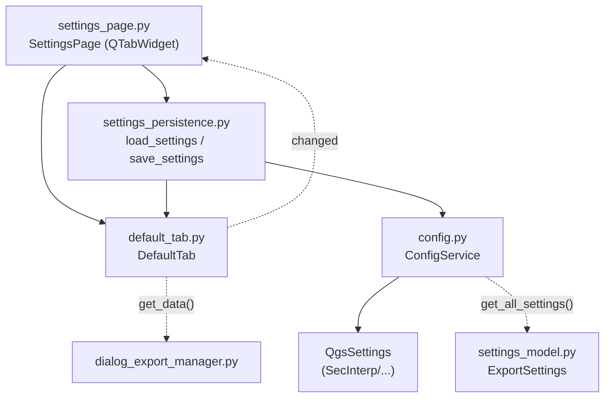

---
tags:
  - secinterp
  - code-walkthrough
  - gui
  - pages
aliases:
  - default_tab.py
  - DefaultTab
cssclass: secinterp-note
---

# `gui/ui/pages/settings/default_tab.py`

> [!abstract] One-line summary
> Default settings tab: selection of which data to generate on save (5 checkboxes), vector format, naming pattern and reset button, with auto-save via `ConfigService`.

**Path**: `gui/ui/pages/settings/default_tab.py` (178 lines)
**Main class**: `DefaultTab`
**Layer**: GUI (QGIS-dependent · sub-page / tab)
**Tags**: #secinterp #gui #pages

---

## 🎯 Why does this file exist?

Pressing "Save" can generate up to five products. This tab chooses which ones,
in which format and under which name, keeping the daily routine apart from
restricted 3D features ([[advanced_tab]]).

| Problem | Solution |
|---------|----------|
| Five toggleable products + format + naming in one tab | `DefaultTab` with sections and horizontal sub-layouts |
| Checkbox names repeated across reset/disconnect | `_EXPORT_CHECKBOXES` tuple as single source |
| Every change must persist with no "Apply" button | `changed` signal → parent → `save_settings` |
| The user may leave the selection in a useless state | `btn_reset_export` restores all defaults |

> [!important] Architectural note
> **Pure-configuration** tab: it never touches layers. Its values travel to
> `ConfigService.set()` (`SecInterp/exp_*`, `export_format`, `export_naming`)
> and typed modelling lives in `ExportSettings` (see [[settings_model]]).

---

## 🧬 Relationship diagram



> [!tip] How to read
> Solid arrow = imports/calls; dashed = signal or deferred consumption (export).

---

## 📦 Imports — architectural reading

```python
# gui/ui/pages/settings/default_tab.py
from __future__ import annotations
import contextlib
from typing import Any
from qgis.PyQt.QtCore import QCoreApplication, pyqtSignal
from qgis.PyQt.QtWidgets import (
    QCheckBox,
    QComboBox,
    QHBoxLayout,
    QLabel,
    QLineEdit,
    QPushButton,
    QVBoxLayout,
    QWidget,
)
from sec_interp.logger_config import get_logger
```

| # | Observation |
|---|-------------|
| ① | Widest import of the settings package: combo, text line and button. |
| ② | No `qgis.core`/`qgis.gui`: pure configuration, no layer selectors. |
| ③ | Nested `QHBoxLayout` for format and naming (label + control). |
| ④ | `changed` signal (settings vocabulary, same as `AdvancedTab`). |
| ⑤ | `logger` is actually used here (`logger.info` on reset). |

---

## 🏗️ Structure inventory

**Class:** `DefaultTab(QWidget)` — 1 signal, 1 module constant, 8 methods.

| Member | Type | Role |
|--------|------|------|
| `changed` | `pyqtSignal()` | Notifies the parent to auto-save |
| `chk_exp_topo` | `QCheckBox` | Generate topographic profile |
| `chk_exp_geol` | `QCheckBox` | Generate geological profile |
| `chk_exp_struct` | `QCheckBox` | Generate structural data |
| `chk_exp_drill` | `QCheckBox` | Generate drillhole data |
| `chk_exp_interp` | `QCheckBox` | Generate 2D interpretations |
| `combo_format` | `QComboBox` | Shapefile / GeoPackage / DXF |
| `txt_naming` | `QLineEdit` | `{filename}_{profile}` pattern |
| `btn_reset_export` | `QPushButton` | Restores tab defaults |

**Constant:** `_EXPORT_CHECKBOXES` — tuple with the 5 attribute names.

**Methods:**

| Method | Signature | Purpose |
|--------|-----------|---------|
| `__init__` | `(parent=None) -> None` | Builds and calls `_setup_ui` |
| `tr` | `(message: str) -> str` | Translates with the `"DefaultTab"` context |
| `_setup_ui` | `() -> None` | Sections + sub-layouts + stretch |
| `get_data` | `() -> dict[str, Any]` | Defensive read with `hasattr` |
| `reset_to_defaults` | `() -> None` | Defaults + informative log |
| `connect_signals` | `() -> None` | Checks + button + format + naming |
| `disconnect_signals` | `() -> None` | Delegates to two private helpers |
| `_disconnect_checkboxes` | `() -> None` | 5 checks + button, with `suppress` |
| `_disconnect_format_settings` | `() -> None` | Combo + text, with `hasattr` |

---

## 📁 Files in the package

| File | Lines | Role |
|---|---|---|
| `settings/__init__.py` | 9 | Re-exports `AdvancedTab`, `DefaultTab`, `build_info_tab` |
| `advanced_tab.py` | 106 | 3D features (see [[advanced_tab]]) |
| `default_tab.py` | 178 | This note: export selection |
| `info_tab.py` | — | Informational tab (`build_info_tab`) |
| `settings_persistence.py` | 75 | `load/save_settings` (see [[settings_persistence]]) |
| `../settings_page.py` | 124 | Parent with `QTabWidget` (see [[settings_page]]) |

---

## 📖 Method-by-method walkthrough

### `__init__` + `tr` + `_EXPORT_CHECKBOXES`

```python
_EXPORT_CHECKBOXES = (
    "chk_exp_topo",
    "chk_exp_geol",
    "chk_exp_struct",
    "chk_exp_drill",
    "chk_exp_interp",
)


class DefaultTab(QWidget):
    changed = pyqtSignal()

    def __init__(self, parent: QWidget | None = None) -> None:
        super().__init__(parent)
        self._setup_ui()

    def tr(self, message: str) -> str:
        return QCoreApplication.translate("DefaultTab", message)
```

The tuple avoids repeating the five names in `reset_to_defaults` (loop) and
documents the canonical set of exportable products.

### `_setup_ui`

```python
layout = QVBoxLayout(self)

layout.addWidget(QLabel(self.tr("<b>Export Selection (Save)</b>")))
layout.addWidget(
    QLabel(self.tr("<i>Select which data to generate when clicking Save.</i>"))
)

self.chk_exp_topo = QCheckBox(self.tr("Topographic Profile"))
self.chk_exp_geol = QCheckBox(self.tr("Geological Profile"))
self.chk_exp_struct = QCheckBox(self.tr("Structural Data"))
self.chk_exp_drill = QCheckBox(self.tr("Drillhole Data"))
self.chk_exp_interp = QCheckBox(self.tr("Interpretations (2D)"))
...
```

| Block | Content |
|-------|---------|
| Header | Bold title + italic subtitle |
| 5 checks | One product each |
| Format | `QHBoxLayout`: label + `combo_format` (Shapefile, GeoPackage, DXF) + stretch |
| Naming | `QHBoxLayout`: label + `txt_naming` (`{filename}_{profile}` placeholder, placeholder tooltip) |
| Button | `QHBoxLayout` with stretch + `btn_reset_export` (re-enable tooltip) |
| Closing | `addStretch()` |

> [!note] No explicit initial state
> As in `AdvancedTab`, `load_settings` hydrates the state after creation.

### `get_data` — defensive read

```python
def get_data(self) -> dict[str, Any]:
    return {
        "exp_topo": (self.chk_exp_topo.isChecked() if hasattr(self, "chk_exp_topo") else True),
        "exp_geol": (self.chk_exp_geol.isChecked() if hasattr(self, "chk_exp_geol") else True),
        ...
        "export_format": (
            self.combo_format.currentText() if hasattr(self, "combo_format") else "Shapefile"
        ),
        "export_naming": (
            self.txt_naming.text() if hasattr(self, "txt_naming") else "{filename}_{profile}"
        ),
    }
```

| Key | Fallback | `QgsSettings` |
|-----|----------|---------------|
| `exp_topo/geol/struct/drill/interp` | `True` | `SecInterp/exp_*` (default `True`) |
| `export_format` | `"Shapefile"` | `SecInterp/export_format` |
| `export_naming` | `"{filename}_{profile}"` | `SecInterp/export_naming` |

Eight keys that `SettingsPage.get_data()` merges with the five from advanced.

### `reset_to_defaults`

```python
def reset_to_defaults(self) -> None:
    for attr in _EXPORT_CHECKBOXES:
        widget = getattr(self, attr, None)
        if widget is not None:
            widget.setChecked(True)

    if hasattr(self, "combo_format"):
        index = self.combo_format.findText("Shapefile")
        if index >= 0:
            self.combo_format.setCurrentIndex(index)

    if hasattr(self, "txt_naming"):
        self.txt_naming.setText("{filename}_{profile}")
    logger.info("Export options reset to defaults.")
```

All checked + Shapefile + canonical pattern. `findText >= 0` guards against
altered combo models. The only reset in the package that logs.

### `connect_signals`

```python
def connect_signals(self) -> None:
    self.chk_exp_topo.stateChanged.connect(self.changed.emit)
    ...  # 4 more checks
    self.btn_reset_export.clicked.connect(self.reset_to_defaults)

    if hasattr(self, "combo_format"):
        self.combo_format.currentIndexChanged.connect(self.changed.emit)
    if hasattr(self, "txt_naming"):
        self.txt_naming.textChanged.connect(self.changed.emit)
```

Nine connections: every change persists via the parent. Note the button wires
to `reset_to_defaults`, and reset fires `changed` ⇒ cascading auto-save (as
in advanced).

### `disconnect_signals` + helpers

```python
def disconnect_signals(self) -> None:
    self._disconnect_checkboxes()
    self._disconnect_format_settings()

def _disconnect_checkboxes(self) -> None:
    with contextlib.suppress(TypeError, RuntimeError):
        self.chk_exp_topo.stateChanged.disconnect(self.changed.emit)
    ...  # 4 checks + button

def _disconnect_format_settings(self) -> None:
    if hasattr(self, "combo_format"):
        with contextlib.suppress(TypeError, RuntimeError):
            self.combo_format.currentIndexChanged.disconnect(self.changed.emit)
    if hasattr(self, "txt_naming"):
        with contextlib.suppress(TypeError, RuntimeError):
            self.txt_naming.textChanged.disconnect(self.changed.emit)
```

The only tab factoring disconnection into two private helpers: selection vs.
format. More readable than the flat blocks of its siblings.

---

## 🔄 Data flow

| Phase | Input | Transformation | Output |
|-------|-------|----------------|--------|
| Setup | `parent` | `_setup_ui` with sections | Stateless widgets |
| Hydration | `QgsSettings` | `load_settings(settings, default_tab, advanced_tab)` | Checks + format + naming |
| Editing | Click/typing | `stateChanged`/`currentIndexChanged`/`textChanged → changed` | Signal to parent |
| Auto-save | `changed` | `_on_settings_changed` → `save_settings` | `ConfigService.set(...)` × 8 |
| Reading | Widgets | Defensive `get_data()` | 8-key `dict` |
| Model | `QgsSettings` | `ConfigService._load_from_qgs_settings` | `ExportSettings` |
| Reset | `btn_reset_export` | `reset_to_defaults()` + log | Defaults + auto-save |
| Close | Dialog | Two-phase `disconnect_signals()` | No dangling signals |

---

## 📐 Tab → SettingsModel → QgsSettings mapping

| Widget | `get_data()` | `QgsSettings` (`SecInterp/…`) | Model |
|--------|--------------|-------------------------------|-------|
| `chk_exp_topo` | `exp_topo` | `exp_topo` | Export selection flag |
| `chk_exp_geol` | `exp_geol` | `exp_geol` | Export selection flag |
| `chk_exp_struct` | `exp_struct` | `exp_struct` | Export selection flag |
| `chk_exp_drill` | `exp_drill` | `exp_drill` | Export selection flag |
| `chk_exp_interp` | `exp_interp` | `exp_interp` | Export selection flag |
| `combo_format` | `export_format` | `export_format` | `ExportSettings.default_format` |
| `txt_naming` | `export_naming` | `export_naming` | `ExportSettings.naming_pattern` |

---

## 🏛️ Design patterns present

| Pattern | Where | Purpose |
|---------|-------|---------|
| **Composite (tab)** | `SettingsPage` + tabs | Uniform default/advanced contract |
| **Observer** | `changed` | Reactive auto-save |
| **Single source** | `_EXPORT_CHECKBOXES` | Keeps reset/disconnect from diverging |
| **Defensive programming** | `hasattr`/`getattr` | Supports partial doubles |
| **Template method** | `disconnect_signals` → helpers | Phased unwiring |
| **Guarded disconnect** | `contextlib.suppress` | Idempotent unwiring |
| **Persistence facade** | `settings_persistence` | Tabs with no direct `QgsSettings` |

---

## 🧾 API summary

| Symbol | Signature / Inherits | Typical use |
|--------|----------------------|-------------|
| `DefaultTab` | `QWidget` | `SettingsPage.tab_widget.addTab(DefaultTab(), ...)` |
| `changed` | `pyqtSignal()` | `tab.changed.connect(self._on_settings_changed)` |
| `get_data()` | `-> dict[str, Any]` | 8 selection/format keys |
| `reset_to_defaults()` | `-> None` | Restore + log |
| `connect_signals()` | `-> None` | Wire when shown |
| `disconnect_signals()` | `-> None` | Two-phase unwire |
| `_EXPORT_CHECKBOXES` | `tuple[str, ...]` | Iterate the 5 products |

---

## 🛡️ Error handling

- `get_data`/`reset`/`connect`/`disconnect` tolerate missing attributes.
- `findText("Shapefile") >= 0` before `setCurrentIndex`: altered combo ⇒ no-op.
- Suppressed disconnection (`TypeError`/`RuntimeError`) on every signal.
- No naming-pattern validation (free placeholders): the exporter resolves
  `{filename}`/`{profile}` at generation time.

---

## 🧪 Associated tests

No dedicated `tests/gui/test_default_tab.py`; coverage via pages and dialog:

- `tests/gui/test_settings_page.py::TestSettingsPage::test_load_settings` — hydration of checks, format and naming.
- `test_save_settings` — persistence of all 8 keys via `ConfigService`.
- `test_get_data` — default + advanced merge in `SettingsPage.get_data()`.
- `test_initialization` — widgets exposed by `_expose_tab_widgets`.
- `tests/gui/test_main_dialog_settings.py` — global settings parsing and persistence.

---

## 🌐 i18n and migration notes

- `"DefaultTab"` context; HTML headers and tooltips translated.
- Combo items (`"Shapefile"`, `"GeoPackage"`, `"DXF"`) added without `tr()`:
  they are format identifiers, not free text (correct call).
- The `{filename}_{profile}` placeholder is not translated: syntax, not prose.
- No `qgis.core`/`qgis.gui`: safe from 3.x → 4.x API changes.

---

## 👀 Observations and notes

> [!success] Strengths
> - `_EXPORT_CHECKBOXES` as single source: reset and docs cannot diverge.
> - Disconnection factored into two helpers, the cleanest in the package.
> - Format/naming with sensible fallbacks for partial doubles.

> [!warning] Points of attention
> - Nothing prevents unchecking all 5 products: "Save" would generate nothing silently.
> - Naming is unvalidated (unknown placeholders pass silently).
> - `logger.info` on every reset may pollute the log if the button is overused.

> [!question] Open questions
> - Warn if all 5 products are unchecked on save?
> - Validate the naming pattern (at least `{filename}` present)?

---

## 🔗 Related notes

- [[Index]] — vault index
- [[settings_page]] — parent page with the `QTabWidget`
- [[gui_ui_pages_settings]] — settings tab package
- [[advanced_tab]] — sibling 3D-features tab
- [[settings_persistence]] — `load/save_settings` hydrating this tab
- [[settings_model]] — `ExportSettings` and `PluginSettings`
- [[config]] — `ConfigService` (`get`/`set`, `SecInterp/` prefix)
- [[dialog_export_manager]] — selection consumer on save

---

*Note of the SecInterp Code Walkthrough v2 vault — v3.9.1*
