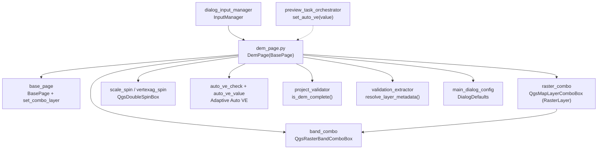

---
tags:
  - secinterp
  - code-walkthrough
  - gui
  - pages
aliases:
  - dem_page.py
  - DemPage
cssclass: secinterp-note
---

# `gui/ui/pages/dem_page.py`

> [!abstract] One-line summary
> DEM raster configuration page: layer and band selectors, auto-calculated resolution, suggested scale, and manual or adaptive vertical exaggeration (Auto VE with a live value label).

**Path**: `gui/ui/pages/dem_page.py` (271 lines)
**Main class**: `DemPage(BasePage)`
**Layer**: GUI (programmatic presentation · Extract into `ValidationParams`)
**Tags**: #secinterp #gui #pages

---

## 🎯 Why does this file exist?

The topographic profile is the backbone of the cross-section: without a DEM there
are no elevations to sample and no drawing scale. This page concentrates everything
the dialog needs to know about the raster before previewing.

| Problem | Solution |
|---------|----------|
| Users must pick raster, band, scale and vertical exaggeration without getting lost among QGIS dialogs | One page with raster + band + resolution + profile settings |
| Resolution and scale depend on the chosen raster and must be recomputed on layer change | `_update_resolution()` recomputes on `layerChanged` |
| A fixed VE deforms gentle profiles or flattens rugged relief | Auto/Manual toggle: in Auto the adaptive pipeline computes VE and `set_auto_ve()` shows it live |

> [!important] Architectural note
> Pure Extract: `get_data()` hands over the live layer plus primitives; `is_complete()`
> converts the layer to `LayerMetadata` with `resolve_layer_metadata` and delegates to
> `ProjectValidator.is_dem_complete`. The core never sees a `QgsRasterLayer`.

---

## 🧬 Relationship diagram



> [!tip] How to read
> Solid arrow = imports/delegates; dashed = the preview orchestrator injects the computed VE.

---

## 📦 Imports — architectural reading

```python
# gui/ui/pages/dem_page.py
from __future__ import annotations

from typing import Any

from qgis.core import Qgis, QgsUnitTypes
from qgis.gui import QgsDoubleSpinBox, QgsMapLayerComboBox, QgsRasterBandComboBox
from qgis.PyQt.QtCore import QCoreApplication
from qgis.PyQt.QtWidgets import QCheckBox, QGridLayout, QGroupBox, QHBoxLayout, QLabel, QLineEdit

from sec_interp.core.validation.project_validator import ProjectValidator, ValidationParams
from sec_interp.gui.adapters.validation_extractor import resolve_layer_metadata
from sec_interp.gui.main_dialog_config import DialogDefaults

from .base_page import BasePage, set_combo_layer
```

| # | Observation |
|---|-------------|
| ① | `qgis.gui` provides the three specialised widgets: raster-layer combo, raster-band combo and unit-labelled double spin. |
| ② | `Qgis.LayerFilter.RasterLayer` restricts the combo to rasters; `QgsUnitTypes` renders CRS units as text (`toString`). |
| ③ | `QCoreApplication.translate` is only used for the group title; remaining labels use `self.tr()`. |
| ④ | Imports the core validator plus the extractor that detaches the layer into `LayerMetadata`: the Extract-then-Compute boundary in two lines. |
| ⑤ | `DialogDefaults` centralises initial values (`SCALE`, `VERTICAL_EXAGGERATION`, `AUTO_VERTICAL_EXAGGERATION`, `DEFAULT_BAND`). |
| ⑥ | Base-class `set_combo_layer`: `load()` restores the layer without firing `layerChanged`. |

---

## 🏗️ Structure inventory

**`DemPage(BasePage)` class** — `layer_keys = frozenset({"dem_layer"})`:

Construction and layout:

- `__init__(self, iface: Any = None, parent: Any = None) -> None`
- `_setup_ui(self) -> None` — `QGridLayout` + 3 blocks
- `_setup_raster_selection(self) -> None` — row 0: label, raster combo, indicator
- `_setup_band_and_resolution(self) -> None` — row 1: band, resolution, units
- `_setup_profile_settings(self) -> None` — nested group with scale and VE

Adaptive vertical exaggeration:

- `_on_auto_ve_toggled(self, checked: bool) -> None`
- `set_auto_ve(self, value: float | None) -> None`
- `_update_resolution(self) -> None`

`BasePage` protocol:

- `get_data`, `dump`, `load`, `reset`, `validate`, `is_complete`, `connect_signals`, `disconnect_signals`

**Widgets (exact code names):**

| Widget | Type | Role |
|--------|------|------|
| `raster_combo` | `QgsMapLayerComboBox` | DEM raster (`RasterLayer` filter, empty allowed) |
| `lbl_raster_status` | `QLabel` 16×16 | Raster state indicator |
| `band_combo` | `QgsRasterBandComboBox` | Raster band (minimum width 150) |
| `res_edit` | read-only `QLineEdit` | Auto-calculated native resolution |
| `units_edit` | read-only `QLineEdit`, width 50 | Map units (`QgsUnitTypes.toString`) |
| `settings_group` | `QGroupBox` | Nested "Profile Settings" group |
| `scale_spin` | `QgsDoubleSpinBox` 1–1000000, 0 decimals | Scale 1:N (default `DialogDefaults.SCALE`) |
| `vertexag_spin` | `QgsDoubleSpinBox` 0.1–100, step 0.5, 1 decimal | Manual VE (default `VERTICAL_EXAGGERATION`) |
| `auto_ve_check` | `QCheckBox` "Auto" | Enables adaptive VE (default `True`) |
| `auto_ve_value` | `QLabel` "—" | Shows the computed VE (`"2.5×"`) |

---

## 📖 Method-by-method walkthrough

### `__init__` — stores `iface` and a translated title

```python
def __init__(self, iface: Any = None, parent: Any = None) -> None:
    self.iface = iface
    super().__init__(QCoreApplication.translate("DemPage", "Digital Elevation Model"), parent)
    self.iface = iface
```

Accepts an optional `iface` (unused today: `_update_resolution` does not need it) and passes
the translated title to the base. The double `self.iface` assignment is redundant but
harmless. It is the only page with `iface`; [[main_window]] builds it as `DemPage(iface)`.

### `_setup_ui` — 3-block grid

```python
def _setup_ui(self) -> None:
    super()._setup_ui()

    self.group_layout = QGridLayout(self.group_box)
    self.group_layout.setSpacing(6)

    self._setup_raster_selection()
    self._setup_band_and_resolution()
    self._setup_profile_settings()
```

Installs a spacing-6 `QGridLayout` on the inherited `group_box` and delegates to three
private builders. The `_setup_*` pattern recurs in [[preview_page]] and keeps each
block testable in isolation.

### `_setup_raster_selection` — filtered raster combo

```python
self.raster_combo = QgsMapLayerComboBox()
self.raster_combo.setFilters(Qgis.LayerFilters(Qgis.LayerFilter.RasterLayer))
self.raster_combo.setAllowEmptyLayer(True)
self.raster_combo.setToolTip(self.tr("Select the raster DEM layer"))
self.raster_combo.setCurrentIndex(0)
```

The `RasterLayer` filter hides vector layers; `setAllowEmptyLayer(True)` permits
the "no selection" state, which `validate()` rejects with `"Raster layer is required"`.
The `lbl_raster_status` indicator (16×16) is reserved for the validity semaphore
managed by the dialog from outside.

### `_setup_band_and_resolution` — read-only band and resolution

```python
self.band_combo = QgsRasterBandComboBox()
self.band_combo.setMinimumWidth(150)
...
self.res_edit = QLineEdit()
self.res_edit.setReadOnly(True)
self.units_edit = QLineEdit()
self.units_edit.setReadOnly(True)
self.units_edit.setMaximumWidth(50)
```

The band follows the layer automatically (`layerChanged → band_combo.setLayer`, see
`connect_signals`). Resolution and units are informational: `_update_resolution()`
computes them and the user cannot edit them, avoiding inconsistencies between the
displayed value and the real raster.

### `_setup_profile_settings` — nested group before the stretch

```python
self.settings_group = QGroupBox(self.tr("Profile Settings"))
settings_layout = QGridLayout(self.settings_group)
# ... scale + manual VE + Auto initialised from DialogDefaults ...
self._on_auto_ve_toggled(self.auto_ve_check.isChecked())

count = self.main_layout.count()
self.main_layout.insertWidget(count - 1, self.settings_group)
```

Builds the "Profile Settings" sub-group with scale and VE, inserting it **before**
the stretch (second-to-last position) so it hugs the upper controls instead of
floating at the bottom. The trailing `_on_auto_ve_toggled` call syncs the manual
spin's initial state with the checkbox (on by default).

### `_on_auto_ve_toggled` — Auto/Manual switch

```python
def _on_auto_ve_toggled(self, checked: bool) -> None:
    self.vertexag_spin.setEnabled(not checked)
    self.auto_ve_value.setVisible(checked)
```

In Auto mode the manual spin is disabled (a fixed VE the pipeline would ignore
cannot be set) and the computed-value label appears; in manual mode the reverse
applies. Same visual language as the [[preview_page]] LOD toggle
(`_toggle_lod_spin`).

### `set_auto_ve` — live adaptive-VE label (2026-09-21)

```python
def set_auto_ve(self, value: float | None) -> None:
    self.auto_ve_value.setText("—" if value is None else f"{value:.1f}×")
```

Injection point for the preview pipeline: when the orchestrator computes the
adaptive vertical exaggeration it displays it here with one decimal and the `×`
symbol (`"2.5×"`); `None` (no preview yet) restores the dash. The page computes
nothing: it only exhibits the value handed over by the preview core/GUI.

### `_update_resolution` — native resolution and suggested scale

```python
def _update_resolution(self) -> None:
    layer = self.raster_combo.currentLayer()
    if not layer:
        self.res_edit.clear()
        self.units_edit.clear()
        return

    res = layer.rasterUnitsPerPixelX()
    units = layer.crs().mapUnits()
    # ... shows resolution with 2 decimals (str fallback) ...
    # ... renders units with QgsUnitTypes.toString(units) ...
    # ... metres only: suggested scale round((res*2000)/1000)*1000 ...
```

Reads `rasterUnitsPerPixelX()` and the CRS units, shows them with 2 decimals and,
for metre units, suggests a scale rounded to the thousand
(`round((res*2000)/1000)*1000`). With no layer it clears both fields (never leaves
stale values). The `try/except` covers rasters returning non-numeric resolutions.
Note it also overwrites `scale_spin`: hence `load()` blocks that spin's signals
during the call and restores the persisted value afterwards.

### `get_data` — reading with the live layer

```python
def get_data(self) -> dict[str, Any]:
    return {
        "raster_layer": self.raster_combo.currentLayer(),
        "selected_band": self.band_combo.currentBand(),
        "scale": self.scale_spin.value(),
        "vertexag": self.vertexag_spin.value(),
        "auto_vert_exag": self.auto_ve_check.isChecked(),
    }
```

Returns the live layer (`InputManager` detaches it with `resolve_layer_metadata`)
plus primitives. `currentBand()` is a 1-based `int`; `DialogDefaults.DEFAULT_BAND`
is `1`, consistent with `reset()`.

### `dump` / `load` — persistence with key renaming

```python
def dump(self) -> dict[str, Any]:
    return {
        "dem_layer": self.raster_combo.currentLayer(),
        "dem_band": self.band_combo.currentBand(),
        "scale": self.scale_spin.value(),
        "vert_exag": self.vertexag_spin.value(),
        "auto_vert_exag": self.auto_ve_check.isChecked(),
    }
```

`dump` renames `raster_layer → dem_layer`, `selected_band → dem_band` and
`vertexag → vert_exag`: the session namespace (`layer_keys = {"dem_layer"}`)
differs from the read namespace. `load()` restores layer (via `set_combo_layer`
+ propagates to `band_combo`), band, scale, VE and Auto, re-syncs the toggle and
recomputes resolution with signals blocked… finally re-imposing the persisted
scale over the suggested one.

### `reset` — `DialogDefaults` defaults

```python
def reset(self) -> None:
    self.raster_combo.setLayer(None)
    self.band_combo.setBand(DialogDefaults.DEFAULT_BAND)
    self.scale_spin.setValue(float(DialogDefaults.SCALE))
    self.vertexag_spin.setValue(float(DialogDefaults.VERTICAL_EXAGGERATION))
    self.auto_ve_check.setChecked(bool(DialogDefaults.AUTO_VERTICAL_EXAGGERATION))
    self._on_auto_ve_toggled(self.auto_ve_check.isChecked())
```

Empties the layer, restores band 1, scale `"50000"`, VE `"1.0"` and enabled Auto,
closing with the toggle sync. Note the direct `setLayer(None)` (no
`set_combo_layer`): here the cascades are welcome because they clear band and
resolution.

### `validate` / `is_complete` — two check levels

```python
def validate(self) -> tuple[bool, str]:
    if not self.raster_combo.currentLayer():
        return False, self.tr("Raster layer is required")
    return True, ""

def is_complete(self) -> bool:
    data = self.get_data()
    params = ValidationParams(raster_layer=resolve_layer_metadata(data["raster_layer"]))
    return ProjectValidator.is_dem_complete(params)
```

`validate()` (Level 1, i18n message for the dialog) only requires a layer;
`is_complete()` (Level 2, for sidebar/button state) goes through `DEMValidator`
via `is_dem_complete`, which additionally requires a valid band. The live layer is
converted to `LayerMetadata` before crossing into the core.

### `connect_signals` / `disconnect_signals` — layer→band→resolution wiring

```python
def connect_signals(self) -> None:
    self.raster_combo.layerChanged.connect(self.band_combo.setLayer)
    self.raster_combo.layerChanged.connect(self._update_resolution)
    self.auto_ve_check.toggled.connect(self._on_auto_ve_toggled)
# disconnect_signals reverts all three under a single try/except (TypeError, RuntimeError).
```

One signal (`layerChanged`) feeds two slots: band sync and resolution/scale
recompute. Disconnection uses a single `try/except` for all three (unlike the
per-line `contextlib.suppress` of sibling pages): if the first fails, the rest are
not attempted — a known asymmetry, see observations.

---

## 🔄 Data flow

| Phase | Input | Transformation | Output |
|-------|-------|----------------|--------|
| Selection | QGIS project | `RasterLayer` filter + empty layer allowed | `raster_combo.currentLayer()` |
| Cascade | `layerChanged` | `band_combo.setLayer` + `_update_resolution` | band, resolution, units, suggested scale |
| Adaptive VE | preview pipeline | VE computation (outside the page) | `set_auto_ve(v)` → `"2.5×"` label |
| Reading | widgets | `get_data()` | `raster_layer/selected_band/scale/vertexag/auto_vert_exag` |
| Validation | live layer | `resolve_layer_metadata` + `is_dem_complete` | `bool` for the dialog |
| Persistence | widgets | `dump()` | `dem_layer/dem_band/scale/vert_exag/auto_vert_exag` |
| Restoration | dict + resolved layers | `load()` + `set_combo_layer` | widgets + recomputed resolution |

---

## 🏛️ Design patterns present

| Pattern | Where | Purpose |
|---------|-------|---------|
| **Template Method** | `_setup_ui` → 3× `_setup_*` | Split construction into testable blocks |
| **Observer (Qt signals)** | `layerChanged` → band + resolution | Automatic cascade on raster change |
| **Strategy (Auto/Manual)** | `_on_auto_ve_toggled` + `set_auto_ve` | User-fixed vs pipeline-computed VE |
| **Extract-then-Compute** | `get_data` + `is_complete` | GUI extracts, `ProjectValidator` decides |
| **Signal suppression** | `load` + `set_combo_layer` | Restore without intermediate cascades |

---

## 🧾 API summary

| Symbol | Signature / Inherits | Typical use |
|--------|----------------------|-------------|
| `DemPage` | `(BasePage)`, optional `iface` | `DemPage(iface)` in [[main_window]] |
| `layer_keys` | `frozenset({"dem_layer"})` | Persistence namespace |
| `get_data` | `raster_layer/selected_band/scale/vertexag/auto_vert_exag` | Reading for `InputManager` |
| `dump` | `dem_layer/dem_band/scale/vert_exag/auto_vert_exag` | Multi-session persistence |
| `set_auto_ve` | `(float \| None) -> None` | Live label fed by preview |
| `validate` | layer required | Export/preview gate |
| `is_complete` | via `is_dem_complete` | Sidebar state |

---

## 🛡️ Error handling

- No layer: `_update_resolution` clears the fields (never shows stale data); `validate` returns `(False, message)`; `is_complete` is `False` via the `if not params.raster_layer` guard.
- Non-numeric resolution: `try/except (ValueError, TypeError)` with `str(res)` fallback.
- Suggested scale only when `scale > 0` and units are metres: never overwrites scale with garbage under geographic CRS.
- `disconnect_signals` swallows `TypeError`/`RuntimeError` (double disconnect on rewire + close).

---

## 🧪 Associated tests

Real direct coverage in `tests/gui/test_dem_page.py` (`TestDemPage`, with
`QApplication` in `setUpClass` and `BaseTestCase`):

- `get_data` contract: `raster_layer/selected_band/scale/vertexag/auto_vert_exag` keys.
- `dump` contract: `dem_layer/dem_band/scale/vert_exag/auto_vert_exag` keys.
- Auto/Manual VE toggle (`_on_auto_ve_toggled` + `set_auto_ve`).
- `validate` without layer → `(False, …)`; `is_complete` with layer mocks.

Indirect coverage:

- `tests/gui/test_dialog_input_manager.py` — `InputManager.get_all_values()` and `get_validation_params()` consume the DEM `get_data()`.
- `tests/gui/test_main_dialog_validation_manager.py` — dialog-level `dem` rules.
- `tests/gui/test_multi_session_persistence.py` — `dump/load` round-trip with `dem_layer`.
- `tests/gui/test_signal_restoration.py` — `layerChanged` wiring survives rewires.

---

## 🌐 i18n and migration notes

- Every label and tooltip uses `self.tr(...)` (`"Raster Layer *"`, `"Band"`, `"Resolution"`, `"Profile Settings"`, `"Scale 1:"`, `"Vert. Exag."`, `"Auto"`…); the title uses `QCoreApplication.translate("DemPage", …)`.
- The `f"{value:.1f}×"` format in `set_auto_ve` is not translatable (number + universal symbol): correctly left outside `tr()`.
- `QgsUnitTypes.toString(units)` already localises the unit name via the QGIS API.

---

## 👀 Observations and notes

> [!success] Strengths
> - Layer→band→resolution→scale cascade in two clear connections, with defensive cleanup when there is no layer.
> - Adaptive VE well separated: the page exhibits (`set_auto_ve`), the pipeline computes; no reverse coupling.
> - Careful `load()`: blocks signals, recomputes, then re-imposes the persisted scale over the suggested one.

> [!warning] Points of attention
> - `disconnect_signals` with a single global `try/except`: if the first disconnect fails, the other two are never attempted. Sibling pages use per-line `suppress`.
> - Duplicated `self.iface = iface` in `__init__`; moreover `iface` is currently unused (`_update_resolution` does not need it).
> - `load()` calls `_update_resolution()`, which overwrites `scale_spin`, then restores the scale: works, but the ordering is fragile if anyone reorders it.
> - The suggested scale only handles metres; feet or degree CRS suggest nothing (silence, not an error).

> [!question] Open questions
> - Unify `disconnect_signals` to the per-line `contextlib.suppress` style of [[geology_page]] and [[structure_page]]?
> - Drop the unused `iface` or wire it into resolution computation (e.g. canvas CRS)?

---

## 🔗 Related notes

- [[Index]] — vault index
- [[base_page]] — `get_data/dump/load/reset` protocol and `set_combo_layer`
- [[gui_ui_pages]] — pages package and its assembly
- [[main_window]] — instantiates `DemPage(iface)` in the `QStackedWidget`
- [[sidebar]] — "DEM / Raster" entry (`mIconRaster.svg`)
- [[dialog_input_manager]] — consumes `get_data()` and builds `ValidationParams`
- [[project_validator]] — `is_dem_complete` / `DEMValidator`
- [[validation_extractor]] — `resolve_layer_metadata` (live layer → `LayerMetadata`)
- [[main_dialog_config]] — `DialogDefaults` (scale, VE, band)
- [[preview_task_orchestrator]] — injects adaptive VE via `set_auto_ve`
- [[vertical_exaggeration_service]] — VE computation exhibited by the label
- [[section_page]] — the other mandatory page for preview

---

*Note of the SecInterp Code Walkthrough v2 vault — v3.9.0*
