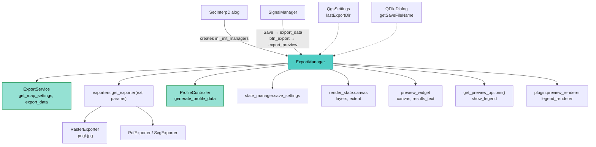

---
tags:
  - secinterp
  - code-walkthrough
  - gui
  - managers
aliases:
  - dialog_export_manager.py
  - ExportManager
cssclass: secinterp-note
---

# `gui/dialog_export_manager.py`

> [!abstract] One-line summary
> `ExportManager` holds both dialog outputs: it exports the preview image (PNG/JPG/PDF/SVG via `get_exporter`) and orchestrates data export (SHP/CSV via `ExportService`), with save dialogs, high-resolution dimensions and settings auto-save.

**Path**: `gui/dialog_export_manager.py` (218 lines)
**Main class**: `ExportManager`
**Layer**: GUI · `SecInterpDialog` manager (presentation and exporter delegation)
**Tags**: #secinterp #gui #managers

---

## 🎯 Why does this file exist?

Exporting mixes file dialogs, map settings, a format factory and data orchestration.
Without this manager, all that code would live in the dialog:

| Problem | Solution |
|---------|----------|
| The dialog should not know formats or resolutions | `ExportManager` picks dimensions and factory by extension |
| Remember the last visited folder | `QgsSettings("SecInterp/lastExportDir")` in `_get_save_path` |
| Data export touches controller + service + UI | `export_data` orchestrates validate → generate → export → report |
| Exporting with no preview confuses users | Early guards with warning `push_message` |

> [!important] Architectural note
> Presentation manager: it **extracts** (canvas, layers, options) and **delegates** the
> real work to `ExportService` (map settings + data) and the `get_exporter` factory.
> It never writes files itself.

---

## 🧬 Relationship diagram



> [!tip] How to read
> Solid arrow = creates/calls; dashed = system service (settings, file dialog).

---

## 📦 Imports — architectural reading

```python
# gui/dialog_export_manager.py
from __future__ import annotations

from pathlib import Path            # ①
from typing import TYPE_CHECKING    # ②

from qgis.core import Qgis, QgsSettings        # ③
from qgis.PyQt.QtCore import QSize             # ④
from qgis.PyQt.QtGui import QColor             # ④
from qgis.PyQt.QtWidgets import QFileDialog    # ⑤

import sec_interp                                # ⑥
from sec_interp.core.exceptions import SecInterpError  # ⑦
from sec_interp.core.performance_metrics import MetricsCollector, PerformanceTimer  # ⑧
from sec_interp.core.services.export_service import ExportService  # ⑨
from sec_interp.exporters import get_exporter    # ⑩
from sec_interp.logger_config import get_logger

if TYPE_CHECKING:                                # ②
    pass
```

| # | Observation |
|---|-------------|
| ① | `pathlib.Path` across the public API (`_get_save_path`, `_execute_preview_export`): typed paths, not `str`. |
| ② | Empty `TYPE_CHECKING` block (marker for future zero-cost type imports). |
| ③ | `Qgis.MessageLevel` for notifications and `QgsSettings` for persisting the last folder. |
| ④ | `QSize` (raster output size) and `QColor` (white export background). |
| ⑤ | Static `QFileDialog.getSaveFileName`: the save dialog lives here, not in `main_dialog`. |
| ⑥ | Root `import sec_interp` to annotate `dialog: sec_interp.gui.main_dialog.SecInterpDialog` with no runtime circular import. |
| ⑦ | `SecInterpError` separates the expected domain failure from the unexpected error. |
| ⑧ | `MetricsCollector` + `PerformanceTimer("Total Preview Export Time")` time the export. |
| ⑨ | `ExportService(controller)` built with the plugin controller: map settings and data. |
| ⑩ | `get_exporter(ext, export_params)` factory: the manager never names format classes. |

---

## 🏗️ Structure inventory

**Classes:** `class ExportManager` — 7 methods.

**Methods:**

- `__init__(dialog)` — stores the dialog, creates metrics and `ExportService(controller)`.
- `export_preview() -> bool` — exports the current image (guards + dialog + execution).
- `_show_export_error(message)` — standardised warning via `push_message` (`Warning` level).
- `_get_save_path() -> Path | None` — `QFileDialog` with a 4-format filter + `QgsSettings`.
- `_execute_preview_export(path, layers) -> bool` — dimensions, parameters, map settings, factory.
- `_get_export_dimensions(ext) -> tuple[int, int, int]` — 3× @ 300 dpi for raster; canvas size @ 96 for vector.
- `export_data() -> bool` — full SHP/CSV pipeline: validate → auto-save → generate → export.

---

## 📖 Method-by-method walkthrough

### `__init__` — Dialog reference and service

```python
def __init__(self, dialog: sec_interp.gui.main_dialog.SecInterpDialog) -> None:
    self.dialog = dialog
    self.metrics = MetricsCollector()
    self.export_service = ExportService(self.dialog.plugin_instance.controller)
```

Unlike `PreviewManager` (which uses `Any`), the dialog is annotated with the full
path thanks to `import sec_interp`: no cycle because real access happens at runtime.
The service is built with the plugin controller.

### `export_preview` — Image with early guards

```python
def export_preview(self) -> bool:
    self.metrics.clear()
    try:
        if not self.dialog.render_state.canvas:
            self._show_export_error(
                self.dialog.tr("No preview available to export. Generate a preview first.")
            )
            return False

        layers = self.dialog.render_state.canvas.layers()
        if not layers:
            self._show_export_error(self.dialog.tr("No layers to export."))
            return False

        output_path = self._get_save_path()
        if not output_path:
            return False

        with PerformanceTimer("Total Preview Export Time", self.metrics):
            success = self._execute_preview_export(output_path, layers)
            if success:
                self.dialog.push_message(
                    self.dialog.tr("Success"),
                    self.dialog.tr("Preview exported to {}").format(output_path.name),
                    level=Qgis.MessageLevel.Success,
                )
            return success
    except Exception as e:
        self.dialog.handle_error(e, self.dialog.tr("Export Error"))
        return False
```

| Guard | Message |
|-------|---------|
| No canvas (`render_state.canvas` is `None`) | "No preview available to export. Generate a preview first." |
| Canvas with no layers | "No layers to export." |
| User cancels the dialog | Silent `return False` (not an error) |

A simple `bool` contract for the `btn_export` slot. The success message only shows
when the export succeeded; any exception falls through to `handle_error`.

### `_show_export_error` — Standardised warning

```python
def _show_export_error(self, message: str) -> None:
    self.dialog.push_message(
        self.dialog.tr("Export Error"), message, level=Qgis.MessageLevel.Warning
    )
```

Centralises the title ("Export Error") and level (`Warning`): guards never repeat
the warning format.

### `_get_save_path` — Save dialog with memory

```python
def _get_save_path(self) -> Path | None:
    settings = QgsSettings()
    last_dir = settings.value("SecInterp/lastExportDir", "", type=str)
    default_path = str(Path(last_dir) / "preview.png") if last_dir else "preview.png"

    file_filter = (
        "PNG Image (*.png);;JPEG Image (*.jpg *.jpeg);;PDF Document (*.pdf);;SVG Vector (*.svg)"
    )

    path_str, _ = QFileDialog.getSaveFileName(
        self.dialog, self.dialog.tr("Export Preview"), default_path, file_filter
    )
    if not path_str:
        return None

    path = Path(path_str)
    settings.setValue("SecInterp/lastExportDir", str(path.parent))
    return path
```

It remembers the last folder in `QgsSettings` and proposes `preview.png` inside it.
The filter offers the four factory-supported formats. On cancel it returns `None`
and the caller exits silently.

### `_execute_preview_export` — Parameters, map and factory

```python
def _execute_preview_export(self, path: Path, layers: list) -> bool:
    ext = path.suffix.lower()
    width, height, dpi = self._get_export_dimensions(ext)

    opts = self.dialog.get_preview_options()
    export_params = {
        "width": width,
        "height": height,
        "dpi": dpi,
        "background_color": QColor(255, 255, 255),
        "show_legend": opts.get("show_legend", True),
        "legend_renderer": getattr(self.dialog.plugin_instance, "preview_renderer", None),
        "title": self.dialog.tr("Section Interpretation Preview"),
        "description": self.dialog.tr("Generated by SecInterp QGIS Plugin"),
        "extent": self.dialog.render_state.canvas.extent(),
    }

    map_settings = self.export_service.get_map_settings(
        layers,
        export_params["extent"],
        self.dialog.preview_widget.canvas.size(),
        export_params["background_color"],
    )

    if ext in [".png", ".jpg", ".jpeg"]:
        map_settings.setOutputSize(QSize(width, height))

    exporter = get_exporter(ext, export_params)
    return exporter.export(path, map_settings)
```

| Step | Detail |
|------|--------|
| Normalised extension | `path.suffix.lower()`: drives dimensions and factory. |
| Dialog options | `get_preview_options()` (e.g. `show_legend`, default `True`). |
| Legend renderer | `getattr(plugin, "preview_renderer", None)`: tolerates its absence. |
| Map settings | Delegated to `ExportService` with canvas extent and canvas size. |
| Output size | Set only for raster (`QSize(width, height)`); vector uses the base size. |
| Factory | `get_exporter(ext, export_params).export(path, map_settings)` returns `bool`. |

### `_get_export_dimensions` — Resolution per format

```python
def _get_export_dimensions(self, ext: str) -> tuple[int, int, int]:
    canvas_width = self.dialog.preview_widget.canvas.width()
    canvas_height = self.dialog.preview_widget.canvas.height()

    if ext in [".png", ".jpg", ".jpeg"]:
        return canvas_width * 3, canvas_height * 3, 300
    return canvas_width, canvas_height, 96
```

Raster at triple resolution (300 dpi, report-grade) and vector (PDF/SVG) at canvas
size with 96 dpi: scaling lives in the exporter, not in pixels.

### `export_data` — Full SHP/CSV pipeline

```python
def export_data(self) -> bool:
    try:
        # 1. Validate inputs via dialog
        params = self.dialog.plugin_instance._get_and_validate_inputs()
        if not params:
            return False

        # Auto-save current valid settings
        self.dialog.state_manager.save_settings()

        values = self.dialog.get_selected_values()
        output_folder = Path(values["output_path"])

        # 2. Generate data via controller
        self.dialog.preview_widget.results_text.setPlainText(
            self.dialog.tr("✓ Generating data for export...")
        )
        profile_data, geol_data, struct_data, drillhole_data, _ = (
            self.dialog.plugin_instance.controller.generate_profile_data(params)
        )

        if not profile_data:
            self.dialog.push_message(
                self.dialog.tr("Error"),
                self.dialog.tr("No profile data generated."),
                level=Qgis.MessageLevel.Critical,
            )
            return False

        num_interps = len(self.dialog.interpretations)
        logger.info(f"Exporting data: found {num_interps} interpretation(s) in dialog.")

        export_options = {
            "exp_topo": values.get("exp_topo", True),
            "exp_geol": values.get("exp_geol", True),
            "exp_struct": values.get("exp_struct", True),
            "exp_drill": values.get("exp_drill", True),
            "exp_interp": values.get("exp_interp", True),
            "drill_3d_traces": values.get("drill_3d_traces", True),
            "drill_3d_intervals": values.get("drill_3d_intervals", True),
            "drill_3d_original": values.get("drill_3d_original", True),
            "drill_3d_projected": values.get("drill_3d_projected", False),
        }

        result_msg = self.export_service.export_data(
            output_folder, params, profile_data, geol_data, struct_data,
            drillhole_data, interp_data=self.dialog.interpretations,
            export_options=export_options,
        )

        self.dialog.preview_widget.results_text.setPlainText("\n".join(result_msg))
    except SecInterpError as e:
        self.dialog.handle_error(e, self.dialog.tr("Data Export Error"))
        return False
    except Exception as e:
        self.dialog.handle_error(e, self.dialog.tr("Unexpected Data Export Error"))
        return False
    else:
        return True
```

Five phases: (1) validate inputs; (2) **auto-save** valid settings before exporting;
(3) generate data with `controller.generate_profile_data` (controller messages
discarded with `_`); (4) require topographic profile (no topo means nothing to
export → `Critical` message); (5) delegate to `ExportService.export_data` with the
dialog interpretations and publish the summary line by line into `results_text`.

> [!note] `export_options` with defaults
> Every flag uses `values.get(key, default)`; only `drill_3d_projected` defaults to
> `False`. A partial values dict never breaks the call.

---

## 🔄 Data flow

| Phase | Input | Transformation | Output |
|-------|-------|----------------|--------|
| Guards | `render_state.canvas` | Canvas and layers present | `layers` or warning |
| Destination | `QgsSettings` + `QFileDialog` | Remembered folder + filter | `Path` or `None` |
| Image | Layers + extent + options | `get_map_settings` + `get_exporter(ext)` | PNG/JPG/PDF/SVG file |
| Validate | Widgets | `_get_and_validate_inputs` | `PreviewParams` or `False` |
| Auto-save | Dialog state | `state_manager.save_settings()` | Persisted settings |
| Generate | `params` | `controller.generate_profile_data` | 4 domains + messages |
| Data | Domains + interpretations | `ExportService.export_data` | SHP/CSV files + summary |

---

## 🏛️ Design patterns present

| Pattern | Where | Purpose |
|---------|-------|---------|
| **Manager (dialog decomposition)** | Whole class | Take exporting out of `SecInterpDialog` |
| **Factory** | `get_exporter(ext, export_params)` | Pick exporter by extension |
| **Service facade** | `ExportService` | Hide map settings and data writing |
| **Guard clauses** | `export_preview`, `export_data` | Exit early on empty canvas/layers/params |
| **Implicit memento** | `QgsSettings lastExportDir` | Remember the last folder |

---

## 🧾 API summary

| Symbol | Signature | Typical use |
|--------|-----------|-------------|
| `ExportManager(dialog)` | constructor | Created in `main_dialog._init_managers` |
| `export_preview()` | `-> bool` | `btn_export` slot (via `SignalManager`) |
| `export_data()` | `-> bool` | `button_box` Save button (via `SignalManager`) |
| `_get_save_path()` | `-> Path \| None` | Image destination (`None` = cancelled) |
| `_execute_preview_export(path, layers)` | `-> bool` | Image-export core |
| `_get_export_dimensions(ext)` | `-> tuple[int, int, int]` | `(width, height, dpi)` per format |

---

## 🛡️ Error handling

| Situation | Behaviour |
|-----------|-----------|
| No canvas or no layers | `Warning` notice, `False` (no exception) |
| User cancels save | Silent `False` |
| `SecInterpError` in data | `handle_error` + "Data Export Error" title |
| Unexpected exception | `handle_error` + "Export Error" / "Unexpected Data Export Error" titles |
| No topographic profile | `Critical` "No profile data generated.", `False` |

---

## 🌐 i18n

Titles and messages go through `self.dialog.tr()`: "Export Preview", "Success",
"Preview exported to {}", "Section Interpretation Preview", "Generated by SecInterp
QGIS Plugin", "✓ Generating data for export..." and the error titles. The
`QFileDialog` filter stays in English (standard format names).

---

## 🧪 Associated tests

Real coverage in `tests/gui/test_dialog_export_manager.py` (mock-first, no QGIS):

- `test_export_preview_no_canvas` / `test_export_preview_no_layers` — early guards.
- `test_export_preview_success` / `test_export_preview_canceled` — success with a mocked factory and silent cancellation.
- `test_export_preview_exception` — fallthrough to `handle_error`.
- `test_execute_preview_export_formats` — dimensions and factory per extension.
- `test_export_data_validation_fail` / `test_export_data_no_profile` — early pipeline exits.
- `test_export_data_success` / `test_export_data_sec_interp_error` — delegation and domain error.

---

## 👀 Observations and notes

> [!success] Strengths
> - Both outputs (image and data) share homogeneous `bool` contracts.
> - Settings auto-save before data export: exports match what is on screen.
> - Extension factory: adding a format never touches the manager.
> - 3× raster @ 300 dpi vs 1× vector: a quality decision documented in code.

> [!warning] Points of attention
> - `export_data` reaches into the `plugin._get_and_validate_inputs()` private and reads `dialog.interpretations` directly: coupling to the plugin and the `InterpretationManager`.
> - Controller messages are discarded (`_`) instead of shown: useful context is lost.
> - `export_preview` catches only the generic `Exception` (no `SecInterpError` tier): the exporter should distinguish domain failure.
> - Fixed white `background_color` and current canvas `extent`: exports mirror the zoom, not the whole section.

> [!question] Open questions
> - Go through `InputManager`/`get_selected_values` instead of the plugin private?
> - Show controller messages next to the export summary?
> - Add `SecInterpError` to the `export_preview` `except` as in `export_data`?

---

## 🔗 Related notes

- [[Index]] — vault index
- [[main_dialog]] — creates the manager; `get_preview_options`, `get_selected_values`
- [[dialog_signal_manager]] — Save → `export_data`, `btn_export` → `export_preview`
- [[dialog_preview_manager]] — produces the canvas and layers being exported
- [[dialog_state_manager]] — `save_settings` called before data export
- [[core_services_export]] — `ExportService` (map settings and data export)
- [[controller]] — `generate_profile_data` in the data pipeline
- [[preview_renderer]] — `preview_renderer` as `legend_renderer`
- [[main_dialog_config]] — dialog configuration

---

*Note of the SecInterp Code Walkthrough v2 vault — v3.8.0*
