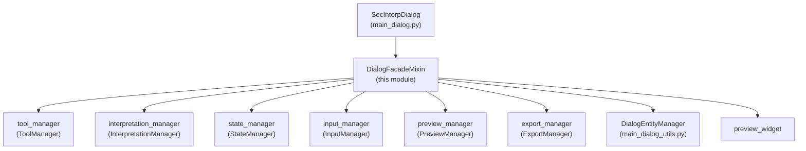

---
tags:
  - secinterp
  - code-walkthrough
  - gui
  - mixins
aliases:
  - dialog_facade_mixin.py
  - DialogFacadeMixin
cssclass: secinterp-note
---

# `gui/dialog_facade_mixin.py`

> [!abstract] One-line summary
> Facade mixin exposing the main dialog's stable public API as thin proxies that delegate every call to the specialized manager implementing it.

**Path**: `gui/dialog_facade_mixin.py` (166 lines)
**Main class**: `DialogFacadeMixin`
**Layer**: GUI (presentation layer · stateless mixin)
**Tags**: #secinterp #gui #mixins

---

## 🎯 Why does this file exist?

`SecInterpDialog` coordinates seven managers (`tool`, `interpretation`, `state`,
`input`, `preview`, `export`, `signal`) plus navigation and the layer factory.
Without a facade, every consumer (signals, buttons, map tools) would need to know
which manager resolves each operation:

| Problem | Solution |
|---------|----------|
| Signal callbacks and map tools need a stable dialog API | The mixin exposes `toggle_measure_tool()`, `preview_profile_handler()`, `accept_handler()`… as a stable surface |
| Adding or splitting a manager would break dozens of connections | Only the proxy changes; public signatures stay intact |
| `main_dialog.py` would exceed the 300-line-per-dialog limit | All delegation lives here; the dialog only composes (`DialogLifecycleMixin`, `DialogMessageMixin`, `DialogFacadeMixin`, `SecInterpMainWindow`) |

> [!important] Architectural note
> **Facade + Proxy**: the mixin holds no business logic and no state of its own;
> every method is a 1–3 line proxy to `self.tool_manager`, `self.state_manager`,
> `self.preview_manager`, `self.export_manager`, `self.input_manager`,
> `self.interpretation_manager`, or `DialogEntityManager` (static methods).

---

## 🧬 Relationship diagram



> [!tip] How to read
> Solid arrow = delegates (`self.<manager>.<method>()`); there is no inheritance
> from the managers, only composition installed by `SecInterpDialog._init_managers()`.

---

## 📦 Imports — architectural reading

```python
# gui/dialog_facade_mixin.py
from __future__ import annotations
from typing import Any
from qgis.core import Qgis
from sec_interp.core.domain import InterpretationPolygon
from sec_interp.gui.main_dialog_utils import DialogEntityManager
from sec_interp.logger_config import get_logger

logger = get_logger(__name__)
```

| # | Observation |
|---|-------------|
| ① | `from __future__ import annotations` — project standard; allows `list[InterpretationPolygon]` on the property at no runtime cost. |
| ② | `typing.Any` — combobox proxies (`source_combobox`, `target_combobox`) and icon utilities are typed as `Any` because they are heterogeneous Qt widgets. |
| ③ | `qgis.core.Qgis` — only the `Qgis.MessageLevel.Warning` enum is used, in `preview_profile_handler`; the mixin creates no geometries and touches no layers. |
| ④ | `InterpretationPolygon` comes from `sec_interp.core.domain` (a domain DTO, not a QGIS object): the `on_interpretation_finished(interpretation)` signature honours Extract-then-Compute. |
| ⑤ | `DialogEntityManager` — **static** entity utilities (fields, layers, theme icons); the mixin re-exposes them for backward compatibility. |
| ⑥ | `get_logger(__name__)` — a single real `logger.info` in the module (`clear_cache_handler`); all other logging lives in the managers. |

---

## 🏗️ Structure inventory

**Classes:** 1 — `DialogFacadeMixin` (no `__init__`, no own attributes; everything it touches hangs off `self`, injected by `SecInterpDialog`).

**Methods grouped by delegation target:**

| Group | Methods | Delegates to |
|-------|---------|--------------|
| Map tools | `toggle_measure_tool`, `update_measurement_display`, `toggle_interpretation_tool`, `on_interpretation_finished` | `tool_manager`, `interpretation_manager` |
| Interpretation compatibility | `interpretations` (property + setter), `_load_interpretations`, `_save_interpretations` | `interpretation_manager` |
| UI state | `update_preview_checkbox_states`, `update_button_state` | `state_manager` |
| Input reading | `get_selected_values`, `get_preview_options` | `input_manager`, `preview_widget` |
| Preview and export | `update_preview_from_checkboxes`, `preview_profile_handler`, `export_preview` | `preview_manager`, `export_manager` |
| Accept / reject / utilities | `accept_handler`, `reject_handler`, `clear_cache_handler`, `reset_defaults_handler` | `state_manager`, validation, cache |
| Static entities | `_populate_field_combobox`, `get_layer_names_by_type`, `get_layer_names_by_geometry`, `getThemeIcon` | `DialogEntityManager` |
| User settings | `_load_user_settings`, `_save_user_settings` | `state_manager` |

---

## 📁 Files in the package

This module is a single file inside `gui/`; its composition siblings are:

| File | Role in the composition |
|---|---|
| `gui/main_dialog.py` | `SecInterpDialog(DialogLifecycleMixin, DialogMessageMixin, DialogFacadeMixin, SecInterpMainWindow)` — composition root |
| `gui/dialog_lifecycle_mixin.py` | `wheelEvent`, `closeEvent`, deterministic cleanup |
| `gui/dialog_message_mixin.py` | `push_message`, `handle_error` (message bar + results area) |
| `gui/main_dialog_utils.py` | `DialogEntityManager` — static utilities re-exposed by this mixin |
| `gui/dialog_interpretation_manager.py` | `InterpretationManager` — target of the interpretation proxies |

---

## 📖 Method-by-method walkthrough

### `toggle_measure_tool` / `update_measurement_display`

```python
def toggle_measure_tool(self, checked: bool) -> None:
    """Toggle measurement tool via tool_manager."""
    self.tool_manager.toggle_measure_tool(checked)

def update_measurement_display(self, metrics: dict[str, Any]) -> None:
    """Display measurement results from multi-point tool via tool_manager."""
    self.tool_manager.update_measurement_display(metrics)
```

Pure 1:1 proxy to `ToolManager`. The second one doubles as the **callback** that
`SecInterpDialog._init_managers()` injects into `ToolManager(...)` as
`update_measurement_display`, closing the tool → dialog loop without circular
imports. See [[dialog_tool_manager]] and [[measure_tool]].

### `toggle_interpretation_tool` / `on_interpretation_finished`

```python
def toggle_interpretation_tool(self, checked: bool) -> None:
    """Toggle interpretation tool via tool_manager."""
    self.tool_manager.toggle_interpretation_tool(checked)

def on_interpretation_finished(self, interpretation: InterpretationPolygon) -> None:
    """Handle finalized interpretation polygon."""
    self.interpretation_manager.handle_interpretation_finished(interpretation)
```

A finished polygon travels tool → facade → `InterpretationManager`, which applies
attribute inheritance and opens [[interpretation_properties_dialog]]. The signature
uses the `InterpretationPolygon` DTO, never `QgsGeometry`. See
[[dialog_interpretation_manager]].

### `interpretations` (property + setter)

```python
@property
def interpretations(self) -> list[InterpretationPolygon]:
    """Proxy to interpretations in the manager for backward compatibility."""
    return self.interpretation_manager.interpretations

@interpretations.setter
def interpretations(self, value: list[InterpretationPolygon]) -> None:
    """Set interpretations in the manager."""
    self.interpretation_manager.interpretations = value
```

Compatibility alias: legacy code reads `dialog.interpretations` while the real
state lives in the manager. The setter allows rehydrating the whole list (e.g.
after `sync_from_layer`). See [[interpretation_persistence_mixin]].

### `update_preview_checkbox_states` / `update_button_state`

```python
def update_preview_checkbox_states(self) -> None:
    """Enable or disable preview checkboxes via state_manager."""
    self.state_manager.update_preview_checkbox_states()

def update_button_state(self) -> None:
    """Enable or disable buttons via state_manager."""
    self.state_manager.update_button_state()
```

Enables/disables the UI depending on data availability. Called by
`StateManager.update_all()` and by the [[dialog_signal_manager]] wiring after
every layer or parameter change. See [[dialog_state_manager]].

### `get_selected_values` / `get_preview_options`

```python
def get_selected_values(self) -> dict[str, Any]:
    return self.input_manager.get_all_values()

def get_preview_options(self) -> dict[str, Any]:
    return {
        "show_topo": bool(self.preview_widget.chk_topo.isChecked()),
        ...
        "max_points": self.preview_widget.spin_max_points.value(),
        "auto_lod": self.preview_widget.chk_auto_lod.isChecked(),
        "use_adaptive_sampling": bool(self.preview_widget.chk_adaptive_sampling.isChecked()),
    }
```

Two flavours of reading: `get_selected_values` returns the legacy flat format
(`input_manager.get_all_values()`), while `get_preview_options` reads the
programmatic `preview_widget` (6 checkboxes + `spin_max_points` + LOD/sampling).
This is the **Extract** phase of Extract-then-Compute. See
[[dialog_input_manager]] and [[preview_page]].

### `update_preview_from_checkboxes` / `preview_profile_handler`

```python
def update_preview_from_checkboxes(self) -> None:
    """Update preview when checkboxes change via PreviewManager."""
    self.preview_manager.update_from_checkboxes()

def preview_profile_handler(self) -> None:
    """Generate a quick preview and auto-save settings on success."""
    success, message = self.preview_manager.generate_preview()
    if success:
        self.state_manager.save_settings()
    if not success and message:
        self.push_message(self.tr("Preview Error"), message, level=Qgis.MessageLevel.Warning)
```

The preview handler chains **Compute → Persist → Notify**: it generates,
auto-saves settings only on success, and notifies via `push_message` (from
[[dialog_message_mixin]]) using `self.tr()` for i18n. See
[[dialog_preview_manager]].

### `export_preview`

```python
def export_preview(self) -> None:
    """Export the current preview to a file using ExportManager."""
    self.export_manager.export_preview()
```

Direct delegation to [[dialog_export_manager]]; the facade knows no formats or
paths, only the entry point the Export button invokes.

### `accept_handler` / `reject_handler`

```python
def accept_handler(self) -> None:
    """Handle the accept button click event."""
    self.state_manager.save_settings()
    if self.iface is None:
        self._cleanup_preview_renderer()
        self.accept()
        return
    if not self.validate_inputs():
        return
    self.interpretation_manager.save_interpretations()
    self._cleanup_preview_renderer()
    self.accept()

def reject_handler(self) -> None:
    """Handle the reject button click event."""
    self._save_on_close = False
    self.close()
```

`accept_handler` implements the Accept protocol in 4 steps: persist settings,
headless shortcut (`iface is None`, used in tests), validation gate, and
interpretation persistence before `self.accept()`. `reject_handler` disables
auto-save (`_save_on_close = False`, consumed by `closeEvent` in
[[dialog_lifecycle_mixin]]) and closes.

### `clear_cache_handler` / `reset_defaults_handler`

```python
def clear_cache_handler(self) -> None:
    """Clear cached data and notify user."""
    if hasattr(self, "plugin_instance") and self.plugin_instance:
        self.plugin_instance.controller.data_cache.clear()
        ...
        logger.info("Cache cleared by user")
    else:
        self.preview_widget.results_text.append(self.tr("⚠ Cache not available"))

def reset_defaults_handler(self) -> None:
    """Reset all dialog inputs via state_manager."""
    self.state_manager.reset_to_defaults()
```

Cache clearing guarded by `hasattr` (plugin-less dialog in tests) with localized
feedback in `results_text`; reset delegated to state. The `measure_tool.reset()`
avoids orphaned rubber bands on the canvas.

### Entity proxies (`DialogEntityManager`)

```python
def _populate_field_combobox(self, source_combobox: Any, target_combobox: Any) -> None:
    DialogEntityManager.populate_field_combobox(source_combobox, target_combobox)

def get_layer_names_by_type(self, layer_type) -> list[str]: ...
def get_layer_names_by_geometry(self, geometry_type) -> list[str]: ...
def getThemeIcon(self, name: str) -> Any:
    return DialogEntityManager.get_theme_icon(name)
```

Re-exposure of static utilities so legacy callers keep working. Note the inherited
`getThemeIcon` (camelCase) name: kept deliberately for compatibility. See
[[main_dialog_utils]].

### `_load_interpretations` / `_save_interpretations` / `_load_user_settings` / `_save_user_settings`

```python
def _load_interpretations(self) -> None:
    self.interpretation_manager.load_interpretations()

def _save_user_settings(self) -> None:
    self.state_manager.save_settings()
```

Four private wrappers preserving the historic names that `SecInterpDialog` and
the tests invoked before the manager extraction.

---

## 🔄 Data flow

| Phase | Input | Transformation | Output |
|-------|-------|----------------|--------|
| Tool toggle | `checked: bool` from the button | 1:1 proxy | `tool_manager` enables/disables the map tool |
| Finished polygon | `InterpretationPolygon` (DTO) | `interpretation_manager.handle_interpretation_finished` | inheritance + properties dialog + persistence |
| Reading (Extract) | widgets / pages | `input_manager` / `preview_widget` | flat dict or preview-options dict |
| Preview | Preview click | `preview_manager.generate_preview()` → `save_settings()` on success | memory layers + localized message on failure |
| Accept | OK click | settings → validate → save interpretations → clean renderer | `self.accept()` (dialog closed) |
| Reject | Cancel click | `_save_on_close = False` → `close()` | `closeEvent` without persisting |

---

## 🏛️ Design patterns present

| Pattern | Where | Purpose |
|---------|-------|---------|
| **Facade** | whole class | Stable surface over 6 managers + utilities |
| **Proxy** | every method | Forwarding without logic; behaviour lives in the manager |
| **Callback injection** | `on_interpretation_finished`, `update_measurement_display` | `ToolManager` receives them in its constructor and invokes them without knowing the dialog |
| **Law of Demeter (relaxed)** | `self.preview_widget.chk_topo` in `get_preview_options` | Documented exception: reading checkboxes is presentation Extract, not logic |
| **Template (historic hooks)** | `_load/_save_*` | Legacy names preserved as hooks |

---

## 🧾 API summary

| Symbol | Signature | Typical use |
|--------|-----------|-------------|
| `DialogFacadeMixin` | `class DialogFacadeMixin:` (no bases) | Mixed into `SecInterpDialog` |
| `toggle_measure_tool` | `(checked: bool) -> None` | Measure button → `tool_manager` |
| `update_measurement_display` | `(metrics: dict[str, Any]) -> None` | multi-point tool callback |
| `toggle_interpretation_tool` | `(checked: bool) -> None` | Interpret button → `tool_manager` |
| `on_interpretation_finished` | `(interpretation: InterpretationPolygon) -> None` | finished polygon → manager |
| `interpretations` | `property list[InterpretationPolygon]` + setter | compatibility with legacy readers |
| `get_selected_values` | `() -> dict[str, Any]` | legacy flat values |
| `get_preview_options` | `() -> dict[str, Any]` | 9 visibility and sampling keys |
| `preview_profile_handler` | `() -> None` | preview + auto-save + warning |
| `export_preview` | `() -> None` | Export button |
| `accept_handler` / `reject_handler` | `() -> None` | OK / Cancel |
| `clear_cache_handler` | `() -> None` | Clear Cache button |
| `reset_defaults_handler` | `() -> None` | Reset Defaults button |
| `getThemeIcon` | `(name: str) -> Any` | theme icon (legacy name) |

---

## 🛡️ Error handling

The mixin barely catches exceptions: it filters before delegating.

- **Validation gate**: `accept_handler` aborts when `validate_inputs()` is false; the validation message is shown by `show_user_message`, not the facade.
- **`hasattr` guards**: `clear_cache_handler` tolerates plugin-less dialogs (headless tests) with a localized message instead of `AttributeError`.
- **Headless branch**: `iface is None` accepts directly after cleaning the renderer; lets the dialog close in tests without a real QGIS.
- **Preview failure**: `generate_preview()` returns `(success, message)` instead of raising; only the message travels to `push_message` at `Warning` level.

---

## 🧪 Associated tests

There is no dedicated `test_dialog_facade_mixin.py`; the facade is covered
through the dialog tests and each target manager's tests:

- `tests/gui/test_main_dialog_tools.py` — measure/interpretation toggles through the proxies.
- `tests/gui/test_main_dialog_interpretation.py` — `TestInterpretationManager::test_apply_attribute_inheritance_geology` exercises the `on_interpretation_finished` → inheritance chain.
- `tests/gui/test_dialog_interpretation_manager.py` — `test_handle_interpretation_finished_accepted/rejected`, `test_save_interpretations`.
- `tests/gui/test_main_dialog_settings.py` — `test_save_and_load_layer_with_name` covers the settings path that `accept_handler` persists.
- `tests/gui/test_main_dialog_validation_manager.py` — the `validate_inputs()` gate consulted by `accept_handler`.

> [!note] Honest coverage
> The 1:1 proxies are not tested one by one (that would test the mock); the
> effects on the target manager and the dialog `accept/reject` paths are verified.

---

## 🧩 MRO and attribute contract

`SecInterpDialog(DialogLifecycleMixin, DialogMessageMixin, DialogFacadeMixin, SecInterpMainWindow)`:
the MRO order matters because `DialogLifecycleMixin.closeEvent`/`wheelEvent` use
cooperative `super()`, while this mixin defines neither `__init__` nor magic
methods, so it never intercepts the chain.

| Implicit contract | Provider | Consumed by |
|---|---|---|
| `self.tool_manager`, `self.interpretation_manager`, `self.state_manager` | `_init_managers()` | all proxies |
| `self.preview_widget` (canvas, checkboxes, `results_text`) | `SecInterpMainWindow` | `get_preview_options`, `clear_cache_handler` |
| `self.push_message`, `self.show_dialog` | `DialogMessageMixin` + `main_dialog` | `preview_profile_handler` |
| `self._cleanup_preview_renderer`, `self._save_on_close` | `DialogLifecycleMixin` | `accept_handler`, `reject_handler` |
| `self.validate_inputs` | `main_dialog` → `input_manager` | `accept_handler` |

Calling a proxy before `_init_managers()` fails with `AttributeError`: that is a
programming error, not a runtime case, which is why it is not guarded with
`getattr` except on the documented headless path.

---

## 🌐 Facade i18n

Every visible string is born with `self.tr()` at the delegation point:

| String | Context |
|--------|---------|
| `self.tr("Preview Error")` | failed-preview warning title |
| `self.tr("✓ Cache cleared - next preview will re-process data")` | cache-cleared confirmation |
| `self.tr("⚠ Cache not available")` | plugin-less dialog |
| `self.tr("Clear Cache")`, `self.tr("Reset Defaults")` | buttons created in `main_dialog` whose handlers live here |

The mixin never concatenates translated fragments with data except for the
already-localized `message` returned by the manager; it follows the GUI-layer
rule of translating with `self.tr()`.

---

## 👀 Observations and notes

> [!success] Strengths
> - 1–3 line proxies: reading the file reads the dialog's responsibility map.
> - The `InterpretationPolygon` (DTO) signature keeps the Extract-then-Compute boundary even in tool callbacks.
> - `accept_handler` orders persist → validate → persist interpretations → clean up correctly.

> [!warning] Points of attention
> - `get_preview_options` reaches 9 widgets by name; renaming a checkbox in `preview_widget` breaks the proxy at runtime with no typing help.
> - `getThemeIcon` keeps its historic camelCase: inconsistent with the surrounding snake_case, but renaming would break external callers.
> - The `_load/_save_*` proxies duplicate manager method names; a new reader may confuse which level really persists.

> [!question] Open questions
> - Should `get_preview_options` be generated from the `preview_widget`'s `dump()` protocol (as `DialogSettingsPersistence` does) instead of hand-reading widgets?
> - Does the facade deserve a contract test (every proxy exists and delegates) with manager mocks?

---

## 🔗 Related notes

- [[Index]] — vault index
- [[main_dialog]] — composition root installing the managers
- [[dialog_lifecycle_mixin]] — cleanup and `_save_on_close` used by accept/reject
- [[dialog_message_mixin]] — `push_message` used in `preview_profile_handler`
- [[dialog_interpretation_manager]] — target of the interpretation proxies
- [[dialog_state_manager]] — target of state, buttons and settings
- [[dialog_preview_manager]] — preview target; [[dialog_export_manager]] for export
- [[dialog_input_manager]] — `get_all_values` behind `get_selected_values`
- [[main_dialog_utils]] — `DialogEntityManager` re-exposed here
- [[interpretations]] — `InterpretationPolygon` DTO crossing the facade

---

*Note of the SecInterp Code Walkthrough v2 vault — v3.9.1*
