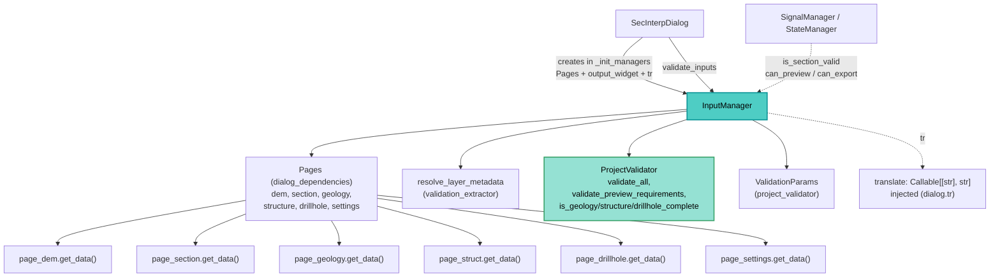

---
tags:
  - secinterp
  - code-walkthrough
  - gui
  - managers
aliases:
  - dialog_input_manager.py
  - InputManager
cssclass: secinterp-note
---

# `gui/dialog_input_manager.py`

> [!abstract] One-line summary
> `InputManager` aggregates the six configuration pages (`Pages`) into a flat dictionary or a `ValidationParams`, applies per-section UI rules, and delegates formal validation to `ProjectValidator`, exposing `can_preview()` / `can_export()` as UI gates.

**Path**: `gui/dialog_input_manager.py` (200 lines)
**Main class**: `InputManager`
**Layer**: GUI · `SecInterpDialog` manager (input aggregation and validation)
**Tags**: #secinterp #gui #managers

---

## 🎯 Why does this file exist?

Reading six configuration pages on every action (preview, export, validate) would
repeat the same aggregation code across the dialog. This manager centralises it:

| Problem | Solution |
|---------|----------|
| Every action needs the same values from 6 pages | `get_all_values()` (flat dict) and `get_validation_params()` (DTO) |
| Full validation is costly; sometimes the minimum suffices | Two tiers: `validate_inputs` (full) and `validate_preview_requirements` (minimal) |
| Enabling buttons needs yes/no answers per section | `dem/section/output/geology/structure/drillhole` rules + `can_preview` / `can_export` |
| Pages return live QGIS layers | `resolve_layer_metadata` converts them to metadata before validating |

> [!important] Architectural note
> A GUI-side aggregator that imports **nothing from `qgis.*`**: it only talks to pages,
> `ProjectValidator` and the metadata extractor. It is the first step of
> Extract-then-Compute (widgets into validatable data).

---

## 🧬 Relationship diagram



> [!tip] How to read
> Solid arrow = calls/consumes; dashed = injected function or state query.

---

## 📦 Imports — architectural reading

```python
# gui/dialog_input_manager.py
from __future__ import annotations

from collections.abc import Callable    # ①
from typing import Any                  # ②

from sec_interp.core.exceptions import ValidationError              # ③
from sec_interp.core.validation.project_validator import (          # ④
    ProjectValidator,
    ValidationParams,
)
from sec_interp.gui.adapters.validation_extractor import resolve_layer_metadata  # ⑤

from .dialog_dependencies import Pages  # ⑥
```

| # | Observation |
|---|-------------|
| ① | `Callable[[str], str]` types the injected translation function (`dialog.tr`). |
| ② | `Any` for the output widget and the flat values dictionary. |
| ③ | Only catches `ValidationError`: the manager translates exceptions into `(bool, str)` tuples. |
| ④ | Core `ProjectValidator` (formal logic) + `ValidationParams` (validation DTO). |
| ⑤ | `resolve_layer_metadata` decouples QGIS layers → metadata before validating (Extract). |
| ⑥ | Relative import of the `Pages` container: the manager receives pages, never the whole dialog. |

> [!success] Zero `qgis.*`
> The only dialog manager with no QGIS imports: it works over page `get_data()` and
> metadata. Hence trivially testable with no QGIS environment.

---

## 🏗️ Structure inventory

**Classes:** `class InputManager` — 10 methods.

**Methods:**

- `__init__(pages, output_widget, translate)` — stores collaborators and defines rules.
- `_setup_validation_rules()` — `rules` dict with 6 sections (check + message).
- `get_all_values() -> dict[str, Any]` — flat dict with ~30 keys from the 6 pages.
- `get_validation_params() -> ValidationParams` — DTO with resolved metadata.
- `validate_inputs() -> tuple[bool, str]` — full validation via `ProjectValidator.validate_all`.
- `validate_preview_requirements() -> tuple[bool, str]` — minimum for preview.
- `is_section_valid(section) -> bool` — applies one section's rule.
- `get_section_error(section) -> str` — the section message or `""`.
- `can_preview() -> bool` — valid `dem` and `section`.
- `can_export() -> bool` — `can_preview` plus valid `output`.

---

## 📖 Method-by-method walkthrough

### `__init__` — Narrow collaborators

```python
def __init__(
    self,
    pages: Pages,
    output_widget: Any,
    translate: Callable[[str], str],
) -> None:
    self.pages = pages
    self.output_widget = output_widget
    self.tr = translate
    self._setup_validation_rules()
```

It receives the `Pages` container (a dataclass in `gui/dialog_dependencies.py` with
`dem/section/geology/structure/drillhole/settings`), the output-path widget and the
`tr` function. Never the dialog: minimal, testable dependency.

### `_setup_validation_rules` — The 6 UI rules

```python
def _setup_validation_rules(self) -> None:
    self.rules = {
        "dem": {
            "check": lambda p: bool(p.raster_layer),
            "message": self.tr("Raster DEM layer is required"),
        },
        "section": {
            "check": lambda p: bool(p.line_layer),
            "message": self.tr("Cross-section line layer is required"),
        },
        "output": {
            "check": lambda p: bool(p.output_path),
            "message": self.tr("Output directory path is required"),
        },
        "geology": {
            "check": lambda p: (
                ProjectValidator.is_geology_complete(p) if p.outcrop_layer else True
            ),
            "message": self.tr("Geology configuration is incomplete"),
        },
        "structure": {
            "check": lambda p: (
                ProjectValidator.is_structure_complete(p) if p.struct_layer else True
            ),
            "message": self.tr("Structure configuration is incomplete"),
        },
        "drillhole": {
            "check": lambda p: (
                ProjectValidator.is_drillhole_complete(p) if p.collar_layer else True
            ),
            "message": self.tr("Drillhole configuration is incomplete"),
        },
    }
```

| Rule | Semantics |
|------|-----------|
| `dem`, `section`, `output` | Always required (layers and path present). |
| `geology`, `structure`, `drillhole` | **Conditional**: only required complete when their layer is configured; with no layer the section counts as valid (`True`). |

The optional ones delegate the "complete" criterion to the core
(`is_geology_complete`, etc.) instead of reinventing it. Messages are translated
when rules are defined (once per instance).

### `get_all_values` — Flat dictionary (~30 keys)

```python
def get_all_values(self) -> dict[str, Any]:
    dem = self.pages.dem.get_data()
    sect = self.pages.section.get_data()
    geol = self.pages.geology.get_data()
    stru = self.pages.structure.get_data()
    dh = self.pages.drillhole.get_data()

    return {
        "raster_layer": dem["raster_layer"],
        "selected_band": dem["selected_band"],
        "scale": dem["scale"],
        "vertexag": dem["vertexag"],
        "crossline_layer": sect["crossline_layer"],
        "buffer_distance": sect["buffer_distance"],
        "outcrop_layer": geol["outcrop_layer"],
        "outcrop_name_field": geol["outcrop_name_field"],
        "structural_layer": stru["structural_layer"],
        "dip_field": stru["dip_field"],
        "strike_field": stru["strike_field"],
        "dip_scale_factor": stru["dip_scale_factor"],
        "collar_layer_obj": dh["collar_layer"],
        ...
        "output_path": self.output_widget.filePath(),
        **(self.pages.settings.get_data() if self.pages.settings is not None else {}),
    }
```

It renames keys while flattening (`crossline_layer`, `collar_layer_obj`, …): the dict
is the contract consumed by the dialog's `get_selected_values` and, from there, by
`ExportManager.export_data` (e.g. `values["output_path"]`, `values.get("exp_topo")`).
`page_settings` merges only when present (`None`-tolerant).

### `get_validation_params` — DTO with resolved metadata

```python
def get_validation_params(self) -> ValidationParams:
    dem = self.pages.dem.get_data()
    ...
    return ValidationParams(
        raster_layer=resolve_layer_metadata(dem["raster_layer"]),
        band_number=dem["selected_band"],
        line_layer=resolve_layer_metadata(sect["crossline_layer"]),
        output_path=self.output_widget.filePath(),
        scale=dem["scale"],
        vert_exag=dem["vertexag"],
        buffer_dist=sect["buffer_distance"],
        outcrop_layer=resolve_layer_metadata(geol["outcrop_layer"]),
        outcrop_field=geol["outcrop_name_field"],
        struct_layer=resolve_layer_metadata(stru["structural_layer"]),
        struct_dip_field=stru["dip_field"],
        struct_strike_field=stru["strike_field"],
        dip_scale_factor=stru["dip_scale_factor"],
        collar_layer=resolve_layer_metadata(dh["collar_layer"]),
        collar_id=dh["collar_id"],
        collar_use_geom=dh["use_geometry"],
        collar_x=dh["collar_x"],
        collar_y=dh["collar_y"],
        survey_layer=resolve_layer_metadata(dh["survey_layer"]),
        ...
        interval_lith=dh["interval_lith"],
    )
```

Every live QGIS layer goes through `resolve_layer_metadata` (id, name, validity,
CRS) before reaching the core: the resulting `ValidationParams` validates with no
QGIS. See [[validation_extractor]] and [[project_validator]].

### `validate_inputs` / `validate_preview_requirements` — Exception to tuple

```python
def validate_inputs(self) -> tuple[bool, str]:
    params = self.get_validation_params()
    try:
        ProjectValidator.validate_all(params)
        return True, ""
    except ValidationError as e:
        return False, str(e)

def validate_preview_requirements(self) -> tuple[bool, str]:
    params = self.get_validation_params()
    try:
        ProjectValidator.validate_preview_requirements(params)
        return True, ""
    except ValidationError as e:
        return False, str(e)
```

Same shape on two tiers: full validation (export/accept) and minimal validation
(preview: DEM + line suffice). They turn `ValidationError` into `(False, message)`
so the dialog shows the text with no `try/except`.

### `is_section_valid` / `get_section_error` — Per-section gates

```python
def is_section_valid(self, section: str) -> bool:
    if section not in self.rules:
        return True
    params = self.get_validation_params()
    return self.rules[section]["check"](params)

def get_section_error(self, section: str) -> str:
    if self.is_section_valid(section):
        return ""
    return self.rules[section]["message"]
```

Unknown section → valid (`True`): a permissive policy that never blocks the UI over
new keys. `get_section_error` returns `""` when all is well, so callers can
concatenate messages without checking first.

### `can_preview` / `can_export` — Composite gates

```python
def can_preview(self) -> bool:
    return self.is_section_valid("dem") and self.is_section_valid("section")

def can_export(self) -> bool:
    return self.can_preview() and self.is_section_valid("output")
```

A monotone hierarchy: exporting requires everything previewing does plus the output
path. `StateManager`/`UIStatusManager` use them to enable buttons and checkboxes
(see [[dialog_state_manager]] and [[ui_status_manager]]).

---

## 🔄 Data flow

| Phase | Input | Transformation | Output |
|-------|-------|----------------|--------|
| Aggregate | 6 pages + `output_widget` | `get_data()` per page | Flat dict (~30 keys) |
| Resolve | Live QGIS layers | `resolve_layer_metadata` | `ValidationParams` with no QGIS |
| Validate | `ValidationParams` | `ProjectValidator.*` | `(True, "")` or `(False, message)` |
| Gate | Per-section rules | `check(params)` | `can_preview` / `can_export` |

---

## 🏛️ Design patterns present

| Pattern | Where | Purpose |
|---------|-------|---------|
| **Manager (dialog decomposition)** | Whole class | Centralise input reading and validation |
| **Parameter Object** | `Pages`, `ValidationParams` | Group collaborators and validation data |
| **Rule table** | `self.rules` | Declarative rules (check + message) per section |
| **Adapter** | `resolve_layer_metadata` | QGIS layers → validatable metadata |
| **Exception translation** | `validate_*` | `ValidationError` → `(bool, str)` for the UI |

---

## 🧾 API summary

| Symbol | Signature | Typical use |
|--------|-----------|-------------|
| `InputManager(pages, output_widget, translate)` | constructor | Created in `main_dialog._init_managers` |
| `get_all_values()` | `-> dict[str, Any]` | Basis for `get_selected_values` (export) |
| `get_validation_params()` | `-> ValidationParams` | `ProjectValidator` input |
| `validate_inputs()` | `-> tuple[bool, str]` | `SecInterpDialog.validate_inputs` |
| `validate_preview_requirements()` | `-> tuple[bool, str]` | Minimum for previewing |
| `is_section_valid(section)` | `-> bool` | `StateManager` gates |
| `can_preview()` / `can_export()` | `-> bool` | Enable preview/export buttons |

---

## 🛡️ Error handling

| Situation | Behaviour |
|-----------|-----------|
| Core `ValidationError` | `(False, str(e))`, never propagated |
| Unknown section in `is_section_valid` | `True` (permissive) |
| `page_settings` is `None` | Its merge is skipped in `get_all_values` |
| Optional layer missing | Its rule returns `True` (non-blocking) |

The manager never validates by itself: all formal logic lives in
`ProjectValidator`; data is aggregated here and results translated.

---

## 🌐 i18n

The six rule messages are translated in `_setup_validation_rules` with the injected
function (`self.tr = translate`, usually `dialog.tr`): "Raster DEM layer is
required", "Cross-section line layer is required", "Output directory path is
required" and the three "… configuration is incomplete" messages. Detailed core
messages arrive localisable via `str(e)`.

---

## 🧪 Associated tests

Real coverage in `tests/gui/test_dialog_input_manager.py` (no QGIS, mocked pages):

- `test_get_all_values_collects_from_all_pages` — aggregation of all 6 pages into the flat dict.
- `test_validate_inputs_success` / `test_validate_inputs_failure` — `ValidationError`-to-tuple translation (mocked `ProjectValidator`).
- `test_is_section_valid_logic` — required vs conditional rules.
- `test_get_section_error_messages` — message or `""` based on validity.

---

## 👀 Observations and notes

> [!success] Strengths
> - Zero QGIS imports: the purest, most testable dialog manager.
> - Conditional rules (`if p.outcrop_layer … else True`) honour optionality with no branched UI code.
> - Dual output (flat dict + DTO) serving different consumers (export and validation).
> - Injected `translate` instead of direct `dialog.tr`: decoupled from `SecInterpDialog`.

> [!warning] Points of attention
> - `get_all_values` and `get_validation_params` repeat the five `get_data()` calls: a page-dict change must touch two methods.
> - `rules` lambdas take `ValidationParams`, but `validate_*` never uses them: two validation paths that may diverge.
> - Unknown section → silent `True`: a typo (`"demm"`) would wrongly enable buttons.
> - `get_section_error` calls `get_validation_params` twice (via `is_section_valid`): duplicated aggregation.

> [!question] Open questions
> - Unify `validate_*` over `self.rules` for a single validation path?
> - Register valid keys and raise on unknown sections in debug mode?
> - Cache the `ValidationParams` per call to avoid double aggregation?

---

## 🔗 Related notes

- [[Index]] — vault index
- [[main_dialog]] — creates the manager with `Pages` and `output_widget`
- [[dialog_state_manager]] — consumes `can_preview` / `can_export` for buttons
- [[dialog_export_manager]] — consumes `get_selected_values` (derived from the flat dict)
- [[dialog_preview_manager]] — previewing requires what is validated here
- [[project_validator]] — `validate_all`, `validate_preview_requirements`
- [[validation_extractor]] — `resolve_layer_metadata`
- [[ui_status_manager]] — indicators reflecting these rules
- [[domain]] — domain DTOs close to `ValidationParams`

---

*Note of the SecInterp Code Walkthrough v2 vault — v3.8.0*
