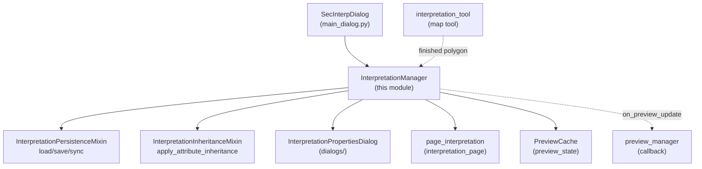
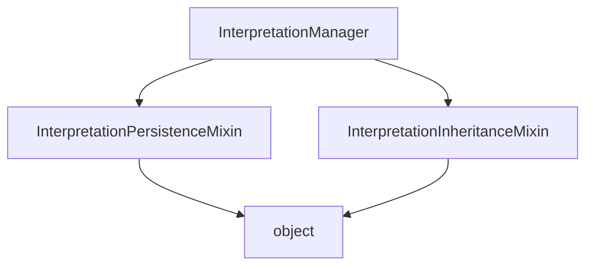

---
tags:
  - secinterp
  - code-walkthrough
  - gui
  - managers
aliases:
  - dialog_interpretation_manager.py
  - InterpretationManager
cssclass: secinterp-note
---

# `gui/dialog_interpretation_manager.py`

> [!abstract] One-line summary
> GUI orchestrator for interpretation polygons: it inherits persistence and attribute inheritance from two mixins and adds the finish flow (inheritance → properties dialog → append → persist → preview refresh).

**Path**: `gui/dialog_interpretation_manager.py` (107 lines)
**Main class**: `InterpretationManager`
**Layer**: GUI (presentation manager · mixin composition)
**Tags**: #secinterp #gui #managers

---

## 🎯 Why does this file exist?

Interpretations drawn on the profile need a clear owner that is not the monolithic
dialog: something must receive the polygon from the map tool, enrich it, ask the
user for its properties, save it, and repaint. Splitting that between
`main_dialog.py` and the tool would violate the 300-line-per-dialog rule and scatter
the lifecycle:

| Problem | Solution |
|---------|----------|
| `SecInterpDialog` already coordinates 6 managers; adding the interpretation lifecycle would overflow it | `InterpretationManager` owns the `interpretations` list and the `handle_interpretation_finished` flow |
| Persistence (project JSON / layer) and inheritance (geology / drillholes) are two independent axes | They live in [[interpretation_persistence_mixin]] and [[interpretation_inheritance_mixin]]; the manager composes them via multiple inheritance |
| The preview must repaint after each interpretation without coupling the manager to the renderer | `_on_preview_update` callback registered with `set_preview_update_handler` (callback injection) |

> [!important] Architectural note
> **Manager + mixin inheritance**: `InterpretationManager(InterpretationPersistenceMixin, InterpretationInheritanceMixin)`
> implements neither persistence nor inheritance; only orchestration. Persistence and
> inheritance are reusable capabilities the dialog also exposes via
> [[dialog_facade_mixin]] (`_load_interpretations`, `on_interpretation_finished`).

---

## 🧬 Relationship diagram



> [!tip] How to read
> Solid arrow = uses/inherits; dashed = callback or event (the tool emits, the
> preview refreshes) with no static dependency.

---

## 📦 Imports — architectural reading

```python
# gui/dialog_interpretation_manager.py
from __future__ import annotations
from collections.abc import Callable
from typing import TYPE_CHECKING
from sec_interp.core.domain import InterpretationPolygon
from sec_interp.gui.interpretation_inheritance_mixin import InterpretationInheritanceMixin
from sec_interp.gui.interpretation_persistence_mixin import InterpretationPersistenceMixin
from sec_interp.logger_config import get_logger, log_critical_operation
from .preview_state import PreviewCache

if TYPE_CHECKING:
    from .main_dialog import SecInterpDialog
```

| # | Observation |
|---|-------------|
| ① | `Callable` from `collections.abc` (not `typing`): the `_on_preview_update` callback uses modern typing (`Callable[[], None] \| None`). |
| ② | `TYPE_CHECKING` + deferred `SecInterpDialog` import: breaks the dialog ↔ manager cycle; at runtime the dialog is only used as an attribute (`self.dialog`). |
| ③ | `InterpretationPolygon` from `core.domain`: the manager manipulates domain DTOs, never `QgsFeature`; layer conversion lives in the persistence mixin's `save_to_layer`. |
| ④ | Both mixins imported via absolute path (`sec_interp.gui.…`): they are reusable public capabilities, not relative details. |
| ⑤ | `PreviewCache` via relative import (`.preview_state`): shared cache **owned by the dialog** and injected through the constructor — the manager never creates one alone in production. |
| ⑥ | `log_critical_operation` plus `get_logger`: finishing a polygon is an auditable critical operation (id + vertex count in the log). |
| ⑦ | `InterpretationPropertiesDialog` imported **inside** `handle_interpretation_finished` (lazy): avoids the `dialogs/ → gui → dialogs/` cycle at import time. |

---

## 🏗️ Structure inventory

**Classes:** 1 — `InterpretationManager(InterpretationPersistenceMixin, InterpretationInheritanceMixin)`.

**Instance attributes** (set in `__init__`):

| Attribute | Type | Origin |
|----------|------|--------|
| `dialog` | `SecInterpDialog` | injected by `SecInterpDialog._init_managers()` |
| `interpretations` | `list[InterpretationPolygon]` | live list; the dialog re-exposes it via the [[dialog_facade_mixin]] property |
| `_preview_cache` | `PreviewCache` | shared with `preview_manager`; an empty one is created if none is injected |
| `_on_preview_update` | `Callable[[], None] \| None` | callback registered by the dialog towards `preview_manager.update_from_checkboxes` |

**Own methods:** `__init__`, `set_preview_update_handler`, `clear_interpretations`, `handle_interpretation_finished` (4). Everything else (`load/save/sync`, `apply_attribute_inheritance`, `save_to_layer…`) is inherited from the mixins.

---

## 📁 Files in the package

| File | Role towards this manager |
|---|---|
| `gui/interpretation_persistence_mixin.py` | base 1: `load/save_interpretations`, `sync_from_layer`, `save_to_layer` |
| `gui/interpretation_inheritance_mixin.py` | base 2: `apply_attribute_inheritance` + `QgsSpatialIndex` search |
| `gui/dialogs/interpretation_properties_dialog.py` | modal dialog invoked in the finish flow |
| `gui/main_dialog.py` | `_init_managers()`: `InterpretationManager(self, cache=preview_cache)` + callback wiring |
| `gui/preview_state.py` | shared `PreviewCache` (`geol`/`drillhole` reads for inheritance) |
| `gui/ui/pages/interpretation_page.py` | `page_interpretation.get_data()`: `inherit_geology`, `inherit_drillholes`, `custom_fields`, `source_type` |

---

## 📖 Method-by-method walkthrough

### `__init__`

```python
def __init__(self, dialog: SecInterpDialog, cache: PreviewCache | None = None) -> None:
    self.dialog = dialog
    self.interpretations: list[InterpretationPolygon] = []
    self._preview_cache = cache if cache is not None else PreviewCache()
    self._on_preview_update: Callable[[], None] | None = None
```

Explicit dependency injection: the dialog (for `page_interpretation`,
`preview_widget`, `project`, `layer_factory` via the mixins) and the shared cache.
The `None → PreviewCache()` default exists only to ease unit testing without a real
dialog. Note there is no `super().__init__()` call: the mixins define no
initializer and the MRO does not require one.

### `set_preview_update_handler`

```python
def set_preview_update_handler(self, handler: Callable[[], None]) -> None:
    """Register the callback invoked after an interpretation is added."""
    self._on_preview_update = handler
```

Registers the preview refresh. `main_dialog._init_managers()` wires
`self.preview_manager.update_from_checkboxes` here, so adding an interpretation
repaints without this manager importing the preview one. A minimalist
single-subscriber Observer.

### `clear_interpretations`

```python
def clear_interpretations(self) -> None:
    """Clear all interpretations and persist the change."""
    self.interpretations = []
    self.save_interpretations()
```

Empties and persists in one step so project JSON or target layer never drift out
of sync. It is also the handler `preview_manager` invokes via
`set_interpretations_cleared_handler` (the mirror image of the previous callback).

### `handle_interpretation_finished` — first half (inheritance + properties)

```python
def handle_interpretation_finished(self, interpretation: InterpretationPolygon) -> None:
    from .dialogs.interpretation_properties_dialog import InterpretationPropertiesDialog
    log_critical_operation(logger, "handle_interpretation_finished",
        polygon_id=interpretation.id, vertices=len(interpretation.vertices_2d))
    interp_config = self.dialog.page_interpretation.get_data()
    if interp_config.get("inherit_geology") or interp_config.get("inherit_drillholes"):
        self.apply_attribute_inheritance(interpretation, interp_config)
    dlg = InterpretationPropertiesDialog(
        interpretation, interp_config.get("custom_fields"), self.dialog)
    if dlg.exec() != 1:
        logger.info(f"Interpretation canceled by user: {interpretation.id}")
        self.dialog.preview_widget.btn_interpret.setChecked(False)
        return
```

Sequence: audit → page configuration → conditional inheritance (only when a flag
is on, avoiding building the spatial index for nothing) → modal editing. If the
user cancels (`exec() != 1`, i.e. not `Accepted`), the polygon is discarded,
`btn_interpret` is unchecked and the method **returns without persisting or
repainting**. See [[interpretation_inheritance_mixin]] and
[[interpretation_properties_dialog]].

### `handle_interpretation_finished` — second half (append + notify)

```python
    self.interpretations.append(interpretation)
    self.save_interpretations()
    logger.info(f"Interpretation polygon added: {interpretation.id} "
        f"({len(interpretation.vertices_2d)} vertices)")
    msg = (f"<b>{self.dialog.tr('Interpretation Finished')}</b><br>"
        f"<b>{self.dialog.tr('Name')}:</b> {interpretation.name}<br>"
        f"<b>{self.dialog.tr('Vertices')}:</b> {len(interpretation.vertices_2d)}<br>"
        f"<b>{self.dialog.tr('ID')}:</b> {interpretation.id[:8]}...")
    self.dialog.preview_widget.results_text.setHtml(msg)
    self.dialog.preview_widget.results_group.setCollapsed(False)
    self.dialog.preview_widget.btn_interpret.setChecked(False)
    if self._on_preview_update:
        self._on_preview_update()
```

Reached only when the user accepted: append → immediate persistence →
localized HTML summary in `results_text` (group expanded) → button unchecked →
preview refresh via callback. The order guarantees a persistence failure cannot
leave a phantom polygon in the list without saving… actually append precedes
save: if `save_interpretations` failed, memory and destination would diverge (see risks).

---

## 🔄 Data flow

| Phase | Input | Transformation | Output |
|-------|-------|----------------|--------|
| Finish | `InterpretationPolygon` from `interpretation_tool` | `log_critical_operation` + `page_interpretation.get_data()` read | config (`inherit_*`, `custom_fields`) |
| Inheritance | polygon + flags | `apply_attribute_inheritance` (spatial index over cache) | name/type/attributes/color filled in |
| Editing | inherited polygon | modal `InterpretationPropertiesDialog.exec()` | edited polygon or discard (cancel) |
| Persistence | list + polygon | `append` + `save_interpretations()` (JSON or layer) | project/layer updated |
| Notification | saved polygon | HTML in `results_text` + `_on_preview_update()` | user informed + preview repainted |

---

## 🏛️ Design patterns present

| Pattern | Where | Purpose |
|---------|-------|---------|
| **Manager** | the class | Owner of the interpretation lifecycle outside the dialog |
| **Mixin composition** | dual inheritance | Persistence and inheritance as orthogonal, combinable capabilities |
| **Observer (callback)** | `_on_preview_update` / `set_preview_update_handler` | Notify the preview with no static dependency |
| **Lazy import** | `InterpretationPropertiesDialog` inside the method | Break the `gui ↔ dialogs` import cycle |
| **Facade delegation** | `dialog.page_interpretation`, `dialog.preview_widget` | The manager consumes the dialog surface without importing it |

---

## 🧾 API summary

| Symbol | Signature / Inherits | Typical use |
|--------|----------------------|-------------|
| `InterpretationManager` | `(InterpretationPersistenceMixin, InterpretationInheritanceMixin)` | `InterpretationManager(dialog, cache)` in `_init_managers` |
| `__init__` | `(dialog, cache: PreviewCache \| None = None) -> None` | dialog + shared-cache injection |
| `set_preview_update_handler` | `(handler: Callable[[], None]) -> None` | wire `preview_manager.update_from_checkboxes` |
| `clear_interpretations` | `() -> None` | empty + persist (also via preview_manager) |
| `handle_interpretation_finished` | `(interpretation: InterpretationPolygon) -> None` | entry from `tool_manager` / facade |
| persistence inherited | `load/save_interpretations`, `sync_from_layer`, `save_to_layer` | see [[interpretation_persistence_mixin]] |
| inheritance inherited | `apply_attribute_inheritance` | see [[interpretation_inheritance_mixin]] |

---

## 🛡️ Error handling

- **User cancellation is not an error**: `exec() != 1` is handled with an early `return` + `info` log; nothing is raised or notified.
- **No own `try/except`**: persistence failures propagate from the mixin (which already catches `Exception` when reading JSON and logs with `logger.exception`); a layer-write failure would bubble up to the tool caller.
- **Conditional inheritance**: with both flags off, the cache is untouched and no `QgsSpatialIndex` is built; with an empty cache, the `_check_*` helpers return `(best_match, min_dist)` unchanged.
- **Orphaned button**: both cancel and success paths run `btn_interpret.setChecked(False)`; the tool never stays armed after finishing.

---

## 🧪 Associated tests

- `tests/gui/test_dialog_interpretation_manager.py` — `TestDialogInterpretationManager`:
  - `test_handle_interpretation_finished_accepted` / `..._rejected` — accept/cancel branches of the modal dialog (mocked `InterpretationPropertiesDialog`).
  - `test_apply_attribute_inheritance_geology` / `..._drillholes` — inheritance via mocked cache.
  - `test_load_interpretations_success` / `test_load_interpretations_fail` / `test_save_interpretations` / `test_json_serial_special` / `test_no_project_guards` — inherited persistence.
  - `test_inheritance_no_cached_data` — nothing inherited without cached data.
  - `test_sync_from_layer_uses_filtered_request` — `sync_from_layer` filters by extent (spatial index).
- `tests/gui/test_main_dialog_interpretation.py` — `TestInterpretationManager::test_load_interpretations_empty/valid`, `test_save_interpretations`, `test_apply_attribute_inheritance_geology` (dialog-level coverage).
- `tests/gui/test_attribute_inheritance.py` — `TestAttributeInheritance::test_inheritance_midpoint_bias`.
- `tests/gui/test_interpretation_tool.py` — the tool producing the polygons (`test_finalize_polygon`, `test_finalize_invalid`).

---

## 🧩 Initialization order in the dialog

In `SecInterpDialog._init_managers()` the order is significant:

1. `preview_cache = PreviewCache()` — the dialog owns the cache.
2. `interpretation_manager = InterpretationManager(self, cache=preview_cache)` — receives the shared cache.
3. `interpretation_manager.load_interpretations()` — rehydrates at startup (JSON or layer per `source_type`).
4. `preview_manager.set_interpretations_cleared_handler(interpretation_manager.clear_interpretations)` — the preview can empty the list.
5. `interpretation_manager.set_preview_update_handler(preview_manager.update_from_checkboxes)` — the manager can repaint.

Steps 4–5 form a **bidirectional callback coupling**, not an import coupling: each
side knows a `() -> None` signature, never the other's class.

---

## 🌐 Flow i18n

The HTML summary uses `self.dialog.tr(...)` per fragment (`"Interpretation
Finished"`, `"Name"`, `"Vertices"`, `"ID"`), so each label is extractable by
`update-strings.sh`. Values (name, id) are not translated, as is correct. The
properties dialog translates its own labels (`"Name:"`, `"Color:"`, `"Custom
Attributes"`); see [[interpretation_properties_dialog]].

Additionally, `btn_interpret.setChecked(False)` carries no text: it is state, not i18n.
Log messages (`"Interpretation polygon added…"`) stay in English on purpose:
logs are never translated, only the visible UI. This log-vs-UI split is the
project convention (see [[gui_utils_py]]).

---

## ⚖️ Project JSON vs vector layer as destination

`load/save_interpretations` (inherited) pick the destination from
`interp_config.get("source_type")`. The manager does not decide: it reads the page and delegates.

| Aspect | `source_type != "layer"` (JSON) | `source_type == "layer"` (layer) |
|---|---|---|
| Where it lives | `project.readEntry/writeEntry("SecInterp", "interpretations", json)` | polygon vector layer (`target_layer_id`) |
| Schema | list of dicts (`id`, `name`, `type`, `vertices_2d`, `attributes`, `color`, `created_at`) | `id/name/type/color/created_at` fields + polygon geometry |
| On failure | corrupt JSON → `logger.exception`, list left intact | invalid layer → ignored, falls through to JSON |
| Use case | quick sessions without a dedicated layer | interoperability (view/edit interpretations as a GIS layer) |

> [!tip] The `if not self.dialog.project: return` guard
> In orphan dialogs (tests without a project) persistence is a silent no-op;
> that is why `test_no_project_guards` exists and must keep existing.

---

## 🔬 Multiple-inheritance MRO



| Rule | Effect on this manager |
|-------|------------------------|
| `InterpretationPersistenceMixin` first | If both bases defined the same method, persistence would win |
| No base defines `__init__` | `InterpretationManager.__init__` is the only one; there is no `super()` chain to break |
| Shared attributes | `self.dialog`, `self.interpretations`, `self._preview_cache` are created here and consumed by the mixins |
| `self.interpretations = []` reassigns | Mixins always access via attribute, never capture the list; reassigning is safe |

> [!warning] Documented fragility
> If a future mixin defines a parameterized `__init__`, this `__init__` must
> cooperate via `super().__init__()`. Not needed today; adding it would be noise.

---

## 👀 Observations and notes

> [!success] Strengths
> - Readable orchestration in a single method with early return on cancel.
> - Conditional inheritance avoids needless spatial work.
> - Dual callback with `preview_manager` decouples refresh and clearing without cross-imports.

> [!warning] Points of attention
> - `append` precedes `save_interpretations`: if the layer save fails midway, memory and destination diverge.
> - `dlg.exec() != 1` compares against a magic literal; `QDialog.DialogCode.Accepted` would read better.
> - No `super().__init__()`: harmless today (stateless mixins) but fragile if a future mixin adds an initializer.

> [!question] Open questions
> - Should the post-append `save_interpretations` roll the list back when the write fails?
> - Should the literal `1` become `QDialog.DialogCode.Accepted`?

---

## 🔗 Related notes

- [[Index]] — vault index
- [[main_dialog]] — `_init_managers` and callback wiring
- [[dialog_facade_mixin]] — `on_interpretation_finished` and the `interpretations` property
- [[interpretation_inheritance_mixin]] — attribute-inheritance base
- [[interpretation_persistence_mixin]] — JSON/layer persistence base
- [[interpretation_properties_dialog]] — modal editing of the flow
- [[interpretation_page]] — `get_data()` (`inherit_*`, `custom_fields`, `source_type`)
- [[dialog_preview_manager]] — refresh-callback target
- [[preview_state]] — shared `PreviewCache`
- [[interpretation_tool]] — tool originating the polygon

---

*Note of the SecInterp Code Walkthrough v2 vault — v3.9.0*
