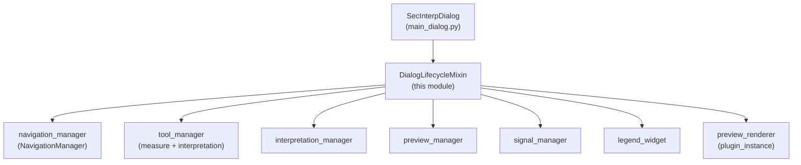

---
tags:
  - secinterp
  - code-walkthrough
  - gui
  - mixins
aliases:
  - dialog_lifecycle_mixin.py
  - DialogLifecycleMixin
cssclass: secinterp-note
---

# `gui/dialog_lifecycle_mixin.py`

> [!abstract] One-line summary
> Main-dialog lifecycle mixin: it forwards wheel events to navigation, auto-saves on close, and runs a deterministic 4-phase cleanup (map tools, managers, signals/components, preview renderer).

**Path**: `gui/dialog_lifecycle_mixin.py` (77 lines)
**Main class**: `DialogLifecycleMixin`
**Layer**: GUI (presentation mixin · first in the dialog MRO)
**Tags**: #secinterp #gui #mixins

---

## 🎯 Why does this file exist?

A QGIS dialog that installs map tools, connects dozens of signals, and registers
temporary memory layers cannot rely on the default `closeEvent`: it would leave
armed tools, orphaned previews, and the "temporary scratch layers" warning on
QGIS exit:

| Problem | Solution |
|---------|----------|
| Closing without saving loses the session; always saving on close defeats Cancel | `_save_on_close` flag: `closeEvent` saves only while it is set (`reject_handler` clears it) |
| Each resource (tools, managers, signals, renderer) needs its own cleanup order | `_cleanup_resources` in 4 fixed phases with `contextlib.suppress` per phase |
| Preview layers registered in `QgsProject` leak and trigger the scratch-layer warning on exit | `_cleanup_preview_renderer` removes them via `preview_renderer.cleanup()` |

> [!important] Architectural note
> **Cooperative multiple inheritance**: `wheelEvent` and `closeEvent` call
> `super()`, which is why `DialogLifecycleMixin` is the **first** base of
> `SecInterpDialog` — its `closeEvent`/`wheelEvent` lead the MRO chain.

---

## 🧬 Relationship diagram



> [!tip] How to read
> The mixin owns none of these objects; it locates them via `self`/`hasattr` and
> cleans them. Arrow = "cleans", not "owns".

---

## 📦 Imports — architectural reading

```python
# gui/dialog_lifecycle_mixin.py
from __future__ import annotations
import contextlib
from typing import Any
from sec_interp.logger_config import get_logger

logger = get_logger(__name__)
```

| # | Observation |
|---|-------------|
| ① | **No QGIS imports**: neither `qgis.core` nor `qgis.gui`; events are typed as `Any` and `super()` resolves the Qt class at runtime. The mixin is portable to any `QDialog`. |
| ② | `contextlib.suppress` is the core robustness mechanism: each cleanup phase tolerates failures instead of aborting the rest. |
| ③ | `Any` only for `event` in `wheelEvent`/`closeEvent`: avoids importing `QWheelEvent`/`QCloseEvent` from Qt just for annotations. |
| ④ | One module logger with two levels: `info` when closing starts, `debug` per completed phase. |

---

## 🏗️ Structure inventory

**Classes:** 1 — `DialogLifecycleMixin` (2 event handlers + 5 cleanup methods, all returning nothing).

| Method | Role |
|--------|-----|
| `wheelEvent(event)` | Preview zoom via `navigation_manager`; falls through to `super().wheelEvent(event)` when unconsumed |
| `closeEvent(event)` | Conditional auto-save → `_cleanup_resources()` → guarded `super().closeEvent(event)` |
| `_cleanup_resources()` | Orchestrator: 4 phases in fixed order |
| `_cleanup_map_tools()` | `measure_tool.cleanup_finalized()` + `interpretation_tool.reset()` |
| `_cleanup_managers()` | `interpretation_manager.save_interpretations()` + `preview_manager.cleanup()` |
| `_cleanup_signals_and_components()` | `signal_manager.disconnect_all()` + `legend_widget.cleanup()` |
| `_cleanup_preview_renderer()` | `plugin_instance.preview_renderer.cleanup()` (memory layers) |

---

## 📁 Files in the package

| File | Role towards this mixin |
|---|---|
| `gui/main_dialog.py` | `SecInterpDialog(DialogLifecycleMixin, DialogMessageMixin, DialogFacadeMixin, SecInterpMainWindow)`; defines `_save_on_close = True` |
| `gui/dialog_facade_mixin.py` | `reject_handler` clears `_save_on_close`; `accept_handler` calls `_cleanup_preview_renderer` |
| `gui/dialog_tool_manager.py` | `NavigationManager.handle_wheel_event`, `ToolManager` holding `measure_tool`/`interpretation_tool` |
| `gui/dialog_signal_manager.py` | `disconnect_all()` — counterpart of `connect_all()` |
| `gui/legend_widget.py` | `LegendWidget.cleanup()` unmounts the legend from the canvas |

---

## 📖 Method-by-method walkthrough

### `wheelEvent`

```python
def wheelEvent(self, event: Any) -> None:
    """Handle mouse wheel for zooming in preview via navigation_manager."""
    if self.navigation_manager.handle_wheel_event(event):
        return
    super().wheelEvent(event)
```

Delegation with cooperative fallback: when the navigator consumes the wheel
(preview-canvas zoom) it returns; otherwise the Qt chain continues via `super()`.
As the first base, this `super()` proceeds towards `DialogMessageMixin` (which
does not define it) and finally `SecInterpMainWindow/QDialog`. See
[[dialog_tool_manager]].

### `closeEvent`

```python
def closeEvent(self, event: Any) -> None:
    """Handle dialog close event to clean up all resources."""
    if self._save_on_close:
        self.state_manager.save_settings()
    self._cleanup_resources()
    with contextlib.suppress(AttributeError, RuntimeError, TypeError):
        super().closeEvent(event)
```

Three steps: (1) auto-save only while `_save_on_close` is set — reject clears it,
Accept already saved; (2) full cleanup **always**, even when saving raised;
(3) `super().closeEvent(event)` guarded because during QGIS shutdown the
underlying Qt object may be half-destroyed
(`RuntimeError: wrapped C/C++ object has been deleted`).

### `_cleanup_resources` — orchestrator

```python
def _cleanup_resources(self) -> None:
    """Clean up map tools, managers, signals, and components."""
    logger.info("Closing dialog, cleaning up resources...")
    self._cleanup_map_tools()
    self._cleanup_managers()
    self._cleanup_signals_and_components()
    self._cleanup_preview_renderer()
```

Fixed, significant order: disarm tools first (they stop emitting), then persist
managers, then disconnect signals, finally remove layers. The `logger.info`
marks the start of closing in the log for diagnosing hung shutdowns.

### `_cleanup_map_tools`

```python
def _cleanup_map_tools(self) -> None:
    if hasattr(self, "tool_manager") and self.tool_manager:
        with contextlib.suppress(Exception):
            if self.tool_manager.measure_tool:
                self.tool_manager.measure_tool.cleanup_finalized()
            if self.tool_manager.interpretation_tool:
                self.tool_manager.interpretation_tool.reset()
    logger.debug("Map tools cleaned up")
```

Double guard (`hasattr` + truthiness) because closing may happen on a
half-built dialog. `cleanup_finalized` removes the measure rubber band and
`reset` disarms digitizing; both share one `suppress(Exception)` since they are
cosmetic relative to closing. See [[measure_tool]] and [[interpretation_tool]].

### `_cleanup_managers`

```python
def _cleanup_managers(self) -> None:
    with contextlib.suppress(Exception):
        self.interpretation_manager.save_interpretations()
        self.preview_manager.cleanup()
    logger.debug("Managers cleaned up")
```

Last-chance interpretation persistence (covers edits that bypassed Accept) plus
`preview_manager.cleanup()`, which stops tasks and frees the cache. A save
failure here is suppressed: closing must never block on I/O.

### `_cleanup_signals_and_components`

```python
def _cleanup_signals_and_components(self) -> None:
    if hasattr(self, "signal_manager"):
        self.signal_manager.disconnect_all()
    logger.debug("Signals disconnected")
    if hasattr(self, "legend_widget") and self.legend_widget:
        with contextlib.suppress(Exception):
            self.legend_widget.cleanup()
```

Total signal disconnection — the mandatory counterpart of `connect_all()` and a
GUI-guide requirement ("every connected signal must be disconnected"). The legend
is cleaned separately under suppress because its `cleanup()` touches the canvas,
which may not exist in headless tests. See [[dialog_signal_manager]] and
[[legend_widget]].

### `_cleanup_preview_renderer`

```python
def _cleanup_preview_renderer(self) -> None:
    renderer = getattr(self.plugin_instance, "preview_renderer", None)
    if renderer and hasattr(renderer, "cleanup"):
        with contextlib.suppress(Exception):
            renderer.cleanup()
```

The renderer registers memory layers in `QgsProject` for stable rendering;
without this removal they leak and QGIS shows the scratch-layer warning on exit.
Resolved with `getattr(..., None)` because `plugin_instance` may be `None` in
tests. `accept_handler` also calls it before `self.accept()`.

---

## 🔄 Data flow

| Phase | Input | Transformation | Output |
|-------|-------|----------------|--------|
| Wheel | `QWheelEvent` | `navigation_manager.handle_wheel_event` or `super()` | zoom or default Qt behaviour |
| Close | `QCloseEvent` | `_save_on_close` → save; always clean; guarded `super()` | dialog destroyed with no leaks |
| Cleanup 1–2 | tools and managers | disarm + persist + release | no orphaned bands, interpretations safe |
| Cleanup 3–4 | signals, legend, renderer | disconnect + remove layers | no dangling callbacks, no scratch layers |

---

## 🏛️ Design patterns present

| Pattern | Where | Purpose |
|---------|-------|---------|
| **Mixin (cooperative)** | the class + `super()` in events | Compose lifecycle without rigid inheritance |
| **Template Method** | `_cleanup_resources` | Fixed phase order; each phase a hook |
| **Guarded cleanup** | `hasattr`/`getattr` + `suppress` | Robust closing with partial construction or half-destroyed Qt |
| **Flag protocol** | `_save_on_close` | Cancel distinguishes "close" from "close saving" |

---

## 🧾 API summary

| Symbol | Signature | Typical use |
|--------|-----------|-------------|
| `DialogLifecycleMixin` | `class DialogLifecycleMixin:` (no bases) | first base of `SecInterpDialog` |
| `wheelEvent` | `(event: Any) -> None` | invoked by Qt; delegates to navigation |
| `closeEvent` | `(event: Any) -> None` | invoked by Qt; saves + cleans + `super()` |
| `_cleanup_resources` | `() -> None` | 4-phase orchestrator |
| `_cleanup_map_tools` | `() -> None` | disarm measure and interpretation |
| `_cleanup_managers` | `() -> None` | save interpretations + release preview |
| `_cleanup_signals_and_components` | `() -> None` | `disconnect_all` + legend |
| `_cleanup_preview_renderer` | `() -> None` | remove memory layers (also from Accept) |

---

## 🛡️ Error handling

The whole module philosophy is **closing never fails**:

- `suppress(AttributeError, RuntimeError, TypeError)` on `super().closeEvent`: covers destroyed Qt objects and MROs without `closeEvent` (e.g. in mocks).
- `suppress(Exception)` on cosmetic or I/O phases: a broken rubber band or an unwritable JSON never blocks destruction.
- `hasattr` before `tool_manager`, `signal_manager`, `legend_widget`: closing may arrive with an incomplete `__init__` when construction raised.
- `getattr(plugin_instance, "preview_renderer", None)`: headless dialog without plugin.

---

## 🧪 Associated tests

No dedicated file (`test_dialog_lifecycle_mixin.py` does not exist); indirect but
honest coverage:

- `tests/gui/test_multi_session_persistence.py` — `test_signals_restored_after_close_and_reopen`, `test_tool_internal_signals_restored`, `test_idempotent_connection_logic`: close and reopen, exercising `closeEvent` + `disconnect_all` + reconnect.
- `tests/gui/test_signal_restoration.py` — signal restoration after close.
- `tests/gui/test_main_dialog_tools.py` — tool `reset` covered via `ToolManager`.
- `tests/gui/test_dialog_preview_manager.py` — preview-manager `cleanup()` invoked in phase 2.

> [!note] Documented gap
> `_cleanup_preview_renderer` (removing scratch layers, the mixin's original
> motive) has no dedicated test; it would need a real `QgsProject` or a
> `preview_renderer` mock with `cleanup()`.

---

## 👀 Observations and notes

> [!success] Strengths
> - No QGIS imports: the mixin is testable and portable by construction.
> - Reasoned, commented cleanup order (tools → data → signals → layers).
> - Conditional auto-save via flag instead of two different `closeEvent`s.

> [!warning] Points of attention
> - `suppress(Exception)` in `_cleanup_managers` can hide a genuine interpretation-persistence failure at close; only the earlier log remains.
> - When `save_settings` in `closeEvent` raises, cleanup still runs (correct), but the user gets no warning: the dialog is already being destroyed.
> - `_save_on_close` is a dynamic attribute (created in `main_dialog`), invisible in this file to a new reader.

> [!question] Open questions
> - Should a `save_interpretations` failure at close be logged as `warning` (not silently suppressed)?
> - Should `_save_on_close: bool = True` be declared as a mixin class attribute to document the protocol?

---

## 🔗 Related notes

- [[Index]] — vault index
- [[main_dialog]] — MRO order and `_save_on_close = True`
- [[dialog_facade_mixin]] — `reject_handler` (clears the flag) and `accept_handler`
- [[dialog_message_mixin]] — composition sibling (messages, no lifecycle)
- [[dialog_signal_manager]] — `connect_all`/`disconnect_all`
- [[dialog_tool_manager]] — `NavigationManager` and the tools cleaned here
- [[dialog_interpretation_manager]] — `save_interpretations` in phase 2
- [[legend_widget]] — phase-3 `cleanup()`
- [[preview_renderer]] — phase-4 memory-layer `cleanup()`
- [[measure_tool]] / [[interpretation_tool]] — tools disarmed

---

*Note of the SecInterp Code Walkthrough v2 vault — v3.9.1*
