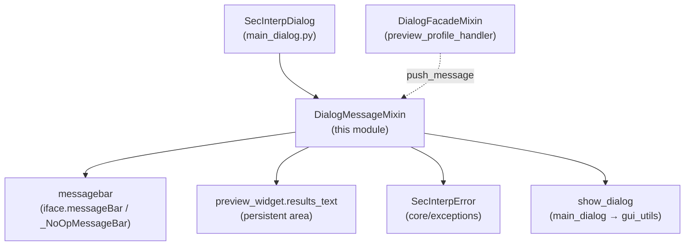

---
tags:
  - secinterp
  - code-walkthrough
  - gui
  - mixins
aliases:
  - dialog_message_mixin.py
  - DialogMessageMixin
cssclass: secinterp-note
---

# `gui/dialog_message_mixin.py`

> [!abstract] One-line summary
> Main-dialog messaging mixin: it publishes notices to the QGIS message bar and the plugin results area, and centralizes error handling by distinguishing `SecInterpError` from unexpected failures.

**Path**: `gui/dialog_message_mixin.py` (78 lines)
**Main class**: `DialogMessageMixin`
**Layer**: GUI (presentation mixin · second base in the dialog MRO)
**Tags**: #secinterp #gui #mixins

---

## 🎯 Why does this file exist?

Every plugin operation (preview, export, validation) must inform the user on two
surfaces: the QGIS message bar (ephemeral) and the plugin's own results area
(persistent). Without a single point, each caller would invent its format and
domain errors would be confused with bugs:

| Problem | Solution |
|---------|----------|
| Notices only on the QGIS bar are lost when `duration` expires | `push_message` also writes to `preview_widget.results_text` (HTML with per-level icon and colour) |
| Every `except` formatted errors its own way | `handle_error` centralizes: `SecInterpError` → warning; everything else → critical + traceback in log |
| Headless tests have no `iface.messageBar()` | `if self.messagebar` guard (the dialog installs `_NoOpMessageBar` without iface) |

> [!important] Architectural note
> **Dual-surface notification**: a single `push_message(title, message, level,
> duration, show_in_plugin)` feeds the global QGIS surface and the plugin-local
> surface. The `Qgis.MessageLevel` level picks the icon and colour on both.

---

## 🧬 Relationship diagram



> [!tip] How to read
> Solid arrow = writes/shows; dashed = the facade calls `push_message`
> (e.g. failed preview at `Warning` level).

---

## 📦 Imports — architectural reading

```python
# gui/dialog_message_mixin.py
from __future__ import annotations
import traceback
from qgis.core import Qgis
from sec_interp.core.exceptions import SecInterpError
from sec_interp.logger_config import get_logger

logger = get_logger(__name__)
```

| # | Observation |
|---|-------------|
| ① | `traceback` only for `traceback.format_exc()` on the unexpected branch: the dialog never shows the traceback, only logs it. |
| ② | `qgis.core.Qgis` provides the `MessageLevel` enum (`Info`, `Warning`, `Critical`, `Success`); the mixin touches no geometries or layers. |
| ③ | `SecInterpError` from `core.exceptions` is the only core import: the mixin tells expected domain errors from bugs apart by type, not by text. |
| ④ | No widget or `preview_widget` imports: both surfaces resolve via `self`, injected by `SecInterpMainWindow`/`main_dialog`. |
| ⑤ | Two log levels with a criterion: `warning` for domain (expected, with `details`), `error` + traceback for unexpected. |

---

## 🏗️ Structure inventory

**Classes:** 1 — `DialogMessageMixin` (2 public methods, no `__init__`, no state).

| Method | Signature | Role |
|--------|-----------|-----|
| `push_message` | `(title, message, level=Info, duration=5, show_in_plugin=True) -> None` | dual surface: QGIS bar + plugin area |
| `handle_error` | `(error: Exception, title="Error") -> None` | central dialog exception router |

**Level → icon/colour map** (plugin surface):

| `Qgis.MessageLevel` | Icon | Colour |
|---|---|---|
| `Success` | ✓ | `#28a745` (green) |
| `Warning` | ⚠ | `#ffc107` (amber) |
| `Critical` | ✗ | `#dc3545` (red) |
| `Info` (default) | ℹ | `#17a2b8` (blue) |

---

## 📁 Files in the package

| File | Role towards this mixin |
|---|---|
| `gui/main_dialog.py` | Installs `messagebar` (real or `_NoOpMessageBar`) and defines `show_dialog(title, message, level)` used by `handle_error` |
| `gui/dialog_facade_mixin.py` | `preview_profile_handler` calls `push_message` on failed preview |
| `gui/utils.py` | `show_user_message` — the real `show_dialog` behind the delegation |
| `core/exceptions.py` | `SecInterpError` hierarchy discriminated in `handle_error` (see [[exceptions]]) |
| `gui/ui/pages/preview_page.py` | `preview_widget.results_text` — persistent surface |

---

## 📖 Method-by-method walkthrough

### `push_message`

```python
def push_message(self, title: str, message: str,
    level: int = Qgis.MessageLevel.Info, duration: int = 5,
    show_in_plugin: bool = True) -> None:
    if self.messagebar:
        self.messagebar.pushMessage(title, message, level=level, duration=duration)
    if show_in_plugin and hasattr(self, "preview_widget"):
        if level == Qgis.MessageLevel.Success:
            icon, color = "✓", "#28a745"
        elif level == Qgis.MessageLevel.Warning:
            icon, color = "⚠", "#ffc107"
        elif level == Qgis.MessageLevel.Critical:
            icon, color = "✗", "#dc3545"
        else:
            icon, color = "ℹ", "#17a2b8"
        formatted_msg = (
            f'<span style="color: {color}; font-weight: bold;">{icon} {title}:</span> {message}'
        )
        self.preview_widget.results_text.append(formatted_msg)
```

Dual write with two guards: `if self.messagebar` (always truthy in practice —
`_NoOpMessageBar` is a safe no-op) and `hasattr(self, "preview_widget")` for
mixins tested without the widget. `duration` only affects the QGIS bar; the
plugin area is cumulative (`append`). `show_in_plugin=False` allows ephemeral
notices that do not pollute results. Note `level: int`: the `Qgis.MessageLevel`
enum is annotated as int because it is a Qt `IntEnum`.

### `handle_error`

```python
def handle_error(self, error: Exception, title: str = "Error") -> None:
    if isinstance(error, SecInterpError):
        msg = str(error)
        logger.warning(f"{title}: {msg} - Details: {getattr(error, 'details', 'N/A')}")
        self.show_dialog(title, msg, level="warning")
    else:
        msg = self.tr("An unexpected error occurred: {}").format(error)
        details = traceback.format_exc()
        logger.error(f"{title}: {msg}\n{details}")
        self.show_dialog(title,
            self.tr("{}\n\nPlease check the logs for details.").format(msg),
            level="critical")
```

Two branches with opposite philosophies. **Domain** (`SecInterpError`): message
verbatim (already readable, often localized at origin), `warning` log with
`details`, and a `warning` dialog — an expected failure (validation, geometry,
data). **Unexpected**: generic message via `self.tr()` (the module's only two
translated strings), full traceback in the `error` log only, and a `critical`
dialog pointing at the logs without exposing the trace. `getattr(error,
'details', 'N/A')` tolerates subclasses built without `details`.

---

## 🔄 Data flow

| Phase | Input | Transformation | Output |
|-------|-------|----------------|--------|
| Notice | `title`, `message`, `level` | `messagebar.pushMessage` + icon/colour HTML | ephemeral bar + persistent results line |
| Domain error | `SecInterpError` | `warning` with details + `show_dialog(level="warning")` | user informed, no trace |
| Unexpected error | any `Exception` | generic `self.tr()` + `traceback` in `error` + `show_dialog(level="critical")` | user sent to logs, bug recorded |

---

## 🏛️ Design patterns present

| Pattern | Where | Purpose |
|---------|-------|---------|
| **Mixin** | the class | Messaging capability composed into the dialog |
| **Dual-surface notification** | `push_message` | Ephemeral global + persistent local in one call |
| **Centralized error handling** | `handle_error` | Single point classifying by exception type |
| **Null Object** | `_NoOpMessageBar` (in `main_dialog`) | Tests without iface need no special branches here |

---

## 🧾 API summary

| Symbol | Signature | Typical use |
|--------|-----------|-------------|
| `DialogMessageMixin` | `class DialogMessageMixin:` (no bases) | second base of `SecInterpDialog` |
| `push_message` | `(title, message, level=Info, duration=5, show_in_plugin=True) -> None` | failed preview, cleared cache, missing help |
| `handle_error` | `(error, title="Error") -> None` | `except Exception as e: self.handle_error(e, ...)` |
| Icons/colours | `✓/#28a745`, `⚠/#ffc107`, `✗/#dc3545`, `ℹ/#17a2b8` | results visual consistency |

---

## 🛡️ Error handling

The module **is** the dialog's error handler; its own robustness:

- Never raises: both branches end in `show_dialog`; `push_message` does not validate levels (an unknown level falls into the `Info` branch).
- `hasattr(self, "preview_widget")`: the mixin survives in tests mounting it without the preview widget.
- `getattr(error, 'details', 'N/A')`: tolerates domain exceptions built without `details`.
- The traceback never reaches the UI: `traceback.format_exc()` only feeds `logger.error`.

---

## 🧪 Associated tests

- `tests/gui/test_message_manager.py` — `TestMessageMethods`:
  - `test_push_message` — dual write to mock bar + `results_text`.
  - `test_push_message_no_bar` — no bar, no crash (Null Object).
  - `test_show_dialog` — delegation to `show_user_message` (mock).
  - `test_handle_error_sec_interp_error` — domain branch (`warning`, no traceback).
  - `test_handle_error_unexpected` — unexpected branch (`critical` + traceback in log).
- Callers covered in `test_main_dialog_*`: `preview_profile_handler` (via facade) exercises `push_message` with `Warning`.

---

## 🌐 Mixin i18n

Only two strings are translated, both on the unexpected branch (domain errors
arrive already localized from their origin):

| String | Use |
|--------|-----|
| `self.tr("An unexpected error occurred: {}")` | generic prefix with `.format(error)` |
| `self.tr("{}\n\nPlease check the logs for details.")` | log referral with `.format(msg)` |

Titles (`title`) come from the caller already translated (e.g.
`self.tr("Preview Error")` in the facade). Icons and colours are non-textual
universals; the HTML uses inline `<span>` with no external stylesheets.

---

## 📐 Attribute contract with the dialog

The mixin declares no `__init__`; everything it consumes must exist on the host:

| Attribute | Provider | Use |
|----------|-----------|-----|
| `self.messagebar` | `main_dialog.__init__` (`iface.messageBar()` or `_NoOpMessageBar`) | QGIS surface in `push_message` |
| `self.preview_widget` | `SecInterpMainWindow` | `results_text` in `push_message` |
| `self.show_dialog` | `main_dialog.show_dialog` → `gui_utils.show_user_message` | modal dialogs in `handle_error` |
| `self.tr` | `QObject` (via `QDialog`) | only two translated strings |

> [!tip] Relevant MRO order
> `SecInterpDialog(DialogLifecycleMixin, DialogMessageMixin, DialogFacadeMixin,
> SecInterpMainWindow)`: this mixin never intercepts `closeEvent`/`wheelEvent`
> (it does not define them), and the facade can safely call `self.push_message`
> because the MRO resolves it here.

---

## 👀 Observations and notes

> [!success] Strengths
> - Type-based classification (`isinstance`), not text: robust to message changes.
> - Traceback never touches the UI but always the log: support/user balance.
> - Null Object on the bar removes `iface is None` branches from every caller.

> [!warning] Points of attention
> - `level: int` accepts any integer; a value outside the enum silently falls into `Info` in the plugin but may fail in the real `pushMessage`.
> - `results_text.append` accumulates unboundedly: long sessions with many notices fatten the widget.
> - `handle_error` returns nothing and never re-raises: the caller cannot tell whether notification happened.

> [!question] Open questions
> - Should `level` be validated against `Qgis.MessageLevel`, degrading to `Info` with a `logger.warning`?
> - Should the `results_text` buffer be capped (e.g. last 500 lines) for long sessions?

---

## 🔗 Related notes

- [[Index]] — vault index
- [[main_dialog]] — installs `messagebar`/`_NoOpMessageBar` and defines `show_dialog`
- [[dialog_facade_mixin]] — `preview_profile_handler` and `clear_cache_handler` (callers)
- [[dialog_lifecycle_mixin]] — composition sibling (lifecycle)
- [[exceptions]] — `SecInterpError` hierarchy discriminated here
- [[gui_utils_py]] — `show_user_message` behind `show_dialog`
- [[preview_page]] — `results_text`, persistent surface
- [[dialog_preview_manager]] — source of the notified `(success, message)`
- [[dtos]] — validation producing domain errors

---

*Note of the SecInterp Code Walkthrough v2 vault — v3.9.1*
