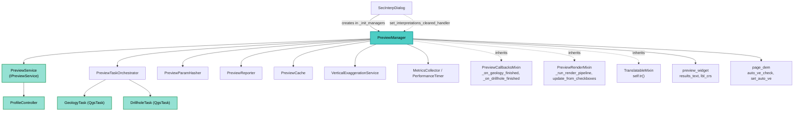

---
tags:
  - secinterp
  - code-walkthrough
  - gui
  - managers
aliases:
  - dialog_preview_manager.py
  - PreviewManager
cssclass: secinterp-note
note_lines: 700
---

# `gui/dialog_preview_manager.py`

> [!abstract] One-line summary
> `PreviewManager` holds the dialog's whole preview concern: it validates inputs, generates the `PreviewResult` via `PreviewService`, keeps a parameter-hash cache, and delegates heavy work to `PreviewTaskOrchestrator` plus the render and callback mixins.

**Path**: `gui/dialog_preview_manager.py` (244 lines)
**Main class**: `PreviewManager(TranslatableMixin, PreviewCallbacksMixin, PreviewRenderMixin)`
**Layer**: GUI · `SecInterpDialog` manager (orchestration, no geological math of its own)
**Tags**: #secinterp #gui #managers

---

## 🎯 Why does this file exist?

`SecInterpDialog` would exceed 300 lines if it generated the preview itself
(documented limit in `gui/AGENTS.md`: beyond that size, extract managers).
This module isolates the full "preview" concern:

| Problem | Solution |
|---------|----------|
| The dialog mixes widgets, tools and data generation | `PreviewManager` owns the generate → cache → render cycle |
| Regenerating everything on any click is slow | Hash cache (`PreviewParamHasher` + `last_result`) |
| Heavy compute would block the UI | Delegation to `PreviewTaskOrchestrator` (background tasks) |
| Render and callbacks clutter the manager | `PreviewRenderMixin` and `PreviewCallbacksMixin` |
| Clearing interpretations on geometry change is forgotten | Geometric-change detection + injected handler |

> [!important] Architectural note
> GUI orchestration manager: it **extracts** (`_get_and_validate_inputs`, `resolve_layer`,
> `transformContext`) and **delegates compute** to `IPreviewService`. It never computes
> geology directly; it honours Extract-then-Compute.

---

## 🧬 Relationship diagram



> [!tip] How to read
> Solid arrow = creates/calls; dashed = inheritance, injected callback, or widget access.

---

## 📦 Imports — architectural reading

```python
# gui/dialog_preview_manager.py
from __future__ import annotations

from collections.abc import Callable                      # ①
from typing import Any                                    # ①

from qgis.core import QgsVectorLayer                      # ②
from qgis.PyQt.QtCore import QTimer                       # ③

from sec_interp.core.domain import PreviewParams, PreviewResult       # ④
from sec_interp.core.exceptions import SecInterpError                 # ⑤
from sec_interp.core.interfaces.preview_interface import IPreviewService  # ⑥
from sec_interp.core.performance_metrics import MetricsCollector, PerformanceTimer  # ⑦
from sec_interp.core.services.preview_service import PreviewService   # ⑥
from sec_interp.core.services.vertical_exaggeration_service import VerticalExaggerationService  # ⑧
from sec_interp.core.utils.i18n import TranslatableMixin              # ⑧
from sec_interp.gui.adapters.layer_resolver import resolve_layer      # ⑨
from sec_interp.gui.preview_callbacks_mixin import PreviewCallbacksMixin   # ⑩
from sec_interp.gui.preview_render_mixin import PreviewRenderMixin         # ⑩
from sec_interp.logger_config import get_logger

from .main_dialog_config import DialogConfig                # ⑩
from .preview_param_hasher import PreviewParamHasher        # ⑪
from .preview_reporter import PreviewReporter               # ⑪
from .preview_state import PreviewCache                     # ⑪
from .preview_task_orchestrator import PreviewTaskOrchestrator  # ⑪
```

| # | Observation |
|---|-------------|
| ① | `Callable` types the interpretations handler; `Any` types the dialog (avoids a circular import with `main_dialog`). |
| ② | Only QGIS type imported (`QgsVectorLayer`), used purely as an annotation in `_update_crs_label`. |
| ③ | Single-shot debounce `QTimer`, created in `__init__` and stopped in `cleanup`. |
| ④ | Domain DTOs: `PreviewParams` (input) and `PreviewResult` (output). The GUI/core boundary. |
| ⑤ | `SecInterpError` for the first tier of the staggered `except` in `generate_preview`. |
| ⑥ | Depends on the `IPreviewService` contract, building `PreviewService(controller)` by default (injection with fallback). |
| ⑦ | Telemetry: cumulative `MetricsCollector` + `PerformanceTimer` as a context manager. |
| ⑧ | Dedicated `VerticalExaggerationService` and `TranslatableMixin` (`self.tr()`). |
| ⑨ | `resolve_layer` turns the layer identifier from `PreviewParams` into a real layer (Extract phase). |
| ⑩ | The mixins provide signals, the render pipeline and task slots; `DialogConfig` toggles performance logging. |
| ⑪ | `PreviewParamHasher` (freshness), `PreviewReporter` (results text), `PreviewCache` (4-domain dict) and `PreviewTaskOrchestrator(self)` (`QgsTask` tasks). |

---

## 🏗️ Structure inventory

**Classes:** `class PreviewManager(TranslatableMixin, PreviewCallbacksMixin, PreviewRenderMixin)` — 15 own methods (plus mixin-inherited ones).

**Own methods (15):** `__init__`, `set_interpretations_cleared_handler`, `cleanup`,
`generate_preview`, `_update_ui_state`, `_process_preview_data`, `_get_transform_context`,
`_update_cache_and_metrics`, `_trigger_async_updates`, `_is_data_unchanged`,
`_handle_geometric_changes`, `_cancel_active_tasks`, `_calculate_params_hash`,
`_handle_invalid_plugin_instance`, `_update_crs_label`.

**Inherited methods used by other managers (via `SignalManager`):**

| Method | Provided by | Connected by |
|--------|-------------|--------------|
| `connect_signals()` / `disconnect_signals()` | `PreviewRenderMixin` | `SignalManager._connect_page_signals` (re-invokes `connect_signals`) |
| `update_from_checkboxes()` | `PreviewRenderMixin` | 9 `preview_widget` signals (checkboxes, spin, LOD) |
| `_run_render_pipeline(result)` | `PreviewRenderMixin` | Called from `_update_ui_state` |
| `_on_geology_finished` / `_on_drillhole_finished` | `PreviewCallbacksMixin` | Wired by the orchestrator to the `QgsTask`s |

---

## 📖 Method-by-method walkthrough

### `__init__` — Manager composition

```python
def __init__(
    self,
    dialog: Any,
    preview_service: IPreviewService | None = None,
    cache: PreviewCache | None = None,
    ve_service: VerticalExaggerationService | None = None,
) -> None:
    self.dialog = dialog
    self.preview_service = preview_service or PreviewService(
        self.dialog.plugin_instance.controller
    )
    self.metrics = MetricsCollector()
    self.ve_service = ve_service or VerticalExaggerationService()

    self.orchestrator = PreviewTaskOrchestrator(self)
    self.hasher = PreviewParamHasher()

    self.cached_data = cache if cache is not None else PreviewCache()
    self.last_params_hash: str | None = None
    self.last_result: PreviewResult | None = None

    self._on_interpretations_cleared: Callable[[], None] | None = None

    self.debounce_timer = QTimer()
    self.debounce_timer.setSingleShot(True)

    self.connect_signals()
```

`dialog: Any` avoids the circular import with `SecInterpDialog`; the three optional
parameters accept test doubles and build the real objects by default. The `PreviewCache`
is created by `main_dialog._init_managers` and shared with the `InterpretationManager`.
`connect_signals()` (inherited from `PreviewRenderMixin`) starts the manager listening
from birth; the single-shot `debounce_timer` is driven from the render mixin.

### `set_interpretations_cleared_handler` — Injected callback

```python
def set_interpretations_cleared_handler(self, handler: Callable[[], None]) -> None:
    self._on_interpretations_cleared = handler
```

`main_dialog._init_managers` registers `interpretation_manager.clear_interpretations`.
The preview can therefore order interpretations cleared **without knowing** the other
manager: decoupling by callback instead of a cross reference.

### `cleanup` — Ordered shutdown

```python
def cleanup(self) -> None:
    self.orchestrator.cancel_active_tasks()
    self.debounce_timer.stop()
    self.disconnect_signals()
```

Three steps in order: cancel in-flight tasks first (thread safety), stop the timer,
then disconnect signals. Called by `DialogLifecycleMixin._cleanup_managers` on dialog
close. It mirrors the connect/disconnect symmetry required by `gui/AGENTS.md`.

### `generate_preview` — Entry point with staggered `except`

```python
def generate_preview(self) -> tuple[bool, str]:
    self.metrics.clear()
    try:
        with PerformanceTimer("Total Preview Generation", self.metrics):
            params = self.dialog.plugin_instance._get_and_validate_inputs()
            if not params:
                return False, self.tr("Invalid configuration")
            result = self._process_preview_data(params)
            self._update_ui_state(params, result)
    except SecInterpError as e:
        self.dialog.handle_error(e, self.dialog.tr("Preview Error"))
        return False, str(e)
    except (AttributeError, TypeError, ValueError) as e:
        ...
    except Exception as e:
        ...
    else:
        return True, self.tr("Preview generated successfully")
```

| Tier | Catches | Handling |
|------|---------|----------|
| 1st | `SecInterpError` | Expected domain error → `handle_error` titled "Preview Error". |
| 2nd | `AttributeError, TypeError, ValueError` | Unexpected UI error → traceback log + "Unexpected Preview Error" title. |
| 3rd | `Exception` | Critical → log + "Critical Error" title. |

A stable `(bool, str)` contract for the caller (`preview_profile_handler` on the
dialog): success/failure plus an already-translated message.

### `_process_preview_data` — Core with cache short-circuit

```python
def _process_preview_data(self, params: PreviewParams) -> PreviewResult:
    if self._is_data_unchanged(params):
        logger.info("Using cached data (params unchanged)")
        return self.last_result

    self._handle_geometric_changes(params)
    transform_context = self._get_transform_context()

    result = self.preview_service.generate_all(params, transform_context)

    self._update_cache_and_metrics(result)
    self._cancel_active_tasks()
    self._trigger_async_updates(params)

    self.last_result = result
    return result
```

Sequence: cache → geometry → synchronous compute (topo and structures) → publish
cache/metrics → cancel old tasks → launch new ones (geology and drillholes are
refined in the background via the orchestrator).

### `_is_data_unchanged` / `_calculate_params_hash`

```python
def _is_data_unchanged(self, params: PreviewParams) -> bool:
    current_hash = self._calculate_params_hash(params)
    unchanged = current_hash == self.last_params_hash
    self.last_params_hash = current_hash
    return unchanged and self.last_result is not None
```

The hash is always updated (even on a miss), so a second identical call hits.
It also requires `last_result is not None` for first use.

### `_handle_geometric_changes` — Interpretations guardian

```python
def _handle_geometric_changes(self, params: PreviewParams) -> None:
    old_geo_params = getattr(self, "_last_geo_params", None)
    line_lyr = resolve_layer(params.line_layer)
    line_feat = next(line_lyr.getFeatures(), None) if line_lyr else None
    line_geom = line_feat.geometry().asWkt() if line_feat else None

    new_geo_params = (params.line_layer, params.raster_layer, line_geom)
    self._last_geo_params = new_geo_params

    if old_geo_params and old_geo_params != new_geo_params:
        logger.info("Geometric change detected: Clearing interpretations.")
        if self._on_interpretations_cleared:
            self._on_interpretations_cleared()
```

It compares the `(line_layer, raster_layer, line_geom_WKT)` tuple: when the section
line changes geometry, drawn interpretations are stale and ordered cleared. The first
call only memorises (`old_geo_params` is `None`).

### `_get_transform_context` — Defensive canvas extraction

Returns `iface.mapCanvas().mapSettings().transformContext()` for service
reprojections, or `None` without a `plugin_instance` (test environment) instead
of raising.

### `_update_cache_and_metrics` — Result publication

```python
def _update_cache_and_metrics(self, result: PreviewResult) -> None:
    self.cached_data.update({
        "topo": result.topo,
        "geol": result.geol,
        "struct": result.struct,
        "drillhole": result.drillhole,
    })
    self.metrics.timings.update(result.metrics.timings)
    self.metrics.counts.update(result.metrics.counts)
```

It dumps the four domains into the shared `PreviewCache` and merges the service
metrics with the local ones (the `PerformanceTimer` in `generate_preview` already
recorded total time). `_trigger_async_updates` / `_cancel_active_tasks` delegate to
the orchestrator passing **services**, never live QGIS layers (the `QgsTask` rule
against QGIS objects on threads). See [[preview_task_orchestrator]].

### `_update_ui_state` — Presentation after compute

It resolves the line layer, updates `lbl_crs`, runs `_run_render_pipeline(result)`
(mixin), applies vertical exaggeration (`auto_ve_check` → `set_auto_ve`) and publishes
`PreviewReporter.format_results_message(...)` into `results_text`; when
`DialogConfig.LOG_DETAILED_METRICS`, it logs the metrics summary.
See [[preview_render_mixin]] for the full pipeline.

### `_update_crs_label` — Fault-tolerant CRS label

```python
def _update_crs_label(self, layer: QgsVectorLayer | None) -> None:
    try:
        if layer and layer.isValid():
            auth_id = layer.crs().authid()
            self.dialog.preview_widget.lbl_crs.setText(self.tr("CRS: {}").format(auth_id))
        else:
            self.dialog.preview_widget.lbl_crs.setText(self.tr("CRS: None"))
    except (AttributeError, TypeError, ValueError):
        self.dialog.preview_widget.lbl_crs.setText(self.tr("CRS: Unknown"))
    except Exception:
        logger.exception("Unexpected error updating CRS label")
```

Three degradation levels (`authid` → `None` → `Unknown`); a cosmetic failure never
breaks the preview. `_handle_invalid_plugin_instance` fails fast with an actionable
`AttributeError` when the manager runs without a plugin.

---

## 🔄 Data flow

| Phase | Input | Transformation | Output |
|-------|-------|----------------|--------|
| Validate | Dialog widgets | `plugin._get_and_validate_inputs()` | `PreviewParams` or `None` |
| Freshness | `PreviewParams` | `hasher.calculate_hash` vs `last_params_hash` | `last_result` (hit) or continue |
| Geometry | Line layer | WKT of the first feature | Optional interpretations cleanup |
| Compute | `params` + `transformContext` | `preview_service.generate_all` | `PreviewResult` |
| Publish | `PreviewResult` | `cached_data.update` + metrics merge | Shared cache up to date |
| Background | `params` + services | `orchestrator.start_*_task` | Geology and drillhole `QgsTask`s |
| Present | `PreviewResult` | Render pipeline + `PreviewReporter` + VE | Canvas, `lbl_crs`, `results_text` |

---

## 🏛️ Design patterns present

| Pattern | Where | Purpose |
|---------|-------|---------|
| **Manager (dialog decomposition)** | Whole class | Extract the "preview" concern from `SecInterpDialog` |
| **Mixin (render + callbacks)** | `PreviewRenderMixin`, `PreviewCallbacksMixin` | Separate drawing pipeline and async slots |
| **Dependency injection with fallback** | `__init__` | Testability without breaking normal construction |
| **Cache-aside by hash** | `_is_data_unchanged` + `PreviewParamHasher` | Skip recompute on identical parameters |
| **Observer (callback)** | `_on_interpretations_cleared` | Notify without coupling managers |
| **Task facade** | `PreviewTaskOrchestrator` | Hide the `QgsTask` lifecycle |
| **Template (timing)** | `PerformanceTimer` as context | Measure without cluttering logic |

---

## 🧾 API summary

| Symbol | Signature | Typical use |
|--------|-----------|-------------|
| `PreviewManager(...)` | `(dialog, preview_service=None, cache=None, ve_service=None)` | Built in `main_dialog._init_managers` |
| `generate_preview()` | `-> tuple[bool, str]` | `btn_preview` slot via `preview_profile_handler` |
| `cleanup()` | `-> None` | Dialog close (`DialogLifecycleMixin`) |
| `set_interpretations_cleared_handler(handler)` | `(Callable[[], None]) -> None` | Registers the `InterpretationManager` clearer |
| `update_from_checkboxes()` | inherited `-> None` | 9 preview-option signals |
| `connect_signals()` / `disconnect_signals()` | inherited | Signal lifecycle |

---

## 🛡️ Error handling

| Situation | Behaviour |
|-----------|-----------|
| `params` is `None` (validation failed) | `(False, "Invalid configuration")`, no exception |
| `SecInterpError` from the service | `handle_error` + `(False, str(e))` |
| UI error (`AttributeError`, `TypeError`, `ValueError`) | Traceback log + "Unexpected Preview Error" title |
| Any other error | Critical log + "Critical Error" title |
| Invalid layer when labelling CRS | Degrades to "CRS: None" / "CRS: Unknown" |
| No `plugin_instance` | `None` as `transform_context` (or `AttributeError` in render) |

---

## 🌐 i18n

All visible messages use `self.tr()` (`TranslatableMixin`) or `self.dialog.tr()`:
"Invalid configuration", "Preview generated successfully", "Preview Error", error
titles and the `"CRS: {}"` template. The results text is composed by
`PreviewReporter` from already-translated messages.

---

## 🧪 Associated tests

Real coverage in `tests/gui/test_dialog_preview_manager.py` (mock-first, no QGIS):

- `test_generate_preview_success` / `..._invalid_params` / `..._cached` / `..._exception` / `..._sec_interp_error` — happy path, validation, cache and `except` tiers.
- `test_update_from_checkboxes_no_data` / `..._with_data` — render-mixin slot.
- `test_on_geology_finished_success` / `test_on_drillhole_finished_success` / `test_on_geology_error` / `test_on_drillhole_error` — async callbacks.
- `test_handle_geometric_changes` and `test_cleanup` — geometry guardian and shutdown.
- `test_resolve_vertical_exaggeration_auto` / `..._manual` / `..._auto_without_result` — VE.
- `test_run_render_pipeline_error` / `test_update_crs_label_error` — graceful degradation.

---

## 👀 Observations and notes

> [!success] Strengths
> - Clean split: the manager orchestrates, the service computes, the mixins present.
> - Hash cache avoids recompute; geometric invalidation protects interpretations.
> - Staggered `except` with translated messages and a stable `(bool, str)` contract.
> - Constructor injection with fallback eases test doubles.

> [!warning] Points of attention
> - `generate_preview` reaches into `dialog.plugin_instance._get_and_validate_inputs()` (a plugin private): fragile coupling if the plugin is refactored.
> - `_last_geo_params` is lazily created via `getattr` instead of `__init__`; object state is harder to see.
> - `_update_ui_state` touches four different widgets/pages; a UI rename breaks here with no typing warning (`dialog: Any`).
> - The `debounce_timer` is created and stopped here, but its wiring lives in the mixin: logic split across two files.

> [!question] Open questions
> - Move `_get_and_validate_inputs` to the `InputManager` to drop the plugin-private access?
> - Initialise `_last_geo_params = None` in `__init__` to make state explicit?
> - Type `dialog` via `TYPE_CHECKING` + `SecInterpDialog` (as `dialog_signal_manager` does) instead of `Any`?

---

## 🔗 Related notes

- [[Index]] — vault index
- [[main_dialog]] — composition root creating the manager and registering the handler
- [[dialog_signal_manager]] — wires `update_from_checkboxes` to the preview options
- [[dialog_lifecycle_mixin]] — calls `cleanup()` on close
- [[preview_service]] — `PreviewService.generate_all`, the delegated compute
- [[preview_task_orchestrator]] — geology and drillhole `QgsTask` tasks
- [[preview_render_mixin]] / [[preview_callbacks_mixin]] — render pipeline and async slots
- [[preview_state]] — `PreviewCache` shared with interpretations
- [[preview_param_hasher]] / [[preview_reporter]] — freshness hash and results text
- [[controller]] — `ProfileController` behind the preview service
- [[dialog_interpretation_manager]] — owns `clear_interpretations`

---

*Note of the SecInterp Code Walkthrough v2 vault — v3.9.0*
