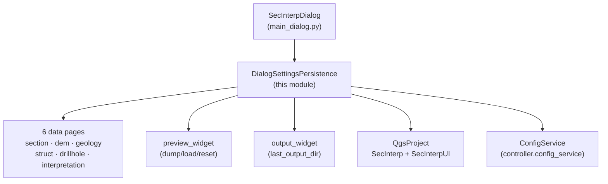

---
tags:
  - secinterp
  - code-walkthrough
  - gui
  - managers
aliases:
  - dialog_settings_persistence.py
  - DialogSettingsPersistence
cssclass: secinterp-note
---

# `gui/dialog_settings_persistence.py`

> [!abstract] One-line summary
> Manager persisting dialog state (pages, preview and output) with a three-level store — QGIS project, global `ConfigService`, and layer resolution by id/name — through the pages' `dump()`/`load()`/`reset()` protocol.

**Path**: `gui/dialog_settings_persistence.py` (198 lines)
**Main class**: `DialogSettingsPersistence`
**Layer**: GUI (presentation manager · no widgets of its own)
**Tags**: #secinterp #gui #managers

---

## 🎯 Why does this file exist?

Every reopening of the dialog should recall layers, parameters and preview options.
The historic code read widgets by attribute name from the dialog, coupling
persistence to each concrete page and breaking on every rename:

| Problem | Solution |
|---------|----------|
| Persistence reached widgets by name (`page.page_geology.cbo...`) and broke on renames | `dump()`/`load()`/`reset()` protocol: each page exposes its state as a `dict`; the manager only moves dicts |
| Settings had to survive the session but also travel with the `.qgz` | Three levels: `QgsProject` (`SecInterp` + legacy `SecInterpUI`) → global `ConfigService` → default value |
| Storing a `QgsVectorLayer` in settings is impossible (not serializable) | Layer keys (`layer_keys`) are stored as id + name and resolved on load |

> [!important] Architectural note
> **Extract-state, not Extract-widgets**: the manager never imports a page or a
> widget; it only requires the `dump/load/reset` protocol plus the optional
> `layer_keys` attribute. The same decoupling `PreviewCache` applies to data.

---

## 🧬 Relationship diagram



> [!tip] How to read
> Solid arrow = reads/writes; the manager writes to project **and** config on every
> `_set_setting`, and reads in cascade project → legacy UI → config.

---

## 📦 Imports — architectural reading

```python
# gui/dialog_settings_persistence.py
from __future__ import annotations
import contextlib
import json
from typing import TYPE_CHECKING, Any
from sec_interp.logger_config import get_logger

if TYPE_CHECKING:
    from sec_interp.gui.main_dialog import SecInterpDialog
```

| # | Observation |
|---|-------------|
| ① | **Zero QGIS and zero page imports**: the module only uses `QgsProject` through `self.dialog.project`; it does not even import `QgsSettings`. Maximum manager decoupling. |
| ② | `contextlib` is used exactly once: `contextlib.suppress(Exception)` around `controller.reload_settings()` — the post-save refresh is best-effort. |
| ③ | `json` plays a double role: serializing dicts/lists in `_write_page` and decoding them in `_parse_persisted_value`. |
| ④ | `TYPE_CHECKING` for `SecInterpDialog`: the dialog appears only as a constructor type; at runtime it is an opaque attribute. |
| ⑤ | `get_logger` for a single `logger.warning` (failed config-key read): persistence is silent by design, the warning is the only trace. |

---

## 🏗️ Structure inventory

**Classes:** 1 — `DialogSettingsPersistence` (constructor + 3 public methods + 12 private ones).

**Public methods:**

| Method | Role |
|--------|-----|
| `__init__(dialog)` | Stores `dialog`; resolves `self.config` from `plugin_instance.controller.config_service` when present (otherwise `None`, shortening the cascade) |
| `load_settings()` | Hydrates the 6 pages + output + preview from persisted state |
| `save_settings()` | Dumps the 6 pages + output + preview and refreshes the controller |
| `reset_pages()` / `reset_preview()` | Restore defaults via the `reset()` protocol |

**Private methods by group:**

| Group | Methods |
|-------|---------|
| Page protocol | `_data_pages`, `_write_page`, `_read_page`, `_parse_persisted_value` |
| Layers | `_save_layer_value`, `_resolve_layer_value`, `_find_layer_by_id_or_name`, `_find_layer_by_id`, `_find_layer_by_name` |
| Output | `_load_output_settings`, `_save_output_settings` (`last_output_dir`) |
| Storage | `_get_setting`, `_set_setting`, `_parse_setting_value` |

---

## 📁 Files in the package

| File | Role towards this manager |
|---|---|
| `gui/main_dialog.py` | `StateManager` (not this manager) orchestrates `load/save_settings`; the facade re-exposes `_load/_save_user_settings` |
| `gui/dialog_state_manager.py` | `StateManager.save_settings/load_settings` delegate here (see note) |
| `gui/ui/pages/*.py` | The 6 pages implement `dump/load/reset` + `layer_keys` (`section_page`, `dem_page`, `geology_page`, `structure_page`, `drillhole_page`, `interpretation_page`) |
| `core/config.py` | `ConfigService.get/set` — second cascade level (see [[settings_model]]) |
| `gui/dialog_settings_persistence.py` | This module (current note) |

---

## 📖 Method-by-method walkthrough

### `__init__` / `_data_pages`

```python
def __init__(self, dialog: SecInterpDialog) -> None:
    self.dialog = dialog
    self.config = None
    if hasattr(self.dialog, "plugin_instance") and self.dialog.plugin_instance:
        self.config = self.dialog.plugin_instance.controller.config_service

def _data_pages(self) -> list[Any]:
    return [self.dialog.page_section, self.dialog.page_dem, self.dialog.page_geology,
            self.dialog.page_struct, self.dialog.page_drillhole, self.dialog.page_interpretation]
```

The constructor tolerates plugin-less dialogs (tests): `config = None` shrinks the
read/write cascade to the project. `_data_pages` pins the canonical 6-page order —
`page_settings` is deliberately excluded (its defaults reset via
`_reset_export_defaults`, not `reset()`).

### `load_settings` / `save_settings`

```python
def load_settings(self) -> None:
    for page in self._data_pages():
        page.load(self._read_page(page))
    self._load_output_settings()
    self.dialog.preview_widget.load(self._read_page(self.dialog.preview_widget))

def save_settings(self) -> None:
    if not self.config:
        return
    for page in self._data_pages():
        self._write_page(page, page.dump())
    self._save_output_settings()
    self._write_page(self.dialog.preview_widget, self.dialog.preview_widget.dump())
    if self.config and hasattr(self.dialog, "plugin_instance"):
        with contextlib.suppress(Exception):
            self.dialog.plugin_instance.controller.reload_settings()
```

Deliberate asymmetry: **loading needs no config** (the project suffices),
**saving does** (`if not self.config: return`). Without a plugin there is no
global place to persist, so saving is a no-op. After saving,
`reload_settings()` refreshes the controller cache; wrapped in
`suppress(Exception)`, a half-built controller never breaks the save.

### `reset_pages` / `reset_preview`

```python
def reset_pages(self) -> None:
    for page in self._data_pages():
        page.reset()
    self.dialog.output_widget.setFilePath("")
    if hasattr(self.dialog, "page_settings"):
        self.dialog.page_settings._reset_export_defaults()

def reset_preview(self) -> None:
    self.dialog.preview_widget.reset()
```

Protocol-driven reset, plus two special cases: the output path is emptied and the
settings page restores its export defaults (protected method, `hasattr`-guarded
because not every dialog variant mounts it). Invoked by the
[[dialog_facade_mixin]] `reset_defaults_handler` via `state_manager`.

### `_write_page` / `_read_page` / `_parse_persisted_value`

```python
def _write_page(self, page: Any, data: dict[str, Any]) -> None:
    layer_keys = getattr(page, "layer_keys", frozenset())
    for key, value in data.items():
        if key in layer_keys:
            self._save_layer_value(key, value)
        elif isinstance(value, dict | list):
            self._set_setting(key, json.dumps(value))
        else:
            self._set_setting(key, value)

def _read_page(self, page: Any) -> dict[str, Any]:
    layer_keys = getattr(page, "layer_keys", frozenset())
    data = {}
    for key in page.dump():
        if key in layer_keys:
            data[key] = self._resolve_layer_value(key)
        else:
            data[key] = self._parse_persisted_value(key)
    return data
```

Core of the protocol: **the keys are defined by `page.dump()`**, not the manager —
`_read_page` iterates `page.dump()` to learn which keys to request, so adding a
field to a page never touches this file. Dicts/lists travel as JSON; layers as
id+name. `_parse_persisted_value` JSON-decodes only when the text starts with `[`
or `{`, falling back to the raw string when `json.loads` fails.

### `_save_layer_value` / `_resolve_layer_value` / `_find_layer_by_*`

```python
def _save_layer_value(self, key: str, layer: Any) -> None:
    if layer:
        self._set_setting(key, layer.id())
        self._set_setting(f"{key}_name", layer.name())
    else:
        self._set_setting(key, "")
        self._set_setting(f"{key}_name", "")

def _resolve_layer_value(self, key: str) -> Any:
    layer_id = self._get_setting(key)
    layer_name = self._get_setting(f"{key}_name")
    return self._find_layer_by_id_or_name(layer_id, layer_name)
```

Dual id + name anchor: the id is stable within the session/project, the name
rescues the layer when the id changed (reloaded project). Resolution tries the id
(`project.mapLayer`) then the name (a `mapLayers()` sweep); when both fail it
returns `None` and the page receives `None` for that key. See [[layer_resolver]].

### `_load_output_settings` / `_save_output_settings`

```python
def _load_output_settings(self) -> None:
    last_dir = self._get_setting("last_output_dir")
    if last_dir:
        self.dialog.output_widget.setFilePath(str(last_dir))

def _save_output_settings(self) -> None:
    self._set_setting("last_output_dir", self.dialog.output_widget.filePath())
```

The last export directory is remembered across sessions. It is the only key outside
the page protocol, because `output_widget` is not a page.

### `_get_setting` / `_set_setting` / `_parse_setting_value`

```python
def _get_setting(self, key: str, default: Any = None) -> Any:
    val, ok = self.dialog.project.readEntry("SecInterp", key, "")
    if not ok or val in (None, "", "None", "NULL"):
        val, ok = self.dialog.project.readEntry("SecInterpUI", key, "")
    if ok and val not in (None, "", "None", "NULL"):
        parsed = self._parse_setting_value(val)
        if parsed is not None:
            return parsed
    if self.config:
        try:
            val = self.config.get(key, default)
            ...

def _set_setting(self, key: str, value: Any) -> None:
    if value is None:
        value = ""
    self.dialog.project.writeEntry("SecInterp", key, str(value))
    if self.config:
        self.config.set(key, value)
```

3-level read cascade: `SecInterp` (current format) → `SecInterpUI` (legacy from
older versions, transparent migration) → global `ConfigService`. The `""`,
`"None"`, `"NULL"` sentinels count as absent. `_parse_setting_value` converts
`"true"/"false"` to bool and tries int/float before returning the string. Writes
are dual: project **and** config, with `None → ""` so no literal `"None"` is stored.

---

## 🔄 Data flow

| Phase | Input | Transformation | Output |
|-------|-------|----------------|--------|
| Save | `page.dump()` per page | layers → id+name; dicts/lists → JSON; rest → string | `writeEntry("SecInterp")` + `config.set` |
| Load | keys from `page.dump()` | project → `SecInterpUI` → config cascade; layers by id/name | `dict` → `page.load(...)` |
| Reset | — | `page.reset()` + empty output + export defaults | UI at initial values |
| Post-save | written settings | `controller.reload_settings()` (best-effort) | controller synchronized |

---

## 🏛️ Design patterns present

| Pattern | Where | Purpose |
|---------|-------|---------|
| **Manager** | the class | Single owner of settings persistence |
| **Protocol (duck typing)** | `dump/load/reset` + `layer_keys` | Decouple the manager from concrete pages |
| **Fallback chain** | `_get_setting` | `SecInterp` → `SecInterpUI` → config → default |
| **Best-effort** | `suppress(Exception)` on `reload_settings` | Refresh never breaks the save |
| **Surrogate key** | layer id + name | Persist non-serializable references |

---

## 🧾 API summary

| Symbol | Signature | Typical use |
|--------|-----------|-------------|
| `DialogSettingsPersistence` | `class DialogSettingsPersistence:` | instantiated by `StateManager`/dialog |
| `load_settings` | `() -> None` | startup and reopen |
| `save_settings` | `() -> None` | no-op without `config`; preview OK, Accept, close |
| `reset_pages` / `reset_preview` | `() -> None` | Reset Defaults button |
| `_write_page` / `_read_page` | `(page, data) -> None` / `(page) -> dict` | protocol core |
| `_get_setting` / `_set_setting` | `(key, default) -> Any` / `(key, value) -> None` | three levels / dual write |
| `_parse_setting_value` | `(val) -> Any` | bool → int/float → string |
| `_resolve_layer_value` | `(key) -> Any` | id → name → `None` |

---

## 🛡️ Error handling

- **No config**: `save_settings` returns silently; `load_settings` keeps working from the project. Designed for tests and orphan dialogs.
- **Corrupt JSON**: `_parse_persisted_value` catches `JSONDecodeError`/`TypeError` and returns the raw string; the page decides.
- **Raising config**: `_get_setting` wraps `config.get` in `try/except` with `logger.warning`; one poisoned key never aborts the load.
- **Missing layers**: unknown id and name → `None`; the page shows "no layer" instead of breaking.
- **Guarded `reload_settings`**: `suppress(Exception)` because the controller may be half-built during startup.

---

## 🧪 Associated tests

- `tests/gui/test_dialog_settings_persistence.py` — `TestDialogSettingsPersistence`:
  - `test_load_settings` / `test_save_settings` — full cycle with stub pages.
  - `test_get_set_setting_fallbacks` — project → config cascade.
  - `test_resolve_layer_value` — id/name resolution.
  - `test_reset_pages` — protocol reset.
  - `test_parse_setting_value` — bool/int/float coercions.
- `tests/gui/test_main_dialog_settings.py` — `TestMainDialogSettings`:
  - `test_parse_setting_value`, `test_save_and_load_layer_with_name`, `test_load_settings_fallback_to_global_with_parsing`.
- `tests/gui/test_multi_session_persistence.py` — cross-session persistence (close and reopen).

---

## 🧩 `dump()`/`load()`/`reset()` protocol — page contract

Every persistable page must honour:

| Member | Contract |
|---------|----------|
| `dump() -> dict[str, Any]` | **Defines the keys**: anything missing here is neither persisted nor read |
| `load(data: dict) -> None` | Applies values; must tolerate missing keys or `None` (unresolved layers) |
| `reset() -> None` | Restores the page defaults |
| `layer_keys: frozenset` (optional) | Keys whose values are layers, travelling as id+name |

> [!tip] Adding a persistable field
> Just include it in `dump()` and read it in `load()`; `_read_page` will request
> it and `_write_page` will store it on their own. This file does not change.

---

## 🌐 i18n and persisted types

The manager translates nothing (it persists values, not labels), but its type
decisions affect the translated UI:

| Detail | Effect |
|--------|--------|
| `str(value)` when writing to the project | Floats always use a decimal point; on read, `_parse_setting_value` recovers them as float |
| `"true"/"false"` → bool | Checkboxes persist their real state, not Python `"True"`/`"False"` |
| Layers by id+name | The visible name in the combo survives id changes |
| `last_output_dir` as string | The file dialog reopens where the user left it |

---

## 👀 Observations and notes

> [!success] Strengths
> - Zero dependencies on concrete pages: adding fields never touches this file.
> - Transparent `SecInterpUI` → `SecInterp` migration with no versioning scripts.
> - Dual id+name anchor for layers, robust to project reloads.

> [!warning] Points of attention
> - No-op `save_settings` without config may surprise: production always has a plugin, but a future headless caller would silently lose settings.
> - `_parse_setting_value` turns `"3.0"` into float and `"3"` into int, but `"03"` into int `3` too: zero-padded strings do not survive as strings.
> - Writing everything as `str()` into the project loses the original type; reading re-infers it (heuristic, not schema).

> [!question] Open questions
> - Should config-less `save_settings` at least write to the project instead of being a full no-op?
> - Should keys be typed with a schema (`TypedDict` per page) instead of re-inferring types on read?

---

## 🔗 Related notes

- [[Index]] — vault index
- [[main_dialog]] — `StateManager` and the save/load cycle
- [[dialog_state_manager]] — delegates `save/load_settings` here
- [[dialog_facade_mixin]] — `_load/_save_user_settings` and `reset_defaults_handler`
- [[settings_model]] — `ConfigService` (second cascade level)
- [[section_page]] / [[dem_page]] / [[geology_page]] — pages with `dump/load/reset` protocol
- [[structure_page]] / [[drillhole_page]] / [[interpretation_page]] — remaining persisted pages
- [[preview_page]] — `preview_widget.dump/load/reset`
- [[layer_resolver]] — layer resolution by id/name
- [[dtos]] — DTOs versus settings dicts

---

*Note of the SecInterp Code Walkthrough v2 vault — v3.8.0*
