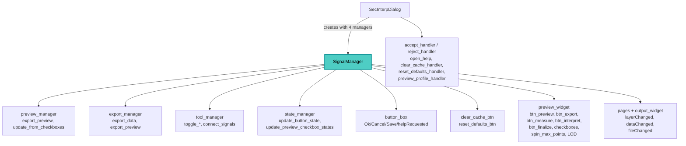

---
tags:
  - secinterp
  - code-walkthrough
  - gui
  - managers
aliases:
  - dialog_signal_manager.py
  - SignalManager
cssclass: secinterp-note
---

# `gui/dialog_signal_manager.py`

> [!abstract] One-line summary
> `SignalManager` is the dialog's signal hub: it wires four groups (buttons, preview, pages, tools) with disconnect-first idempotence, and mirrors every connection with surgical disconnection under `contextlib.suppress` for leak-free shutdown.

**Path**: `gui/dialog_signal_manager.py` (354 lines)
**Main class**: `SignalManager`
**Layer**: GUI · `SecInterpDialog` signal hub (event-bus style toward managers)
**Tags**: #secinterp #gui #managers

---

## 🎯 Why does this file exist?

A dialog with ~30 connections scattered through `__init__` is fragile: reconnects
duplicate slots and partial teardowns leak Qt objects. This hub fixes that:

| Problem | Solution |
|---------|----------|
| Scattered connections impossible to audit | Four `_connect_*` groups, each with a `_disconnect_*` mirror |
| Calling `connect_all` twice duplicates slots | Idempotence: every `connect` starts with `disconnect` |
| Qt raises when unwiring the never-connected | `contextlib.suppress` on each individual disconnection |
| The analyser reports leaked signals | Explicit per-widget unwiring + sequential page sweep |
| The dialog should not know every slot | Wires widgets directly against injected managers (event-bus) |

> [!important] Architectural note
> Event-bus-style hub: dialog widgets connect **directly** to methods of the injected
> managers (`preview_manager`, `export_manager`, `tool_manager`, `state_manager`);
> the dialog only contributes widgets and orchestration handlers (`accept_handler`,
> `preview_profile_handler`, …). See [[main_dialog]].

---

## 🧬 Relationship diagram



> [!tip] How to read
> The hub holds no logic: each arrow toward a manager is a signal→slot connection
> documented in the connection map.

---

## 📦 Imports — architectural reading

```python
# gui/dialog_signal_manager.py
from __future__ import annotations

import contextlib                          # ①
from typing import TYPE_CHECKING, Any       # ②

from qgis.PyQt.QtWidgets import QDialogButtonBox  # ③

from sec_interp.logger_config import get_logger   # ④

logger = get_logger(__name__)


if TYPE_CHECKING:                                # ②
    from .main_dialog import SecInterpDialog
```

| # | Observation |
|---|-------------|
| ① | `contextlib.suppress` is the module's core: ~30 unwirings use it. |
| ② | `SecInterpDialog` only under `TYPE_CHECKING` (annotation with no cycle); `Any` for the four managers (duck typing). |
| ③ | Only Qt import: `QDialogButtonBox` to resolve the standard Ok/Cancel/Save buttons. |
| ④ | Logger for the two `disconnect_all` `debug` calls (sweep start/end). |

> [!note] No `core/`, no pages
> The hub imports no services or pages: it works over dialog attributes
> (`dialog.button_box`, `dialog.preview_widget`, `dialog.page_dem`, …).

---

## 🏗️ Structure inventory

**Classes:** `class SignalManager` — 18 methods in 4 groups + 2 public ones.

| Group | Connect | Disconnect (mirror) |
|-------|---------|---------------------|
| Buttons | `_connect_button_signals` | `_disconnect_button_signals` → `_disconnect_dialog_buttons` + `_disconnect_custom_buttons` |
| Preview | `_connect_preview_signals` | `_disconnect_preview_signals` → `_disconnect_preview_action_buttons` + `_disconnect_preview_options` → `_disconnect_preview_checkboxes` + `_disconnect_preview_misc_options` |
| Pages | `_connect_page_signals` | `_disconnect_page_signals` → `_disconnect_explicit_page_signals` + `_disconnect_sequential_pages` → `_disconnect_known_page_signals` → `_disconnect_layer_combo_signals` + `_disconnect_data_changed_signals` |
| Tools | `_connect_tool_signals` | `_disconnect_tool_signals` |

**Public:** `__init__(dialog, preview_manager, export_manager, tool_manager, state_manager)`,
`connect_all()`, `disconnect_all()`.

---

## 🗺️ Connection map (the hub contract)

### Button group — `_connect_button_signals`

| Signal | Slot | Slot owner |
|--------|------|------------|
| Ok `clicked` | `dialog.accept_handler` | dialog (orchestration) |
| Cancel `clicked` | `dialog.reject_handler` | dialog |
| Save `clicked` | `export_manager.export_data` | manager |
| `helpRequested` | `dialog.open_help` | dialog |
| `clear_cache_btn.clicked` | `dialog.clear_cache_handler` | dialog |
| `reset_defaults_btn.clicked` | `dialog.reset_defaults_handler` | dialog |

Standard buttons resolve via `button_box.button(StandardButton.Ok/Cancel/Save)`
with an existence check (`if ok_btn:`): when the `.ui` defines no Save button,
nothing is wired.

### Preview group — `_connect_preview_signals`

| Signal | Slot |
|--------|------|
| `btn_preview.clicked` | `dialog.preview_profile_handler` |
| `btn_export.clicked` | `export_manager.export_preview` |
| `chk_topo/chk_geol/chk_struct/chk_drillholes/chk_interpretations/stateChanged` | `preview_manager.update_from_checkboxes` (×5) |
| `chk_legend.stateChanged` | `preview_manager.update_from_checkboxes` |
| `spin_max_points.valueChanged` | `preview_manager.update_from_checkboxes` |
| `chk_auto_lod.toggled` | `preview_manager.update_from_checkboxes` |
| `chk_adaptive_sampling.toggled` | `preview_manager.update_from_checkboxes` |

Nine signals converge on `update_from_checkboxes`: any option repaints from cache.
Detail in [[preview_render_mixin]].

### Page group — `_connect_page_signals`

| Signal | Slot |
|--------|------|
| `output_widget.fileChanged` | `state_manager.update_button_state` |
| `page_dem.raster_combo.layerChanged` | `update_button_state` **and** `update_preview_checkbox_states` |
| `page_section.line_combo.layerChanged` | `update_button_state` **and** `update_preview_checkbox_states` |
| `page_geology.dataChanged` | `update_preview_checkbox_states` |
| `page_struct.dataChanged` | `update_preview_checkbox_states` |
| `page_drillhole.dataChanged` | `update_preview_checkbox_states` |

It also re-invokes `page.connect_signals()` on all 9 pages/components (dem, section,
geology, struct, drillhole, interpretation, preview_widget, preview_manager,
settings) under `suppress(Exception)`: restoring internal wiring the sweep may have
dropped.

### Tool group — `_connect_tool_signals`

| Signal | Slot |
|--------|------|
| `btn_measure.toggled` | `tool_manager.toggle_measure_tool` |
| `btn_interpret.toggled` | `tool_manager.toggle_interpretation_tool` |
| `btn_finalize.clicked` | `tool_manager.measure_tool.finalize_measurement` |

Plus restoring internal signals via `tool_manager.connect_signals()` (idempotent:
disconnects first). Keep the `IMPORTANT` comment in code.

---

## 📖 Method-by-method walkthrough

### `__init__` — Five references, zero logic

```python
def __init__(
    self,
    dialog: SecInterpDialog,
    preview_manager: Any,
    export_manager: Any,
    tool_manager: Any,
    state_manager: Any,
) -> None:
    self.dialog = dialog
    self.preview_manager = preview_manager
    self.export_manager = export_manager
    self.tool_manager = tool_manager
    self.state_manager = state_manager
```

The dialog uses the real type (thanks to `TYPE_CHECKING`); managers use `Any` to
avoid coupling to their classes. Created in `SecInterpDialog.__init__` after
`tool_manager.initialize_tools()`.

### `connect_all` / `disconnect_all` — Idempotence and sweep

```python
def connect_all(self) -> None:
    """Connect all signals in organized groups.

    This method is idempotent: it disconnects first to avoid double connections.
    """
    self.disconnect_all()

    self._connect_button_signals()
    self._connect_preview_signals()
    self._connect_page_signals()
    self._connect_tool_signals()

def disconnect_all(self) -> None:
    logger.debug("Starting exhaustive signal disconnection")
    self._disconnect_button_signals()
    self._disconnect_preview_signals()
    self._disconnect_page_signals()
    self._disconnect_tool_signals()
    logger.debug("Signal disconnection complete")
```

`connect_all` is idempotent by construction. `disconnect_all` is called by
`DialogLifecycleMixin` on close; the two `debug` calls delimit the sweep in the log.

### Button unwiring — `_disconnect_dialog_buttons` + `_disconnect_custom_buttons`

```python
def _disconnect_dialog_buttons(self) -> None:
    ok_btn = self.dialog.button_box.button(QDialogButtonBox.StandardButton.Ok)
    if ok_btn:
        with contextlib.suppress(TypeError, RuntimeError):
            ok_btn.clicked.disconnect()
    ...
    with contextlib.suppress(TypeError, RuntimeError):
        self.dialog.button_box.helpRequested.disconnect()
```

Each button resolves and is checked before unwiring; `helpRequested` (a `button_box`
signal, not a button's) unwires directly. Custom buttons (`clear_cache_btn`,
`reset_defaults_btn`) are guarded with `hasattr` because `main_dialog` creates them
in `__init__`, not the `.ui` file.

### Preview unwiring — Three levels

`_disconnect_preview_action_buttons` (5 buttons with generic `suppress(Exception)`),
`_disconnect_preview_checkboxes` (5 layer checkboxes) and
`_disconnect_preview_misc_options` (legend, spin, LOD, adaptive sampling).
They mirror the connection map 1:1: adding an option to `_connect` means adding it
here (manual symmetry, see risks).

### Page unwiring — Explicit + sequential

```python
def _disconnect_explicit_page_signals(self) -> None:
    with contextlib.suppress(Exception):
        self.dialog.page_dem.raster_combo.layerChanged.disconnect()
    ...
```

First the 6 signals the analyser flagged as leaking (DEM/section combos,
geology/struct/drillhole `dataChanged`, output `fileChanged`). Then the sequential
sweep: for each of the 9 pages, (1) call its `disconnect_signals()` when present
and (2) unwire `raster_combo.layerChanged`, `line_combo.layerChanged`,
`dataChanged` and `fileChanged` when present. A double net for legacy pages with no
own method.

### The 9 pages of the sequential sweep

Both `_disconnect_sequential_pages` and `_connect_page_signals` walk the same list:
`page_dem`, `page_section`, `page_geology`, `page_struct`, `page_drillhole`,
`page_interpretation`, `preview_widget`, `preview_manager` and `page_settings`. Each
`None` entry is skipped (`if not page: continue` on disconnect); on connect,
`connect_signals()` runs only when present (`hasattr`). The list is duplicated in
both methods: adding a page means touching both.

### `_disconnect_tool_signals` — Delegation

```python
def _disconnect_tool_signals(self) -> None:
    if self.tool_manager:
        with contextlib.suppress(AttributeError, TypeError, RuntimeError):
            self.tool_manager.disconnect_signals()
```

It delegates to `ToolManager.disconnect_signals` (already per-signal surgical); the
`suppress` here adds `AttributeError` in case the manager is half-built.

---

## 🔄 Data flow

| Phase | Input | Transformation | Output |
|-------|-------|----------------|--------|
| Startup | Dialog + 4 managers | `SignalManager(...)` + `connect_all()` | ~30 live connections |
| Buttons | Click / help | Dialog slots or `export_data` | Accept, save, help, reset |
| Preview | Click or option | `preview_profile_handler` / `export_preview` / `update_from_checkboxes` | Render, image or repaint |
| Pages | Layer/data/path change | `update_button_state` / `update_preview_checkbox_states` | Buttons and checkboxes current |
| Tools | Toggles | `toggle_*` + `finalize_measurement` | Tool installed |
| Close | `closeEvent` | `disconnect_all()` | Zero dangling connections |

---

## 🏛️ Design patterns present

| Pattern | Where | Purpose |
|---------|-------|---------|
| **Event bus / Hub** | Whole class | Centralise signal→slot outside the dialog |
| **Idempotent connect** | `connect_all` → `disconnect_all` first | Avoid duplicated slots |
| **Mirror teardown** | Each `_connect_*` has its `_disconnect_*` | Auditable leak-free shutdown |
| **Bulkhead (per-signal suppress)** | ~30 blocks | One failure never aborts the sweep |
| **Dependency injection** | 4 managers via constructor | Wire against usage abstractions |

---

## 🧾 API summary

| Symbol | Signature | Typical use |
|--------|-----------|-------------|
| `SignalManager(dialog, preview, export, tool, state)` | constructor | Created in `SecInterpDialog.__init__` |
| `connect_all()` | `-> None` | Startup (idempotent) |
| `disconnect_all()` | `-> None` | Shutdown (`DialogLifecycleMixin`) |
| `_connect_*` (4) | private | One connection group each |
| `_disconnect_*` (10) | private | Mirrors + page sweeps |

---

## 🛡️ Error handling

| Situation | Behaviour |
|-----------|-----------|
| Standard button missing from the `.ui` | `if btn:` skips it |
| Custom button missing | `hasattr` skips it |
| Signal not connected or object destroyed | `suppress(TypeError, RuntimeError)` (or `Exception` in preview/pages) |
| Page without `connect/disconnect_signals` | `hasattr` + `suppress` skip it |
| `tool_manager` is `None` | `if self.tool_manager` skips it |

> [!warning] Generic `suppress(Exception)`
> The preview and page groups suppress `Exception` (not just Qt): a genuine
> programming error in those blocks would be silenced. Button and tool groups use the
> precise tuple (`TypeError, RuntimeError`).

---

## 🌐 i18n

The hub defines no visible strings: there is no `tr()` in the module. Every string
flows through the destination slots (dialog and managers), which already translate.

---

## 🧪 Associated tests

There is no dedicated `tests/gui/test_dialog_signal_manager.py`; real coverage lives
in two wiring files (stated honestly so the gap stays visible):

- `tests/gui/test_main_dialog_signals_wiring.py`: `test_preview_signals_wire`, `test_preview_manager_signals_wire`, `test_preview_widget_connect_logic`, `test_page_signals_trigger_status_update`, `test_page_signals_survive_connect_all` (idempotence), `test_close_saves_settings`.
- `tests/gui/test_signal_restoration.py`: `test_page_signals_survive_connect_all`, `test_settings_reset_button_restores_defaults`, `test_reset_button_triggers_state_manager`.

---

## 👀 Observations and notes

> [!success] Strengths
> - Auditable signal→slot map in four groups with a disconnection mirror.
> - Genuine idempotence (`connect_all` disconnects first; verified by tests).
> - Sequential page sweep with a double net (own method + known signals).
> - Wiring against managers, not the dialog: a clean event-bus.

> [!warning] Points of attention
> - High cyclomatic complexity by design (~30 `with suppress` branches): the connection map and its mirror need manual upkeep; a forgotten mirror reintroduces the leak.
> - `suppress(Exception)` in preview/pages can hide programming errors.
> - `_connect_page_signals` re-invokes page `connect_signals`: a non-idempotent page would duplicate its internal slots.
> - Managers typed as `Any`: renaming `update_from_checkboxes` would break at runtime with no static warning.

> [!question] Open questions
> - A declarative `(emitter, signal, slot)` table with a single wire/unwire loop to drop the manual mirror?
> - Narrow `suppress(Exception)` to `(TypeError, RuntimeError)` in preview/pages?
> - A `Protocol` for the 4 managers instead of `Any`?

---

## 🔗 Related notes

- [[Index]] — vault index
- [[main_dialog]] — creates the hub with the four managers
- [[dialog_lifecycle_mixin]] — `disconnect_all()` on close
- [[dialog_preview_manager]] — `update_from_checkboxes`, `preview_profile_handler`
- [[dialog_export_manager]] — `export_data`, `export_preview` as slots
- [[dialog_tool_manager]] — `toggle_*`, `finalize_measurement`, `connect_signals`
- [[dialog_state_manager]] — `update_button_state`, `update_preview_checkbox_states`
- [[preview_render_mixin]] — destination of the 9 option signals
- [[orchestrator]] — general flow orchestration

---

*Note of the SecInterp Code Walkthrough v2 vault — v3.9.1*
