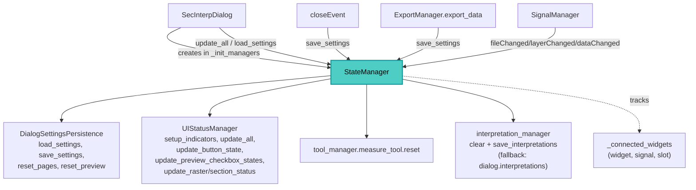

---
tags:
  - secinterp
  - code-walkthrough
  - gui
  - managers
aliases:
  - dialog_state_manager.py
  - StateManager
cssclass: secinterp-note
---

# `gui/dialog_state_manager.py`

> [!abstract] One-line summary
> `StateManager` orchestrates dialog state: it delegates visuals to `UIStatusManager` (indicators, buttons, checkboxes), persistence to `DialogSettingsPersistence` (load/save/reset), and tracks its own wiring via `connect_checked` for leak-free unwiring.

**Path**: `gui/dialog_state_manager.py` (117 lines)
**Main class**: `StateManager`
**Layer**: GUI · `SecInterpDialog` state orchestrator (delegation, no widgets of its own)
**Tags**: #secinterp #gui #managers

---

## 🎯 Why does this file exist?

Dialog "state" mixes two distinct concerns: how it looks (icons, enabled buttons)
and what is remembered across sessions (layers, paths, options).
This orchestrator separates them:

| Problem | Solution |
|---------|----------|
| The dialog should not know icons or `QgsSettings` | Delegation to `UIStatusManager` and `DialogSettingsPersistence` |
| Loading settings leaves indicators stale | `load_settings` ends with `update_all()` |
| Resetting must touch pages, preview and tools | `reset_to_defaults` coordinates all three levels |
| Its own wiring must be cleaned up | `_connected_widgets` + `connect_checked` / `disconnect_signals` |
| Clearing interpretations has two implementations | `_reset_tools` with a compatibility fallback |

> [!important] Architectural note
> A pure-delegation facade: no method computes or draws; everything forwards to the
> two specialists. The dialog sees one API (`state_manager.*`) with two collaborators
> underneath. See [[dialog_settings_persistence]] and [[ui_status_manager]].

---

## 🧬 Relationship diagram



> [!tip] How to read
> Solid arrow = delegates/calls; dashed = internal connection tracking.

---

## 📦 Imports — architectural reading

```python
# gui/dialog_state_manager.py
from __future__ import annotations

import contextlib                     # ①
from typing import TYPE_CHECKING, Any  # ②

from sec_interp.logger_config import get_logger  # ③

from .dialog_settings_persistence import DialogSettingsPersistence  # ④
from .ui_status_manager import UIStatusManager                      # ⑤

if TYPE_CHECKING:                       # ②
    from sec_interp.gui.main_dialog import SecInterpDialog

logger = get_logger(__name__)
```

| # | Observation |
|---|-------------|
| ① | `contextlib.suppress(TypeError, RuntimeError)` in the `disconnect_signals` sweep. |
| ② | `SecInterpDialog` for annotation only under `TYPE_CHECKING`; `Any` for the tracked-widget list. |
| ③ | Three lifecycle logs: unwiring (debug with count), load and reset (info). |
| ④ | Persistence: per-page `QgsSettings` plus layer resolution by id/name. |
| ⑤ | Visual state: required-field indicators, button enabling, checkboxes. |

> [!note] No Qt, no QGIS
> Like `InputManager`, this module imports neither Qt nor QGIS: it only coordinates.
> All visual dependency lives in `UIStatusManager`, all settings in persistence.

---

## 🏗️ Structure inventory

**Classes:** `class StateManager` — 12 methods in 3 groups.

| Group | Methods |
|-------|---------|
| Visual orchestration (forward to `status_manager`) | `setup_indicators`, `update_all`, `update_preview_checkbox_states`, `update_button_state`, `update_raster_status`, `update_section_status` |
| Signal handling (its own) | `disconnect_signals`, `connect_checked` |
| Persistence (forward to `persistence` + post-steps) | `load_settings`, `save_settings`, `reset_to_defaults`, `_reset_tools` |

**State:** `self.dialog`, `self._connected_widgets: list[Any]` (`(widget, signal, slot)`
tuples), `self.persistence`, `self.status_manager`.

---

## 📖 Method-by-method walkthrough

### `__init__` — Two specialists and a tracking list

```python
def __init__(self, dialog: SecInterpDialog) -> None:
    self.dialog = dialog
    self._connected_widgets: list[Any] = []

    # Specialized Managers
    self.persistence = DialogSettingsPersistence(dialog)
    self.status_manager = UIStatusManager(dialog)
```

Both specialists receive the same dialog; `StateManager` is the only access path
from outside. The list starts empty: it only fills via `connect_checked`.

### Visual orchestration — Six thin delegations

```python
def setup_indicators(self) -> None:
    """Set up required field indicators with warning icons."""
    self.status_manager.setup_indicators()

def update_all(self) -> None:
    """Update all UI status components."""
    self.status_manager.update_all()

def update_preview_checkbox_states(self) -> None:
    """Enable or disable preview checkboxes."""
    self.status_manager.update_preview_checkbox_states()

def update_button_state(self) -> None:
    """Enable or disable buttons based on input validity."""
    self.status_manager.update_button_state()

def update_raster_status(self) -> None:
    """Update raster layer status icon."""
    self.status_manager.update_raster_status()

def update_section_status(self) -> None:
    """Update section line status icon."""
    self.status_manager.update_section_status()
```

Each method is one line: the orchestrator adds no logic. `main_dialog` calls them in
`__init__` (`setup_indicators`, `update_all`, `load_settings`) and `SignalManager`
wires `update_button_state` (path/layers) and `update_preview_checkbox_states`
(layers/data) as slots. Visual detail in [[ui_status_manager]].

### `connect_checked` / `disconnect_signals` — Own tracking

```python
def disconnect_signals(self) -> None:
    """Disconnect all UI signals to prevent memory leaks."""
    logger.debug(f"Disconnecting {len(self._connected_widgets)} UI signals")
    for _widget, signal, slot in self._connected_widgets:
        with contextlib.suppress(TypeError, RuntimeError):
            signal.disconnect(slot)
    self._connected_widgets.clear()

def connect_checked(self, widget: Any, signal: Any, slot: Any) -> None:
    """Connect a signal and track it for later disconnection."""
    signal.connect(slot)
    self._connected_widgets.append((widget, signal, slot))
```

Unlike other managers' global `disconnect()`, this unwires the **nominal slot**
(`signal.disconnect(slot)`): only the registered connection is released, leaving
other connections on the same signal untouched. The widget is stored even though
unwiring ignores it (debugging traceability). The log counts before clearing.

### `load_settings` — Restore then refresh

```python
def load_settings(self) -> None:
    """Load user settings from previous session."""
    self.persistence.load_settings()
    # Update all status indicators after bulk restoration
    self.update_all()
    logger.info("Settings loaded and UI updated")
```

Bulk restoration leaves widgets holding values the indicators never saw;
`update_all()` reconciles them. Called by `SecInterpDialog.__init__` after the
initial `update_all()` (a cheap double refresh guaranteeing consistency).

### `save_settings` — Straight persistence

```python
def save_settings(self) -> None:
    """Save user settings for next session."""
    self.persistence.save_settings()
```

No post-steps: pure delegation. Three callers: `closeEvent` (via
`DialogLifecycleMixin`), the Save button indirectly, and `ExportManager.export_data`
(auto-save before data export).

### `reset_to_defaults` — Three-level reset

```python
def reset_to_defaults(self) -> None:
    """Reset all dialog inputs to their default values."""
    self.persistence.reset_pages()
    self.persistence.reset_preview()
    self._reset_tools()

    self.dialog.preview_widget.results_text.append(
        self.dialog.tr("✓ Form reset to default values")
    )
    self.update_all()
    logger.info("Dialog reset to defaults by user")
```

It coordinates (1) configuration pages, (2) preview options and (3) tools plus
interpretations; then reports into `results_text` (via `append`, keeping history)
and reconciles the UI with `update_all()`. Wired to `reset_defaults_btn` via
`SignalManager` → `dialog.reset_defaults_handler`.

### `_reset_tools` — Tools and interpretations with fallback

```python
def _reset_tools(self) -> None:
    """Reset internal tools and interpretations."""
    if hasattr(self.dialog, "tool_manager"):
        self.dialog.tool_manager.measure_tool.reset()

    # Handle interpretations via manager or direct property (backward compat)
    if hasattr(self.dialog, "interpretation_manager") and self.dialog.interpretation_manager:
        self.dialog.interpretation_manager.interpretations = []
        self.dialog.interpretation_manager.save_interpretations()
    elif hasattr(self.dialog, "interpretations"):
        self.dialog.interpretations = []
        if hasattr(self.dialog, "_save_interpretations"):
            self.dialog._save_interpretations()
```

It resets the measure tool and empties interpretations, persisting the emptiness.
The `elif` branch covers legacy dialogs with no `InterpretationManager`
(`backward compat` comment in code): direct property plus save when present.
Defensive `hasattr` calls never break on half-built dialogs.

---

## 🔬 Collaborators under the hood

### `DialogSettingsPersistence` — What persists and how

Public methods verified in `gui/dialog_settings_persistence.py`:

| Method | Role |
|--------|------|
| `load_settings()` / `save_settings()` | Loop over `_data_pages()` + output settings |
| `reset_pages()` / `reset_preview()` | Factory values on pages and preview options |
| `_read_page(page)` / `_write_page(page, data)` | Per-page serialisation via `QgsSettings` |
| `_save_layer_value` / `_resolve_layer_value` | Layers as id + name pair (reorder-robust) |
| `_find_layer_by_id_or_name` (+ `_by_id`, `_by_name`) | Tolerant resolution when reopening the project |
| `_load_output_settings` / `_save_output_settings` | Output path outside the pages |
| `_parse_setting_value` / `_parse_persisted_value` | Type coercion (`bool`, `int`, `float`, `str`) |

Layers persist by id with a name fallback: when the id changes across sessions,
resolution by name is tried before giving up.

### `UIStatusManager` — What it shows

Public methods verified in `gui/ui_status_manager.py`:

| Method | Role |
|--------|------|
| `setup_indicators()` | Warning icons on required fields |
| `update_all()` | Global refresh (calls the next three) |
| `update_preview_checkbox_states()` | Enables checkboxes per configured layers |
| `update_button_state()` | Enables buttons per validity (`can_preview`/`can_export`) |
| `update_raster_status()` / `update_section_status()` | DEM and section-line status icons |

`StateManager` caches nothing visual: every call passes through to the specialist,
so what is shown always mirrors current dialog state.

---

## 🔄 Data flow

| Phase | Input | Transformation | Output |
|-------|-------|----------------|--------|
| Startup | Dialog | `setup_indicators` + `update_all` + `load_settings` | Labelled, refreshed, restored UI |
| Change | Layer/data/path | `update_button_state` / `update_preview_checkbox_states` | Coherent buttons/checkboxes |
| Close | `closeEvent` | `save_settings` | Persisted settings |
| Export | `export_data` | `save_settings` (auto-save) | On-screen matches exported |
| Reset | `reset_defaults_btn` | `reset_pages` + `reset_preview` + `_reset_tools` | Factory values + notice |

---

## 🏛️ Design patterns present

| Pattern | Where | Purpose |
|---------|-------|---------|
| **Facade** | Whole class | One API (`state_manager.*`) over two specialists |
| **Delegation** | 6 visual + 2 persistence methods | Zero logic in the orchestrator |
| **Tracker (connection registry)** | `_connected_widgets` + `connect_checked` | Nominal disconnection without leaks |
| **Template (reset)** | `reset_to_defaults` | Fixed pages → preview → tools sequence |
| **Backward-compat branch** | `_reset_tools` | Support dialogs without `InterpretationManager` |

---

## 🧾 API summary

| Symbol | Signature | Typical use |
|--------|-----------|-------------|
| `StateManager(dialog)` | constructor | Created in `main_dialog._init_managers` |
| `setup_indicators()` / `update_all()` | `-> None` | Dialog startup |
| `update_button_state()` | `-> None` | Path/layer slot (via `SignalManager`) |
| `update_preview_checkbox_states()` | `-> None` | Layer/data slot |
| `update_raster_status()` / `update_section_status()` | `-> None` | DEM and section icons |
| `connect_checked(widget, signal, slot)` | `-> None` | Tracked connection |
| `disconnect_signals()` | `-> None` | Nominal unwiring of the registry |
| `load_settings()` / `save_settings()` | `-> None` | Restore / persist session |
| `reset_to_defaults()` | `-> None` | Reset Defaults button |

---

## 🛡️ Error handling

| Situation | Behaviour |
|-----------|-----------|
| Slot already unwired or object destroyed | `suppress(TypeError, RuntimeError)` per connection |
| `tool_manager` missing in `_reset_tools` | `hasattr` skips it |
| No `interpretation_manager` | Fallback to `dialog.interpretations` (+ `_save_interpretations` when present) |
| Inconsistent bulk restore | `update_all()` reconciles after `load_settings` and `reset_to_defaults` |

---

## 🌐 i18n

A single own string: `"✓ Form reset to default values"` via `self.dialog.tr()`
(note it uses the dialog's `tr`, not an own mixin). All other strings live in
`UIStatusManager` and `DialogSettingsPersistence`.

---

## 🧪 Associated tests

Real coverage in `tests/gui/test_dialog_state_manager.py` (mocked dialog):

- `test_reset_to_defaults_interacts_with_widgets` — pages/preview/tools coordination.
- `test_update_button_state_enabled` / `test_update_button_state_disabled` — button gates.
- `test_parse_setting_value_types` — types when persisting settings.
- `test_reset_button_triggers_state_manager` — Reset button wiring.
- `test_close_saves_settings` — persistence on close.
- `test_page_signals_trigger_status_update` / `test_page_signals_survive_connect_all` — slots alive after reconnect.
- `test_settings_reset_button_restores_defaults` — end-to-end reset.

---

## 👀 Observations and notes

> [!success] Strengths
> - Minimal facade: the dialog never knows two specialists sit underneath.
> - Nominal `disconnect(slot)` instead of global: third-party connections survive.
> - `load_settings` and `reset_to_defaults` reconcile with `update_all()`: no stale indicators.
> - Compatibility fallback in `_reset_tools` documented in code.

> [!warning] Points of attention
> - `connect_checked` stores the widget but never uses it (signature built for debugging, not unwiring).
> - `dialog.preview_widget.results_text.append` in `reset_to_defaults`: a missing widget raises after the reset already ran.
> - Direct `tool_manager.measure_tool` access with no `measure_tool` check: `initialize_tools` must have run.
> - The legacy `_reset_tools` branch duplicates `InterpretationManager` logic: a deprecation candidate.

> [!question] Open questions
> - Move the informational `append` before the reset or guard it with `hasattr`?
> - Drop the legacy branch once all dialogs use `InterpretationManager`?
> - Expose `_connected_widgets` as read-only for leak debugging?

---

## 🔗 Related notes

- [[Index]] — vault index
- [[main_dialog]] — creates the orchestrator; `reset_defaults_handler`
- [[dialog_signal_manager]] — wires `update_button_state` and `update_preview_checkbox_states`
- [[dialog_lifecycle_mixin]] — `save_settings` on close
- [[dialog_export_manager]] — auto-save before exporting
- [[dialog_input_manager]] — `can_preview` / `can_export` behind these gates
- [[dialog_settings_persistence]] — `load/save/reset_pages/reset_preview`
- [[ui_status_manager]] — indicators, buttons and checkboxes
- [[dialog_interpretation_manager]] — interpretations emptied in `_reset_tools`

---

*Note of the SecInterp Code Walkthrough v2 vault — v3.9.1*
