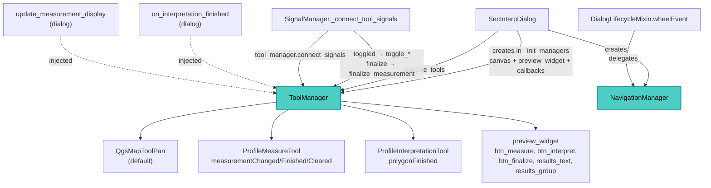

---
tags:
  - secinterp
  - code-walkthrough
  - gui
  - managers
aliases:
  - dialog_tool_manager.py
  - ToolManager
  - NavigationManager
cssclass: secinterp-note
---

# `gui/dialog_tool_manager.py`

> [!abstract] One-line summary
> `ToolManager` owns the preview-canvas tools (pan, measure and interpret) with idempotent signal wiring and exclusive switching, while `NavigationManager` turns the mouse wheel into zoom; both take injected collaborators for testability.

**Path**: `gui/dialog_tool_manager.py` (203 lines)
**Main classes**: `ToolManager`, `NavigationManager`
**Layer**: GUI · `SecInterpDialog` managers (canvas `QgsMapTool` tools)
**Tags**: #secinterp #gui #managers

---

## 🎯 Why does this file exist?

The preview canvas needs three mutually exclusive tools plus wheel zoom.
Without this module, `QgsMapTool` handling would scatter across the dialog:

| Problem | Solution |
|---------|----------|
| Only one tool can be active | `toggle_*` switch against the default pan tool |
| Reconnecting signals duplicates slots | Idempotent `connect_signals` (disconnects first) |
| Rebuilding the dialog leaks connections | `disconnect_signals` with per-signal `contextlib.suppress` |
| Wheel zoom must be delegated | `NavigationManager.handle_wheel_event` used by `DialogLifecycleMixin` |
| Testing tools demands a real canvas | Constructor-injectable tools |

> [!important] Architectural note
> A pure-GUI tools manager: it touches no `core/` and computes nothing; it translates
> gestures (clicks, toggles, wheel) into canvas tools and callbacks. Tools receive the
> canvas, never live layers on threads.

---

## 🧬 Relationship diagram



> [!tip] How to read
> Solid arrow = creates/wires; dashed = dialog-injected callback.

---

## 📦 Imports — architectural reading

```python
# gui/dialog_tool_manager.py
from __future__ import annotations

import contextlib              # ①
from collections.abc import Callable  # ②
from typing import Any           # ③

from qgis.gui import QgsMapTool, QgsMapToolPan   # ④

from .tools.interpretation_tool import ProfileInterpretationTool  # ⑤
from .tools.measure_tool import ProfileMeasureTool                # ⑤
```

| # | Observation |
|---|-------------|
| ① | `contextlib.suppress(TypeError, RuntimeError)` wraps each `disconnect()`: unwiring a never-connected signal must not raise. |
| ② | `Callable` types both dialog callbacks and translation. |
| ③ | `Any` for canvas, widgets and metrics (no coupling to concrete Qt classes). |
| ④ | Only QGIS import: `QgsMapTool` (injectable-pan annotation) and `QgsMapToolPan` (default tool). No `qgis.core`. |
| ⑤ | The plugin's own tools: multi-point measure and interpretation digitising. See [[measure_tool]] and [[interpretation_tool]]. |

> [!note] No `core/`
> This manager imports no service: pure interaction. Measurement is formatted here;
> the finished geometry is consumed by the `InterpretationManager`.

---

## 🏗️ Structure inventory

**Classes:** `class ToolManager` (8 methods) and `class NavigationManager` (2 methods).

**`ToolManager`:**

- `__init__(canvas, preview_widget, translate, on_interpretation_finished, update_measurement_display, pan_tool=None, measure_tool=None, interpretation_tool=None)`
- `initialize_tools()` — builds non-injected tools, wires, activates pan.
- `connect_signals()` — idempotent: disconnects first, then connects 4 signals.
- `toggle_measure_tool(checked)` — activates measure (with reset) or returns to pan.
- `activate_default_tool()` — pan as the default tool.
- `toggle_interpretation_tool(checked)` — activates interpret (unchecks measure) or pan.
- `update_measurement_display(metrics)` — formats the measure dict as HTML.
- `disconnect_signals()` — per-signal disconnection with `suppress`.

**`NavigationManager`:**

- `__init__(canvas)` — stores the canvas.
- `handle_wheel_event(event) -> bool` — zooms when the cursor is over the canvas.

---

## 📖 Method-by-method walkthrough

### `ToolManager.__init__` — Everything injectable

```python
def __init__(
    self,
    canvas: Any,
    preview_widget: Any,
    translate: Callable[[str], str],
    on_interpretation_finished: Callable[[Any], None],
    update_measurement_display: Callable[[dict], None],
    pan_tool: QgsMapTool | None = None,
    measure_tool: ProfileMeasureTool | None = None,
    interpretation_tool: ProfileInterpretationTool | None = None,
) -> None:
    self.canvas = canvas
    self.preview_widget = preview_widget
    self.tr = translate
    self.on_interpretation_finished = on_interpretation_finished
    self._update_measurement_display_cb = update_measurement_display
    self.pan_tool = pan_tool
    self.measure_tool = measure_tool
    self.interpretation_tool = interpretation_tool
```

All three tools accept doubles: tests inject mocks with no real canvas.
The callbacks (`on_interpretation_finished`, `update_measurement_display`) are dialog
methods passed as functions: the manager never imports the dialog.

### `initialize_tools` — Lazy creation and default pan

```python
def initialize_tools(self) -> None:
    if not self.pan_tool:
        self.pan_tool = QgsMapToolPan(self.canvas)
    if not self.measure_tool:
        self.measure_tool = ProfileMeasureTool(self.canvas)
    if not self.interpretation_tool:
        self.interpretation_tool = ProfileInterpretationTool(self.canvas)

    self.connect_signals()
    self.canvas.setMapTool(self.pan_tool)
```

It only builds what was not injected (per-attribute null-coalescing), wires signals
and leaves pan active. Called by `SecInterpDialog.__init__` right after the
`clear_cache_btn` / `reset_defaults_btn` buttons are created.

### `connect_signals` — Explicit idempotence

```python
def connect_signals(self) -> None:
    # Always disconnect first to ensure we don't have multiple connections
    self.disconnect_signals()

    if self.interpretation_tool:
        self.interpretation_tool.polygonFinished.connect(self.on_interpretation_finished)

    if self.measure_tool:
        self.measure_tool.measurementChanged.connect(self._update_measurement_display_cb)
        self.measure_tool.measurementFinished.connect(
            lambda: self.preview_widget.btn_measure.setChecked(False)
        )
        self.measure_tool.measurementCleared.connect(self.preview_widget.results_text.clear)
```

| Signal | Slot | Effect |
|--------|------|--------|
| `polygonFinished` | `on_interpretation_finished` (dialog) | The digitised polygon reaches the `InterpretationManager` |
| `measurementChanged` | `_update_measurement_display_cb` (dialog) | Live measurement repaint |
| `measurementFinished` | lambda → `btn_measure.setChecked(False)` | On finish, the toggle button unchecks itself |
| `measurementCleared` | `results_text.clear` | On clear, the results panel empties |

Disconnecting first makes the method safe under repeated calls
(`SignalManager` re-invokes it in `_connect_tool_signals`).

### `toggle_measure_tool` — Exclusive measure

```python
def toggle_measure_tool(self, checked: bool) -> None:
    if checked:
        # Reset any previous measurement when starting new one
        self.measure_tool.reset()
        self.canvas.setMapTool(self.measure_tool)
        self.measure_tool.activate()
        # Show finalize button when measurement tool is active
        self.preview_widget.btn_finalize.setVisible(True)
        # Ensure canvas has focus for keyboard events
        self.canvas.setFocus()
    else:
        self.canvas.setMapTool(self.pan_tool)
        self.pan_tool.activate()
        # Hide finalize button when measurement tool is inactive
        self.preview_widget.btn_finalize.setVisible(False)
```

On activate: resets the previous measurement, installs the tool, activates it, shows
`btn_finalize` and focuses the canvas (keyboard events). On deactivate: back to pan,
`btn_finalize` hidden. Wired to `btn_measure.toggled` by `SignalManager`.

### `toggle_interpretation_tool` — Exclusive interpret

```python
def toggle_interpretation_tool(self, checked: bool) -> None:
    if checked:
        # Deactivate measure tool if active
        self.preview_widget.btn_measure.setChecked(False)
        # Reset and activate interpretation tool
        self.interpretation_tool.reset()
        self.canvas.setMapTool(self.interpretation_tool)
        self.interpretation_tool.activate()
        # Ensure canvas has focus for keyboard events
        self.canvas.setFocus()
    else:
        self.canvas.setMapTool(self.pan_tool)
        self.pan_tool.activate()
```

On activate it unchecks `btn_measure` (tools are exclusive: the measure toggle fires
its own `toggle_measure_tool(False)` and returns to pan before interpret installs).
Wired to `btn_interpret.toggled`.

### `activate_default_tool` — Pan refuge

```python
def activate_default_tool(self) -> None:
    self.canvas.setMapTool(self.pan_tool)
    self.pan_tool.activate()
```

Restores neutral navigation; used when closing tools and in dialog cleanup.

### `update_measurement_display` — Metrics to HTML

```python
def update_measurement_display(self, metrics: dict[str, Any]) -> None:
    MIN_POINT_COUNT = 2
    if not metrics or metrics.get("point_count", 0) < MIN_POINT_COUNT:
        return

    total_dist = metrics.get("total_distance", 0)
    horiz_dist = metrics.get("horizontal_distance", 0)
    elev_change = metrics.get("elevation_change", 0)
    avg_slope = metrics.get("avg_slope", 0)
    seg_count = metrics.get("segment_count", 0)
    point_count = metrics.get("point_count", 0)

    # Format result text with HTML for better presentation
    msg = (
        f"<b>{self.tr('Multi-Point Measurement')}</b><br>"
        f"<b>{self.tr('Points')}:</b> {point_count} | <b>{self.tr('Segments')}:</b> {seg_count}<br>"
        f"<b>{self.tr('Total Distance')}:</b> {total_dist:.2f} m<br>"
        f"<b>{self.tr('Horizontal Distance')}:</b> {horiz_dist:.2f} m<br>"
        f"<b>{self.tr('Elevation Change')}:</b> {elev_change:+.2f} m<br>"
        f"<b>{self.tr('Average Slope')}:</b> {avg_slope:.1f}°"
    )
    self.preview_widget.results_text.setHtml(msg)
    # Ensure results group is expanded
    self.preview_widget.results_group.setCollapsed(False)
```

Local guard `MIN_POINT_COUNT = 2`: fewer than 2 points means no segment, so it exits
without touching the UI. Every label goes through `self.tr()`; elevation change
carries an explicit sign (`{:+.2f}`). After publishing, it expands the results group.

### `disconnect_signals` — Surgical unwiring

```python
def disconnect_signals(self) -> None:
    if self.interpretation_tool:
        with contextlib.suppress(TypeError, RuntimeError):
            self.interpretation_tool.polygonFinished.disconnect()
    if self.measure_tool:
        with contextlib.suppress(TypeError, RuntimeError):
            self.measure_tool.measurementChanged.disconnect()
        with contextlib.suppress(TypeError, RuntimeError):
            self.measure_tool.measurementFinished.disconnect()
        with contextlib.suppress(TypeError, RuntimeError):
            self.measure_tool.measurementCleared.disconnect()
```

One `suppress` block per signal (never a global one): if one unwire fails, the rest
are still attempted. `TypeError` covers "signal not connected" and `RuntimeError`
the destroyed Qt object. It mirrors the connect/disconnect symmetry required by
`gui/AGENTS.md`.

### `NavigationManager.handle_wheel_event` — Wheel zoom

```python
def handle_wheel_event(self, event: Any) -> bool:
    if self.canvas.underMouse():
        if event.angleDelta().y() > 0:
            self.canvas.zoomIn()
        else:
            self.canvas.zoomOut()
        event.accept()
        return True
    return False
```

It only acts when the cursor is over the canvas (`underMouse`); `angleDelta().y() > 0`
zooms in, anything else zooms out. Returns `True` consumed (the lifecycle-mixin
`wheelEvent` returns) or `False` (falls through to `super().wheelEvent(event)`).

---

## 🔄 Data flow

| Phase | Input | Transformation | Output |
|-------|-------|----------------|--------|
| Init | Canvas + callbacks | `initialize_tools` | Pan active, signals wired |
| Toggle | `btn_measure` / `btn_interpret` | Exclusive `toggle_*` | Installed tool + focus |
| Measure | Mouse movement | `measurementChanged` | HTML in `results_text` |
| Finalise | `btn_finalize` / stroke end | `finalize_measurement` / `measurementFinished` | Button unchecked |
| Interpret | Closed polygon | `polygonFinished` | Dialog callback |
| Zoom | Wheel over canvas | `zoomIn` / `zoomOut` | Event consumed |
| Close | `closeEvent` | `disconnect_signals` + reset | No dangling connections |

---

## 🏛️ Design patterns present

| Pattern | Where | Purpose |
|---------|-------|---------|
| **Manager (dialog decomposition)** | Both classes | Take tools and navigation out of the dialog |
| **State (active tool)** | `toggle_*` + `activate_default_tool` | A single installed tool at a time |
| **Observer** | 4 tool signals | Tools → manager → dialog |
| **Dependency injection** | Constructor (3 tools + 2 callbacks) | Testability with no real canvas |
| **Guard clause** | `MIN_POINT_COUNT`, `underMouse` | Never touch the UI without valid data/focus |

---

## 🧾 API summary

| Symbol | Signature | Typical use |
|--------|-----------|-------------|
| `ToolManager(canvas, preview_widget, tr, on_interp, on_measure, ...)` | constructor | Created in `main_dialog._init_managers` |
| `initialize_tools()` | `-> None` | Dialog startup |
| `toggle_measure_tool(checked)` | `(bool) -> None` | `btn_measure.toggled` slot |
| `toggle_interpretation_tool(checked)` | `(bool) -> None` | `btn_interpret.toggled` slot |
| `activate_default_tool()` | `-> None` | Back to pan |
| `update_measurement_display(metrics)` | `(dict) -> None` | Formatted measurement in the UI |
| `connect_signals()` / `disconnect_signals()` | `-> None` | Lifecycle (via `SignalManager`) |
| `NavigationManager(canvas).handle_wheel_event(event)` | `-> bool` | Wheel zoom |

---

## 🛡️ Error handling

| Situation | Behaviour |
|-----------|-----------|
| Tool is `None` when wiring/unwiring | The `if` block skips it (never raises) |
| Unwiring a non-connected signal or destroyed object | `suppress(TypeError, RuntimeError)` |
| Measurement with < 2 points or empty/`None` dict | Early return without touching the UI |
| Wheel outside the canvas | `False`: the event propagates to the parent |

---

## 🌐 i18n

The six measurement labels go through `self.tr()`: "Multi-Point Measurement",
"Points", "Segments", "Total Distance", "Horizontal Distance", "Elevation Change"
and "Average Slope". Units (`m`, `°`) and number formatting stay untranslated.

---

## 🧪 Associated tests

There is no dedicated `tests/gui/test_dialog_tool_manager.py`; real coverage lives
in `tests/gui/test_main_dialog_tools.py` (mocked tools, no real canvas) — stated
honestly here so the gap is visible:

- `test_initialize_tools_creates_default_tools` / `test_initialize_tools_uses_provided_tools` — lazy creation vs injection.
- `test_toggle_measure_tool_activate` / `test_toggle_measure_tool_deactivate` — install, reset, `btn_finalize` shown/hidden.
- `test_activate_default_tool` — back to pan.
- `test_toggle_interpretation_tool_activate` / `test_toggle_interpretation_tool_deactivate` — exclusion with measure.
- `test_update_measurement_display_valid_metrics` / `..._insufficient_points` / `..._empty_metrics` / `..._none_metrics` — the `MIN_POINT_COUNT` guard.
- `test_handle_wheel_event_zoom_in` — consumed zoom over the canvas.

The tools themselves are tested in `test_measure_tool.py` and `test_interpretation_tool.py`.

---

## 👀 Observations and notes

> [!success] Strengths
> - Total injection (tools + callbacks + `tr`): testable with no real QGIS.
> - Idempotent `connect_signals` and surgical `disconnect_signals`: no leaks, no double slots.
> - Explicit mutual exclusion (unchecking measure when interpreting).
> - Separate `NavigationManager`: zoom never pollutes tool logic.

> [!warning] Points of attention
> - The `measurementFinished` lambda cannot be unwired by name (global `disconnect()` is used — correct here but fragile if slots are added).
> - `toggle_*` assume non-`None` tools: `AttributeError` when `initialize_tools` never ran.
> - `MIN_POINT_COUNT` is a local constant: redefined on every call (minor).
> - `update_measurement_display` exists both as a method and as same-named injected callback: they coexist but confuse (the wired one is the dialog's).

> [!question] Open questions
> - Keep the `measurementFinished` slot reference for nominal disconnection?
> - Assert initialised tools at the top of `toggle_*` with a clear error?
> - Unify the measurement callback in one place (manager or dialog)?

---

## 🔗 Related notes

- [[Index]] — vault index
- [[main_dialog]] — creates both managers and injects the callbacks
- [[dialog_signal_manager]] — `toggled`/`clicked` → `toggle_*`/`finalize_measurement`
- [[dialog_lifecycle_mixin]] — `wheelEvent` delegates to `NavigationManager`
- [[measure_tool]] — `ProfileMeasureTool` and its 3 signals
- [[interpretation_tool]] — `ProfileInterpretationTool` and `polygonFinished`
- [[dialog_interpretation_manager]] — consumes finished polygons
- [[dialog_preview_manager]] — owns the canvas and `preview_widget`

---

*Note of the SecInterp Code Walkthrough v2 vault — v3.8.0*
