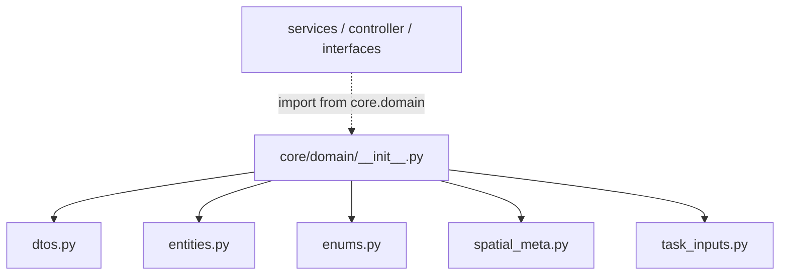

---
tags:
  - secinterp
  - code-walkthrough
  - core
  - domain
aliases:
  - core/domain/__init__.py
  - domain
  - core/domain/
cssclass: secinterp-note
---

# `core/domain/__init__.py`

> [!abstract] One-line summary
> The **facade** of the domain package: re-exports the 24 public symbols from `dtos.py`, `entities.py`, `enums.py`, `spatial_meta.py` and `task_inputs.py` so the rest of the core imports from a single `core.domain` point.

**Path**: `core/domain/__init__.py` (68 lines)
**Main class/function**: re-exports / `__all__`
**Layer**: Core (QGIS-agnostic)
**Tags**: #secinterp #core #domain

---

## 🎯 Why does this file exist?

`core/domain/` contains 6 modules with the domain types (entities, DTOs, enums, spatial
metadata and contexts). Without an `__init__` that re-exports them, each consumer would
have to import from each sub-module separately. The facade solves that:

| Problem | Solution |
|---------|----------|
| Importing from 6 scattered sub-modules | Unified re-export from `core.domain` |
| Uncontrolled public API | Explicit `__all__` with 24 symbols |
| Exposing internal package dependencies | The consumer does not know the internal layout |
| Refactoring sub-modules without breaking consumers | The facade is the only stable point |

> [!important] Architectural note — Facade + `__all__`
> The `__init__.py` acts as a **facade** of the domain: it imports every symbol and
> declares them in `__all__`, which also controls what `from core.domain import *` exposes.
> It is QGIS-agnostic: it only re-exports pure types (dataclasses, aliases, an `IntEnum`).

---

## 🧬 Relationship diagram



> [!tip] How to read
> Solid = imports (the `__init__` aggregates the 5 sub-modules). Dashed = consumers import
> **only from the facade** (`from sec_interp.core.domain import GeologyContext`), without
> knowing the real location of each type.

---

## 📦 Imports — architectural reading

```python
# core/domain/__init__.py
from __future__ import annotations

from .dtos import (
    PreviewParams,
    PreviewResult,
)
from .entities import (
    DomainGeometry, DrillholeProjection, ExportSettings,
    GeologyData, GeologyPoints, GeologySegment,
    InterpretationPolygon, InterpretationPolygon25D,
    Point2D, Point3D, PointList, ProfileData, ProfilePoints,
    SettingsDict, StructureData, StructureMeasurement, StructurePoints,
    ValidationResult,
)
from .enums import FieldType
from .spatial_meta import SpatialMeta
from .task_inputs import (
    DrillholeContext,
    GeologyContext,
    OutcropSegments,
)
```

| # | Observation |
|---|-------------|
| ① | **Relative** imports (`.dtos`, `.entities`, …): cohesive to the package. |
| ② | Re-exports by semantic grouping (DTOs, entities, enum, meta, inputs). |
| ③ | No `from qgis...`: everything re-exported is QGIS-agnostic. |

---

## 🏗️ Structure inventory

**`__all__` (24 symbols):**

| Sub-module | Re-exported symbols |
|-----------|---------------------|
| `dtos.py` | `PreviewParams`, `PreviewResult` |
| `entities.py` | `DomainGeometry`, `DrillholeProjection`, `ExportSettings`, `GeologyData`, `GeologyPoints`, `GeologySegment`, `InterpretationPolygon`, `InterpretationPolygon25D`, `Point2D`, `Point3D`, `PointList`, `ProfileData`, `ProfilePoints`, `SettingsDict`, `StructureData`, `StructureMeasurement`, `StructurePoints`, `ValidationResult` |
| `enums.py` | `FieldType` |
| `spatial_meta.py` | `SpatialMeta` |
| `task_inputs.py` | `DrillholeContext`, `GeologyContext`, `OutcropSegments` |

> [!note] `ExportSettings` and `SettingsDict` are also aliases
> `ExportSettings` (export dict) and `SettingsDict` come from `entities.py` as type aliases,
> not dataclasses. The facade does not distinguish: it re-exports both.

---

## 📁 Files in the package

- `__init__.py` — this file (facade). The other package modules have their own notes:
  [[dtos]], [[entities]], [[task_inputs]], [[core_domain]] (`enums` + `spatial_meta`).

---

## 📖 Symbol-by-symbol walkthrough

The `__init__.py` defines no classes or methods of its own: its only "behavior" is to
**aggregate and expose**. The relevant walkthrough is that of the re-exported symbols,
detailed in each sub-module's note:

| Symbol | Type | Note with details |
|--------|------|-------------------|
| `PreviewParams` / `PreviewResult` | dataclass | [[dtos]] |
| `GeologySegment`, `StructureMeasurement`, `DrillholeProjection`, `InterpretationPolygon`, `InterpretationPolygon25D` | dataclass | [[entities]] |
| `Point2D`, `Point3D`, `PointList`, `DomainGeometry`, `ProfileData`, `GeologyData`, `StructureData`, `SettingsDict`, `ExportSettings`, `ValidationResult`, `ProfilePoints`, `GeologyPoints`, `StructurePoints` | type alias | [[entities]] |
| `FieldType` | `IntEnum` | [[core_domain]] |
| `SpatialMeta` | `frozen` dataclass | [[core_domain]] |
| `DrillholeContext`, `GeologyContext`, `OutcropSegments` | dataclass | [[task_inputs]] |

---

## 🔄 Data flow

| Phase | Input | Transformation | Output |
|-------|-------|----------------|--------|
| Import | `from sec_interp.core.domain import X` | facade resolution | sub-module symbol |
| Use | imported type | construction/processing in the consumer | DTO/entity |

---

## 🏛️ Design patterns present

| Pattern | Where | Purpose |
|---------|-------|---------|
| **Facade** | `__init__.py` | A single import point for the domain |
| **Barrel / Re-export** | grouped imports | Re-export sub-module symbols |
| **Explicit API (`__all__`)** | 24-symbol list | Control the package's public API |

---

## 🧾 API summary

| Symbol | Signature / Inherits | Typical use |
|--------|----------------------|-------------|
| `PreviewParams` / `PreviewResult` | dataclass | Profile generation input/output |
| `GeologySegment` / `StructureMeasurement` | dataclass | Geological/structural results |
| `DrillholeProjection` / `SpatialMeta` | dataclass | Projected drillholes |
| `DrillholeContext` / `GeologyContext` | dataclass | Detached inputs of the services |
| `FieldType` | `IntEnum` | Field type validation without PyQt |
| `DomainGeometry` / `Point2D` / `Point3D` | alias | Geometric vocabulary (WKT, tuples) |

---

## 🛡️ Error handling

No error logic: a re-export `__init__` does not validate or raise. The only risk is an
`ImportError` if a sub-module is missing or a name is misspelled in the list — something
import tests catch immediately.

---

## 🧪 Associated tests

There is no dedicated `test_domain.py` for the facade; its correctness is validated
**indirectly**:

- `tests/core/test_entities.py` / `test_dtos.py` — cover the re-exported symbols.
- `tests/core/test_architecture_boundary.py` — verifies the core does not import QGIS.

> [!note] The `__all__` list as an implicit contract
> If a symbol is added to a sub-module without adding it to `__all__`, it is not exposed by
> `import *`. It is an API decision worth reviewing on every change.

---

## 👀 Observations and notes

> [!success] Strengths
> - A single import point for the whole domain (`from sec_interp.core.domain import ...`).
> - Explicit `__all__` documents and controls the public API.
> - Fully QGIS-agnostic.

> [!warning] Points of attention
> - `__all__` must be maintained **by hand**: adding a type in a sub-module does not expose
>   it automatically (risk of forgetting).
> - `ExportSettings` (alias in `entities.py`) and `ExportSettings` (dataclass in
>   `settings_model.py`) share a name across different domains — possible confusion.

> [!question] Open questions
> - Generate `__all__` automatically or keep the manual list as an "explicit contract"?
> - Rename `ExportSettings` (domain alias) to avoid the clash with `settings_model`?

---

## 🔢 Example — importing through the facade

In the core code, consumers import **from the facade**, not from the sub-modules:

```python
# ✅ Preferred style (facade)
from sec_interp.core.domain import (
    GeologyContext,
    GeologySegment,
    DrillholeContext,
    FieldType,
    SpatialMeta,
)

# ❌ Style the facade aims to avoid (direct sub-module import)
from sec_interp.core.domain.task_inputs import GeologyContext
from sec_interp.core.domain.entities import GeologySegment
```

Both work (Python resolves the sub-module the same way), but the facade offers a single
stable import point: if `GeologyContext` were moved from `task_inputs.py` to another module,
only `__init__.py` would need updating, not every consumer.

> [!note] `from core.domain import *` also works
> Thanks to `__all__`, `from sec_interp.core.domain import *` imports exactly the 24 listed
> symbols. It is not the project's usual style (explicit imports are preferred), but
> `__all__` guarantees the wildcard does not drag in `annotations` or other internal names.

---

## 📐 Facade vs direct import — criteria

When is the facade better than a direct import?

| Criterion | Facade (`from core.domain import X`) | Direct (`from ...task_inputs import X`) |
|-----------|--------------------------------------|-----------------------------------------|
| Import point stability | High (single point) | Low (tied to the file) |
| Coupling to internal structure | None | Exposed |
| Clarity of origin | Lower (can't see the source file) | Higher (exact module) |
| Refactor-friendly | Yes | No |

> [!tip] Practical rule
> For **public, stable** domain types (entities, DTOs, contexts), the facade is the right
> choice. For internal details that should not be exposed, direct import is kept within the
> package itself.

---

## 🌐 i18n and migration notes

- **No user strings**: the `__init__.py` translates nothing; it only re-exports types.
- **Manual maintenance**: `__all__` is not generated; each new symbol must be added to the
  list and to the matching import (forgetting is documented in Observations).
- **Stability**: the facade is a *de facto* contract; renaming or moving a symbol without
  updating `__init__.py` breaks `from core.domain import X` for consumers.

---

## 📦 Full contents of `__all__` (24 symbols)

Exhaustive reference of what the facade makes available, grouped by sub-module:

| Symbol | Sub-module | Type |
|--------|-----------|------|
| `PreviewParams` | `dtos.py` | dataclass |
| `PreviewResult` | `dtos.py` | dataclass |
| `DomainGeometry` | `entities.py` | alias (`str`, WKT) |
| `Point2D` | `entities.py` | alias (`tuple[float, float]`) |
| `Point3D` | `entities.py` | alias (`tuple[float, float, float]`) |
| `PointList` | `entities.py` | alias (`list[Point2D]`) |
| `ProfileData` | `entities.py` | alias (`list[tuple[float, float]]`) |
| `GeologyData` | `entities.py` | alias (`list[GeologySegment]`) |
| `StructureData` | `entities.py` | alias (`list[StructureMeasurement]`) |
| `SettingsDict` | `entities.py` | alias (`dict[str, Any]`) |
| `ExportSettings` | `entities.py` | alias (`dict[str, Any]`) |
| `ValidationResult` | `entities.py` | alias (`tuple[bool, str]`) |
| `ProfilePoints` / `GeologyPoints` / `StructurePoints` | `entities.py` | alias |
| `GeologySegment` | `entities.py` | dataclass |
| `StructureMeasurement` | `entities.py` | dataclass |
| `InterpretationPolygon` | `entities.py` | dataclass |
| `InterpretationPolygon25D` | `entities.py` | dataclass |
| `DrillholeProjection` | `entities.py` | dataclass |
| `FieldType` | `enums.py` | `IntEnum` |
| `SpatialMeta` | `spatial_meta.py` | `frozen` dataclass |
| `DrillholeContext` | `task_inputs.py` | dataclass |
| `GeologyContext` | `task_inputs.py` | dataclass |
| `OutcropSegments` | `task_inputs.py` | dataclass |

> [!note] 17 symbols come from `entities.py`
> Most of the facade comes from `entities.py` (17 of 24). It is consistent: the entities and
> their aliases are the domain's "vocabulary"; the rest are transports and enums.

---

## 🔗 Related notes

- [[Index]] — vault index
- [[dtos]] — `PreviewParams` / `PreviewResult`
- [[entities]] — the re-exported entities and aliases
- [[task_inputs]] — `DrillholeContext` / `GeologyContext`
- [[core_domain]] — `FieldType` and `SpatialMeta`
- [[core_interfaces]] — the contracts that consume these types
- [[controller]] — main consumer of the facade

---

*Note of the SecInterp Code Walkthrough v2 vault — v3.8.0*
