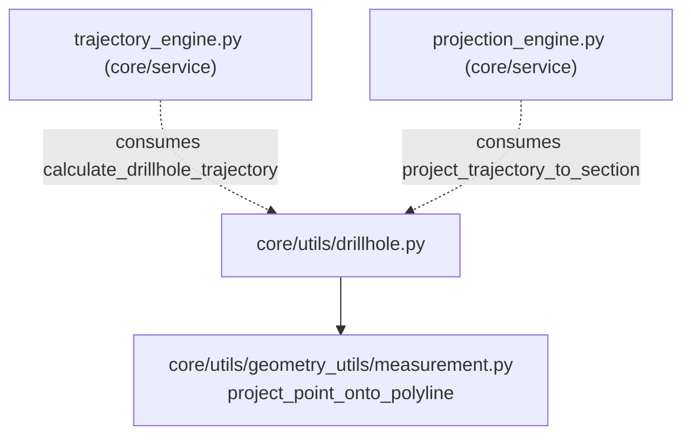

---
tags:
  - secinterp
  - code-walkthrough
  - core
  - utils
aliases:
  - drillhole.py
  - calculate_drillhole_trajectory
  - project_trajectory_to_section
cssclass: secinterp-note
---

# `core/utils/drillhole.py`

> [!abstract] One-line summary
> Pure **drillhole geometry utilities**: compute the 3D trajectory from surveys, project it onto the section line, and distribute lithological intervals along it — all without touching QGIS.

**Path**: `core/utils/drillhole.py` (298 lines)
**Main function**: `calculate_drillhole_trajectory`
**Layer**: Core (QGIS-agnostic)
**Tags**: #secinterp #core #utils

---

## 🎯 Why does this file exist?

A drillhole is not a point: it is a **3D polyline** that wanders according to survey
readings (depth, azimuth, inclination). To draw it on a vertical section we need three
independent transformations:

| Problem | Solution |
|---------|----------|
| Turn survey readings into (x, y, z) coordinates | `calculate_drillhole_trajectory` + `_calculate_segment_delta` |
| Flatten the 3D trajectory onto the section plane | `project_trajectory_to_section` |
| Assign lithological (from/to) intervals to the trajectory | `interpolate_intervals_on_trajectory` |

> [!important] QGIS-agnostic verified
> The module imports only `math`, `typing` and one in-house utility
> (`project_point_onto_polyline`). `collar_point` is consumed via **duck typing**
> (`x()`/`y()` or `[0]`/`[1]`), never `QgsPoint`. Testable without QGIS.

---

## 🧬 Relationship diagram



> [!tip] How to read
> Solid = imports; dashed = is consumed by. This module is a **leaf** in the
> dependency graph: it depends on no services, only services use it.

---

## 📦 Imports — architectural reading

```python
# core/utils/drillhole.py
from __future__ import annotations

import math
from typing import Any

from sec_interp.core.utils.geometry_utils.measurement import project_point_onto_polyline
```

| # | Observation |
|---|-------------|
| ① | `math` for trajectory trigonometry (radians, cos, sin). |
| ② | `Any` appears in `collar_point` and `intervals`: the module accepts any point-like type (duck typing). |
| ③ | The only internal dependency is `project_point_onto_polyline` — reuses the already-tested 2D projection. |

---

## 🏗️ Structure inventory

**Constants:** `DEPTH_TOLERANCE`, `MIN_INTERVAL_POINTS`

**Functions/Methods:**
- `calculate_drillhole_trajectory(...)`
- `project_trajectory_to_section(...)`
- `interpolate_intervals_on_trajectory(...)`
- `_calculate_segment_delta(...)`
- `_initialize_start_point(...)`
- `_process_survey_segment(...)`
- `_calculate_segment_points(...)`
- `_extrapolate_trajectory(...)`
- `_get_points_for_interval(...)`
- `_interpolate_at_depth(...)`

3 **public** functions (the real API), 7 private (internal mechanics).

---

## 📖 Method-by-method walkthrough

### `calculate_drillhole_trajectory`

```python
def calculate_drillhole_trajectory(
    collar_point: Any,
    collar_z: float,
    survey_data: list[tuple[float, float, float]],
    section_azimuth: float,
    densify_step: float = 1.0,
    total_depth: float = 0.0,
) -> list[tuple[float, float, float, float, float, float]]:
```

Entry point. Returns a list of `(depth, x, y, z, 0.0, 0.0)` tuples — the last two
fields are `0.0` because the point has not been projected onto the section yet.

**Behaviour:**

1. **Empty survey** → if `total_depth <= 0` returns `[]`; otherwise invents a vertical
   survey `(0.0, 0.0, -90.0)` (inclination −90° = straight down).
2. Initialises `(x, y)` with `_initialize_start_point` and `z = collar_z`.
3. Iterates each survey calling `_process_survey_segment`, accumulating `last_azim`,
   `last_incl`, `last_survey_depth`.
4. If `total_depth > last_survey_depth`, **extrapolates** the trajectory with
   `_extrapolate_trajectory` using the last known azimuth/inclination.

> [!warning] `section_azimuth` is unused here
> The `section_azimuth` parameter is accepted but **does not participate** in the
> computation. The trajectory is computed in absolute coordinates (x, y); the section
> azimuth only matters in the later projection.

### `_calculate_segment_delta`

```python
def _calculate_segment_delta(interval, azimuth, inclination) -> tuple[float, float, float]:
```

The trigonometric heart. Converts a survey segment into displacements:

```python
azim_rad = math.radians(azimuth)
standard_incl_rad = math.radians(90 + inclination)
dz = -interval * math.cos(standard_incl_rad)
dx = interval * math.sin(standard_incl_rad) * math.sin(azim_rad)
dy = interval * math.sin(standard_incl_rad) * math.cos(azim_rad)
```

| Detail | Reason |
|--------|--------|
| `90 + inclination` | Converts "inclination from horizontal" to a zenith angle (from vertical) |
| `-interval * cos(...)` | `cos(90°) = 0` (horizontal) → `dz = 0`; `cos(0°) = 1` (vertical) → `dz = -interval` |
| `sin(azim)` in `dx`, `cos(azim)` in `dy` | Azimuth measured from north (+y axis) |

> [!note] Docstring vs. implementation
> The module docstring mentions "minimum curvature", but **only the tangential
> approximation** (straight segments between surveys) is implemented.

### `_initialize_start_point`

```python
def _initialize_start_point(collar_point: Any) -> tuple[float, float]:
```

Pure duck typing: if the object has `.x()`/`.y()` it is treated as `QgsPointXY`;
otherwise indexed as a tuple `[0]`/`[1]`. On `AttributeError`/`TypeError`/`IndexError`
it returns `(0.0, 0.0)` instead of propagating.

### `_process_survey_segment`

```python
def _process_survey_segment(depth, azimuth, inclination, x, y, z, prev_depth, densify_step, trajectory) -> tuple:
```

- Guards `depth <= prev_depth` → does not advance (protects against out-of-order surveys).
- Computes `dx, dy, dz` and **densifies** the span with `_calculate_segment_points`.
- Returns the accumulated `(x, y, z, depth)`.

### `_calculate_segment_points`

```python
num_steps = max(1, int(interval / step))
```

Generates `num_steps` linearly interpolated points (fraction `i/num_steps`) so the
trajectory has a vertex roughly every `~densify_step` metres, even on short spans.

### `_extrapolate_trajectory`

```python
def _extrapolate_trajectory(x, y, z, last_depth, total_depth, azim, incl, step) -> list:
```

Extends the trajectory from the last survey to `total_depth` with the **last**
azimuth/inclination (assumes a straight final span).

### `project_trajectory_to_section`

```python
def project_trajectory_to_section(trajectory, line_points) -> list[tuple]:
```

```python
for depth, x, y, z, _, _ in trajectory:
    dist_along, nearest = project_point_onto_polyline((x, y), line_points)
    offset = math.hypot(x - nearest[0], y - nearest[1])
    projected.append((depth, x, y, z, dist_along, offset, nearest[0], nearest[1]))
```

Converts each 3D point into an 8-tuple `(depth, x, y, z, dist_along, offset, proj_x, proj_y)`:
- `dist_along`: distance travelled **along the section** (profile X coordinate).
- `offset`: distance **perpendicular** to the section (to filter far-away holes).
- `proj_x/proj_y`: point projected onto the line (the "foot" of the perpendicular).

### `interpolate_intervals_on_trajectory`

```python
def interpolate_intervals_on_trajectory(trajectory, intervals, buffer_width) -> list:
```

Distributes lithological attributes along the projected trajectory:

1. Sorts the trajectory by depth (`sorted(..., key=lambda p: p[0])`).
2. For each `(from_val, to_val, attr)` fetches the interval's points.
3. If there are ≥ `MIN_INTERVAL_POINTS` (2), builds three coordinate lists:
   `p_2d = (dist_along, z)`, `p_3d = (x, y, z)`, `p_3d_proj = (proj_x, proj_y, z)`.

### `_get_points_for_interval`

```python
p_from = _interpolate_at_depth(traj, from_val)
```

Joins three point sources: a point **interpolated at `from_val`**, all vertices
**strictly inside**, and a point **interpolated at `to_val`** — dropping duplicates
with tolerance `DEPTH_TOLERANCE`. Each point is included only if its
`offset ≤ buffer_width`.

### `_interpolate_at_depth`

```python
frac = (target_depth - d1) / (d2 - d1)
return tuple(p1[j] + (p2[j] - p1[j]) * frac for j in range(len(p1)))
```

Linear interpolation of **all tuple fields** (not just x/y/z) between the two vertices
`p1, p2` enclosing the target depth. Handles exact match and out-of-range targets
(returns `None`).

---

## 🔄 Data flow

| Phase | Input | Transformation | Output |
|-------|-------|----------------|--------|
| Trajectory | surveys `(depth, azim, incl)` | trigonometry + densification | 6-tuple `(depth, x, y, z, 0, 0)` |
| Projection | 6-tuple + `line_points` | `project_point_onto_polyline` + hypotenuse | 8-tuple `(depth, x, y, z, dist, offset, nx, ny)` |
| Intervals | 8-tuple + `(from, to, attr)` | depth interpolation + `offset` filter | `(attr, p_2d, p_3d, p_3d_proj)` |

> [!tip] Canonical chaining
> `calculate_drillhole_trajectory` → `project_trajectory_to_section` →
> `interpolate_intervals_on_trajectory` is the chain a consuming service
> (`DrillholeService`) uses to go from survey to drawable geological segments.

---

## 📐 Trajectory tuple layouts

The module chains **two positional tuple layouts**:

| Index | 6-tuple (`calculate_drillhole_trajectory`) | 8-tuple (`project_trajectory_to_section`) |
|:---:|---|---|
| 0 | `depth` | `depth` |
| 1 | `x` | `x` |
| 2 | `y` | `y` |
| 3 | `z` | `z` |
| 4 | `0.0` (reserved) | `dist_along` (profile X) |
| 5 | `0.0` (reserved) | `offset` (perpendicular) |
| 6 | — | `proj_x` (foot of perpendicular) |
| 7 | — | `proj_y` (foot of perpendicular) |

> [!warning] Positional fragility
> Being anonymous tuples, a reorder silently breaks consumers. See "Open questions"
> (migrate to `NamedTuple`/dataclass).

---

## 🔢 Worked example — vertical hole

Given a collar at `(100, 200, z=50)`, `survey_data = [(10.0, 0.0, -90.0)]` (10 m,
vertical) and `densify_step=5.0`:

1. `_calculate_segment_delta(10, 0, -90)`:
   - `standard_incl = 90 + (-90) = 0°` → `cos(0)=1`, `sin(0)=0`
   - `dz = -10 · 1 = -10`, `dx = 10 · 0 · sin(0) = 0`, `dy = 10 · 0 · cos(0) = 0`
2. `_calculate_segment_points` with `num_steps = max(1, int(10/5)) = 2`:
   - point at `frac=0.5`: `(5, 100, 200, 45, 0, 0)`
   - point at `frac=1.0`: `(10, 100, 200, 40, 0, 0)`
3. Result: `[(0,100,200,50,0,0), (5,100,200,45,0,0), (10,100,200,40,0,0)]`

The hole "drops" straight: `x` and `y` constant, only `z` decreases.

---

## ⚡ Performance and complexity

| Aspect | Analysis |
|--------|----------|
| **Complexity** | `O(n)` per generated point; `project_trajectory_to_section` is `O(n · m)` (n points × m line vertices) |
| **Densification** | `densify_step` controls the vertex count; a smaller step ⇒ more points and more memory |
| **Buffer filter** | `_get_points_for_interval` drops points with `offset > buffer_width`, reducing segments |

---

## 🏛️ Design patterns present

| Pattern | Where | Purpose |
|---------|-------|---------|
| **Pipeline** | 3 public functions | Chain independent, composable transformations |
| **Duck typing** | `_initialize_start_point` | Accept `QgsPointXY` or tuple without importing QGIS |
| **Numerical tolerance** | `DEPTH_TOLERANCE` | Avoid float-comparison failures on depths |
| **Guard clause** | `_process_survey_segment`, `interpolate_*` | Early return on empty/out-of-order data |
| **Default parameter object** | `densify_step=1.0`, `total_depth=0.0` | Sensible defaults for the common case |

---

## 🧾 API summary

| Symbol | Signature / Inherits | Typical use |
|--------|----------------------|-------------|
| `calculate_drillhole_trajectory` | `(collar_point, collar_z, survey_data, section_azimuth, densify_step=1.0, total_depth=0.0)` | 3D drillhole trajectory |
| `project_trajectory_to_section` | `(trajectory, line_points)` | Projection onto the section line |
| `interpolate_intervals_on_trajectory` | `(trajectory, intervals, buffer_width)` | Lithological segments along the trajectory |

---

## 🛡️ Error handling

It raises no custom exceptions; it prefers **safe degradation**:

| Case | Behaviour |
|------|-----------|
| Empty `survey_data` and no `total_depth` | `calculate_drillhole_trajectory` → `[]` |
| Unreadable `collar_point` | `_initialize_start_point` → `(0.0, 0.0)` |
| Survey with `depth <= prev_depth` | `_process_survey_segment` does not advance (ignored) |
| Interval outside the trajectory | `_interpolate_at_depth` → `None` (skipped) |

---

## 🧪 Associated tests

Mapped to `tests/core/` (tests consume these utilities indirectly via
`DrillholeService` / `TrajectoryEngine`). Key cases for the pure utility:

- `test_trajectory_vertical_hole` — vertical survey `-90°` produces `dx = dy = 0`.
- `test_trajectory_empty_survey` — `[]` for empty survey without `total_depth`.
- `test_project_trajectory_offset` — `offset = 0` for a point on the line.
- `test_interval_short_segment` — a short interval still yields ≥ 2 points.

---

## 🌐 i18n and migration notes

- **No user-facing strings**: the module emits no translatable messages; every error
  degrades to defaults. It does not require `TranslatableMixin`.
- **v3.x migration**: the tuple layouts (6 → 8 fields) are historical; a refactor to
  `NamedTuple` would keep compatibility if the field order is preserved.
- **Thread-safety**: pure functions with no shared state ⇒ safe for `QgsTask`.

---

## 👀 Observations and notes

> [!success] Strengths
> - 100 % QGIS-agnostic and deterministic (pure trigonometry).
> - Small, composable functions; no shared state.
> - Explicit numerical tolerance (`DEPTH_TOLERANCE`) in comparisons.

> [!warning] Points of attention
> - `section_azimuth` is a dead parameter in `calculate_drillhole_trajectory`.
> - Docstring promises "minimum curvature" but only the tangential method exists.
> - Duplicated tuple layouts (6 vs 8 elements) are fragile to refactors.

> [!question] Open questions
> - Is minimum curvature worth implementing (better fidelity), or is tangential enough?
> - Replace tuples with `NamedTuple`/dataclass for positional clarity?

---

## 🔗 Related notes

- [[Index]] — vault index
- [[trajectory_engine]] — main consumer of `calculate_drillhole_trajectory`
- [[core_services_drillhole]] — consumes `project_trajectory_to_section`
- [[drillhole_service]] — orchestrates the drillhole pipeline
- [[core_utils_geometry_utils]] — sub-layer providing `project_point_onto_polyline`

---

*Note of the SecInterp Code Walkthrough v2 vault — v3.8.0*
