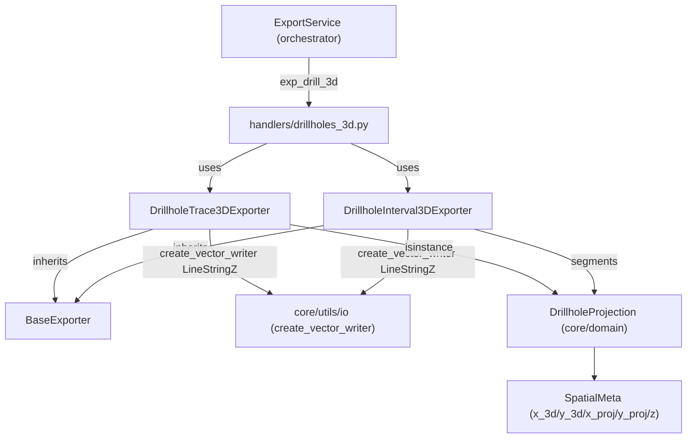

---
tags:
  - secinterp
  - code-walkthrough
  - exporters
  - drillholes
  - 3d
aliases:
  - drillhole_3d_exporter.py
  - DrillholeTrace3DExporter
  - DrillholeInterval3DExporter
cssclass: secinterp-note
---

# `exporters/drillhole_3d_exporter.py`

> [!abstract] One-line summary
> Exports drillholes to 3D (`LineStringZ` traces and `LineStringZ` intervals) accepting `DrillholeProjection`, new 3-element tuples and legacy 5-element tuples, with a `use_projected` switch.

**Path**: `exporters/drillhole_3d_exporter.py` (243 lines)
**Main classes**: `DrillholeTrace3DExporter`, `DrillholeInterval3DExporter`
**Layer**: Exporters (GUI · QGIS-dependent, inherits `BaseExporter`)
**Tags**: #secinterp #exporters #drillholes #3d

---

## 🎯 Why does this file exist?

The core `drillhole_service` already projected the drillholes onto the section plane
(see [[drillhole_service]]). One step is missing: **persisting that projection in 3D**
for the QGIS 3D view or an external GIS:

| Problem | Solution |
|---------|----------|
| The 2D profile trace loses the collar's real coordinate | `DrillholeTrace3DExporter` writes `LineStringZ` with real `(x, y, z)` |
| Lithological intervals must keep `from/to/unit` in 3D | `DrillholeInterval3DExporter` writes one `LineStringZ` per segment with 4 fields |
| Three `drillhole_data` shapes coexist (objects, new tuples, legacy tuples) | `_extract_hole_spatial_data` / `_process_hole_intervals` accept all three without breaking old tests |
| Sometimes the trace shifted onto the section plane is wanted | `use_projected` flag switching between `points_3d` and `points_3d_projected` |

> [!important] Architectural note — write adapter, not renderer
> This module does **not** implement `IRenderer3D` (`render_3d`/`clear`, see
> [[core_interfaces]]): it does not draw a scene, it **writes files** with Z geometry.
> Live 3D rendering belongs to the GUI; this only persists the result for the
> `exp_drill_3d` path of the [[orchestrator]].

---

## 🧬 Relationship diagram



> [!tip] How to read
> Both exporters inherit `BaseExporter` (see [[base_exporter]]) and delegate writer
> creation to `sec_interp.core.utils.io` (see [[io]]). The `drillholes_3d` handler
> (see [[drillholes_3d]]) instantiates them from the [[orchestrator]].

---

## 📦 Imports — architectural reading

```python
# exporters/drillhole_3d_exporter.py
from __future__ import annotations

from typing import Any

from qgis.core import (
    QgsFeature,
    QgsField,
    QgsFields,
    QgsGeometry,
    QgsLineString,
    QgsPoint,
    QgsWkbTypes,
)
from qgis.PyQt.QtCore import QMetaType

import sec_interp.core.utils.io as scu_io
from sec_interp.core.domain import DrillholeProjection
from sec_interp.logger_config import get_logger

from .base_exporter import BaseExporter
```

| # | Observation |
|---|-------------|
| ① | `QgsLineString` + `QgsPoint(x, y, z)` + `QgsWkbTypes.Type.LineStringZ` → real **Z geometry**, not simulated 2.5D. |
| ② | `QMetaType` (via `qgis.PyQt`) to type fields: `QString` for `hole_id`, `Double` for depths. |
| ③ | `DrillholeProjection` from the domain as the **first** `isinstance` choice; tuples are compatibility. |
| ④ | `scu_io.create_vector_writer` centralises SHP/GPKG/DXF (same helper as the other exporters). |
| ⑤ | `get_logger(__name__)` in each exporter: errors with `logger.exception` (with traceback). |

---

## 🏗️ Structure inventory

**Classes:** 2 (`DrillholeTrace3DExporter`, `DrillholeInterval3DExporter`).

**Validation constants:**

| Constant | Value | Use |
|----------|------:|-----|
| `NEW_DATA_LENGTH` | 3 | New tuple `(hole_id, spatial_points, segments)` |
| `LEGACY_DATA_LENGTH` | 5 | Legacy tuple `(hole_id, traces, traces_3d, traces_3d_proj, segments)` |
| `MIN_POINTS_FOR_INTERVAL` | 2 | Minimum points to build a `QgsLineString` |

**Methods of `DrillholeTrace3DExporter`:** `get_supported_extensions`, `export`,
`_process_hole_trace` (extract → convert → validate → write pipeline),
`_extract_hole_spatial_data` (object / 3-tuple / 5-tuple), `_get_trace_points`
(`use_projected` switch), `_prepare_fields` (`hole_id`).

**Methods of `DrillholeInterval3DExporter`:** `get_supported_extensions`, `export`,
`_process_hole_intervals` (segments = last element), `_write_segment` (one feature
per interval), `_prepare_fields` (`hole_id`, `from_depth`, `to_depth`, `unit`).

---

## 📁 Files in the package `exporters/`

| File | Role relative to this note |
|---|---|
| `drillhole_3d_exporter.py` | This note: 3D traces and intervals (`LineStringZ`) |
| [[drillhole_exporters]] | 2D twin: `DrillholeTraceVectorExporter` / `DrillholeIntervalVectorExporter` in `(dist, elev)` |
| [[base_exporter]] | `BaseExporter`: `export()` contract + `get_supported_extensions()` |
| [[interpretation_3d_exporter]] | The other 3D writer: `PolygonZ` polygons + QML style |
| [[exporters]] | Package facade + `get_exporter()` by extension |

---

## 📖 Method-by-method walkthrough

### `DrillholeTrace3DExporter.export`

```python
def export(self, output_path: Any, data: dict[str, Any], layer_name: str | None = None) -> bool:
    drillhole_data = data.get("drillhole_data")
    crs = data.get("crs")
    use_projected = data.get("use_projected", False)
    if not drillhole_data or not crs:
        return False

    try:
        fields = self._prepare_fields()
        writer = scu_io.create_vector_writer(
            str(output_path),
            crs,
            fields,
            QgsWkbTypes.Type.LineStringZ,
            layer_name=layer_name,
        )

        for hole_data in drillhole_data:
            self._process_hole_trace(writer, fields, hole_data, use_projected)

        del writer
    except Exception as e:
        logger.exception(f"Error exporting 3D traces to {output_path}: {e}")
        return False
    return True
```

| Step | Behaviour |
|------|-----------|
| 1. Guards | No `drillhole_data` or no `crs` returns `False` (no empty file written) |
| 2. Writer | Fixed `LineStringZ` type; `layer_name` allows reuse inside a GPKG |
| 3. Loop | One feature per drillhole via `_process_hole_trace` (invalid holes skipped silently) |
| 4. Close | `del writer` flushes and closes the file; any exception → `False` with traceback |

The type is explicit (`LineStringZ`) with geographic `(x, y, z)` points.

### `_process_hole_trace` — 4-step decomposition

```python
def _process_hole_trace(
    self, writer: Any, fields: QgsFields, hole_data: Any, use_projected: bool
) -> None:
    extracted = self._extract_hole_spatial_data(hole_data)
    if not extracted:
        return

    hole_id, spatial_points = extracted
    points = self._get_trace_points(spatial_points, use_projected)

    if not points or len(points) < MIN_POINTS_FOR_INTERVAL:
        return

    geom = QgsGeometry(QgsLineString(points))
    if geom and not geom.isNull():
        feat = QgsFeature(fields)
        feat.setGeometry(geom)
        feat.setAttribute("hole_id", str(hole_id))
        writer.addFeature(feat)
```

The chain is **extract → convert → validate → write**: each stage can abort with
`return` without dirtying the writer. A `QgsLineString` needs at least 2 points;
with 0–1 points the hole is skipped (typical for collars with no computed deviation).

### `_extract_hole_spatial_data` — triple input shape

```python
def _extract_hole_spatial_data(self, hole_data: Any) -> tuple[Any, Any] | None:
    if isinstance(hole_data, DrillholeProjection):
        return hole_data.hole_id, hole_data.points_3d

    if isinstance(hole_data, list | tuple):
        hole_id = hole_data[0]
        if len(hole_data) == NEW_DATA_LENGTH:
            # New format with SpatialMeta objects
            return hole_id, hole_data[1]
        if len(hole_data) == LEGACY_DATA_LENGTH:
            # Legacy/Integration Test format
            return hole_id, hole_data
        logger.warning(
            f"Unexpected hole data format (length {len(hole_data)}) for hole {hole_id}"
        )
    return None
```

| Input | What it returns |
|-------|-----------------|
| `DrillholeProjection` | `(hole_id, points_3d)` — list of `SpatialMeta` |
| 3-tuple | `(hole_id, hole_data[1])` — `SpatialMeta` points at position 1 |
| 5-tuple (legacy) | `(hole_id, hole_data)` — the whole tuple; `_get_trace_points` unpacks it |
| Other length | `warning` with the `hole_id` and `None` (caller skips it) |

In legacy shape the real and projected points live at positions 2 and 3, so
`_get_trace_points` needs the whole tuple to choose by `use_projected`.

### `_get_trace_points` — the `use_projected` switch

```python
def _get_trace_points(self, spatial_data: Any, use_projected: bool) -> list[QgsPoint]:
    if isinstance(spatial_data, list | tuple) and len(spatial_data) == LEGACY_DATA_LENGTH:
        # Legacy/Integration Test format
        _, _, traces_3d, traces_3d_proj, _ = spatial_data
        points_source = traces_3d_proj if use_projected else traces_3d
        return [QgsPoint(x, y, z) for x, y, z in points_source]

    # Standard SpatialMeta objects
    if use_projected:
        return [
            QgsPoint(p.x_proj or 0.0, p.y_proj or 0.0, p.z)
            for p in spatial_data
            if p.x_proj is not None
        ]
    return [
        QgsPoint(p.x_3d or 0.0, p.y_3d or 0.0, p.z) for p in spatial_data if p.x_3d is not None
    ]
```

Two symmetric branches: legacy unpacks raw `(x, y, z)`; standard reads `SpatialMeta`
(real `x_3d`/`y_3d` vs on-plane `x_proj`/`y_proj`), filtering `None` coordinates first.

### `_prepare_fields` (traces): a single `hole_id` field (`QString`); the 3D trace is
pure geometry and lithology lives in the intervals (`_prepare_fields` of intervals:
`hole_id`, `from_depth`/`to_depth` as `Double`, `unit` as `QString`).

### `DrillholeInterval3DExporter.export`

```python
def export(self, output_path: Any, data: dict[str, Any], layer_name: str | None = None) -> bool:
    drillhole_data = data.get("drillhole_data")
    crs = data.get("crs")
    use_projected = data.get("use_projected", False)
    if not drillhole_data or not crs:
        return False

    try:
        fields = self._prepare_fields()
        writer = scu_io.create_vector_writer(
            str(output_path),
            crs,
            fields,
            QgsWkbTypes.Type.LineStringZ,
            layer_name=layer_name,
        )

        for hole_data in drillhole_data:
            self._process_hole_intervals(writer, fields, hole_data, use_projected)

        del writer
    except Exception as e:
        logger.exception(f"Error exporting 3D intervals to {output_path}: {e}")
        return False
    return True
```

Same skeleton as traces: same guards, same `LineStringZ`, different per-hole
processor (`_process_hole_intervals`, with segments as the last tuple element) and
4 fields instead of 1.

### `_process_hole_intervals` — segments are the last element

```python
if isinstance(hole_data, DrillholeProjection):
    hole_id = hole_data.hole_id
    segments = hole_data.segments
elif isinstance(hole_data, list | tuple):
    # segments are always the last element in both 3 and 5 element formats
    hole_id = hole_data[0]
    segments = hole_data[-1]
else:
    return
```

`hole_data[-1]` normalises both tuple shapes at once; if `segments` is not a list,
the hole is skipped. Each segment is written via `_write_segment`.

### `_write_segment` — one feature per interval

```python
def _write_segment(
    self,
    writer: Any,
    fields: QgsFields,
    hole_id: Any,
    segment: Any,
    use_projected: bool,
) -> None:
    points_source = segment.points_3d_projected if use_projected else segment.points_3d
    if not points_source or len(points_source) < MIN_POINTS_FOR_INTERVAL:
        return

    points = [QgsPoint(x, y, z) for x, y, z in points_source]
    geom = QgsGeometry(QgsLineString(points))

    if geom and not geom.isNull():
        feat = QgsFeature(fields)
        feat.setGeometry(geom)
        feat.setAttribute("hole_id", str(hole_id))
        attrs = segment.attributes
        feat.setAttribute("from_depth", attrs.get("from", 0.0))
        feat.setAttribute("to_depth", attrs.get("to", 0.0))
        feat.setAttribute("unit", segment.unit_name)
        writer.addFeature(feat)
```

The segment provides `points_3d` / `points_3d_projected` (`Point3D` lists), its
`attributes` (`from`/`to`, defaulting to `0.0`) and `unit_name`; with fewer than
2 points or a null geometry nothing is written.

### `_prepare_fields` (intervals): `hole_id` (`QString`), `from_depth`/`to_depth`
(`Double`), `unit` (`QString`): 4 fields mirroring the 2D twin so both SHPs are
joinable by attribute.

---

## 🔄 Data flow

| Phase | Input | Transformation | Output |
|-------|-------|----------------|--------|
| Guards | `data` (`drillhole_data`, `crs`, `use_projected`) | `not drillhole_data or not crs` → `False` | Nothing (no partial file) |
| Writer | `output_path`, `crs`, fields | `create_vector_writer(..., LineStringZ)` | SHP/GPKG/DXF writer |
| Traces | `DrillholeProjection` / 3-tuple / 5-tuple | extract → `QgsPoint` list → `QgsLineString` | 1 `hole_id` feature per hole |
| Intervals | `segments` (last element) | 1 `QgsLineString` per segment + `from/to/unit` | N features per hole |
| Close | writer with features | `del writer` | File closed and visible |

---

## 🏛️ Design patterns present

| Pattern | Where | Purpose |
|---------|-------|---------|
| **Template Method** | `BaseExporter.export` → implementations | Shared contract, specific writing |
| **Adapter** | `_extract_hole_spatial_data` | Normalises 3 shapes to `(hole_id, points)` |
| **Strategy** | `use_projected` | Switches real vs projected source without duplicating classes |
| **Guard clauses** | `export`, `_process_*`, `_write_segment` | Early returns instead of nested `if` |
| **Boolean status** | `-> bool` | The handler accumulates messages without control-flow exceptions |

---

## 🧾 API summary

| Symbol | Signature / Inherits | Typical use |
|--------|----------------------|-------------|
| `DrillholeTrace3DExporter` | `(BaseExporter)` | 1 `LineStringZ` per hole, `hole_id` field |
| `DrillholeTrace3DExporter.export` | `(output_path, data, layer_name=None) -> bool` | `data = {"drillhole_data": ..., "crs": ..., "use_projected": ...}` |
| `_process_hole_trace` | `(writer, fields, hole_data, use_projected) -> None` | Extract → convert → validate → write pipeline |
| `_extract_hole_spatial_data` | `(hole_data) -> tuple \| None` | Accepts object, 3-tuple or 5-tuple |
| `_get_trace_points` | `(spatial_data, use_projected) -> list[QgsPoint]` | `SpatialMeta` or `(x, y, z)` → `QgsPoint` |
| `DrillholeInterval3DExporter` | `(BaseExporter)` | N `LineStringZ` per hole + `from_depth/to_depth/unit` |
| `_process_hole_intervals` / `_write_segment` | `(...) -> None` | Segments (last element) → one feature per interval |

---

## 🛡️ Error handling

| Situation | Behaviour |
|-----------|-----------|
| Empty `drillhole_data` or missing `crs` | `return False` (file not created) |
| Unexpected tuple shape | `logger.warning` with `hole_id`; that hole skipped |
| Trace with < 2 points / null geometry | Silent `return` (collar with no trajectory) |
| Missing or non-list `segments` | Silent `return` |
| QGIS/IO exception in `export` | `logger.exception` with traceback → `False` |
| `attrs` without `from`/`to` | `0.0` defaults (no `KeyError`) |

> [!note] No `ExportError` here
> Unlike [[interpretation_3d_exporter]] (which does raise `ExportError`), this module
> reports failure with `bool`. The `drillholes_3d` handler decides whether that `False`
> aborts the export or just adds a warning (see [[orchestrator]] and [[exceptions]]).

---

## 🧪 Associated tests

**Unit (mock-first)** in `tests/exporters/test_drillhole_3d_exporter.py`:

- `test_trace_exporter_real` — traces with real coordinates (`use_projected=False`).
- `test_trace_exporter_projected` — traces with `use_projected=True`.
- `test_interval_exporter_real` — intervals with real coordinates.
- `test_interval_exporter_projected` — projected intervals.

**Domain objects** in `tests/exporters/test_drillhole_export_objects.py`:

- `test_export_3d_traces_with_objects` — traces from `DrillholeProjection`.
- `test_export_3d_intervals_with_objects` — intervals from `DrillholeProjection`.
- `test_export_traces_success` / `test_export_intervals_success` — 2D twins.

**Integration** (real 3D projection):

- `tests/integration/test_export_workflow.py::test_3d_projection_logic` and `test_3d_projection_north` — projection logic onto the section plane.
- `tests/integration/test_3d_projections.py` — end-to-end 3D projections.

> [!tip] `mock_writer_factory` pattern
> Unit tests inject a mocked writer via fixture (`mock_writer_factory`) by patching
> `scu_io.create_vector_writer`: they verify features and attributes without disk IO.

---

## 👀 Observations and notes

> [!success] Strengths
> - Triple input shape with no breakage (object + 3-tuple + legacy-5).
> - Per-hole pipeline with early returns: one bad hole never aborts the file.
> - `use_projected` as a data flag, not a separate class: zero duplication.
> - 3D interval schema identical to 2D: both SHPs joinable by attribute.

> [!warning] Points of attention
> - No `ExportError`: a silent `False` may go unnoticed if the handler does not report it.
> - No vertex simplification: very dense deviated traces are written point by point.
> - The writer closes with `del writer` (idiomatic in PyQGIS but fragile if an exception fires first).

> [!question] Open questions
> - Unify error reporting to `ExportError` like `Interpretation3DExporter`?
> - Type `data` as a `TypedDict` instead of `dict[str, Any]`?

---

## 🔗 Related notes

- [[Index]] — vault index
- [[exporters]] — `exporters/` package facade
- [[base_exporter]] — `BaseExporter`, base class of both exporters
- [[drillhole_exporters]] — 2D twins (`(dist, elev)`, `fromPolylineXY`)
- [[interpretation_3d_exporter]] — the other 3D writer (`PolygonZ` + QML)
- [[drillholes_3d]] — `exp_drill_3d` handler invoking them
- [[orchestrator]] — `ExportService`, export-option dispatch
- [[drillhole_service]] — produces the `DrillholeProjection` objects written here
- [[dtos]] — `DrillholeProjection`, `SpatialMeta` and other domain DTOs

---

*Note of the SecInterp Code Walkthrough v2 vault — v3.9.0*
