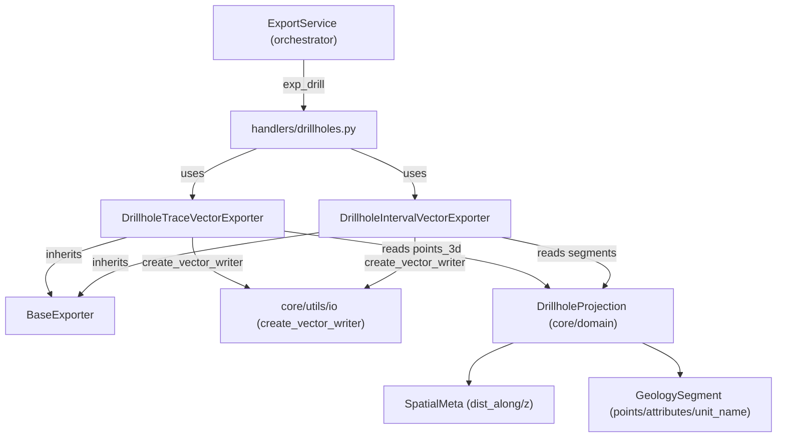

---
tags:
  - secinterp
  - code-walkthrough
  - exporters
  - drillholes
aliases:
  - drillhole_exporters.py
  - DrillholeTraceVectorExporter
  - DrillholeIntervalVectorExporter
cssclass: secinterp-note
---

# `exporters/drillhole_exporters.py`

> [!abstract] One-line summary
> Exports drillholes in 2D profile coordinates (`distance, elevation`): traces as polylines with `hole_id` and intervals as polylines with `from_depth/to_depth/unit`.

**Path**: `exporters/drillhole_exporters.py` (239 lines)
**Main classes**: `DrillholeTraceVectorExporter`, `DrillholeIntervalVectorExporter`
**Layer**: Exporters (GUI · QGIS-dependent, inherits `BaseExporter`)
**Tags**: #secinterp #exporters #drillholes

---

## 🎯 Why does this file exist?

The geological section lives in its own 2D system: X axis = distance along the line,
Y axis = elevation. Projected drillholes (`DrillholeProjection`, see
[[drillhole_service]]) must be drawn in that same plane so they overlay topography,
geology and structures:

| Problem | Solution |
|---------|----------|
| The hole trace must overlay the topographic profile | `DrillholeTraceVectorExporter`: `(dist, elev)` polyline with `hole_id` |
| Each lithological segment needs its depth attributes | `DrillholeIntervalVectorExporter`: one feature per segment with `from_depth`, `to_depth`, `unit` |
| Domain objects and legacy 5-tuples coexist | `_write_traces` / `_write_intervals` accept `DrillholeProjection` and tuples (3 or 5) |
| Points may arrive as `SpatialMeta` or as `(d, e)` pairs | `_create_feature` detects `dist_along`/`z` vs tuple via `hasattr` |

> [!important] Architectural note — 2D twin of the 3D exporter
> This module mirrors [[drillhole_3d_exporter]] in 2D: same input (`drillhole_data` +
> `crs`), same field schema, but flat geometry (`fromPolylineXY`) instead of
> `LineStringZ`. The [[orchestrator]] uses this path for `exp_drill` and the 3D one for
> `exp_drill_3d`.

---

## 🧬 Relationship diagram



> [!tip] How to read
> Unlike the 3D exporter, no `geometry_type` is fixed here: the default writer writes
> 2D polylines. `SpatialMeta` points provide `dist_along`/`z` (section coordinates);
> segments provide `points` (`(d, e)`), `attributes` and `unit_name`.

---

## 📦 Imports — architectural reading

```python
# exporters/drillhole_exporters.py
from __future__ import annotations

from typing import Any

from qgis.core import (
    QgsFeature,
    QgsField,
    QgsFields,
    QgsGeometry,
    QgsPointXY,
)
from qgis.PyQt.QtCore import QMetaType

import sec_interp.core.utils.io as scu_io
from sec_interp.core.domain import DrillholeProjection
from sec_interp.logger_config import get_logger

from .base_exporter import BaseExporter
```

| # | Observation |
|---|-------------|
| ① | `QgsPointXY` + `QgsGeometry.fromPolylineXY` → **flat** geometry in `(dist, elev)`; no `QgsPoint` or Z `QgsLineString`. |
| ② | No `QgsWkbTypes` in imports: the writer infers 2D polyline (direct contrast with the 3D module). |
| ③ | `DrillholeProjection` is the preferred type; tuples unpack by length (`NEW_DATA_LENGTH` / `LEGACY_DATA_LENGTH`). |
| ④ | Named constants (`MIN_REQUIRED_TRACE_POINTS`, `COORD_PAIR_LENGTH`) instead of magic literals. |
| ⑤ | `logger.exception` without interpolating the error in the message (the traceback already includes it). |

---

## 🏗️ Structure inventory

**Classes:** 2 (`DrillholeTraceVectorExporter`, `DrillholeIntervalVectorExporter`).

**Validation constants:**

| Constant | Value | Use |
|----------|------:|-----|
| `MIN_REQUIRED_TRACE_POINTS` | 2 | Traces with fewer points are skipped |
| `LEGACY_DATA_LENGTH` | 5 | Legacy tuple `(hole_id, traces, traces_3d, traces_3d_proj, segments)` |
| `NEW_DATA_LENGTH` | 3 | New tuple `(hole_id, traces, segments)` |
| `MIN_POINTS_FOR_INTERVAL` | 2 | Segments with fewer points → `None` |
| `COORD_PAIR_LENGTH` | 2 | Minimum `(d, e)` pairs in trace `_create_feature` |

**Methods of `DrillholeTraceVectorExporter`:** `get_supported_extensions`, `export`
(`try/except/else`), `_write_traces` (normalises object/3-tuple/5-tuple),
`_create_feature` (`SpatialMeta` via `hasattr` or pairs → polyline or `None`),
`_prepare_fields` (`hole_id`).

**Methods of `DrillholeIntervalVectorExporter`:** `get_supported_extensions`, `export`,
`_write_intervals` (segments = last element), `_create_feature` (strict `(d, e)` pairs
+ `from/to/unit`), `_prepare_fields` (4 fields).

---

## 📁 Files in the package `exporters/`

| File | Role relative to this note |
|---|---|
| `drillhole_exporters.py` | This note: 2D profile traces and intervals |
| [[drillhole_3d_exporter]] | 3D twin: same data as `LineStringZ` + `use_projected` flag |
| [[base_exporter]] | `BaseExporter`: `export()` contract + `get_supported_extensions()` |
| [[profile_exporters]] | Sibling traces: profile topography, geology, structures and axes |
| [[exporters]] | Package facade + `get_exporter()` by extension |

---

## 📖 Method-by-method walkthrough

### `DrillholeTraceVectorExporter.export`

```python
def export(self, output_path: Any, data: dict[str, Any], layer_name: str | None = None) -> bool:
    drillhole_data = data.get("drillhole_data")
    crs = data.get("crs")
    if not drillhole_data or not crs:
        return False

    try:
        fields = self._prepare_fields()
        writer = scu_io.create_vector_writer(
            str(output_path), crs, fields, layer_name=layer_name
        )

        self._write_traces(writer, drillhole_data, fields)
        del writer
    except Exception:
        logger.exception(f"Failed to export drillhole traces to {output_path}")
        return False
    else:
        return True
```

`try/except/else` structure: `True` lives in the `else`, so success is only returned
if the **whole** `try` block finished (including `del writer`). Missing `data` or `crs`
→ immediate `False`, no file created.

### `_write_traces` — object/tuple normalisation

```python
def _write_traces(self, writer: Any, drillhole_data: list, fields: QgsFields) -> None:
    for item in drillhole_data:
        if isinstance(item, DrillholeProjection):
            hole_id = item.hole_id
            traces = item.points_3d
        elif isinstance(item, list | tuple):
            # Handle variable tuple length (legacy 5 vs new 3)
            if len(item) == NEW_DATA_LENGTH:
                hole_id, traces, _ = item
            elif len(item) >= LEGACY_DATA_LENGTH:
                hole_id, traces, _traces_3d, _traces_3d_proj, _ = item
            else:
                continue
        else:
            continue

        if not traces or len(traces) < MIN_REQUIRED_TRACE_POINTS:
            continue

        feat = self._create_feature(hole_id, traces, fields)
        if feat:
            writer.addFeature(feat)
```

| Input | Unpacking |
|-------|-----------|
| `DrillholeProjection` | `hole_id`, `points_3d` |
| 3-tuple | `(hole_id, traces, _)` |
| 5+-tuple | `(hole_id, traces, ...)` — the 2D **section** points, not the 3D ones |
| Anything else | `continue` (skipped silently) |

In 2D `traces` (position 1) is always extracted; the 3D coordinates are ignored here.

### `_create_feature` (traces) — `SpatialMeta` or pairs

```python
def _create_feature(self, hole_id: str, traces: list, fields: QgsFields) -> QgsFeature | None:
    points = []
    for p in traces:
        # Handle SpatialMeta object or tuple/list
        if hasattr(p, "dist_along") and hasattr(p, "z"):
            points.append(QgsPointXY(p.dist_along, p.z))
        elif isinstance(p, list | tuple) and len(p) >= COORD_PAIR_LENGTH:
            points.append(QgsPointXY(p[0], p[1]))

    if not points:
        return None

    geom = QgsGeometry.fromPolylineXY(points)

    if not geom or geom.isNull():
        return None

    feat = QgsFeature(fields)
    feat.setGeometry(geom)
    feat.setAttribute("hole_id", hole_id)
    return feat
```

Duck typing with `hasattr` instead of `isinstance(SpatialMeta)`: accepts any object
with `dist_along`/`z` (including test mocks). Points matching neither branch are
**discarded**; with none left, or a null geometry, it returns `None` and
`_write_traces` writes nothing for that hole.

### `_prepare_fields` (traces)

```python
def _prepare_fields(self) -> QgsFields:
    fields = QgsFields()
    fields.append(QgsField("hole_id", QMetaType.Type.QString))
    return fields
```

A single `hole_id` field (`QString`): the trace is geometric context, attributes live
in the intervals.

### `DrillholeIntervalVectorExporter.export`

```python
def export(self, output_path: Any, data: dict[str, Any], layer_name: str | None = None) -> bool:
    drillhole_data = data.get("drillhole_data")
    crs = data.get("crs")
    if not drillhole_data or not crs:
        return False

    try:
        fields = self._prepare_fields()
        writer = scu_io.create_vector_writer(
            str(output_path), crs, fields, layer_name=layer_name
        )

        self._write_intervals(writer, drillhole_data, fields)
        del writer
    except Exception:
        logger.exception(f"Failed to export drillhole intervals to {output_path}")
        return False
    else:
        return True
```

Same skeleton as traces; the delegated writer (`_write_intervals`) and the field
schema (4 instead of 1) change.

### `_write_intervals` — segments = last element

```python
def _write_intervals(self, writer: Any, drillhole_data: list, fields: QgsFields) -> None:
    for item in drillhole_data:
        if isinstance(item, DrillholeProjection):
            hole_id = item.hole_id
            segments = item.segments
        elif isinstance(item, list | tuple):
            # Handle variable tuple length (legacy 5 vs new 3)
            # Segments are always the last element
            if len(item) == NEW_DATA_LENGTH or len(item) >= LEGACY_DATA_LENGTH:
                hole_id = item[0]
                segments = item[-1]
            else:
                continue
        else:
            continue
        if not segments:
            continue

        for segment in segments:
            feat = self._create_feature(hole_id, segment, fields)
            if feat:
                writer.addFeature(feat)
```

`item[-1]` unifies 3-tuples and legacy-5: segments always close the tuple. A hole
without segments (`None` or empty list) is skipped with `continue` before the inner loop.

### `_create_feature` (intervals) — strict `(d, e)` points

```python
def _create_feature(self, hole_id: str, segment: Any, fields: QgsFields) -> QgsFeature | None:
    if not segment.points or len(segment.points) < MIN_POINTS_FOR_INTERVAL:
        return None

    points = [QgsPointXY(d, e) for d, e in segment.points]
    geom = QgsGeometry.fromPolylineXY(points)

    if not geom or geom.isNull():
        return None

    feat = QgsFeature(fields)
    feat.setGeometry(geom)
    feat.setAttribute("hole_id", hole_id)

    attrs = segment.attributes
    feat.setAttribute("from_depth", attrs.get("from", 0.0))
    feat.setAttribute("to_depth", attrs.get("to", 0.0))
    feat.setAttribute("unit", segment.unit_name)

    return feat
```

No duck typing here: `segment.points` are section `(d, e)` pairs unpacked strictly.
`from`/`to` attributes default to `0.0` and `unit_name` travels as-is (possibly `None`
if the segment is unclassified).

### `_prepare_fields` (intervals)

```python
def _prepare_fields(self) -> QgsFields:
    fields = QgsFields()
    fields.append(QgsField("hole_id", QMetaType.Type.QString))
    fields.append(QgsField("from_depth", QMetaType.Type.Double))
    fields.append(QgsField("to_depth", QMetaType.Type.Double))
    fields.append(QgsField("unit", QMetaType.Type.QString))
    return fields
```

Fixed 4-field schema, identical to the 3D exporter: both SHPs join by attribute
(`hole_id`, `from_depth`, `to_depth`, `unit`).

Both classes return `[".shp", ".gpkg", ".dxf"]` from `get_supported_extensions`;
`scu_io.create_vector_writer` resolves the driver (see [[io]] and [[exporters]]).

---

## 🔄 Data flow

| Phase | Input | Transformation | Output |
|-------|-------|----------------|--------|
| Guards | `data` (`drillhole_data`, `crs`) | empty → `False` | Nothing |
| Writer | `output_path`, `crs`, fields | `create_vector_writer` (2D polyline) | SHP/GPKG/DXF writer |
| Traces | object / 3-tuple / 5-tuple | `traces` → `QgsPointXY(dist_along, z)` → `fromPolylineXY` | 1 `hole_id` feature per hole |
| Intervals | `segments` (last element) | `(d, e)` → polyline + `from/to/unit` | N features per hole |
| Close | writer with features | `del writer` in `try` | `True`; exception → `False` |

---

## 🏛️ Design patterns present

| Pattern | Where | Purpose |
|---------|-------|---------|
| **Template Method** | `BaseExporter.export` → both classes | Same skeleton, different geometry |
| **Adapter** | `_write_traces` / `_write_intervals` | Normalise object and tuples to `(hole_id, data)` |
| **Duck typing** | `hasattr(p, "dist_along")` | Accepts `SpatialMeta`, mocks and tuples without importing the type |
| **Null Object (skip)** | `return None` / `continue` | Degenerate data skipped without aborting the file |
| **Try/except/else** | `export` | `True` only if the full `try` completed |

---

## 🧾 API summary

| Symbol | Signature / Inherits | Typical use |
|--------|----------------------|-------------|
| `DrillholeTraceVectorExporter` | `(BaseExporter)` | 2D `(dist, elev)` traces, `hole_id` field |
| `DrillholeTraceVectorExporter.export` | `(output_path, data, layer_name=None) -> bool` | `data = {"drillhole_data": ..., "crs": ...}` |
| `_write_traces` | `(writer, drillhole_data, fields) -> None` | Normalises shapes and writes traces |
| `_create_feature` (traces) | `(hole_id, traces, fields) -> QgsFeature \| None` | `SpatialMeta` or pairs → polyline |
| `DrillholeIntervalVectorExporter` | `(BaseExporter)` | 2D intervals + `from_depth/to_depth/unit` |
| `_write_intervals` | `(writer, drillhole_data, fields) -> None` | Iterates segments (last element) |
| `_create_feature` (intervals) | `(hole_id, segment, fields) -> QgsFeature \| None` | Strict `(d, e)` → polyline |

---

## 🛡️ Error handling

| Situation | Behaviour |
|-----------|-----------|
| Empty `drillhole_data` or missing `crs` | `return False` |
| Unexpected tuple length / unknown type | Silent `continue` |
| Trace with < 2 points / no convertible points | Skipped (`None` from `_create_feature`) |
| Null geometry | Skipped |
| Empty / `None` `segments` | `continue` before the inner loop |
| `attrs` without `from`/`to` | `0.0` defaults |
| Exception in `export` | `logger.exception` → `False` (no `ExportError`) |

> [!note] `try/except/else` instead of a trailing `return True`
> The `else` guarantees `True` is only returned if `del writer` (the real flush) also
> succeeded. A trailing `return True` would be equivalent here, but `else` documents intent.

---

## 🧪 Associated tests

**Unit (mock-first)** in `tests/exporters/test_drillhole_export_objects.py`:

- `test_export_traces_success` — 2D traces from domain objects.
- `test_export_intervals_success` — 2D intervals from domain objects.
- `test_export_3d_traces_with_objects` / `test_export_3d_intervals_with_objects` — 3D twins.

**Generic exporter checks** in `tests/exporters/test_exporters.py`:

- `test_export_valid_data`, `test_export_empty_data` — `export() -> bool` contract.
- `test_export_missing_headers` / `test_export_missing_rows` — incomplete-data guards.
- `test_get_setting_with_default` / `test_get_setting_no_default` — `BaseExporter.get_setting`.
- `test_get_supported_extensions` — supported extensions.

**Integration** in `tests/integration/test_export_service_e2e.py`:

- `test_export_geology_creates_csv_and_shp` — e2e pattern applicable to vector writers.
- `test_export_nothing_when_all_options_disabled` — [[orchestrator]] option guard.

> [!tip] Where to add specific tests
> There is no `test_drillhole_exporters.py` dedicated to the 2D classes: cases live in
> `test_drillhole_export_objects.py` (objects) with a mocked writer. A legacy-5 tuple
> test for `_write_traces` would be a natural addition.

---

## 👀 Observations and notes

> [!success] Strengths
> - Full trace/interval and 2D/3D symmetry: learning one means learning all four.
> - Duck typing in traces: tolerates `SpatialMeta`, tuples and mocks without type coupling.
> - `item[-1]` for segments: elegant normalisation of both tuple shapes.
> - `try/except/else`: `True` certifies the flush, not just the absence of errors.

> [!warning] Points of attention
> - Asymmetry: traces accept `SpatialMeta` via `hasattr`, intervals require strict `(d, e)` pairs.
> - No `ExportError`: failure collapses to `False` with detail only in the log.

> [!question] Open questions
> - Unify point detection (a single helper for traces and intervals)?
> - Create a dedicated `tests/exporters/test_drillhole_exporters.py` for the 2D path?

---

## 🔗 Related notes

- [[Index]] — vault index
- [[exporters]] — `exporters/` package facade
- [[base_exporter]] — `BaseExporter`, base class of both exporters
- [[drillhole_3d_exporter]] — 3D twins (`LineStringZ`, `use_projected` flag)
- [[profile_exporters]] — remaining 2D profile writers (topography, geology, structures, axes)
- [[drillholes]] — `exp_drill` handler invoking them
- [[orchestrator]] — `ExportService`, export-option dispatch
- [[drillhole_service]] — produces the `DrillholeProjection` objects written here

---

*Note of the SecInterp Code Walkthrough v2 vault — v3.8.0*
