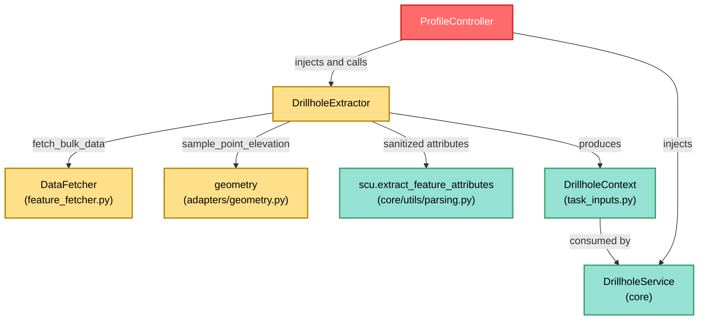

---
tags:
  - secinterp
  - code-walkthrough
  - gui
  - adapters
aliases:
  - drillhole_extractor.py
  - DrillholeExtractor
cssclass: secinterp-note
---

# `gui/adapters/drillhole_extractor.py`

> [!abstract] One-line summary
> **Extract** adapter for drillholes that reads the section line and the collar, survey and interval layers from QGIS and returns a fully-detached `DrillholeContext` so `DrillholeService` never touches QGIS objects.

**Path**: `gui/adapters/drillhole_extractor.py` (369 lines)
**Main class**: `DrillholeExtractor`
**Layer**: GUI · Adapter (Extract side, depends on QGIS)
**Tags**: #secinterp #gui #adapters

---

## 🎯 Why does this file exist?

Projecting drillholes onto a section requires reading four heterogeneous QGIS
layers (line, collars, surveys, intervals) plus an optional DEM, and converting
them to primitives. That reading cannot live in the core (which is QGIS-agnostic)
nor mixed into a dialog:

| Problem | Solution |
|---------|----------|
| The core cannot import `qgis.core` or read `QgsVectorLayer` | The extractor reads the layers and produces a pure `DrillholeContext` |
| Four layers + DEM with different fields and CRS must be combined | `extract_context` orchestrates line → collars → surveys/intervals → Z |
| Reading surveys/intervals hole-by-hole would be N+1 queries | Delegates to `DataFetcher.fetch_bulk_data` (one pass per child layer) |
| The collar elevation may be missing from the Z attribute | Pre-sampling from DEM (`_pre_sample_z` / `_sample_elevation`) |

> [!important] Architectural note
> **Extract Adapter** of the Extract-then-Compute pattern. Everything touching
> `QgsVectorLayer`, `QgsFeatureRequest`, `QgsProject` or `QgsRasterLayer` lives here,
> on the main thread; the result (`DrillholeContext` with tuples, dicts and
> `Point2D`) is the only thing crossing into the core and background `QgsTask`s.

---

## 🧬 Relationship diagram



> [!tip] How to read
> Solid arrow = imports/delegates; `DrillholeExtractor` is the only QGIS-knowing
> link in this chain. `DrillholeService` only ever sees the `DrillholeContext`.

---

## 📦 Imports — architectural reading

```python
# gui/adapters/drillhole_extractor.py
from __future__ import annotations

import math
from typing import Any

from qgis.core import (
    QgsCoordinateReferenceSystem,
    QgsFeatureRequest,
    QgsGeometry,
    QgsProject,
    QgsRasterLayer,
    QgsVectorLayer,
)
from qgis.PyQt.QtCore import QCoreApplication

from sec_interp.core import utils as scu
from sec_interp.core.domain.task_inputs import DrillholeContext
from sec_interp.core.exceptions import DataMissingError, ValidationError
from sec_interp.gui.adapters import geometry
from sec_interp.logger_config import get_logger
```

| # | Observation |
|---|-------------|
| ① | Six `qgis.core` classes: declaratively the GUI side; the core never imports them. |
| ② | `qgis.PyQt.QtCore.QCoreApplication` (not direct `PyQt5`): QGIS 4.x-ready agnostic import. |
| ③ | Imports the `DrillholeContext` DTO and domain exceptions: the Extract→Compute boundary stays typed. |
| ④ | Reuses `scu.extract_feature_attributes` (sanitizes `QVariant` to primitives, thread-safe) and `geometry.sample_point_elevation`. |
| ⑤ | `math` is only used for the section azimuth (`atan2` + `degrees`). |

---

## 🏗️ Structure inventory

**Module constant:**
- `DEFAULT_BUFFER_SEGMENTS = 8` — segments of the `buffer()` around the section line.

**Class:** `class DrillholeExtractor` — 14 methods (1 main public + `__init__` + `tr` + 11 private).

**Public methods:**
- `__init__(data_fetcher=None)` — optional `DataFetcher` injection.
- `tr(message)` — translation via `QCoreApplication.translate("DrillholeExtractor", ...)`.
- `extract_context(line_layer, buffer_width, collar_layer, collar_id_field, use_geometry, collar_x_field, collar_y_field, collar_z_field, collar_depth_field, survey_layer, survey_fields, interval_layer, interval_fields, dem_layer=None, band_num=1)` — orchestrator returning `DrillholeContext | None`.

**Private methods:**
- `_read_line_geometry(line_lyr)` — first line feature; `None` on null geometry.
- `_validate_fields(...)` / `_validate_collar_fields(...)` / `_validate_child_fields(...)` / `_check_field(...)` — level-3 validation (field mapping).
- `_extract_line_points(geometry)` — `(x, y)` tuples from single or multipart lines; `_calculate_azimuth(points)` — compass bearing from the first two vertices.
- `_detach_collars(...)` — buffer + spatial request + collar detaching.
- `_create_line_buffer(line_geom, buffer_width)` — failure-tolerant `buffer()` (`None` on failure).
- `_prepare_feature_request(...)` — `QgsFeatureRequest` with bbox and destination CRS.
- `_extract_point(feat, attrs, use_geom, x_field, y_field)` — point from geometry or X/Y fields.
- `_pre_sample_z(...)` / `_sample_elevation(dem_layer, point)` — fallback Z from DEM.

---

## 📁 Files in the package

The extractor lives in the `gui/adapters/` package (the full Extract phase):

| File | Lines | Role |
|---|--:|---|
| `__init__.py` | 7 | Package docstring: Extract-then-Compute contract |
| `drillhole_extractor.py` | 369 | `DrillholeExtractor` → `DrillholeContext` (this note) |
| `geology_extractor.py` | 235 | `GeologyExtractor` → `GeologyContext` |
| `geometry.py` | 226 | QGIS geometry helpers and DEM sampling |
| `layer_resolver.py` | 113 | `LayerResolver` + `resolve_layer` (layer cache) |
| `structure_extractor.py` | 226 | `SectionContext` + `StructureExtractor` |
| `validation_extractor.py` | 176 | `resolve_layer_metadata`, `build_validation_params` |
| `feature_fetcher.py` | 84 | `DataFetcher` (bulk child reads) |
| `profile_extractor.py` | 86 | `ProfileExtractor` → `ProfileData` |

---

## 📖 Method-by-method walkthrough

### `__init__` — child-fetcher injection

```python
def __init__(self, data_fetcher: Any | None = None) -> None:
    self.data_fetcher = data_fetcher
```

The `DataFetcher` is optional: without it the context comes out with empty
`survey_data` and `interval_data` (useful in tests and deviation-free profiles).
`ProfileController` injects it from the composition root.

### `tr` — adapter i18n

```python
def tr(self, message: str) -> str:
    return QCoreApplication.translate("DrillholeExtractor", message)
```

Every error message goes through here with the `"DrillholeExtractor"` context,
so `update-strings.sh` picks them up for Qt Linguist.

### `extract_context` — Extract orchestrator

```python
def extract_context(
    self, line_layer, buffer_width, collar_layer, collar_id_field,
    use_geometry, collar_x_field, collar_y_field, collar_z_field,
    collar_depth_field, survey_layer, survey_fields, interval_layer,
    interval_fields, dem_layer=None, band_num=1,
) -> DrillholeContext | None:
    if buffer_width <= 0:
        raise ValidationError(self.tr("Buffer width must be positive"))
    self._validate_fields(...)  # level 3: aborts before expensive I/O
    line_geom = self._read_line_geometry(line_layer)
    if line_geom is None:
        return None
    line_points = self._extract_line_points(line_geom)
    section_azimuth = self._calculate_azimuth(line_points)
    ...
```

| Step | Detail |
|------|--------|
| **Buffer guard** | `buffer_width <= 0` → `ValidationError` before touching layers. |
| **Level-3 validation** | `_validate_fields` checks every field mapping; fails fast. |
| **Line** | `_read_line_geometry` may return `None` (null geometry) → the method returns `None`, not an empty context. |
| **Collars** | `_detach_collars` with `target_crs=line_layer.crs()`; without a `collar_layer`, empty lists. |
| **Children** | Only when `collar_ids` is non-empty **and** a `data_fetcher` exists: two `fetch_bulk_data` calls (survey, intervals). |
| **Output** | `DrillholeContext` with 10 fields, all primitives. |

### `_read_line_geometry` — first line feature

```python
def _read_line_geometry(self, line_lyr: QgsVectorLayer) -> QgsGeometry | None:
    line_feat = next(line_lyr.getFeatures(), None)
    if not line_feat:
        raise DataMissingError(self.tr("Line layer has no features"))
    line_geom = line_feat.geometry()
    if not line_geom or line_geom.isNull():
        return None
    return line_geom
```

Empty layer → `DataMissingError`; null geometry → `None` (caller decides).
Only the **first** feature is read: the section is a single polyline.

### `_validate_fields` / `_validate_collar_fields` / `_validate_child_fields` / `_check_field`

Three-level validation chain: `_validate_fields` fans out to collars
(`_validate_collar_fields`: ID always; X/Y only when `use_geometry` is false; Z
and depth only when the name is non-empty) and children (`_validate_child_fields`
for each mapping value labelled `"Survey"` / `"Interval"`).
`_check_field(field_name, fields, label)` ignores empty names (`""` = unused
optional field) and raises `ValidationError("{Label} field '{x}' not found")`
when the field is missing.

### `_extract_line_points` — vertices to tuples

```python
def _extract_line_points(self, geometry: QgsGeometry) -> list[tuple[float, float]]:
    if geometry.isMultipart():
        parts = geometry.asMultiPolyline()
        polyline = parts[0] if parts else []
    else:
        polyline = geometry.asPolyline()
    return [(p.x(), p.y()) for p in polyline]
```

Takes the first part of multilines. The result is `list[tuple[float, float]]`,
the `Point2D` type expected by `DrillholeContext.line_points`.

### `_calculate_azimuth` — section bearing

```python
def _calculate_azimuth(self, points: list[tuple[float, float]]) -> float:
    MIN_REQUIRED_POINTS = 2
    if len(points) < MIN_REQUIRED_POINTS:
        return 0.0
    p1, p2 = points[0], points[1]
    azimuth = math.degrees(math.atan2(p2[0] - p1[0], p2[1] - p1[1]))
    if azimuth < 0:
        azimuth += 360
    return azimuth
```

`atan2(dx, dy)` yields the compass bearing (0° = north, clockwise), normalized to
`[0, 360)`. Fewer than 2 vertices returns `0.0` instead of failing.

### `_detach_collars` — buffer and detach

```python
def _detach_collars(self, collar_layer, line_geom, buffer_width, id_field,
                    use_geom, x_field, y_field, z_field, dem_layer,
                    target_crs=None):
    line_buffer = self._create_line_buffer(line_geom, buffer_width)
    req = self._prepare_feature_request(line_geom, line_buffer, collar_layer, target_crs)
    ...
    for feat in collar_layer.getFeatures(req):
        if line_buffer and not feat.geometry().intersects(line_buffer):
            continue
        hid = feat[id_field]
        ...
        collar_data.append({"id": hid, "point": point, "attributes": attrs})
        ...
    return collar_ids, collar_data, pre_sampled_z
```

Double filter: first the bbox in the `QgsFeatureRequest` (cheap, uses the spatial
index), then the exact `intersects` against the buffer (expensive but precise).
Attributes are sanitized with `scu` (`QVariant` → primitives, thread-safe).
A collar without an extractable point is skipped without aborting the rest.

### `_create_line_buffer` — tolerant buffer

```python
def _create_line_buffer(self, line_geom, buffer_width):
    try:
        return line_geom.buffer(buffer_width, DEFAULT_BUFFER_SEGMENTS)
    except (AttributeError, TypeError, ValueError):
        return None
```

If buffering fails it returns `None` and `_detach_collars` degrades gracefully
(bbox-only filtering). `DEFAULT_BUFFER_SEGMENTS = 8` balances smoothness and cost.

### `_prepare_feature_request` — request with destination CRS

```python
def _prepare_feature_request(self, line_geom, line_buffer, layer, target_crs):
    bbox = line_buffer.boundingBox() if line_buffer else line_geom.boundingBox()
    req = QgsFeatureRequest().setFilterRect(bbox)
    if target_crs and target_crs.isValid() and layer.crs() != target_crs:
        transform_context = QgsProject.instance().transformContext()
        req.setDestinationCrs(target_crs, transform_context)
    return req
```

Reprojects on the fly only when the collar CRS differs from the line CRS, using
the project's `transformContext()`. The only `QgsProject` call in the module.

### `_extract_point` — point from geometry or fields

```python
def _extract_point(self, feat, attrs, use_geom, x_field, y_field):
    if use_geom:
        geom = feat.geometry()
        if geom and not geom.isNull() and not geom.isEmpty():
            pt = geom.asPoint()
            return (pt.x(), pt.y())
    try:
        x = float(attrs.get(x_field, 0.0))
        y = float(attrs.get(y_field, 0.0))
        return (x, y)
    except (ValueError, TypeError):
        return None
```

`use_geometry=True` is the preferred path; the X/Y fields are the fallback for
tabular collar layers without point geometry. Non-numeric coordinates → `None`
(the collar is skipped).

### `_pre_sample_z` / `_sample_elevation` — fallback Z from DEM

```python
def _pre_sample_z(self, feat, attrs, hid, z_field, point, dem_layer):
    z_val = 0.0
    if z_field:
        try:
            z_val = float(attrs.get(z_field, 0.0) or 0.0)
        except (ValueError, TypeError):
            z_val = 0.0
    if z_val == 0.0 and dem_layer:
        elev = self._sample_elevation(dem_layer, point)
        if elev:
            return elev
    return None
```

`_sample_elevation` checks `dem_layer.isValid()` and delegates to
`geometry.sample_point_elevation(dem_layer, point)` (default band 1).

The DEM is only sampled when the Z attribute is missing or zero (zero is read as
"no data", a domain convention). `pre_sampled_z` maps `hole_id → elevation` and
the core consumes it as the context's `pre_sampled_z`.

---

## 🔄 Data flow

| Phase | Input | Transformation | Output |
|-------|-------|----------------|--------|
| Guard | `buffer_width` | `<= 0` → `ValidationError` | — |
| Level-3 validation | layers + mappings | `_validate_fields` | nothing (or exception) |
| Line | `line_layer` (1st feature) | `_read_line_geometry`, `_extract_line_points`, `_calculate_azimuth` | `line_points`, `section_azimuth` |
| Collars | `collar_layer` + buffer | bbox → `intersects` → `scu` + `_extract_point` | `collar_ids`, `collar_data` |
| Prior Z | `point` + `dem_layer` | `_pre_sample_z` when Z is 0 | `pre_sampled_z` |
| Children | `collar_ids` + mappings | `DataFetcher.fetch_bulk_data` × 2 | `survey_map`, `interval_map` |
| Context | all of the above | `DrillholeContext` constructor | Pure DTO to the core |

---

## 🏛️ Design patterns present

| Pattern | Where | Purpose |
|---------|-------|---------|
| **Adapter (Extract)** | whole module | Translates QGIS → primitives with no business logic |
| **Dependency Injection** | `__init__(data_fetcher)` | Optional, mockable fetcher |
| **Fail-fast validation** | `_validate_*` before reading | Mis-mapped fields abort before expensive I/O |
| **Graceful degradation** | `_create_line_buffer`, point-less collar | One bad datum does not kill the extraction |
| **Bulk fetch** | via `DataFetcher` | Two passes instead of N per-hole queries |

---

## 🧾 API summary

| Symbol | Signature / Inherits | Typical use |
|--------|----------------------|-------------|
| `DrillholeExtractor` | GUI class | `DrillholeExtractor(data_fetcher)` |
| `extract_context` | `(line_layer, buffer_width, collar_layer, collar_id_field, use_geometry, collar_x_field, collar_y_field, collar_z_field, collar_depth_field, survey_layer, survey_fields, interval_layer, interval_fields, dem_layer=None, band_num=1) -> DrillholeContext \| None` | Extract entry point |
| `tr` | `(message: str) -> str` | Message i18n |
| `_detach_collars` | `(collar_layer, line_geom, buffer_width, id_field, use_geom, x_field, y_field, z_field, dem_layer, target_crs=None) -> tuple[set, list, dict]` | Detach core |
| `DEFAULT_BUFFER_SEGMENTS` | `= 8` | Line-buffer smoothness |

---

## 🛡️ Error handling

| Situation | Behaviour |
|-----------|-----------|
| `buffer_width <= 0` | Immediate `ValidationError` |
| Mapped field missing | `ValidationError("{Label} field '{x}' not found")` |
| Empty line layer | `DataMissingError("Line layer has no features")` |
| Null line geometry | `return None` (not a fatal error) |
| `buffer()` fails | `None` → bbox-only filtering |
| Collar without point | skipped, loop continues |
| Non-numeric Z | treated as `0.0` → tries DEM |

---

## 🧪 Associated tests

The module has **no dedicated unit tests** under `tests/gui/` (there is no
`test_drillhole_extractor.py`); it is covered indirectly through its consumers
and the core:

- `tests/gui/tasks/test_drillhole_task.py` — the task consuming the extracted context.
- `tests/integration/test_geology_structure_workflow.py` — integrated Extract→Compute flow.
- `tests/integration/test_async_orchestrators.py` — orchestration with injected extractors.
- `tests/core/test_drillhole_service.py` — the core consumer with a mocked `DrillholeContext`.
- `tests/core/test_drillhole_service_optional.py` — service without optional components.
- `tests/base_test.py` — `BaseTestCase` with QGIS mocks for testing the extractor without real QGIS.

---

## 🧵 Thread-safety and i18n

| Aspect | Detail |
|--------|--------|
| **Thread** | The whole extractor runs on the main thread (it reads live `QgsVectorLayer`/`QgsProject`); only the resulting `DrillholeContext` travels to the `QgsTask`. |
| **Attributes** | `scu.extract_feature_attributes` converts `QVariant` to primitives to avoid threading issues on QGIS 4/Qt6. |
| **i18n** | `self.tr()` with the `"DrillholeExtractor"` context via `qgis.PyQt` (Qt5/Qt6 agnostic); without `tr` strings would stay outside Linguist. |

---

## 👀 Observations and notes

> [!success] Strengths
> - Sharp Extract boundary: the core receives 10 primitive fields, zero QGIS.
> - Double spatial filter (bbox + `intersects`) with degradation when buffering fails.
> - On-the-fly reprojection only when CRS differ.
> - Fallback Z from DEM with an explicit convention (0.0 = no data).

> [!warning] Points of attention
> - `band_num` is accepted but **unused** in this module (the DEM is sampled with the default band 1 in `geometry.sample_point_elevation`): a dormant parameter.
> - Only the first line feature is read; a layer with several sections is silently processed partially.
> - `0.0` as "no data" collides with a real 0 m above-sea-level elevation.
> - `_detach_collars` iterates every bbox feature on the main thread: huge layers may freeze the GUI (candidate for a paginated `QgsTask`).

> [!question] Open questions
> - Propagate `band_num` down to `sample_point_elevation`, or drop it from the signature?
> - Warn the user when the line has more than one feature instead of ignoring them?
> - Use a `None` sentinel instead of `0.0` for "missing Z"?

---

## 🔗 Related notes

- [[Index]] — vault index
- [[gui_adapters]] — Extract adapters package note
- [[feature_fetcher]] — `DataFetcher` used for surveys and intervals
- [[geometry]] — `sample_point_elevation` for the fallback Z
- [[task_inputs]] — `DrillholeContext` DTO produced here
- [[drillhole_service]] — core consumer of the context
- [[controller]] — `ProfileController` injecting and orchestrating the extractor
- [[structure_extractor]] — sibling extractor (same shape: line + buffer + detach)
- [[validation_extractor]] — prior validation of the drillhole layers

---

*Note of the SecInterp Code Walkthrough v2 vault — v3.8.0*
