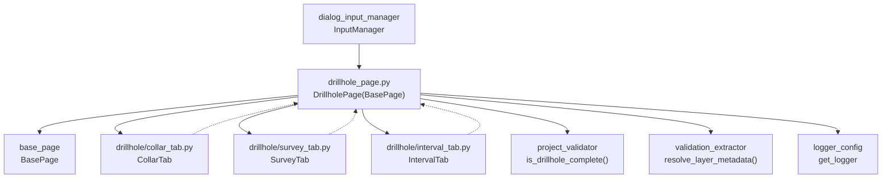

---
tags:
  - secinterp
  - code-walkthrough
  - gui
  - pages
aliases:
  - drillhole_page.py
  - DrillholePage
cssclass: secinterp-note
---

# `gui/ui/pages/drillhole_page.py`

> [!abstract] One-line summary
> Drillhole coordinator page: a `QTabWidget` container (Collars/Survey/Intervals) merging reading, persistence, reset and signals of the three tabs toward the dialog.

**Path**: `gui/ui/pages/drillhole_page.py` (130 lines)
**Main class**: `DrillholePage(BasePage)`
**Layer**: GUI (tab coordination · Extract into `ValidationParams`)
**Tags**: #secinterp #gui #pages

---

## 🎯 Why does this file exist?

A drillhole needs three tables (collar, deviations, intervals) with a dozen fields
across layers and columns. Without a coordinator, the dialog would have to know all
three forms and merge their dicts by hand on every operation.

| Problem | Solution |
|---------|----------|
| Three independent forms (collar/survey/interval) sharing one protocol | `DrillholePage` hosts them in a `QTabWidget` and merges `get_data/dump` with `dict.update` |
| The dialog must hear about any change in any tab | Re-emission: `tab.dataChanged → DrillholePage.dataChanged` |
| Connecting/disconnecting 3 tabs × N signals is repetitive and leak-prone | Loop in `connect_signals` / `disconnect_signals` with `contextlib.suppress` |

> [!important] Architectural note
> Manager-pattern Coordinator: the page owns no data widgets of its own, only the
> tab container. It delegates everything to `CollarTab`, `SurveyTab` and `IntervalTab`
> (`gui/ui/pages/drillhole/`), just as [[settings_page]] delegates to its tabs.

---

## 🧬 Relationship diagram



> [!tip] How to read
> Solid arrow = imports/delegates; dashed = the tab emits `dataChanged` and the page re-emits it.

---

## 📦 Imports — architectural reading

```python
# gui/ui/pages/drillhole_page.py
from __future__ import annotations

import contextlib
from typing import Any

from qgis.PyQt.QtCore import QCoreApplication, pyqtSignal
from qgis.PyQt.QtWidgets import QTabWidget, QVBoxLayout, QWidget

from sec_interp.core.validation.project_validator import ProjectValidator, ValidationParams
from sec_interp.gui.adapters.validation_extractor import resolve_layer_metadata
from sec_interp.logger_config import get_logger

from .base_page import BasePage
from .drillhole import CollarTab, IntervalTab, SurveyTab
```

| # | Observation |
|---|-------------|
| ① | `contextlib.suppress(TypeError, RuntimeError)` for idempotent disconnects, as in [[geology_page]] and [[structure_page]]. |
| ② | `pyqtSignal` defines `dataChanged`: one of the pages with its own signal (alongside [[geology_page]] and [[structure_page]]). |
| ③ | Container-only widgets (`QTabWidget`, `QVBoxLayout`): the layer combos live inside each tab, not here. |
| ④ | `ProjectValidator` + `ValidationParams` + `resolve_layer_metadata`: `is_complete()` translates 3 live layers into metadata before the core. |
| ⑤ | Module-level `get_logger(__name__)`, although the file currently logs nothing: scaffolding ready for the coordinator. |
| ⑥ | Relative `.drillhole` import of the three-form sub-package: the page is the package facade. |

---

## 🏗️ Structure inventory

**`DrillholePage(BasePage)` class:**

- `dataChanged = pyqtSignal()` signal and `layer_keys = frozenset({"dh_collar_layer", "dh_survey_layer", "dh_interval_layer"})`
- `__init__(self, parent: QWidget | None = None) -> None`
- `_setup_ui(self) -> None` — Collars/Survey/Intervals tabs
- `get_data(self) -> dict[str, Any]` — 3-tab merge
- `dump(self) -> dict[str, Any]` — 3-tab merge
- `load(self, data: dict[str, Any]) -> None` — fans out to the 3 tabs
- `reset(self) -> None` — resets the 3 tabs
- `is_complete(self) -> bool` — full `ValidationParams` → `is_drillhole_complete`
- `connect_signals(self) / disconnect_signals(self) -> None` — loop over tabs

**Child tabs (exact names):**

| Attribute | Class | Visible tab | Keys contributed |
|-----------|-------|-------------|------------------|
| `collar_tab` | `CollarTab` | Collars | `collar_layer/use_geometry/collar_id/collar_x/collar_y/collar_z/collar_depth` |
| `survey_tab` | `SurveyTab` | Survey | `survey_layer/survey_id/survey_depth/survey_azim/survey_incl` |
| `interval_tab` | `IntervalTab` | Intervals | `interval_layer/interval_id/interval_from/interval_to/interval_lith` |

---

## 📖 Method-by-method walkthrough

### `__init__` — title only

```python
def __init__(self, parent: QWidget | None = None) -> None:
    super().__init__(QCoreApplication.translate("DrillholePage", "Drillhole Data"), parent)
```

No `iface` (unlike [[dem_page]]): the tabs resolve project layers themselves. All
construction happens in `_setup_ui` via the base.

### `_setup_ui` — tab widget on the inherited group

```python
def _setup_ui(self) -> None:
    super()._setup_ui()

    layout = self.group_box.layout()
    if layout is None:
        layout = QVBoxLayout(self.group_box)
        self.group_box.setLayout(layout)

    self.tab_widget = QTabWidget()
    layout.addWidget(self.tab_widget)

    self.collar_tab = CollarTab()
    self.tab_widget.addTab(self.collar_tab, self.tr("Collars"))
    # ... SurveyTab → "Survey", IntervalTab → "Intervals" ...
    layout.addStretch()
```

Reuses the `group_box` layout if present, else creates a `QVBoxLayout`; adds the
`QTabWidget` with the three forms (`self.tr()` titles) plus a trailing stretch.
[[settings_page]] uses the same container skeleton (Default / Advanced / info tabs).
Tabs are built without an explicit `parent`: the `QTabWidget` takes ownership when
adding them.

### `get_data` / `dump` — merge with `update`

```python
def get_data(self) -> dict[str, Any]:
    data: dict[str, Any] = {}
    data.update(self.collar_tab.get_data())
    data.update(self.survey_tab.get_data())
    data.update(self.interval_tab.get_data())
    return data
# dump() is identical but calls .dump() on each tab.
```

Flat merge in collar → survey → interval order; tab namespaces never collide by
design (`collar_`/`survey_`/`interval_` prefixes). `get_data` mixes live layers and
fields; `dump` mixes persistable layers and primitives. `InputManager` consumes 17
drillhole keys (`collar_layer_obj`, `collar_id_field`, …, `interval_lith_field`)
from this merged dict.

### `load` / `reset` — fan-out to the tabs

```python
def load(self, data: dict[str, Any]) -> None:
    self.collar_tab.load(data)
    self.survey_tab.load(data)
    self.interval_tab.load(data)
# reset() is identical but takes no arguments.
```

Each tab picks its own keys with defensive `.get()`, so the page-level `load`/`reset`
are pure fan-out with no field knowledge. Note `load` hands over the whole dict
(no sub-dicts): each tab ignores what does not concern it.

### `is_complete` — the dialog's largest `ValidationParams`

```python
def is_complete(self) -> bool:
    data = self.get_data()
    params = ValidationParams(
        collar_layer=resolve_layer_metadata(data["collar_layer"]),
        collar_id=data["collar_id"],
        collar_use_geom=data["use_geometry"],
        collar_x=data["collar_x"],
        collar_y=data["collar_y"],
        # ... survey_* (5) and interval_* (5) ...
    )
    return ProjectValidator.is_drillhole_complete(params)
```

Builds the 14-field `ValidationParams` (3 detached layers + 11 field identifiers)
and delegates to `is_drillhole_complete`, which requires collar + id and validates
each block with `DrillholeValidator`. The strictest completeness check among pages:
compare [[section_page]], which only tests `bool(currentLayer())`.

### `connect_signals` / `disconnect_signals` — looped re-emission

```python
def connect_signals(self) -> None:
    for tab in (self.collar_tab, self.survey_tab, self.interval_tab):
        tab.dataChanged.connect(self.dataChanged.emit)
        tab.connect_signals()

def disconnect_signals(self) -> None:
    for tab in (self.collar_tab, self.survey_tab, self.interval_tab):
        tab.disconnect_signals()
        with contextlib.suppress(TypeError, RuntimeError):
            tab.dataChanged.disconnect(self.dataChanged.emit)

    with contextlib.suppress(TypeError, RuntimeError):
        self.dataChanged.disconnect()
```

Wires the re-emission **before** delegating to each tab, and unwires in reverse
(tab first, then the bridge). The bare `self.dataChanged.disconnect()` drops all
external subscribers at once (the dialog re-subscribes on every rewire). Internally,
each tab already connects its `layerChanged` / `fieldChanged` / `toggled` to its own
`dataChanged` (see [[collar_tab]], [[survey_tab]], [[interval_tab]]).

---

## 🗂️ Read keys vs session keys

`get_data` and `dump` do not share names: the former speaks the validator's
language, the latter the session store's (`layer_keys` per block).

| Tab | `get_data` (reading) | `dump` (session) |
|-----|----------------------|------------------|
| Collar | `collar_layer` (live) | `dh_collar_layer` |
| Collar | `use_geometry, collar_id, collar_x, collar_y, collar_z, collar_depth` | same keys (primitives) |
| Survey | `survey_layer` (live) | `dh_survey_layer` |
| Survey | `survey_id, survey_depth, survey_azim, survey_incl` | same keys (primitives) |
| Interval | `interval_layer` (live) | `dh_interval_layer` |
| Interval | `interval_id, interval_from, interval_to, interval_lith` | same keys (primitives) |

> [!note] Only layers are renamed
> Field names (`collar_id`, `survey_azim`, `interval_lith`…) are identical for
> reading and sessions; only the three layers change from `*_layer` to `dh_*_layer`.
> `InputManager` additionally re-maps them to `collar_layer_obj`, `collar_id_field`, etc.
> Session stores keep layer objects; field names travel as plain strings.

---

## 🧩 Dialog lifecycle

How the page takes part in the main dialog (`SecInterpDialog`) lifecycle:

| Moment | Who | What it does with the page |
|--------|-----|----------------------------|
| Construction | [[main_window]] / dialog | `DrillholePage()` in the `QStackedWidget`, "Drillholes" entry in [[sidebar]] |
| Wiring | `SignalManager` | `page.connect_signals()` + subscribes `dataChanged` to refresh validity and buttons |
| Editing | user | any tab change bubbles as `dataChanged`; the dialog revalidates |
| Preview | `InputManager.can_preview` | requires DEM + section; drillholes optional but validated when a collar exists |
| Full validation | `InputManager.validate_inputs` | `get_validation_params()` includes all 14 drillhole fields |
| Export | export managers | `get_data()` feeds layers and fields to the pipeline |
| Session | multi-session persistence | `dump()` stores `dh_*`; `load()` restores via fan-out |
| Teardown | `SignalManager` | `page.disconnect_signals()` breaks bridges and subscriptions |

---

## 🔄 Data flow

| Phase | Input | Transformation | Output |
|-------|-------|----------------|--------|
| Editing | user in any tab | `fieldChanged/layerChanged → tab.dataChanged → page.dataChanged` | dialog refreshes its state |
| Reading | 3 tabs | chained `update` | flat 17-key dict |
| Aggregation | merged dict | `InputManager.get_all_values()` | `collar_*_field/survey_*_field/interval_*_field` |
| Completeness | live layers + fields | 3× `resolve_layer_metadata` + `is_drillhole_complete` | `bool` |
| Persistence | 3 tabs | merged `dump()` | `dh_*_layer` keys + fields |
| Restoration | session dict | `load()` fan-out to each tab | restored forms |

---

## 🏛️ Design patterns present

| Pattern | Where | Purpose |
|---------|-------|---------|
| **Coordinator / Facade** | page over 3 tabs | Dialog sees a single drillhole page |
| **Fan-out / Fan-in** | `load/reset` fan out; `get_data/dump` merge | Read/write symmetry |
| **Signal relay** | `tab.dataChanged → dataChanged.emit` | Single external subscription point |
| **Extract-then-Compute** | `is_complete` detaches 3 layers | Core validates without QGIS |

---

## 🧾 API summary

| Symbol | Signature / Inherits | Typical use |
|--------|----------------------|-------------|
| `DrillholePage` | `(BasePage)` | "Drillholes" tab of the `QStackedWidget` |
| `dataChanged` | `pyqtSignal()` | dialog refreshes validity on emit |
| `layer_keys` | `dh_collar_layer/dh_survey_layer/dh_interval_layer` | per-block persistence |
| `get_data/dump` | collar+survey+interval merge | reading and sessions |
| `load/reset` | fan-out to the 3 tabs | restore and defaults |
| `is_complete` | via `is_drillhole_complete` | preview/export gate |

---

## 🛡️ Error handling

- `is_drillhole_complete` returns `False` when `collar_layer` or `collar_id` is missing before invoking the validator: no collar, nothing to validate.
- `load` tolerates partial dicts because each tab uses per-key `.get()`; a session without a survey block restores collar and intervals cleanly.
- Disconnections shielded with `suppress(TypeError, RuntimeError)` per bridge and globally: rewiring the dialog then closing never raises.
- No custom `validate()` (inherits base `(True, "")`): the real gate is `is_complete` + `InputManager.validate_inputs`, which surfaces the core message.

---

## 🧪 Associated tests

Real direct coverage in `tests/gui/test_drillhole_page.py` (imports
`DrillholePage` plus `CollarTab`, `IntervalTab`, `SurveyTab`):

- `get_data` keys (17: `collar_layer/use_geometry/collar_id/collar_x/…/interval_lith`) and `dump` keys.
- `load/reset` coordination across the three tabs and `dataChanged` re-emission.
- `is_complete` with mocked layers via `tests/base_test.py`.

Indirect:

- `tests/gui/test_dialog_input_manager.py` — `drillhole` rules (`is_drillhole_complete(p) if p.collar_layer else True`).
- `tests/gui/test_main_dialog_validation_manager.py` — `"Drillhole configuration is incomplete"` message.
- `tests/gui/test_multi_session_persistence.py` — round-trip with `dh_*` keys.
- `tests/gui/test_signal_restoration.py` — `dataChanged` bridges survive rewires.

| Test method | What it verifies on this page |
|-------------|-------------------------------|
| `test_get_data_keys` | all 17 read keys exist after building the tabs |
| `test_dump_keys` | `dump()` uses `dh_*_layer` for layers and keeps fields |
| `test_load_roundtrip` | `load(dump())` leaves combos in the same state |
| `test_dataChanged_relay` | a change in one tab emits `DrillholePage.dataChanged` |
| `test_is_complete` | no collar → `False`; collar + fields → `True` |

---

## 🌐 i18n and migration notes

- Tab titles via `self.tr("Collars"/"Survey"/"Intervals")` and group title with the `"DrillholePage"` context: all visible text enters the catalogue.
- No numeric formatting of its own: tabs format their fields; the page only touches `tr()` for titles.
- Only `QTabWidget/QVBoxLayout` from `qgis.PyQt`: no QGIS 4.x migration risk.

---

## 👀 Observations and notes

> [!success] Strengths
> - Symmetric fan-in/fan-out: `load` cannot forget a field `dump` saved, since both delegate to the same tabs.
> - 3-line looped re-emission: adding a fourth tab (e.g. assays) is trivial.
> - `is_complete` with explicit detachment of all 3 layers: textbook Extract-then-Compute.

> [!warning] Points of attention
> - `logger` defined but unused in the file: either use it (e.g. on partial `load`) or drop the import.
> - Bare `self.dataChanged.disconnect()` drops **all** external subscriptions; any non-dialog subscriber loses out too.
> - No custom `validate()`: a collar without id passes Level 1 and only fails at the core validator (less contextual message).

> [!question] Open questions
> - Add `validate()` with per-block (collar/survey/interval) messages for field-closer errors?
> - Remove the unused `logger` or log partial restorations in `load`?

---

## 🔗 Related notes

- [[Index]] — vault index
- [[base_page]] — protocol coordinated by this page
- [[collar_tab]] / [[survey_tab]] / [[interval_tab]] — the three delegated forms
- [[gui_ui_pages_drillhole]] — `drillhole/` sub-package note
- [[main_window]] — "Drillholes" tab of the `QStackedWidget`
- [[sidebar]] — "Drillholes" entry (`mActionDataSourceManager.svg`)
- [[dialog_input_manager]] — merges the 17 keys in `get_all_values()`
- [[project_validator]] — `is_drillhole_complete` / `DrillholeValidator`
- [[validation_extractor]] — `resolve_layer_metadata` per block
- [[settings_page]] — the other coordinator page (settings tabs)

---

*Note of the SecInterp Code Walkthrough v2 vault — v3.8.0*
