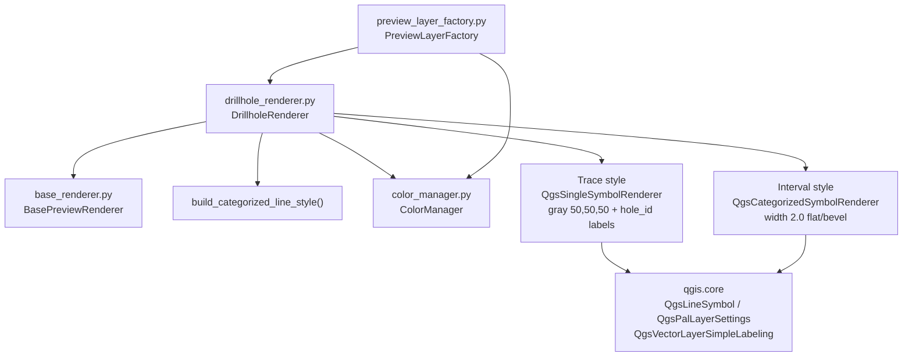

---
tags:
  - secinterp
  - code-walkthrough
  - gui
  - renderers
aliases:
  - drillhole_renderer.py
  - DrillholeRenderer
cssclass: secinterp-note
---

# `gui/renderers/drillhole_renderer.py`

> [!abstract] One-line summary
> Drillhole renderer with a dual role: thin gray traces labeled with `hole_id`, and lithological intervals categorized by unit with the stable `ColorManager` colors.

**Path**: `gui/renderers/drillhole_renderer.py` (71 lines)
**Main class**: `DrillholeRenderer(BasePreviewRenderer)`
**Layer**: GUI · Present (styles memory layers created by `PreviewLayerFactory`)
**Tags**: #secinterp #gui #renderers

---

## 🎯 Why does this file exist?

The preview shows two drillhole layers with opposite visual needs: the trace must stay neutral and readable, while intervals must shout lithology in the same colors as the geology.

| Problem | Solution |
|---------|----------|
| Traces need identification (which drillhole each line is) | Trace style with PAL labeling along the line on the `hole_id` field |
| Intervals must reuse geological unit colors | Interval style via `build_categorized_line_style()` + shared `ColorManager` |
| The factory must request both styles through one interface | `apply_style(layer, role=..., unique_units=...)` dispatching on `role` |

> [!important] Architectural note
> A **Strategy** child of `BasePreviewRenderer`. The `ColorManager` is constructor-injected from `PreviewLayerFactory`, so drillholes and geology share the same `_active_units` cache and an identical `unit_name` gets the same color on both layers. Pure **Present** side: it touches no DTOs or services.

---

## 🧬 Relationship diagram



> [!tip] How to read
> Solid arrow = imports/delegates. The factory creates the `ColorManager` once and shares it between `DrillholeRenderer` and `GeologyRenderer`: that line is what guarantees consistent colors.

---

## 📦 Imports — architectural reading

```python
# gui/renderers/drillhole_renderer.py
from __future__ import annotations

from qgis.core import (
    QgsLineSymbol,
    QgsPalLayerSettings,
    QgsSingleSymbolRenderer,
    QgsTextFormat,
    QgsVectorLayer,
    QgsVectorLayerSimpleLabeling,
)
from qgis.PyQt.QtGui import QColor

from sec_interp.gui.renderers.base_renderer import (
    BasePreviewRenderer,
    build_categorized_line_style,
)
from sec_interp.gui.renderers.color_manager import ColorManager
```

| # | Observation |
|---|-------------|
| ① | Six `qgis.core` classes focused on symbology and PAL labeling: the module only **presents**. |
| ② | `QColor` comes from `qgis.PyQt.QtGui` (Qt5/Qt6-agnostic import, QGIS 4.x-ready), not from `PyQt5` directly. |
| ③ | Imports both the ABC (`BasePreviewRenderer`) and the helper: the only child combining both worlds (own style + helper). |
| ④ | `ColorManager` is imported for constructor typing; the real instance comes from the factory. Constructor injection, not a singleton. |
| ⑤ | Zero `core/` imports: consistent with its Present role. Data already arrives as layers. |

---

## 🏗️ Structure inventory

**Classes (1):**

| Class | Inherits | Methods |
|-------|--------|---------|
| `DrillholeRenderer` | `BasePreviewRenderer` | `__init__`, `apply_style`, `_apply_trace_style`, `_apply_interval_style` |

**Methods:**

| Method | Signature | Role |
|--------|-------|------|
| `__init__` | `(color_manager: ColorManager) -> None` | Keeps the shared manager |
| `apply_style` | `(layer: QgsVectorLayer, **kwargs) -> None` | Dispatches on `role` (`"trace"` by default) |
| `_apply_trace_style` | `(layer: QgsVectorLayer) -> None` | Gray line + `hole_id` labels |
| `_apply_interval_style` | `(layer: QgsVectorLayer, unique_units: set[str]) -> None` | Categorized by `unit` via helper |

---

## 📁 Files in the package

| File | Lines | Role |
|---|--:|---|
| `drillhole_renderer.py` | 71 | This note: dual trace / interval role |
| `base_renderer.py` | 60 | ABC + `build_categorized_line_style()` (contract and helper) |
| `color_manager.py` | 48 | Deterministic palette + shared `_active_units` cache |
| `geology_renderer.py` | 29 | Sibling reusing the helper with defaults |
| `structure_renderer.py` | 18 | Single-line sibling (does not use the helper) |
| `topo_renderer.py` | 32 | Graduated-by-`elev` sibling (does not use the helper) |
| `interpretation_renderer.py` | 43 | Fill-by-`id` sibling (does not use the helper) |

---

## 📖 Method-by-method walkthrough

### `__init__`

```python
def __init__(self, color_manager: ColorManager) -> None:
    self.color_manager = color_manager
```

Keeps the reference without copying: factory, geology, and drillholes share the **same** object, hence the same color cache. Building a private `ColorManager` per renderer would break chromatic consistency.

### `apply_style`

```python
def apply_style(self, layer: QgsVectorLayer, **kwargs) -> None:
    """Apply styling based on layer role (trace or interval)."""
    role = kwargs.get("role", "trace")
    if role == "trace":
        self._apply_trace_style(layer)
    else:
        self._apply_interval_style(layer, kwargs.get("unique_units", set()))
```

Role dispatch with a `"trace"` default: any `role` other than `"trace"` (in practice `"interval"`) falls into the categorized branch. `unique_units` defaults to an empty `set` when the caller omits it, producing a category-less renderer (invisible layer but no exception).

### `_apply_trace_style`

```python
def _apply_trace_style(self, layer: QgsVectorLayer) -> None:
    symbol = QgsLineSymbol.createSimple(
        {"color": "50,50,50", "width": "0.3", "capstyle": "round"}
    )
    layer.setRenderer(QgsSingleSymbolRenderer(symbol))

    settings = QgsPalLayerSettings()
    settings.fieldName = "hole_id"
    settings.placement = QgsPalLayerSettings.Placement.Line

    txt_format = QgsTextFormat()
    txt_format.setColor(QColor(0, 0, 0))
    txt_format.setSize(8)
    settings.setFormat(txt_format)

    layer.setLabeling(QgsVectorLayerSimpleLabeling(settings))
    layer.setLabelsEnabled(True)
```

Deliberately neutral trace: dark gray `50,50,50`, thin (`0.3`), round caps. PAL labeling places the `hole_id` **on the line** (`Placement.Line`) in black, size 8. It requires the memory layer to carry the `hole_id` field, which the factory guarantees when creating the trace layer.

> [!note] Three calls to enable labels
> `setLabeling()` only installs the configuration; `setLabelsEnabled(True)` is what actually turns the labeling engine on. Skipping the second is a classic mistake leaving traces unidentified. `test_apply_trace_style` verifies all three calls.

### `_apply_interval_style`

```python
def _apply_interval_style(self, layer: QgsVectorLayer, unique_units: set[str]) -> None:
    """Styling for lithological intervals."""
    layer.setRenderer(
        build_categorized_line_style(
            self.color_manager,
            unique_units,
            width="2.0",
            capstyle="flat",
            joinstyle="bevel",
        )
    )
```

Delegates to the helper with the default `field` (`"unit"`) but its own visual geometry: **thick** lines (`2.0`) with flat caps and bevel joins, so lithological intervals read as color bands over the thin trace. Requires the `unit` field, also created by the factory.

### Field contract with the factory

The renderer creates no fields: it **requires** them. This is the real coupling to `PreviewLayerFactory`:

| Branch | Required field | Created by | If missing |
|------|---------------|---------------|----------|
| Trace | `hole_id` (text) | `create_drillhole_trace_layer()` | empty labels, visible line |
| Intervals | `unit` (text) | `create_drillhole_interval_layer()` | match-less categories, empty layer |

> [!tip] How to audit the contract
> If traces show without labels or intervals render blank, the first suspect is not this renderer but the factory: verify the memory layer exposes `hole_id`/`unit` before blaming the style.

---

## 🔄 Data flow

| Phase | Input | Transformation | Output |
|-------|-------|----------------|--------|
| Dispatch | `role` + `layer` | `kwargs.get("role", "trace")` | trace branch or interval branch |
| Trace | layer with `hole_id` | gray symbol + PAL `Line` | labeled trace |
| Intervals | layer with `unit` + `unique_units` | helper + `ColorManager` | unit-categorized bands |

---

## 🏛️ Design patterns present

| Pattern | Where | Purpose |
|---------|-------|---------|
| **Strategy** | `DrillholeRenderer(BasePreviewRenderer)` | One more interchangeable renderer in the family |
| **Role dispatcher** | `apply_style()` | Two styles behind one polymorphic signature |
| **Dependency Injection** | `__init__(color_manager)` | Share the chromatic cache with geology |
| **Delegation** | `_apply_interval_style` → helper | Reuse categorization without duplicating it |

---

## 🧾 API summary

| Symbol | Signature / Inherits | Typical use |
|--------|----------------------|-------------|
| `DrillholeRenderer` | `BasePreviewRenderer` | `DrillholeRenderer(color_manager)` (done by the factory) |
| `apply_style` | `(layer, role="trace", unique_units=set()) -> None` | `apply_style(trace_layer)` / `apply_style(iv_layer, role="interval", unique_units=units)` |

---

## 🛡️ Error handling

No private `try/except`; edge cases are silent by QGIS design:

| Situation | Behavior |
|-----------|----------|
| Unknown `role` (e.g. `"collar"`) | Falls into the interval branch; with missing `unique_units`, a symbol-less layer |
| Trace layer without `hole_id` | Empty labels, the gray line still draws |
| Interval layer without `unit` | Categories match nothing: visually empty layer |
| Empty `unique_units` | Category-less categorized renderer, no exception |

---

## 🧪 Associated tests

Direct coverage with mocks in `tests/gui/renderers/test_renderers.py`:

- `TestDrillholeRenderer::test_apply_trace_style` — with `role="trace"` verifies `setRenderer` (once), `setLabeling` (once), and `setLabelsEnabled(True)`. The mocked `ColorManager` is unused on this branch.
- `TestDrillholeRenderer::test_apply_interval_style` — with `role="interval"` and `{"LithA", "LithB"}` verifies `setRenderer` (once) and `get_color` exactly twice, exercising the inherited helper along the way.

No coverage in `tests/core/` (GUI module with `qgis.core` imports). No test for the omitted-`role` default (`"trace"`) or empty `unique_units`.

---

## 👀 Observations and notes

> [!success] Strengths
> - One shared `ColorManager`: the same unit gets the same color in geology and intervals.
> - Deliberate visual contrast: thin neutral trace + thick color bands.
> - PAL labeling on the line: the `hole_id` travels with the geometry, no extra layer.

> [!warning] Points of attention
> - The `else` catches any non-`"trace"` `role`: a typo (`"intervals"`) does not fail, it just yields a possibly empty categorized renderer.
> - Coupled to the `hole_id` and `unit` field names created by the factory; renaming them there breaks styling here with no explicit error.
> - Labels are always enabled; there is no flag to hide them on dense sections.

> [!question] Open questions
> - Validate `role` with a literal (`"trace" | "interval"`) and fail fast on unexpected values?
> - Parameterize the label size (fixed 8) for HiDPI screens?

---

## 🔗 Related notes

- [[Index]] — vault index
- [[gui_renderers]] — family note for renderers
- [[base_renderer]] — ABC contract and helper consumed by this renderer
- [[preview_layer_factory]] — creates the layers (`hole_id`, `unit`) and instantiates this renderer
- [[drillhole_service]] — computes in the core the data only dressed here
- [[drillhole_task]] — brings that data to the main thread before rendering
- [[preview_legend_renderer]] — draws the legend with the same `active_units`

---

*Note of the SecInterp Code Walkthrough v2 vault — v3.8.0*
