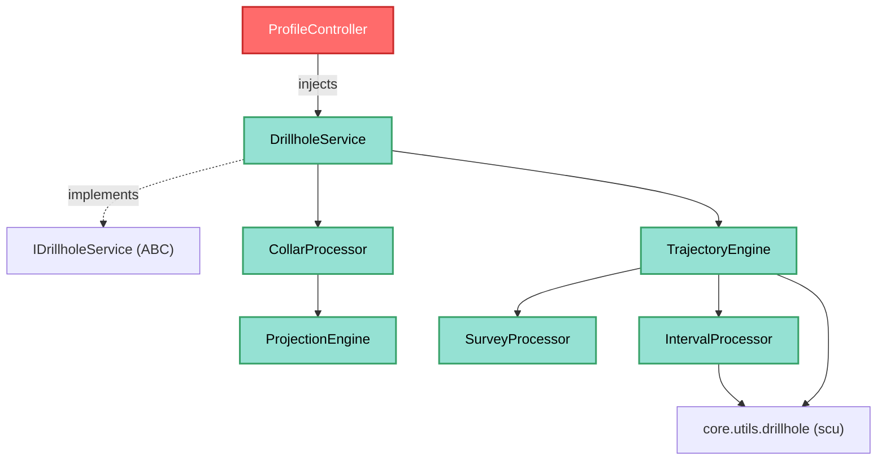

---
tags:
  - secinterp
  - code-walkthrough
  - core
  - services
aliases:
  - drillhole_service.py
  - DrillholeService
  - IDrillholeService
cssclass: secinterp-note
note_lines: 700
---

# `core/services/drillhole_service.py`

> [!abstract] One-line summary
> **Orchestrator** service for drillholes that, from an already-detached `DrillholeContext`, coordinates four pure processors (collar, survey, interval, trajectory) to return `(geol_data, drillhole_data)` without touching QGIS.

**Path**: `core/services/drillhole_service.py` (113 lines)
**Main class**: `DrillholeService(IDrillholeService, TranslatableMixin)`
**Layer**: Core (QGIS-agnostic)
**Tags**: #secinterp #core #services

---

## 🎯 Why does this file exist?

Projecting a drillhole onto a section is a chain of calculations (collar → final depth
→ trajectory → interval interpolation) that must not live in the GUI. This service
centralizes that orchestration over **detached** data:

| Problem | Solution |
|---------|----------|
| Coordinate 4 compute subsystems in one place | `DrillholeService` as a facade over `CollarProcessor`, `SurveyProcessor`, `IntervalProcessor` and `TrajectoryEngine` |
| Keep the core decoupled from QGIS layers | Receives `DrillholeContext` (output of `DrillholeExtractor`), not `QgsVectorLayer` |
| Propagate progress/cancellation in background tasks | `feedback: Any | None` parameter (duck-typed `isCanceled()`/`setProgress()`) |
| Preserve construction compatibility | `data_fetcher` kept in the constructor although unused |

> [!important] Architectural note
> **QGIS-agnostic verified**: not a single `import qgis.*`. The pattern is
> **Extract-then-Compute**: the GUI produces the context (Extract) and this service
> computes it (Compute). It also acts as a **Facade** over the `drillhole/` subsystem.

---

## 🧬 Relationship diagram



> [!tip] How to read
> Solid arrow = imports/delegates; dashed = implements contract. `TrajectoryEngine` is
> the central engine that consumes `SurveyProcessor` and `IntervalProcessor`; the
> service only orchestrates the loop over collars and delegates to it.

---

## 📦 Imports — architectural reading

```python
# core/services/drillhole_service.py
from typing import Any

from sec_interp.core.domain import DrillholeProjection, GeologySegment
from sec_interp.core.domain.task_inputs import DrillholeContext
from sec_interp.core.exceptions import SecInterpError
from sec_interp.core.interfaces.drillhole_interface import IDrillholeService
from sec_interp.core.services.drillhole.collar_processor import CollarProcessor
from sec_interp.core.services.drillhole.interval_processor import IntervalProcessor
from sec_interp.core.services.drillhole.survey_processor import SurveyProcessor
from sec_interp.core.services.drillhole.trajectory_engine import TrajectoryEngine
from sec_interp.core.utils.i18n import TranslatableMixin
from sec_interp.logger_config import get_logger
```

| # | Observation |
|---|-------------|
| ① | **Zero `qgis.*`**: only `typing`, domain, interfaces and the `drillhole/` subsystem. |
| ② | Imports the `IDrillholeService` contract and **implements** it (nominal inheritance). |
| ③ | The 4 collaborators (`CollarProcessor`, `SurveyProcessor`, `IntervalProcessor`, `TrajectoryEngine`) come from `core/services/drillhole/`. |
| ④ | `TranslatableMixin` provides `self.tr()` for localized messages without importing Qt. |
| ⑤ | `DrillholeContext` is the input DTO (produced by the GUI's `DrillholeExtractor`). |

---

## 🏗️ Structure inventory

**Classes:** `class DrillholeService(IDrillholeService, TranslatableMixin)` — 2 methods

**Attributes (injected/composed):**
- `self.collar_processor` — `CollarProcessor` (collar projection)
- `self.survey_processor` — `SurveyProcessor` (final depth)
- `self.interval_processor` — `IntervalProcessor` (interval interpolation)
- `self.data_fetcher` — `Any | None` (kept for compatibility, unused)
- `self.trajectory_engine` — `TrajectoryEngine` (trajectory + result)

**Methods:**
- `__init__(collar_processor, survey_processor, interval_processor, data_fetcher, trajectory_engine)`
- `process_context(context, feedback=None) -> tuple[list[GeologySegment], list[DrillholeProjection]] | None`

---

## 📖 Method-by-method walkthrough

### `__init__` — Dependency injection (Facade)

```python
def __init__(
    self,
    collar_processor: CollarProcessor | None = None,
    survey_processor: SurveyProcessor | None = None,
    interval_processor: IntervalProcessor | None = None,
    data_fetcher: Any | None = None,
    trajectory_engine: TrajectoryEngine | None = None,
) -> None:
    self.collar_processor = collar_processor or CollarProcessor()
    self.survey_processor = survey_processor or SurveyProcessor()
    self.interval_processor = interval_processor or IntervalProcessor()
    self.data_fetcher = data_fetcher
    self.trajectory_engine = trajectory_engine or TrajectoryEngine()
```

Each collaborator is **injectable** and, if `None`, its default implementation is
instantiated (`or CollarProcessor()`). This enables tests with mocks and flexible
composition.

> [!note] `data_fetcher` is a compatibility remnant
> The docstring states it explicitly: *"Kept for backward-compatible construction
> (unused)"*. `ProfileController` passes it via constructor, but the service no longer
> consults it: the context arrives **pre-extracted**.

### `process_context` — Main computation

```python
def process_context(
    self, context: DrillholeContext, feedback: Any | None = None
) -> tuple[list[GeologySegment], list[DrillholeProjection]] | None:
    geol_data_all: list[GeologySegment] = []
    drillhole_data_all: list[DrillholeProjection] = []
    total = len(context.collar_data)

    for i, collar in enumerate(context.collar_data):
        if feedback and feedback.isCanceled():
            return None

        proj = self.collar_processor.extract_and_project_detached(
            collar, context.line_points, context.buffer_width,
            context.collar_id_field, context.collar_z_field,
            context.collar_depth_field, context.pre_sampled_z,
        )
        if proj:
            hole_id = proj.hole_id
            point = collar.get("point")
            surveys = context.survey_data.get(hole_id, [])
            intervals = context.interval_data.get(hole_id, [])
            try:
                hole_geol, hole_tuple = self.trajectory_engine.process_single_hole(
                    hole_id, point, proj.elevation, proj.total_depth,
                    surveys, intervals, context.line_points,
                    context.buffer_width, context.section_azimuth,
                )
                geol_data_all.extend(hole_geol)
                drillhole_data_all.append(hole_tuple)
            except (ValueError, TypeError, KeyError) as e:
                logger.exception(self.tr("Data error in hole {0}: {1}").format(hole_id, e))
            except SecInterpError as e:
                logger.exception(self.tr("Processing error in hole {0}: {1}").format(hole_id, e))

        if feedback:
            feedback.setProgress((i / total) * 100)

    return geol_data_all, drillhole_data_all
```

| Step | Detail |
|------|--------|
| **Cancellation** | `feedback.isCanceled()` at the start of each collar → `return None` (cooperative) |
| **Collar projection** | `extract_and_project_detached` returns `None` if the collar falls outside the buffer |
| **Per-hole data** | `survey_data` / `interval_data` indexed by `hole_id` (`dict.get(..., [])`) |
| **Trajectory** | `process_single_hole` returns `(hole_geol, hole_tuple)` |
| **Fault tolerance** | A bad hole **does not abort** the loop: it is logged and skipped |
| **Progress** | `setProgress((i/total)*100)` after each collar |

> [!important] Per-hole failure, not per-batch
> The `except` blocks are **inside** the loop: a corrupt collar or invalid trajectory is
> logged with `logger.exception` and does not interrupt processing of the rest. This is
> robustness against dirty geological data.

---

## 🔄 Data flow

| Phase | Input | Transformation | Output |
|-------|-------|----------------|--------|
| Context | `DrillholeContext` (collars, surveys, intervals) | — | — |
| Collar | `collar` + `line_points` + `buffer_width` | `extract_and_project_detached` | `DrillholeProjection` (or `None`) |
| Trajectory | `hole_id`, point, elevation, depth, surveys | `process_single_hole` | `(hole_geol, hole_tuple)` |
| Aggregation | partial lists | `extend` / `append` | `(geol_data_all, drillhole_data_all)` |

---

## 🏛️ Design patterns present

| Pattern | Where | Purpose |
|---------|-------|---------|
| **Facade** | `DrillholeService` | Hides the `drillhole/` subsystem (4 classes) behind `process_context` |
| **Dependency Injection** | `__init__` | Injectable collaborators with defaults (`or ...()`) |
| **Template (contract)** | `IDrillholeService` | Fixes the `process_context` signature |
| **Extract-then-Compute** | `DrillholeContext` | The context is pure; the core only computes |
| **Fault tolerance (per item)** | `try/except` in loop | One bad hole does not sink the batch |

---

## 🧾 API summary

| Symbol | Signature / Inherits | Typical use |
|--------|----------------------|-------------|
| `DrillholeService` | `IDrillholeService, TranslatableMixin` | Drillhole service |
| `__init__` | `(collar_processor, survey_processor, interval_processor, data_fetcher, trajectory_engine)` | DI |
| `process_context` | `(context: DrillholeContext, feedback=None) -> tuple[...] | None` | Main computation |

---

## 🛡️ Error handling

| Situation | Behaviour |
|-----------|-----------|
| Cancellation (`feedback.isCanceled()`) | immediate `return None` |
| Invalid data (`ValueError`, `TypeError`, `KeyError`) | `logger.exception` + continue |
| Domain error (`SecInterpError`) | `logger.exception` + continue |
| Collar outside buffer | `extract_and_project_detached` → `None`, skipped |

> [!tip] No exceptions are re-raised
> The service decides to **degrade gracefully**: it logs each hole's error and continues.
> Only cancellation triggers an early return (`None`), never an exception.

---

## 🧪 Associated tests

Mapped to `tests/core/test_drillhole_service.py` and companions (mock-first, no QGIS):

- `test_drillhole_service.py` — loop orchestration and result aggregation.
- `test_drillhole_service_optional.py` — behaviour with optional components.
- `tests/core/services/test_drillhole_engine_crash.py` — robustness against `SecInterpError`/corrupt data.
- `tests/core/services/drillhole/` — subsystem tests (collar, survey, interval, trajectory).

---

## 👀 Observations and notes

> [!success] Strengths
> - **Zero QGIS**: testable without a QGIS environment; fully respects the core boundary.
> - Per-hole failure: dirty data does not abort the whole batch.
> - Clean DI with defaults, easy to mock.
> - Cooperative feedback (`isCanceled`/`setProgress`) without coupling to `QgsTask`.

> [!warning] Points of attention
> - `data_fetcher` is kept but unused: candidate for removal in v4.
> - `logger.exception` in `except` prints a traceback even for a *data* error (log noise).
> - The `tuple[...] | None` return conflates "cancelled" (`None`) with "no data" (empty lists): ambiguous semantics.
> - `process_context` grows linearly with collar count; progress is not weighted by real cost.

> [!question] Open questions
> - Remove `data_fetcher` from the constructor when compatibility is dropped?
> - Distinguish "cancelled" from "empty" with a typed result instead of `None`?
> - Downgrade to `logger.warning` (no traceback) the expected `ValueError/TypeError/KeyError`?

---

## 📐 Context and domain DTOs

`process_context` types its input with the `DrillholeContext` DTO
(`core/domain/task_inputs.py`), produced by the GUI's `DrillholeExtractor`. Each field is
a primitive or a container of primitives:

| Field | Type | Meaning |
|-------|------|---------|
| `line_points` | `list[Point2D]` | Section vertices `(x, y)` |
| `section_azimuth` | `float` | Section orientation in degrees |
| `buffer_width` | `float` | Maximum horizontal projection buffer |
| `collar_id_field` | `str` | Collar ID field |
| `collar_z_field` | `str` | Collar elevation field |
| `collar_depth_field` | `str` | Total depth field |
| `collar_data` | `list[dict]` | Detached collars `{"id", "point", "attributes"}` |
| `survey_data` | `dict[Any, list[tuple]]` | `hole_id -> [(depth, azim, incl)]` |
| `interval_data` | `dict[Any, list[tuple]]` | `hole_id -> [(from, to, lith)]` |
| `pre_sampled_z` | `dict[Any, float]` | `hole_id -> pre-sampled collar elevation` |

> [!important] The Extract-then-Compute boundary
> No field is a `QgsFeature` or a `QgsVectorLayer`. Everything arrives already converted
> by the extractor: the service only consumes tuples, dicts and `Point2D`.

## 🧩 The `drillhole/` subsystem

`DrillholeService` delegates to 4 collaborators that live in `core/services/drillhole/`:

| Collaborator | Responsibility | Detail |
|--------------|----------------|--------|
| `CollarProcessor` | Collar projection | `extract_and_project_detached` uses `ProjectionEngine.project_point_to_line` and filters by `offset <= buffer_width` |
| `SurveyProcessor` | Final depth | `determine_final_depth = max(given_depth, max survey, max interval)` |
| `TrajectoryEngine` | Trajectory + result | `process_single_hole` orchestrates survey, trajectory (`scu`) and intervals |
| `IntervalProcessor` | Interval interpolation | `interpolate_hole_intervals` converts tuples into `GeologySegment` |

> [!tip] Chain of responsibility
> The full per-hole flow is: `CollarProcessor` (is it inside the buffer?) →
> `SurveyProcessor` (what depth?) → `TrajectoryEngine` (where does the trajectory go?) →
> `IntervalProcessor` (what lithology in each stretch?).

## 📊 Performance and scaling

| Aspect | Analysis |
|--------|----------|
| **Complexity** | `O(collars × survey_points × intervals)` per hole |
| **Progress** | `setProgress((i/total)*100)` linear in collar count, not weighted by cost |
| **Memory** | Accumulates `geol_data_all` (list of `GeologySegment`) and `drillhole_data_all` |
| **Thread-safety** | No shared mutable state between holes; `feedback` is only consulted |

> [!warning] No chunking
> For thousands of collars the loop is sequential and without a processing window; the
> feedback updates per collar, not per real work. A candidate to parallelize in v4.

## 🔄 Cooperative feedback and cancellation

The `IDrillholeService.process_context(context, feedback=None)` contract receives a
`feedback` typed `Any` (duck-typed):

| Feedback method | Use in this service |
|-----------------|---------------------|
| `isCanceled()` | check at the start of each collar → `return None` |
| `setProgress(int)` | `(i/total)*100` progress after each collar |

> [!note] Why `Any` and not `QgsTask`
> Typing `QgsTask` would force importing `qgis.core` in the service, breaking the core
> rule. `Any` + duck typing keeps the boundary clean (see [[core_interfaces]]).

## 🔄 Lifecycle and composition

The service is instantiated by `ProfileController` via `SafeLoader.lazy_load` with the 4
collaborators injected (see [[controller]]):

```python
self.drillhole_service = SafeLoader.lazy_load(
    "...drillhole_service", "DrillholeService",
    collar_processor=self.collar_processor,
    survey_processor=self.survey_processor,
    interval_processor=self.interval_processor,
    data_fetcher=self.data_fetcher,
    trajectory_engine=self.trajectory_engine,
)
```

| Phase | Detail |
|-------|--------|
| **Composition root** | the GUI/controller resolves the collaborators |
| **Loading** | `SafeLoader.lazy_load` fails soft if the module is unavailable |
| **Execution** | `process_context` is called from `_process_drillholes` |
| **Return** | only the second element is used: `_, drillhole_data = ...` |

> [!note] Lazy loading
> `SafeLoader.lazy_load` makes the service optional: if the module is missing, the plugin
> does not crash. The `controller` treats it as an optional service.

## 🔗 Related notes

- [[Index]] — vault index
- [[controller]] — instantiates the service via `SafeLoader.lazy_load` and injects the 4 collaborators
- [[core_interfaces]] — `IDrillholeService` contract
- [[task_inputs]] — `DrillholeContext` DTO
- [[entities]] — `DrillholeProjection`, `GeologySegment`
- [[collar_processor]] / [[trajectory_engine]] — delegated subsystems
- [[drillhole]] — trajectory utilities (`scu`)
- [[core_services_drillhole]] — group note for the `drillhole/` subsystem
- [[exceptions]] — `SecInterpError`

---

*Note of the SecInterp Code Walkthrough v2 vault — v3.8.0*
