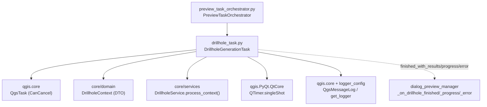
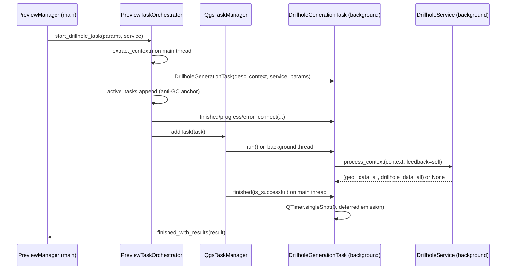

---
tags:
  - secinterp
  - code-walkthrough
  - gui
  - tasks
aliases:
  - drillhole_task.py
  - DrillholeGenerationTask
cssclass: secinterp-note
---

# `gui/tasks/drillhole_task.py`

> [!abstract] One-line summary
> Cancelable `QgsTask` projecting drillholes in the background with detached DTOs (`DrillholeContext` + `DrillholeService`), deferred result emission to the main thread, and never touching live QGIS objects in the worker.

**Path**: `gui/tasks/drillhole_task.py` (107 lines)
**Main class**: `DrillholeGenerationTask(QgsTask)`
**Layer**: GUI · Tasks (background-to-main bridge; compute lives in `core/`)
**Tags**: #secinterp #gui #tasks

---

## 🎯 Why does this file exist?

Projecting drillholes (collars, surveys, intervals, section intersection) can take seconds: doing it on the main thread would freeze QGIS and violate the > 100 ms `QgsTask` rule.

| Problem | Solution |
|---------|----------|
| Drillhole computation blocks the UI | `run()` on a background thread with `DrillholeService.process_context()` |
| Passing `QgsVectorLayer` into the thread crashes (QGIS objects are not thread-safe) | The task only receives the detached `DrillholeContext` DTO + a stateless service |
| The UI needs progress, cancellation, results, and errors | `feedback=self` (the task is its own feedback), 3 signals, main-thread `finished()` |
| Emitting the signal inside `finished()` can race the geology render | Deferred emission via `QTimer.singleShot(0, ...)` on the next event-loop cycle |

> [!important] Architectural note
> **Two-thread Extract-then-Compute**: `PreviewTaskOrchestrator.start_drillhole_task()` extracts the context on the main thread (via `drillhole_extractor`), the task computes in the background, and `finished()` returns the `(geol_data_all, drillhole_data_all)` tuple to the manager. See [[preview_task_orchestrator]] and [[drillhole_service]].

---

## 🧬 Relationship diagram



> [!tip] How to read
> Solid arrow = imports/delegates; dashed = Qt signals to the manager. The orchestrator creates the task, anchors it against GC, and registers it with `QgsApplication.taskManager()`.

---

## 📦 Imports — architectural reading

```python
# gui/tasks/drillhole_task.py
from __future__ import annotations

from typing import TYPE_CHECKING, Any

from qgis.core import Qgis, QgsMessageLog, QgsTask
from qgis.PyQt.QtCore import QTimer, pyqtSignal

from sec_interp.core.domain import DrillholeContext
from sec_interp.logger_config import get_logger

if TYPE_CHECKING:
    from sec_interp.core.services.drillhole_service import DrillholeService
```

| # | Observation |
|---|-------------|
| ① | `TYPE_CHECKING` for `DrillholeService`: the service exists only as an annotation; at runtime the task treats it as anything with `process_context()`. Zero GUI↔core circular import. |
| ② | `DrillholeContext` is imported at runtime (the DTO genuinely travels in the constructor). |
| ③ | `Qgis` + `QgsMessageLog`: worker errors also land in the QGIS message panel (`"SecInterp"`, `Critical` level). |
| ④ | `QTimer.singleShot(0, ...)` — deferred emission: `finished()` schedules the `emit` for the next cycle instead of emitting hot. |
| ⑤ | `Any` for `params` (historical compatibility) and `result`: the result tuple has no named DTO in this version. |

---

## 🏗️ Structure inventory

**Classes (1):** `DrillholeGenerationTask(QgsTask)` — 3 signals + 4 methods.

**Signals:**

| Signal | Payload | Who connects (orchestrator) |
|-------|---------|-----------------------------|
| `finished_with_results` | `object` (tuple `(geol_data_all, drillhole_data_all)`) | `manager._on_drillhole_finished` |
| `error_occurred` | `str` | `manager._on_drillhole_error` |
| `progress_changed` | `float` | `manager._on_drillhole_progress` |

**State:**

| Attribute | Type | Role |
|----------|------|-----|
| `service` | `DrillholeService` | Injected stateless logic |
| `context` | `DrillholeContext` | Detached DTO (the worker's only data) |
| `params` | `Any` | Original params (compatibility) |
| `result` | `Any \| None` | Result tuple or `None` |
| `exception` | `Exception \| None` | Exception caught in `run()` |

**Methods:**

| Method | Signature | Thread | Role |
|--------|-------|------|-----|
| `__init__` | `(description: str, context: DrillholeContext, service: DrillholeService, params: Any) -> None` | Main | Registers `CanCancel`, stores DTO + service |
| `run` | `() -> bool` | **Background** | `process_context(context, feedback=self)`; `True`/`False` |
| `finished` | `(is_successful: bool) -> None` | Main | Normalizes, emits deferred or reports error |
| `setProgress` | `(progress: float) -> None` | Background→Main | Bridges to `progress_changed` for the progress bar |

---

## 📁 Files in the package

| File | Lines | Role |
|---|--:|---|
| `drillhole_task.py` | 107 | This note: drillhole task |
| `geology_task.py` | 101 | Sibling: geology task (`build_segments`, segment list) |
| `__init__.py` | — | Package marker |

---

## 📖 Method-by-method walkthrough

### `__init__`

```python
def __init__(
    self,
    description: str,
    context: DrillholeContext,
    service: DrillholeService,
    params: Any,
) -> None:
    super().__init__(description, QgsTask.Flag.CanCancel)
    self.service = service
    self.context = context
    self.params = params
    self.result: Any | None = None
    self.exception: Exception | None = None
```

The `CanCancel` flag enables cooperative cancellation: the service polls `feedback.isCanceled()` during projection. No live QGIS enters here: `context` is pre-extracted lists/dicts/WKT, `service` is stateless and thread-safe.

### `run` (background thread)

```python
def run(self) -> bool:
    try:
        logger.info("DrillholeGenerationTask started (Background Thread)")
        self.result = self.service.process_context(self.context, feedback=self)

        count = 0
        if self.result and len(self.result) > 1:
            # result[1] is drillhole_data_list
            count = len(self.result[1])

        logger.info(f"DrillholeGenerationTask finished with {count} holes")
        return True

    except Exception as e:
        logger.error(f"Error in DrillholeGenerationTask: {e}", exc_info=True)
        self.exception = e
        return False
```

It passes itself as `feedback`: exposing `isCanceled()` and `setProgress()` to the core with no Qt import in the service (duck typing over `Any`). The defensive count (`len(self.result) > 1`) avoids `IndexError` on a short tuple; `count` is log-only. Any exception is stored and converted to `False`: **never** propagated raw from the worker.

> [!warning] No GUI in `run()`
> No `iface`, no widgets, no `layer.setRenderer()`, not even `QgsMessageLog` here (that lives in `finished()`). Violating this hangs or crashes QGIS. The `gui/AGENTS.md` guide marks it a stop condition.

### `finished` (main thread)

```python
def finished(self, is_successful: bool) -> None:
    try:
        if is_successful:
            if self.result is None:
                self.result = ([], [])

            res_type = type(self.result)
            res_len = len(self.result) if isinstance(self.result, tuple | list) else "N/A"
            # Defer emission to next event loop cycle to avoid race conditions with geology render
            QTimer.singleShot(0, lambda: self.finished_with_results.emit(self.result))
        elif self.exception:
            error_msg = str(self.exception)
            QgsMessageLog.logMessage(
                f"Drillhole Task Failed: {error_msg}",  # no-i18n: developer log tag
                "SecInterp",
                Qgis.MessageLevel.Critical,
            )
            self.error_occurred.emit(error_msg)
    except Exception as e:
        logger.exception(f"Critical error in DrillholeGenerationTask.finished: {e}")
```

Three branches: success (`None` normalized to `([], [])` so the manager always gets a tuple), failure with exception (log + QGIS message + error signal), and a safety net catching even the handler's own failures. Deferred emission avoids the drillhole-vs-geology race: without `singleShot`, the drillhole slot could stomp layers while the geology task was still managing its own.

> [!note] Silent cancellation
> On user cancel (`is_successful=False` with no `exception`), no branch emits: the orchestrator already cleared anchors in `cancel_active_tasks()`. Correct, but the manager gets no explicit cancel notification.

### `setProgress`

```python
def setProgress(self, progress: float) -> None:
    """Override to emit signal for UI progress bar."""
    super().setProgress(progress)
    self.progress_changed.emit(progress)
```

Bridges the native `QgsTask` progress (updated by the core via `feedback.setProgress()`) to the signal the dialog's bar listens to. Calling `super()` first keeps the internal state that `taskManager()` and `isCanceled()` rely on.

## ⏱️ Full lifecycle



| Phase | Thread | Owner | Detail |
|-------|------|-------------|---------|
| Extraction | Main | `drillhole_extractor` | Layers → `DrillholeContext` (lists, dicts, tuples) |
| Construction | Main | `PreviewTaskOrchestrator` | Task + anchor + 3 connections + `addTask()` |
| Compute | Background | `DrillholeService` | Per-collar loop with `isCanceled()` and `setProgress()` |
| Delivery | Main | `finished()` | Normalizes, defers with `singleShot(0)`, emits |
| Presentation | Main | `PreviewManager` | `_on_drillhole_finished` → factory → layers |

> [!note] Two distinct cancellations
> **Cooperative** cancellation (user cancels and the core sees it via `feedback.isCanceled()`) makes `process_context()` return `None`: `run()` returns `True` and `finished()` emits `([], [])` as an "empty success". **QGIS** cancellation (`cancel_active_tasks()` → `task.cancel()`) reaches `finished(is_successful=False)` with no exception and emits nothing. The manager cannot tell "canceled" from "empty" in the first case.

## 📡 Feedback: real cancellation and progress

`feedback=self` is not decorative: the core uses it on every iteration of the per-collar loop (`core/services/drillhole_service.py`, lines 70–111):

```python
for i, collar in enumerate(context.collar_data):
    if feedback and feedback.isCanceled():
        return None
    # ... extract_and_project_detached + trajectory_engine.process_single_hole ...
    if feedback:
        feedback.setProgress((i / total) * 100)
```

| Mechanism | How it travels | Effect |
|-----------|-----------|--------|
| `isCanceled()` | core → task (native `QgsTask`) | Aborts between collars, returns `None` |
| `setProgress(0–100)` | core → `setProgress()` override → `progress_changed` | Dialog bar via `_on_drillhole_progress` |
| `CanCancel` | constructor → `taskManager` | QGIS cancel button enabled |

One bad drillhole does **not** abort the batch: `process_single_hole()` is wrapped in `except (ValueError, TypeError, KeyError)` and `except SecInterpError`, both `logger.exception`-logged with the `hole_id`. The bad collar is skipped and the rest continue; progress counts collars, not successes.

## ❌ Error-path catalog

| Path | Origin | What the user sees |
|------|--------|----------------------|
| Exception in `process_context()` | bug, memory, corrupt context | Log with `exc_info` + QGIS `Critical` panel + `error_occurred` |
| Drillhole with bad data | per-collar `ValueError/TypeError/KeyError` | Log with `hole_id` only; hole skipped |
| Per-collar `SecInterpError` | domain validation/processing | Log with `hole_id` only; batch continues |
| Cooperative cancel | `isCanceled()` → `None` | Empty success `([], [])`, no error |
| QGIS cancel | `task.cancel()` | Silence (no emission) |
| `finished()` itself throws | handler bug | `logger.exception`, no propagation |

### Empty context and 0–100 progress

With an empty `context.collar_data` (`total = 0`), the loop never iterates: no division by zero (the `(i / total)` only evaluates inside the loop), no progress emitted, and an `([], [])` empty-success result.
The manager draws zero drillholes with no error: indistinguishable from a cooperative cancel, and correct in both cases.

| `total` | Iterations | `setProgress` | Result |
|---|---|---|---|
| 0 | none | never | `([], [])` empty success |
| N > 0 | N collars | `(i / N) * 100` per collar | tuple with N attempts |

---

## 🔄 Data flow

| Phase | Thread | Input | Transformation | Output |
|-------|------|-------|----------------|--------|
| Extraction | Main | QGIS layers (collar, survey, interval, line, raster) | `drillhole_extractor.extract_context()` | `DrillholeContext` |
| Launch | Main | context + service | `DrillholeGenerationTask(...)` + anchor + `addTask()` | cancelable queued task |
| Compute | Background | `DrillholeContext`, `feedback=self` | `process_context()` with progress/cancel | `(geol_data_all, drillhole_data_all)` or `exception` |
| Delivery | Main | `result` / `exception` | normalization + `singleShot(0)` / `QgsMessageLog` | signals to `PreviewManager` |
| Presentation | Main | result tuple | factory → layers → `DrillholeRenderer` | drawn drillholes |

---

## 🏛️ Design patterns present

| Pattern | Where | Purpose |
|---------|-------|---------|
| **Background Task (QGIS)** | `QgsTask` + `taskManager().addTask()` | Keep the UI responsive during long compute |
| **Detached DTO** | `DrillholeContext` | Thread safety: the worker never sees QGIS |
| **Feedback-as-self** | `process_context(ctx, feedback=self)` | Progress/cancel without coupling core to Qt |
| **Deferred emission** | `QTimer.singleShot(0, ...)` | Avoid races with the geology render |
| **Observer** | 3 signals to the manager | Results, progress, and errors observable |
| **Anti-GC anchoring** | Orchestrator `_active_tasks` | The task cannot die mid-`run()` (Qt6) |

---

## 🧾 API summary

| Symbol | Signature / Inherits | Typical use |
|--------|----------------------|-------------|
| `DrillholeGenerationTask` | `QgsTask` (`CanCancel`) | `DrillholeGenerationTask("Drillhole Preview (Async)", context, service, params)` |
| `finished_with_results` | `pyqtSignal(object)` | Tuple `(geol_data_all, drillhole_data_all)` |
| `error_occurred` | `pyqtSignal(str)` | Message from `str(exception)` |
| `progress_changed` | `pyqtSignal(float)` | Dialog progress bar |
| `run` / `finished` / `setProgress` | `() -> bool` / `(bool) -> None` / `(float) -> None` | `QgsTask` lifecycle |

---

## 🛡️ Error handling

| Situation | Behavior |
|-----------|----------|
| Exception in `run()` | Log with `exc_info`, stored `exception`, `False` return |
| `result is None` on success | Normalized to `([], [])` before emitting |
| `finished()` itself throws | `logger.exception` (safety net, never propagates) |
| User cancellation | No emission; orchestrator unwires signals and anchors |
| Visible error | `QgsMessageLog` (`SecInterp`, `Critical`) + `error_occurred` |

---

## 🧪 Associated tests

GUI coverage without real QGIS (Mock-first, `BaseTestCase`) in `tests/gui/tasks/test_drillhole_task.py` (`TestDrillholeGenerationTask`):

- `test_initialization` — `description()`, `context`, `service`, `result`/`exception` as `None`.
- `test_run_success` — `process_context` returns `(["geol"], ["hole1", "hole2"])`; asserts `True`, identical `result`, and the `process_context(mock_input, feedback=task)` call (the task as feedback).
- `test_run_error` — `side_effect = ValueError`; asserts `False` and stored `exception`.
- `finished()` tests: deferred emission (patched or real `QTimer.singleShot`) and the error branch with `QgsMessageLog`.

Related: `tests/gui/test_preview_task_orchestrator.py` (launch, anchoring, cancellation), `tests/core/test_drillhole_service.py` + `test_async_drillhole.py` (the compute the worker invokes), `tests/core/test_drillhole_service_optional.py`.

---

## 👀 Observations and notes

> [!success] Strengths
> - 100% QGIS-agnostic worker: only DTO + stateless service + duck-typed feedback.
> - Real cooperative cancellation via `CanCancel` + `feedback.isCanceled()` in the core.
> - Deferred emission removing the drillhole-vs-geology race.
> - Triple error reporting (log + QGIS panel + signal): nothing is lost silently.

> [!warning] Points of attention
> - `result` typed `Any`: the `(geol_data_all, drillhole_data_all)` tuple deserves a named DTO.
> - Cancellation emits no signal: the manager cannot tell "canceled" from "never launched".
> - `params` travels unused in the worker (historical compatibility): constructor dead weight.
> - The `singleShot` lambda captures `self`: if the task dies before the tick, the `emit` falls into the void (the orchestrator anchor mitigates this).

> [!question] Open questions
> - Type `result` as `tuple[GeologyData, list[DrillholeProjection]]`?
> - Emit an explicit cancellation signal so the manager can restore the UI?

---

## 🔗 Related notes

- [[Index]] — vault index
- [[gui_tasks]] — family note for background tasks
- [[geology_task]] — sibling task (same shape, different service/result)
- [[preview_task_orchestrator]] — creates, anchors, cancels, and wires this task
- [[drillhole_service]] — `process_context()`: the compute running in the background
- [[drillhole_extractor]] — produces the `DrillholeContext` on the main thread
- [[drillhole_renderer]] — dresses the results once delivered
- [[controller]] — orchestrates services and cache in the core

---

*Note of the SecInterp Code Walkthrough v2 vault — v3.8.0*
