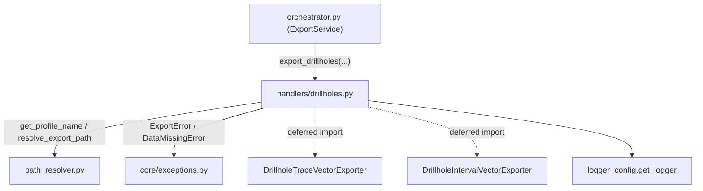

---
tags:
  - secinterp
  - code-walkthrough
  - core
  - export
  - handlers
aliases:
  - drillholes.py
  - export_drillholes
cssclass: secinterp-note
---

# `core/services/export/handlers/drillholes.py`

> [!abstract] One-line summary
> **2D** drillhole export handler: traces (polylines) and intervals (lithology) as vector layers, resolving per-profile paths and translating failures to `ExportError`.

**Path**: `core/services/export/handlers/drillholes.py` (70 lines)
**Main function**: `export_drillholes`
**Layer**: Core (QGIS-agnostic)
**Tags**: #secinterp #core #export #handlers

---

## 🎯 Why does this file exist?

Drillholes projected onto the section must be persisted as two distinct layers (the
hole **trace** and the lithological **intervals**) so the user can consume them in a
GIS. That work of composing paths, instantiating exporters and reporting results must
not live in the orchestrator.

| Problem | Solution |
|---------|----------|
| Two layers to export (trace + intervals) | Two chained export blocks |
| Uniform file naming | `resolve_export_path` with a logical `base_name` |
| Heterogeneous write failures | `try/except` normalizing them to `ExportError` |

> [!important] Architectural note
> QGIS-agnostic: receives `data` and `crs` already decoupled (typed `Any`). Imports the
> exporters **deferred** and delegates to `path_resolver` for naming.

---

## 🧬 Relationship diagram



> [!tip] How to read
> Solid = static import; dashed = deferred import inside the function. The handler leans
> on `path_resolver` (a leaf) and on the exception hierarchy.

---

## 📦 Imports — architectural reading

```python
# core/services/export/handlers/drillholes.py
from __future__ import annotations

from pathlib import Path
from typing import Any

from sec_interp.core.exceptions import DataMissingError, ExportError
from sec_interp.core.services.export.path_resolver import get_profile_name, resolve_export_path
from sec_interp.logger_config import get_logger
```

```python
# deferred imports (inside export_drillholes)
from sec_interp.exporters import (
    DrillholeIntervalVectorExporter,
    DrillholeTraceVectorExporter,
)
```

| # | Observation |
|---|-------------|
| ① | `DataMissingError` and `ExportError` come from `core.exceptions` — the project's own hierarchy. |
| ② | No `qgis.*` import: the `crs` travels as `Any`. |
| ③ | `DataMissingError` is caught to wrap it as `ExportError` (normalization). |
| ④ | Deferred import of exporters: loaded only when there is data to export. |

---

## 🏗️ Structure inventory

**Functions/Methods:**
- `export_drillholes(folder, data, crs, msg, controller, settings, ext) -> None`

**Domain dependencies:**
- `DrillholeTraceVectorExporter`, `DrillholeIntervalVectorExporter` (from `sec_interp.exporters`)

One public function. Linear structure: guard → resolve trace → export → resolve
intervals → export → normalize errors.

---

## 📖 Method-by-method walkthrough

### `export_drillholes`

```python
def export_drillholes(
    folder: Path,
    data: list[Any] | None,
    crs: Any,
    msg: list[str],
    controller: Any | None,
    settings: Any | None,
    ext: str,
) -> None:
    """Export drillhole data (2D traces + intervals)."""
    if not data:
        return
    from sec_interp.exporters import (
        DrillholeIntervalVectorExporter,
        DrillholeTraceVectorExporter,
    )

    logger.info("✓ Saving drillhole data...")
```

**Guard + deferred import**: without drillholes (`data` empty/`None`) it exits
immediately. The exporters import happens here to avoid its cost on drillhole-less
routes. The `logger.info` marks the start of the phase in the log.

```python
    try:
        profile_name = get_profile_name(controller)
        pattern = getattr(settings, "naming_pattern", None) if settings else None

        traces_path, traces_layer = resolve_export_path(
            folder, "drillhole_traces", profile_name, pattern, ext
        )
        traces_exporter = DrillholeTraceVectorExporter({})
        traces_ok = traces_exporter.export(
            traces_path,
            {"drillhole_data": data, "crs": crs},
            layer_name=traces_layer,
        )
        if traces_ok:
            msg.append(f"  - {traces_path.relative_to(folder)}")
        else:
            logger.warning(f"Failed to write drillhole traces to {traces_path}")
```

**2D trace**: resolves the path with `base_name="drillhole_traces"`, instantiates
`DrillholeTraceVectorExporter({})` and exports the payload `{"drillhole_data", "crs"}`.
The logical layer name (`traces_layer`) is kept separate from the physical path.

```python
        intervals_path, intervals_layer = resolve_export_path(
            folder, "drillhole_intervals", profile_name, pattern, ext
        )
        intervals_exporter = DrillholeIntervalVectorExporter({})
        intervals_ok = intervals_exporter.export(
            intervals_path,
            {"drillhole_data": data, "crs": crs},
            layer_name=intervals_layer,
        )
        if intervals_ok:
            msg.append(f"  - {intervals_path.relative_to(folder)}")
        else:
            logger.warning(f"Failed to write drillhole intervals to {intervals_path}")
```

**2D intervals**: the same pattern with `base_name="drillhole_intervals"` and the same
payload. The handler does **not** use `use_projected` (that is exclusive to 3D).

```python
    except (OSError, ValueError, TypeError, DataMissingError) as e:
        logger.exception(f"Drillhole export failed: {e}")
        raise ExportError(f"Drillhole export failed: {e!s}") from e
    except Exception as e:
        logger.exception("Unexpected system error during drillhole export")
        raise ExportError(f"Critical error exporting drillholes: {e}") from e
```

**Error normalization**: one `except` for expected failures (`OSError`, `ValueError`,
`TypeError`, `DataMissingError`) and another generic for everything else. Both convert
any failure to `ExportError` preserving the cause (`from e`) and logging the traceback
via `logger.exception`.

---

## 🔄 Data flow

| Phase | Input | Transformation | Output |
|-------|-------|----------------|--------|
| Guard | `data` (`None`/empty) | early return | — |
| Trace | `data`, `crs` | `DrillholeTraceVectorExporter.export` | trace layer + `msg` |
| Intervals | `data`, `crs` | `DrillholeIntervalVectorExporter.export` | interval layer + `msg` |
| Errors | raw exception | `except → ExportError` | domain exception |

---

## 🏛️ Design patterns present

| Pattern | Where | Purpose |
|---------|-------|---------|
| **Guard clause** | `if not data: return` | early exit without nesting |
| **Lazy import (deferred)** | exporters inside the function | save loading without data |
| **Facade** | single function | hide the orchestration of 2 layers |
| **Exception translation** | `except → ExportError` | homogenize failures to the domain |
| **Builder (payload dict)** | `{"drillhole_data", "crs"}` | transport decoupled data |

---

## 🧾 API summary

| Symbol | Signature / Inherits | Typical use |
|--------|----------------------|-------------|
| `export_drillholes` | `(folder, data, crs, msg, controller, settings, ext) -> None` | Export 2D trace + intervals |
| `DrillholeTraceVectorExporter` | `BaseExporter` (deferred import) | Write the trace as vector |
| `DrillholeIntervalVectorExporter` | `BaseExporter` (deferred import) | Write intervals as vector |

---

## 📐 Handler signature contract

Seven parameters, the minimal silhouette of a handler in the package (no
`csv_exporter` nor `options`):

| Parameter | Type | Role |
|-----------|------|------|
| `folder` | `Path` | Base output directory |
| `data` | `list[Any] \| None` | Decoupled drillhole projections |
| `crs` | `Any` | Section CRS (QGIS object typed `Any`) |
| `msg` | `list[str]` | Message accumulator (mutated in-place) |
| `controller` | `Any \| None` | Profile-name source |
| `settings` | `Any \| None` | Export settings (`naming_pattern`) |
| `ext` | `str` | Output extension |

> [!note] No `csv_exporter`
> Unlike `geology.py`/`structures.py`, this handler exports no CSV; only two vector
> layers. Hence its shorter signature.

## 🔁 Invocation from the orchestrator

```python
"exp_drill": lambda: dh_h.export_drillholes(
    folder, drillhole_data, line_crs, msg,
    self.controller, export_settings, format_ext,
),
```

The `drillhole_data` is the same one the 3D handler receives, but here only the **2D**
view (vector trace + intervals) is exported, without real/projected variants.

---

## 🛡️ Error handling

Two catch levels:

| Caught type | Action | Result |
|-------------|--------|--------|
| `OSError`, `ValueError`, `TypeError`, `DataMissingError` | `logger.exception` + `raise ExportError(...) from e` | domain error with cause |
| `Exception` (rest) | `logger.exception` + `raise ExportError(...) from e` | critical error with cause |

> [!tip] `from e` preserves the trace
> The chaining `raise ExportError(...) from e` keeps the original exception in
> `__cause__`, key for diagnosis in the GUI's `QgsTask`.

---

## 🧪 Associated tests

- `tests/core/test_export_service.py::test_export_data_all_types` — calls
  `DrillholeTraceVectorExporter`/`DrillholeIntervalVectorExporter` via the orchestrator.
- `tests/core/test_export_service.py::test_export_drillholes_error` — verifies that an
  exporter failure is translated to `ExportError`.
- `tests/exporters/test_drillhole_export_objects.py` — drillhole data objects.
- `tests/integration/test_export_service_e2e.py` — real drillhole export end-to-end.

---

## 👀 Observations and notes

> [!success] Strengths
> - Uniform error contract: every failure exits as `ExportError` with cause.
> - Deferred import and guard clause: minimal cost without drillholes.
> - Decoupled payload, no QGIS types in the signatures.

> [!warning] Points of attention
> - Two near-identical blocks (trace/interval): could be unified into a loop.
> - `data: list[Any]` does not document the expected entity (should be `DrillholeProjection`).
> - Duplicates the path-resolution logic of `drillholes_3d.py`.

> [!question] Open questions
> - Extract a shared helper `_export_layer(base_name, ExporterClass, payload)`?
> - Type `data` as `list[DrillholeProjection]` to document the real contract?

---

## 🔗 Related notes

- [[Index]] — vault index
- [[core_services_export_handlers]] — `handlers/` package it belongs to
- [[orchestrator]] — delegates to `export_drillholes` under the `exp_drill` flag
- [[drillholes_3d]] — sibling 3D handler (real + projected traces/intervals)
- [[path_resolver]] — `get_profile_name` / `resolve_export_path`
- [[compat]] — `_export_drillholes` compatibility wrapper
- [[drillhole]] — projected drillhole domain (`DrillholeProjection`)

---

*Note of the SecInterp Code Walkthrough v2 vault — v3.9.1*
