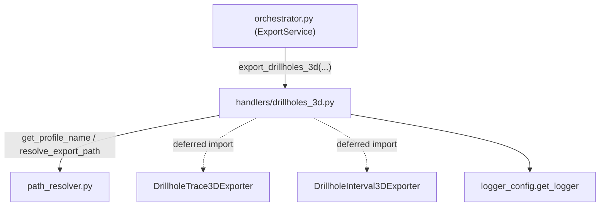

---
tags:
  - secinterp
  - code-walkthrough
  - core
  - export
  - handlers
aliases:
  - drillholes_3d.py
  - export_drillholes_3d
cssclass: secinterp-note
---

# `core/services/export/handlers/drillholes_3d.py`

> [!abstract] One-line summary
> **3D** drillhole export handler: traces and intervals, each in two variants (real and projected), driven by a declarative task table and gated by option flags.

**Path**: `core/services/export/handlers/drillholes_3d.py` (82 lines)
**Main function**: `export_drillholes_3d`
**Layer**: Core (QGIS-agnostic)
**Tags**: #secinterp #core #export #handlers

---

## 🎯 Why does this file exist?

The 2D/3D drillhole pair does not fit a single exporter: 3D data needs traces
(polylines with Z) and intervals (lithology prisms), and each supports a **real** and
a **projected** variant on the section plane.

| Problem | Solution |
|---------|----------|
| Four distinct 3D outputs (2 types × 2 variants) | A declarative **task table** describing them |
| Enable/disable each output per user options | Double gate on flags: `drill_3d_*` and `drill_3d_original/projected` |
| Avoid coupling the handler to concrete exporters | Deferred import (`from sec_interp.exporters import ...`) inside the function |

> [!important] Architectural note
> QGIS-agnostic: QGIS objects (`crs`) travel typed as `Any`; the handler only composes
> paths and delegates to the exporters. Unlike other handlers, it does **not** wrap the
> flow in `try/except ExportError` (see Error handling).

---

## 🧬 Relationship diagram



> [!tip] How to read
> Solid arrow = imports/delegates at import time; dashed = deferred import inside the
> function (avoids the cost of loading exporters when there is no data).

---

## 📦 Imports — architectural reading

```python
# core/services/export/handlers/drillholes_3d.py
from __future__ import annotations

from pathlib import Path
from typing import Any

from sec_interp.core.services.export.path_resolver import get_profile_name, resolve_export_path
from sec_interp.logger_config import get_logger
```

```python
# deferred imports (inside export_drillholes_3d)
from sec_interp.exporters import (
    DrillholeInterval3DExporter,
    DrillholeTrace3DExporter,
)
```

| # | Observation |
|---|-------------|
| ① | Only `pathlib`, `typing` and internal utilities: **zero** `qgis.*` imports. |
| ② | `path_resolver` is the only real internal dependency; the rest are exporters and logging. |
| ③ | Exporters are imported **inside** the function: without data they are never loaded. |
| ④ | `Any` dominates the signatures (`crs`, `controller`, `settings`, `options`) — defensive typing. |

---

## 🏗️ Structure inventory

**Functions/Methods:**
- `export_drillholes_3d(folder, data, crs, msg, options, controller, settings, ext) -> None`

**Internal data:**
- `tasks: list[tuple[str, str, Any, str, bool, str]]` — declarative table of 4 tasks.

A single public function, no classes or constants. The real "structure" is the
`tasks` list, which turns 4 export variants into iterable data.

---

## 📖 Method-by-method walkthrough

### `export_drillholes_3d`

```python
def export_drillholes_3d(
    folder: Path,
    data: list[Any] | None,
    crs: Any,
    msg: list[str],
    options: dict[str, Any],
    controller: Any | None,
    settings: Any | None,
    ext: str,
) -> None:
    """Export 3D drillhole traces and intervals."""
    if not data:
        return
```

**Guard clause**: `if not data: return` — silent early exit. If the orchestrator
passed an empty list or `None`, the handler does nothing (the "no data" message is
handled by the orchestrator itself or the 2D handler).

```python
    tasks: list[tuple[str, str, Any, str, bool, str]] = [
        ("drill_3d_traces", "drill_3d_original", DrillholeTrace3DExporter,
         "drillhole_traces_3d_real", False, "3D Real"),
        ("drill_3d_traces", "drill_3d_projected", DrillholeTrace3DExporter,
         "drillhole_traces_3d_projected", True, "3D Proj"),
        ("drill_3d_intervals", "drill_3d_original", DrillholeInterval3DExporter,
         "drillhole_intervals_3d_real", False, "3D Real"),
        ("drill_3d_intervals", "drill_3d_projected", DrillholeInterval3DExporter,
         "drillhole_intervals_3d_projected", True, "3D Proj"),
    ]
```

The **task table** is the heart of the module. Each tuple encodes:

| Index | Field | Example | Meaning |
|:--:|---|---------|-------------|
| 0 | `type_flag` | `drill_3d_traces` | category flag (traces vs intervals) |
| 1 | `proj_flag` | `drill_3d_original` | variant flag (real vs projected) |
| 2 | `ExporterClass` | `DrillholeTrace3DExporter` | class to instantiate |
| 3 | `base_name` | `drillhole_traces_3d_real` | logical name for `resolve_export_path` |
| 4 | `use_proj` | `False`/`True` | whether to use section-plane projection |
| 5 | `label` | `"3D Real"` | readable suffix for the message |

```python
    profile_name = get_profile_name(controller)
    pattern = getattr(settings, "naming_pattern", None) if settings else None
    for type_flag, proj_flag, ExporterClass, base_name, use_proj, label in tasks:
        if options.get(type_flag, False) and options.get(proj_flag, False):
            path, path_layer = resolve_export_path(folder, base_name, profile_name, pattern, ext)
            exporter = ExporterClass({})
            ok = exporter.export(
                path,
                {"drillhole_data": data, "crs": crs, "use_projected": use_proj},
                layer_name=path_layer,
            )
            if ok:
                msg.append(f"  - {path.relative_to(folder)} ({label})")
            else:
                logger.warning(f"Failed to write 3D drillhole data to {path} ({label})")
```

**Export loop**:

1. Resolves `profile_name` and the `naming_pattern` (same pattern as the other handlers).
2. Iterates `tasks` and exports only when **both** flags are active
   (`options.get(type_flag)` **and** `options.get(proj_flag)`).
3. `ExporterClass({})` instantiates the exporter with an empty settings dict.
4. The payload `{"drillhole_data", "crs", "use_projected"}` carries the already
   decoupled data; `use_projected` chooses between real and projected geometry.
5. `exporter.export(...)` returns `bool`; on `True` the file is noted in `msg`; on
   `False` only a `warning` is logged (no exception is raised).

---

## 🔄 Data flow

| Phase | Input | Transformation | Output |
|-------|-------|----------------|--------|
| Guard | `data` (`None`/empty) | early return | — |
| Config | `options`, `controller`, `settings` | flag gate + `get_profile_name` | `profile_name`, `pattern` |
| Iteration | `tasks` (4 tuples) | filter by flags | active tasks |
| Writing | `data`, `crs`, `use_proj` | `ExporterClass({}).export(...)` | 3D files + `msg` entries |

---

## 🏛️ Design patterns present

| Pattern | Where | Purpose |
|---------|-------|---------|
| **Table-driven / declarative** | `tasks` list | 4 variants described as data, not 4 `if`s |
| **Guard clause** | `if not data: return` | early exit without nesting |
| **Lazy import (deferred)** | imports inside the function | avoid cost when there is no data |
| **Strategy (injected class)** | `ExporterClass` in each tuple | choose the exporter at runtime |
| **Facade** | single function | hide the orchestration of 4 outputs behind one signature |

---

## 🧾 API summary

| Symbol | Signature / Inherits | Typical use |
|--------|----------------------|-------------|
| `export_drillholes_3d` | `(folder, data, crs, msg, options, controller, settings, ext) -> None` | Export 3D traces and intervals |
| `tasks` (internal) | `list[tuple[str, str, Any, str, bool, str]]` | Declare the 4 output variants |

---

## 📐 Handler signature contract

All handlers in the subpackage share a signature "silhouette". This module has 8
parameters, two of them specific (`options` for the double gate and `settings`):

| Parameter | Type | Role |
|-----------|------|------|
| `folder` | `Path` | Base output directory |
| `data` | `list[Any] \| None` | Already-decoupled drillhole projections |
| `crs` | `Any` | Section layer CRS (QGIS object typed `Any`) |
| `msg` | `list[str]` | Report message accumulator (mutated in-place) |
| `options` | `dict[str, Any]` | Flags `drill_3d_traces`, `drill_3d_intervals`, `drill_3d_original/projected` |
| `controller` | `Any \| None` | Profile-name source (defensive introspection) |
| `settings` | `Any \| None` | Export settings (`naming_pattern`) |
| `ext` | `str` | Output extension (`.shp`, `.gpkg`, `.dxf`) |

> [!note] `msg` is mutated by reference
> No handler returns the message list; all **fill it** in-place. The orchestrator
> initializes it once and propagates it across handlers.

## 🔁 Invocation from the orchestrator

`orchestrator.py` registers this handler in the `handlers` dict under the key
`"exp_drill_3d"`:

```python
"exp_drill_3d": lambda: dh3_h.export_drillholes_3d(
    folder, drillhole_data, line_crs, msg, options,
    self.controller, export_settings, format_ext,
),
```

It runs only if `options.get("exp_drill_3d", True)` is true. The `drillhole_data`
comes from `PreviewResult.drillhole` (a list of `DrillholeProjection`), already
projected by the drillhole service.

---

## 🛡️ Error handling

Unlike `drillholes.py`, `geology.py`, `structures.py` and `topography.py`, this
handler does **not** wrap the body in `try/except` nor re-raise `ExportError`:

| Case | Behaviour |
|------|-----------|
| `data` is `None`/empty | silent `return` |
| `exporter.export` returns `False` | `logger.warning(...)`; **no** raise |
| Unexpected exporter exception | **propagates** without wrapping in `ExportError` |

> [!warning] Contract inconsistency
> The other handlers translate any failure to `ExportError`. This one does not, so a 3D
> write error can surface as a raw exception up to the `QgsTask`. A candidate for
> homogenization (see Observations).

---

## 🧪 Associated tests

Tests do not exercise this module in isolation: they traverse it through the
`ExportService` in `tests/core/test_export_service.py`, mocking the 3D exporters:

- `tests/core/test_export_service.py::test_export_data_all_types` — verifies that
  `DrillholeTrace3DExporter`/`DrillholeInterval3DExporter` are called with the flags.
- `tests/core/test_export_service.py::test_export_data_3d_restricted` — the
  `access_control` gate restricts the 3D interpretation output (conceptual parallel).
- `tests/exporters/test_drillhole_3d_exporter.py` — covers the real logic of
  `DrillholeTrace3DExporter` and `DrillholeInterval3DExporter` invoked here.
- `tests/integration/test_export_workflow.py` — 3D projection logic end-to-end.

---

## 👀 Observations and notes

> [!success] Strengths
> - The `tasks` table turns 4 repetitive variants into maintainable data.
> - Deferred import: nothing from `exporters` is loaded without drillholes.
> - Decoupled payload (`drillhole_data`, `crs`, `use_projected`): no QGIS types.

> [!warning] Points of attention
> - Does not translate failures to `ExportError`: breaks uniformity with the other handlers.
> - Double gate (`type_flag` **and** `proj_flag`) requires coherent `options` keys.
> - `ExporterClass` typed as `Any` loses static verification that it is an exporter.

> [!question] Open questions
> - Wrap the loop in `try/except → ExportError` like the other handlers?
> - Type `tasks` with a `NamedTuple`/`dataclass` instead of an anonymous tuple?

---

## 🔗 Related notes

- [[Index]] — vault index
- [[core_services_export_handlers]] — `handlers/` package it belongs to
- [[orchestrator]] — delegates to `export_drillholes_3d` under the `exp_drill_3d` flag
- [[drillholes]] — 2D drillhole handler (vector trace + interval)
- [[path_resolver]] — `get_profile_name` / `resolve_export_path`
- [[compat]] — `_export_*` compatibility wrappers (does not cover 3D)
- [[drillhole]] — projected drillhole domain (`DrillholeProjection`)

---

*Note of the SecInterp Code Walkthrough v2 vault — v3.8.0*
