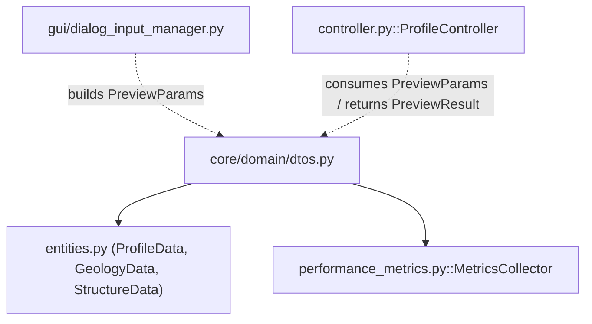
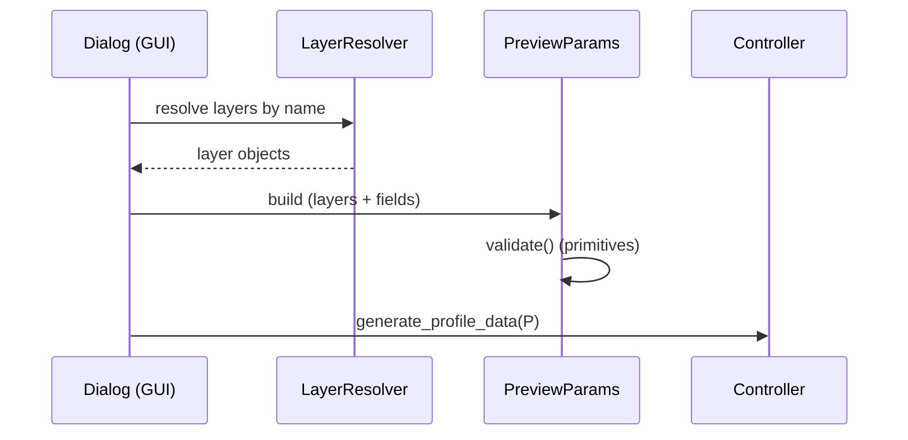

---
tags:
  - secinterp
  - code-walkthrough
  - core
  - domain
  - dto
aliases:
  - dtos.py
  - PreviewParams
  - PreviewResult
cssclass: secinterp-note
---

# `core/domain/dtos.py`

> [!abstract] One-line summary
> Defines the **complex DTOs** crossing the GUI→Core boundary: `PreviewParams` (consolidated generation input) and `PreviewResult` (consolidated output with elevation/distance range helpers).

**Path**: `core/domain/dtos.py` (199 lines)
**Main classes**: `PreviewParams`, `PreviewResult`
**Layer**: Core (QGIS-agnostic)
**Tags**: #secinterp #core #domain #dto

---

## 🎯 Why does this file exist?

The services and `controller` need a **single, typed data contract** to pass dozens of
parameters (layers, fields, LOD) without fragile positional lists. Two dataclasses
solve this:

| Problem | Solution |
|---------|----------|
| Group ~30 input parameters into one object | `PreviewParams` (dataclass) |
| Consolidate the output of 4 domains + metrics | `PreviewResult` (dataclass) |
| Derive the profile's vertical bounds | `PreviewResult.get_elevation_range()` |
| Derive the horizontal (distance) bounds | `PreviewResult.get_distance_range()` |

> [!important] QGIS-agnostic via `Any`
> Layers (`raster_layer`, `line_layer`, …) are typed as `Any` to **avoid importing
> QGIS**. The DTO does not know the concrete type; it only carries the reference to the
> Compute phase, which consumes it via the extractors/adapters.

---

## 🧬 Relationship diagram



> [!tip] How to read
> Solid = imports; dashed = built/consumed by. `dtos.py` is the **data contract**
> between the GUI (which fills the fields) and the core (which processes them).

---

## 📦 Imports — architectural reading

```python
# core/domain/dtos.py
from dataclasses import dataclass, field
from typing import Any

from sec_interp.core.performance_metrics import MetricsCollector
from .entities import GeologyData, ProfileData, StructureData
```

| # | Observation |
|---|-------------|
| ① | `dataclasses` — DTOs are plain (non-frozen) dataclasses. |
| ② | `MetricsCollector` — the result carries performance metrics. |
| ③ | Imports the **aliases** from `entities.py` (`ProfileData`, `GeologyData`, `StructureData`). |

---

## 🏗️ Structure inventory

**Classes:** `class PreviewParams` (1 method), `class PreviewResult` (5 methods)

**Functions/Methods:**
- `PreviewParams.validate()`
- `PreviewResult.get_elevation_range()`
- `PreviewResult.get_distance_range()`
- `PreviewResult._get_geol_elevations()`, `_get_struct_elevations()`, `_get_drillhole_elevations()`

---

## 📖 Class-by-class walkthrough

### `PreviewParams` — consolidated input

```python
@dataclass
class PreviewParams:
    raster_layer: Any
    line_layer: Any
    band_num: int
    buffer_dist: float = 100.0

    # Geology params
    outcrop_layer: Any | None = None
    outcrop_name_field: str | None = None

    # Structure params
    struct_layer: Any | None = None
    dip_field: str | None = None
    strike_field: str | None = None
    dip_scale_factor: float = 1.0

    # Drillhole params
    collar_layer: Any | None = None
    collar_id_field: str | None = None
    ...
    # LOD Params
    max_points: int = 1000
    canvas_width: int = 800
    auto_lod: bool = True
```

Groups **~30 fields** in commented blocks (geology, structure, drillholes, LOD). The
optional fields (`None`) indicate domains the user did not configure.

| Block | Key fields | Note |
|-------|------------|------|
| Core | `raster_layer`, `line_layer`, `band_num`, `buffer_dist` | Required |
| Geology | `outcrop_layer`, `outcrop_name_field` | Optional |
| Structure | `struct_layer`, `dip_field`, `strike_field`, `dip_scale_factor` | Optional |
| Drillholes | `collar_*`, `survey_*`, `interval_*` (14 fields) | Optional |
| LOD | `max_points`, `canvas_width`, `auto_lod` | Defaulted |

### Full field reference

| Field | Type | Default | Role |
|-------|------|---------|------|
| `raster_layer` | `Any` | — | DEM raster for elevation sampling |
| `line_layer` | `Any` | — | Section line |
| `band_num` | `int` | — | Raster band to sample |
| `buffer_dist` | `float` | `100.0` | Projection buffer |
| `outcrop_layer` | `Any \| None` | `None` | Outcrop layer |
| `outcrop_name_field` | `str \| None` | `None` | Geological unit field |
| `struct_layer` | `Any \| None` | `None` | Structural measurements layer |
| `dip_field` | `str \| None` | `None` | Dip field |
| `strike_field` | `str \| None` | `None` | Strike/azimuth field |
| `dip_scale_factor` | `float` | `1.0` | Visual dip scale |
| `collar_layer` | `Any \| None` | `None` | Collar layer |
| `collar_id_field` | `str \| None` | `None` | Collar ID field |
| `collar_use_geometry` | `bool` | `True` | Coords from geometry? |
| `collar_x_field` | `str \| None` | `None` | X field |
| `collar_y_field` | `str \| None` | `None` | Y field |
| `collar_z_field` | `str \| None` | `None` | Z field |
| `collar_depth_field` | `str \| None` | `None` | Total depth field |
| `survey_layer` | `Any \| None` | `None` | Survey layer |
| `survey_id_field` | `str \| None` | `None` | Survey ID field |
| `survey_depth_field` | `str \| None` | `None` | Depth field |
| `survey_azim_field` | `str \| None` | `None` | Azimuth field |
| `survey_incl_field` | `str \| None` | `None` | Inclination field |
| `interval_layer` | `Any \| None` | `None` | Interval layer |
| `interval_id_field` | `str \| None` | `None` | Interval ID field |
| `interval_from_field` | `str \| None` | `None` | "from" field |
| `interval_to_field` | `str \| None` | `None` | "to" field |
| `interval_lith_field` | `str \| None` | `None` | Lithology field |
| `max_points` | `int` | `1000` | Max points for LOD |
| `canvas_width` | `int` | `800` | Canvas width (px) |
| `auto_lod` | `bool` | `True` | Automatic LOD adjustment |

> [!note] `collar_use_geometry`
> If `True`, collar coordinates come from the layer **geometry**; if `False`, from the
> `collar_x_field`/`collar_y_field`/`collar_z_field` fields.

### `PreviewParams.validate()` — native primitive validation

```python
def validate(self) -> None:
    if not isinstance(self.buffer_dist, int | float) or self.buffer_dist < 0:
        raise ValueError("Buffer distance must be a non-negative number")
    if not isinstance(self.band_num, int) or self.band_num < 1:
        raise ValueError("Band number must be a positive integer")
```

| Validation | Rule |
|-----------|------|
| `buffer_dist` | numeric and `>= 0` |
| `band_num` | `int` and `>= 1` |

> [!important] Two-level validation
> Only **primitives** are validated. **Layer** validation (existence, fields) is done by
> the GUI via `ProjectValidator` using detached `LayerMetadata`. The core touches QGIS
> neither here nor in validation.

### `PreviewResult` — consolidated output

```python
@dataclass
class PreviewResult:
    topo: ProfileData | None = None
    geol: GeologyData | None = None
    struct: StructureData | None = None
    drillhole: Any | None = None
    metrics: MetricsCollector = field(default_factory=MetricsCollector)
    buffer_dist: float = 0.0
```

Consolidates the 4 domains + metrics. `metrics` uses `default_factory` (a fresh
`MetricsCollector` per result, not shared).

### `get_elevation_range()` — vertical range

```python
def get_elevation_range(self) -> tuple[float, float]:
    elevations: list[float] = []
    if self.topo:
        elevations.extend(p[1] for p in self.topo)
    elevations.extend(self._get_geol_elevations())
    elevations.extend(self._get_struct_elevations())
    elevations.extend(self._get_drillhole_elevations())
    if not elevations:
        return 0.0, 0.0
    return min(elevations), max(elevations)
```

Scans **all 4 domains** for the absolute min/max elevation. It is the basis of the
profile's vertical auto-scaling and of the `VerticalExaggerationService` computation.

### Private elevation helpers

| Method | Elevation source |
|--------|------------------|
| `_get_geol_elevations` | `segment.points` → `p[1]` (dist, elev) |
| `_get_struct_elevations` | `m.elevation` (explicit field) |
| `_get_drillhole_elevations` | `points_3d` → `p.z` + `segments` → `p[1]` |

### `get_distance_range()` — horizontal range

```python
def get_distance_range(self) -> tuple[float, float]:
    if not self.topo:
        return 0.0, 0.0
    return self.topo[0][0], self.topo[-1][0]
```

Uses the **first and last topography points** as the authoritative horizontal bounds
(topography is required, so it always exists if there is a profile).

---

## 🔄 Data flow

| Phase | Input | Transformation | Output |
|-------|-------|----------------|--------|
| Construction | layers/fields from the GUI | packed into `PreviewParams` | `PreviewParams` |
| Generation | `PreviewParams` | `controller.generate_profile_data` | `PreviewResult` |
| Scaling | `PreviewResult` | `get_elevation_range` / `get_distance_range` | `(min, max)` |

---

## 🔢 Worked example — elevation range

Given a `PreviewResult` with:

```python
result = PreviewResult(
    topo=[(0.0, 100.0), (50.0, 120.0), (100.0, 90.0)],   # dist, elev
    struct=[StructureMeasurement(..., elevation=140.0, ...)],
    geol=[GeologySegment(..., points=[(10.0, 95.0), (20.0, 105.0)], ...)],
)
```

`get_elevation_range()`:

1. `topo` → `[100.0, 120.0, 90.0]`
2. `_get_geol_elevations` → `[95.0, 105.0]`
3. `_get_struct_elevations` → `[140.0]`
4. `_get_drillhole_elevations` → `[]` (no drillholes)

Result: `(min=90.0, max=140.0)`. The 140 peak (structure) and the 90 valley (topo)
define the full vertical auto-scaling.

---

## 🔌 Construction from the GUI

`PreviewParams` is not built in the core: the GUI builds it (via
`dialog_input_manager` and the layer resolvers), which **resolves** layers by name and
fills the fields. The core only receives the already-populated object:



> [!note] Layer resolution outside the core
> Converting names → layer objects is the GUI's job (`layer_resolver`). The core
> receives references (`Any`) and never looks up layers itself.

---

## 🏛️ Design patterns present

| Pattern | Where | Purpose |
|---------|-------|---------|
| **DTO** | both classes | Carry data across the GUI/Core boundary |
| **Default object** | default values | Optional domains without explicit config |
| **Convenience methods** | `get_*_range` | Derive bounds without repeating the scan in consumers |
| **Any-typed port** | layer fields | Avoid importing QGIS in the domain |

---

## 🧾 API summary

| Symbol | Signature / Inherits | Typical use |
|--------|----------------------|-------------|
| `PreviewParams.validate` | `() -> None` | Validate primitives before processing |
| `PreviewResult.get_elevation_range` | `() -> (float, float)` | Vertical auto-scaling |
| `PreviewResult.get_distance_range` | `() -> (float, float)` | Horizontal profile bounds |

---

## 🛡️ Error handling

| Situation | Behaviour |
|-----------|-----------|
| `buffer_dist < 0` or non-numeric | `ValueError` (in `validate`) |
| `band_num < 1` or non-integer | `ValueError` (in `validate`) |
| No data (all layers empty) | `get_elevation_range` → `(0.0, 0.0)` |
| Missing `topo` | `get_distance_range` → `(0.0, 0.0)` |

> [!warning] `ValueError` not `ValidationError`
> `validate()` raises `ValueError` (builtin), not `ValidationError` from
> `exceptions.py`. A minor inconsistency with the project's exception hierarchy.

---

## 🧪 Associated tests

Pure cases (no QGIS), mapped to `tests/core/test_dtos.py`:

- `test_preview_params_validate_ok` — valid `buffer_dist`/`band_num` do not raise.
- `test_preview_params_validate_negative_buffer` — `buffer_dist < 0` → `ValueError`.
- `test_preview_params_validate_band_zero` — `band_num = 0` → `ValueError`.
- `test_get_elevation_range_all_domains` — includes topo/geol/struct/drillhole.
- `test_get_elevation_range_empty` — no data → `(0.0, 0.0)`.
- `test_get_distance_range` — uses first/last topo.

---

## 🌐 i18n and migration notes

- **No user-facing strings**: the DTOs emit no messages; `validate()` errors are
  `ValueError` with fixed text (no `TranslatableMixin`).
- **Thread-safety**: simple dataclasses; per-instance `MetricsCollector` via
  `default_factory` (no shared state between results).
- **Migration**: `drillhole` typed `Any` is a candidate for `list[DrillholeProjection]`.

---

## 👀 Observations and notes

> [!success] Strengths
> - Single, typed contract for all profile generation.
> - `Any` keeps the core QGIS-agnostic despite carrying layers.
> - `get_elevation_range` centralises the auto-scaling logic.

> [!warning] Points of attention
> - `validate()` raises `ValueError` instead of the `SecInterpError` hierarchy.
> - `drillhole` is typed `Any` (not `list[DrillholeProjection]`) — loose typing.
> - ~30 fields in one dataclass: candidate for nested sub-objects.

> [!question] Open questions
> - Migrate `PreviewParams` to nested dataclasses (e.g. `DrillholeParams`)?
> - Change `ValueError` → `ValidationError` for consistency with `exceptions.py`?

---

## 🔗 Related notes

- [[Index]] — vault index
- [[entities]] — aliases and entities it imports (`ProfileData`, `GeologyData`, …)
- [[performance_metrics]] — `MetricsCollector`
- [[controller]] — consumes `PreviewParams` and produces `PreviewResult`
- [[vertical_exaggeration_service]] — uses `get_elevation_range`
- [[domain]] — `domain/` package index

---

*Note of the SecInterp Code Walkthrough v2 vault — v3.9.0*
