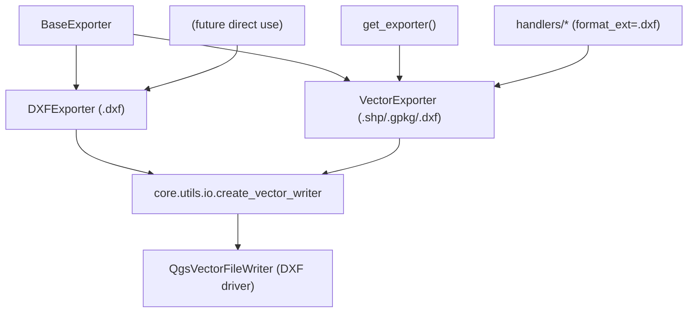

---
tags:
  - secinterp
  - code-walkthrough
  - exporters
  - cad
aliases:
  - dxf_exporter.py
  - DXFExporter
cssclass: secinterp-note
---

# `exporters/dxf_exporter.py`

> [!abstract] One-line summary
> Dedicated CAD exporter: writes `.dxf` through the same OGR pipeline as `VectorExporter` but with a defensive `_prepare_fields` (validates list, dict and the `attributes` key) and its own log messages.

**Path**: `exporters/dxf_exporter.py` (126 lines)
**Main class**: `DXFExporter(BaseExporter)`
**Layer**: Exporters (coupled to `qgis.core` via `QgsVectorFileWriter`, DXF driver)
**Tags**: #secinterp #exporters #cad

---

## 🎯 Why does this file exist?

DXF is the CAD interchange format (AutoCAD, BricsCAD) used by mine teams and
consultancies. Although `VectorExporter` already writes `.dxf`, this module offers a
dedicated route with stricter input validation:

| Problem | Solution |
|---------|----------|
| Interchange with external CAD | `.dxf` output readable by AutoCAD/BricsCAD |
| Malformed `features_data` breaking field inference | Defensive `_prepare_fields`: validates `list`, `dict` and `attributes` presence |
| Ambiguous diagnosis when the DXF driver fails | DXF-prefixed logs (`"Failed to create DXF writer"`, `"DXF export failed"`) |
| Optional CAD symbology | `symbology_export` setting propagated to the writer |

> [!important] Architectural note
> `DXFExporter` inherits **directly** from `BaseExporter`, not from `VectorExporter`:
> a conscious duplication of the pipeline so the CAD path can evolve (DXF layers,
> blocks, styles) without affecting the SHP/GPKG path. See the diagram and the open
> questions.

---

## 🧬 Relationship diagram



> [!tip] How to read
> Today the factory routes `.dxf` to `VectorExporter` (see `__init__.py`), not to this
> class: `DXFExporter` is a dedicated route available for direct use or a future
> factory switch. Both share `create_vector_writer`.

---

## 📦 Imports — architectural reading

```python
# exporters/dxf_exporter.py
from __future__ import annotations

from pathlib import Path
from typing import Any

from qgis.core import (
    QgsCoordinateReferenceSystem,
    QgsFeature,
    QgsField,
    QgsFields,
    QgsVectorFileWriter,
    QgsWkbTypes,
)
from qgis.PyQt.QtCore import QMetaType

from sec_interp.core.utils import io as scu_io
from sec_interp.logger_config import get_logger

from .base_exporter import BaseExporter
```

| # | Observation |
|---|-------------|
| ① | Block identical to `vector_exporter.py`: same OGR driver, same type inference. |
| ② | No `noqa: E402` (unlike vector/csv): imports are already ordered after `__future__`. |
| ③ | `scu_io.create_vector_writer` abstracts the driver: DXF option changes (version, layers) would happen in [[io]], not here. |
| ④ | Direct `BaseExporter` inheritance: it does not reuse `VectorExporter._write_features` even though it is identical. |
| ⑤ | `get_logger(__name__)`: error messages carry the DXF prefix for log filtering. |

---

## 🏗️ Structure inventory

**Classes:** `class DXFExporter(BaseExporter)` — 1 class, 4 methods.

**Methods:**

- `get_supported_extensions() -> list[str]` — `[".dxf"]` (CAD only)
- `export(output_path: Path, features_data: list[dict[str, Any]], layer_name: str | None = None) -> bool`
- `_write_features(writer: QgsVectorFileWriter, features_data: list[dict[str, Any]], fields: QgsFields) -> None`
- `_prepare_fields(features_data: list[dict[str, Any]]) -> QgsFields` — defensive version

**Consumed settings:** `geometry_type` (default `LineString`), `crs` (default
`EPSG:4326`), `symbology_export` (default `NoSymbology`) — same as `VectorExporter`.

---

## 📁 Files in the package

| File | Lines | Role |
|---|--:|---|
| `__init__.py` | 81 | `get_exporter()`: `.dxf` → `VectorExporter` (not this class, today) |
| `base_exporter.py` | 137 | Inherited contract (see [[base_exporter]]) |
| `vector_exporter.py` | 122 | Generic twin that also writes `.dxf` |
| `dxf_exporter.py` | 126 | `DXFExporter` — dedicated CAD route (this note) |
| `csv_exporter.py` | 58 | Tabular twin accompanying every DXF in the handlers |

> [!note] Why two classes that write DXF?
> `VectorExporter` covers the general case (the orchestrator uses it with
> `format_ext=".dxf"`). `DXFExporter` exists to harden the input and to leave room
> for CAD-specific options (DXF layer names, R2007/R2010 version, `symbology_export`)
> without polluting the SHP/GPKG path.

---

## 📖 Method-by-method walkthrough

### `get_supported_extensions`

```python
def get_supported_extensions(self) -> list[str]:
    """Get supported vector format extensions."""
    return [".dxf"]
```

Only `.dxf`: unlike `VectorExporter`, this class accepts neither SHP nor GPKG even on
misconfiguration. The inherited `validate_path()` rejects any other extension.

### `export` — DXF writing

```python
def export(
    self,
    output_path: Path,
    features_data: list[dict[str, Any]],
    layer_name: str | None = None,
) -> bool:
    if not features_data:
        return False

    try:
        geometry_type = self.get_setting("geometry_type", QgsWkbTypes.Type.LineString)
        crs = self.get_setting("crs", QgsCoordinateReferenceSystem("EPSG:4326"))
        symb_mode = self.get_setting(
            "symbology_export", QgsVectorFileWriter.SymbologyExport.NoSymbology
        )

        fields = self._prepare_fields(features_data)
        writer = scu_io.create_vector_writer(
            output_path,
            crs,
            fields,
            geometry_type,
            layer_name=layer_name,
            symbology_export=symb_mode,
        )

        if writer.hasError() != QgsVectorFileWriter.WriterError.NoError:
            logger.error(f"Failed to create DXF writer: {writer.errorMessage()}")
            return False

        self._write_features(writer, features_data, fields)

        # Note: writer is closed when object is deleted or goes out of scope
        del writer

    except Exception:
        logger.exception(f"DXF export failed for {output_path}")
        return False
    else:
        return True
```

| Step | Detail |
|------|--------|
| Guard | Empty `features_data` → `False` without creating a file |
| Settings | Same defaults as `VectorExporter`; `layer_name` reaches the writer (conceptual layer name) |
| Writer | `create_vector_writer` picks the driver by extension (`.dxf` → OGR DXF driver) |
| Check | `hasError()` with the OGR message in the log, tagged as DXF |
| Close | `del writer` forces the flush, as in the generic twin |

### `_write_features` — identical to the generic one

```python
def _write_features(
    self,
    writer: QgsVectorFileWriter,
    features_data: list[dict[str, Any]],
    fields: QgsFields,
) -> None:
    for data in features_data:
        feature = QgsFeature(fields)
        if "geometry" in data:
            feature.setGeometry(data["geometry"])
        if "attributes" in data:
            attrs = data["attributes"]
            feature.setAttributes([attrs.get(field.name()) for field in fields])
        writer.addFeature(feature)
```

Name-based field mapping, tolerant of extra keys and geometry-less items. The only
difference from `VectorExporter._write_features` is ownership: the day the CAD path
needs attribute transforms (truncating widths, sanitising layer names), this is the
intervention point that leaves SHP/GPKG untouched.

### `_prepare_fields` — the real difference

```python
def _prepare_fields(self, features_data: list[dict[str, Any]]) -> QgsFields:
    """Create fields based on first feature's attributes."""
    fields = QgsFields()
    if not features_data or not isinstance(features_data, list):
        return fields

    first_item = features_data[0]
    if not isinstance(first_item, dict) or "attributes" not in first_item:
        return fields

    first_attrs = first_item["attributes"]
    for key, value in first_attrs.items():
        if isinstance(value, int):
            fields.append(QgsField(key, QMetaType.Type.Int))
        elif isinstance(value, float):
            fields.append(QgsField(key, QMetaType.Type.Double))
        else:
            fields.append(QgsField(key, QMetaType.Type.QString))
    return fields
```

| Extra guard | What it prevents |
|-------------|------------------|
| `not isinstance(features_data, list)` | A stray dict or `None` slipping past the `not features_data` guard |
| `not isinstance(first_item, dict)` | Scalar items that would break `in` / `.items()` |
| `"attributes" not in first_item` | Geometry-only items: returns an empty schema instead of `KeyError` |

With an empty schema, the DXF writer creates an attribute-less layer: the drawing
comes out, the data does not. Deliberate graceful degradation for CAD, where geometry
rules.

---

## 🆚 DXFExporter vs VectorExporter

Both classes write `.dxf` through the same OGR driver, but only one is routed in the factory. Source-verified comparison:

| Aspect | `VectorExporter` | `DXFExporter` (this one) |
|--------|------------------|--------------------------|
| Inherits from | `BaseExporter` | `BaseExporter` (not the twin) |
| `get_supported_extensions` | `[".shp", ".gpkg", ".dxf"]` | `[".dxf"]` |
| `export()` | guard + settings + writer + `_write_features` + `del writer` | identical step by step |
| `_write_features` | name-based field mapping | exact copy, different owner |
| `_prepare_fields` | `if features_data and "attributes" in features_data[0]` | triple `isinstance` guard + key |
| Failure logs | `"Failed to create writer"` / `"Vector export failed"` | `"Failed to create DXF writer"` / `"DXF export failed"` |
| Routed in `get_exporter(".dxf")` | yes (active route) | no (available route) |

> [!tip] Rule of thumb
> The `.dxf` the GUI delivers today comes from `VectorExporter` with `format_ext=".dxf"`.
> Use `DXFExporter` directly when you need its defensive inference or when the CAD path
> starts to diverge; until then, every OGR fix goes in both classes.

### `symbology_export` — the CAD lever

Both classes read the same setting and forward it untouched:

```python
symb_mode = self.get_setting(
    "symbology_export", QgsVectorFileWriter.SymbologyExport.NoSymbology
)
writer = scu_io.create_vector_writer(
    output_path, crs, fields, geometry_type,
    layer_name=layer_name,
    symbology_export=symb_mode,
)
```

| Value | Effect on the DXF |
|-------|-------------------|
| `NoSymbology` (default) | Flat geometry on one layer; attributes per the driver |
| `PerSymbolLayer` / `PerFeature` | The writer attempts to map QGIS symbology to DXF layers and styles |

---

## 🔄 Data flow

| Phase | Input | Transformation | Output |
|-------|-------|----------------|--------|
| DTOs | domain data + line `crs` | handlers assemble `features_data` | `list[dict]` |
| Defensive schema | first item | triple guard + `int/float/str` inference | `QgsFields` (possibly empty) |
| Writing | `(writer, features_data, fields)` | one `QgsFeature` per dict | `.dxf` file |
| Result | success/failure | `bool` (+ handler `ExportError`) | message in `result_msg` |

---

## 🧩 DXF format limitations

| Limitation | Detail | Implication |
|------------|--------|-------------|
| **Essentially 2D** | The OGR DXF driver flattens Z | 3D sections export via `drillhole_3d_exporter` / `interpretation_3d_exporter`, not here |
| **Field widths** | Text attributes truncate per the driver | Long names and codes may be clipped when opened in CAD |
| **Poor types** | No guaranteed high-precision `Double`, no real `NULL` | Critical elevations also travel in the twin CSV |
| **Layers** | Attribute→DXF-layer mapping depends on `symbology_export` | Default `NoSymbology`: everything on one layer |
| **Version** | DXF version is fixed by the environment's OGR driver | See `tests/integration/test_vector_drivers_integration.py` |

> [!tip] CSV as backup
> Handlers **always** write the tabular CSV next to the vector file: if the DXF
> truncates a field, the exact value survives in the sibling `.csv`.

---

## 🏛️ Design patterns present

| Pattern | Where | Purpose |
|---------|-------|---------|
| **Template Method** | `export()` over the [[base_exporter]] contract | Same skeleton as the generic twin |
| **Defensive programming** | Triple guard in `_prepare_fields` | Degrade to an empty schema instead of `KeyError` |
| **Conscious duplication** | Pipeline copied from `VectorExporter` | Evolve CAD without SHP/GPKG risk |
| **Fail-soft** | `except Exception → False` + tagged logs | Grep-friendly "DXF" diagnosis |
| **Graceful degradation** | Empty schema allowed | Geometry without attributes beats nothing |

---

## 🧾 API summary

| Symbol | Signature / Inherits | Typical use |
|--------|----------------------|-------------|
| `DXFExporter` | `(BaseExporter)` | `DXFExporter({"crs": line_crs})` |
| `export` | `(output_path: Path, features_data: list[dict[str, Any]], layer_name: str \| None = None) -> bool` | `.dxf` writing |
| `get_supported_extensions` | `() -> list[str]` | `[".dxf"]` |
| `_write_features` | `(writer, features_data, fields) -> None` | Internal loop |
| `_prepare_fields` | `(features_data) -> QgsFields` | Defensive inference |

---

## 🛡️ Error handling

| Situation | Behaviour |
|-----------|-----------|
| Empty `features_data` | `return False` without touching disk |
| Non-list `features_data` or items without `attributes` | Empty schema → geometry-only DXF |
| `writer.hasError()` | `logger.error("Failed to create DXF writer: …")` + `False` |
| Any exception | `logger.exception("DXF export failed for …")` + `False` |
| `False` upstream | The handler raises `ExportError` (see [[compat]]) |

---

## 🧪 Associated tests

There is no dedicated `test_dxf_exporter.py`: DXF coverage arrives via two routes
worth knowing:

- `tests/exporters/test_vector_exporter.py` — exercises the **same OGR pipeline**
  (`test_export_success`, `test_export_writer_error`, `test_export_exception_handling`)
  with a mocked `QgsVectorFileWriter`; applies by implementation symmetry.
- `tests/exporters/test_exporters.py` — `BaseExporter` contract (`test_get_supported_extensions`, empty-`data` guards).
- `tests/integration/test_vector_drivers_integration.py` — verifies the QGIS environment ships the OGR DXF driver.
- `tests/integration/test_export_service_e2e.py` — orchestrator flow with `format_ext=".dxf"` (via `VectorExporter`).
- `tests/integration/test_export_workflow.py` — full export flow.

> [!warning] Honest coverage gap
> The defensive `DXFExporter._prepare_fields` (the three `isinstance` guards) has no
> direct test. A `test_dxf_exporter.py` with non-dict items and dicts lacking
> `attributes` would be the natural addition.

---

## 👀 Observations and notes

> [!success] Strengths
> - Defensive `_prepare_fields`: the only schema inference in the package that cannot raise `KeyError`/`AttributeError`.
> - DXF-tagged logs: trivial filtering in multi-format sessions.
> - Single declared extension: impossible to misconfigure for SHP/GPKG.
> - CAD evolution space reserved with no risk to the main path.

> [!warning] Points of attention
> - **Real duplication**: `export` and `_write_features` are copies of `VectorExporter`; any OGR fix must be applied twice.
> - The factory does **not** use it (`.dxf` → `VectorExporter`): available but unrouted code today.
> - Silent empty schema: a DXF without attributes can read as total success (`True`) while data was lost.
> - Same risky defaults as the twin (`EPSG:4326` when `crs` is missing).

> [!question] Open questions
> - Inherit from `VectorExporter` and only override `_prepare_fields`, removing the duplication?
> - Route `.dxf` to `DXFExporter` in `get_exporter()`, or keep it a manual route?
> - Log a `warning` on empty schema instead of silent success?

---

## 🔗 Related notes

- [[Index]] — vault index
- [[base_exporter]] — inherited contract
- [[vector_exporter]] — generic twin (compare `_prepare_fields`)
- [[exporters]] — package layer note
- [[io]] — `create_vector_writer`, the real DXF driver
- [[csv_exporter]] — exact tabular backup of the DXF
- [[orchestrator]] — decides `format_ext=".dxf"` from settings
- [[compat]] — translates `False` into `ExportError`
- [[drillhole_exporters]] / [[profile_exporters]] — entities ending up as DXF
- [[dialog_export_manager]] — GUI exposing DXF as `default_format`
- [[exceptions]] — `ExportError`

---

*Note of the SecInterp Code Walkthrough v2 vault — v3.9.1*
