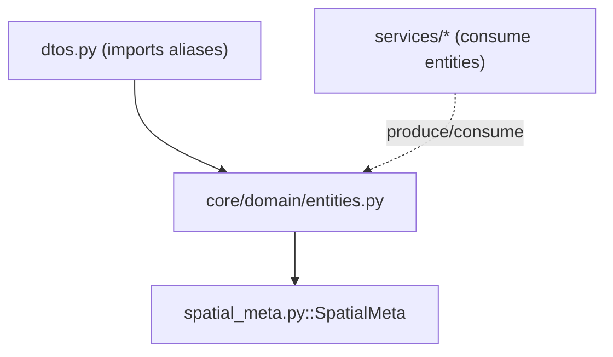

---
tags:
  - secinterp
  - code-walkthrough
  - core
  - domain
  - entities
aliases:
  - entities.py
  - GeologySegment
  - StructureMeasurement
  - DrillholeProjection
cssclass: secinterp-note
---

# `core/domain/entities.py`

> [!abstract] One-line summary
> Defines the **domain entities** (dataclasses) and **type aliases** that name and shape the processed data: structural measurements, geological segments, interpretation polygons and drillhole projections.

**Path**: `core/domain/entities.py` (161 lines)
**Main classes**: `GeologySegment`, `StructureMeasurement`, `DrillholeProjection`
**Layer**: Core (QGIS-agnostic)
**Tags**: #secinterp #core #domain #entities

---

## 🎯 Why does this file exist?

The core processes geometry, but **without QGIS**. It needs its own types that express
the geological/structural results with primitives (tuples, WKT, dicts). `entities.py`
is the domain vocabulary:

| Problem | Solution |
|---------|----------|
| Represent a projected structural measurement | `StructureMeasurement` |
| Represent a geological span along the profile | `GeologySegment` |
| Represent an interpretation polygon (2D and 2.5D) | `InterpretationPolygon` / `InterpretationPolygon25D` |
| Represent a projected drillhole | `DrillholeProjection` |
| Short, stable names for repeated types | Aliases (`Point2D`, `ProfileData`, …) |

> [!important] `DomainGeometry = str` (WKT)
> All geometry is transported as **WKT** (`DomainGeometry`), never `QgsGeometry`. This
> is the key piece of Extract-then-Compute: the GUI extracts WKT, the core computes on
> text.

---

## 🧬 Relationship diagram



> [!tip] How to read
> `entities.py` is the **domain base**: `dtos.py` and the services import it. It only
> depends on `spatial_meta.py` (for `DrillholeProjection.points_3d`).

---

## 📦 Imports — architectural reading

```python
# core/domain/entities.py
from dataclasses import dataclass, field
from typing import TYPE_CHECKING, Any

if TYPE_CHECKING:
    from .spatial_meta import SpatialMeta
```

| # | Observation |
|---|-------------|
| ① | `TYPE_CHECKING` avoids the runtime circular import (`SpatialMeta` only for typing). |
| ② | `dataclass` for entities; `field(default_factory=...)` for collections. |
| ③ | No QGIS imports; primitive types + `Any`. |

---

## 🏗️ Structure inventory

**Type aliases:** `ProfilePoints`, `GeologyPoints`, `StructurePoints`, `SettingsDict`,
`ExportSettings`, `ValidationResult`, `Point2D`, `Point3D`, `DomainGeometry`,
`PointList`, `StructureData`, `GeologyData`, `ProfileData`

**Classes:** `StructureMeasurement`, `GeologySegment`, `InterpretationPolygon`,
`InterpretationPolygon25D`, `DrillholeProjection` — 5 dataclasses

---

## 📖 Entities and aliases walkthrough

### Type aliases (domain vocabulary)

| Alias | Definition | Use |
|-------|-----------|-----|
| `Point2D` | `tuple[float, float]` | (x, y) or (distance, elevation) point |
| `Point3D` | `tuple[float, float, float]` | (x, y, z) point |
| `PointList` | `list[Point2D]` | list of 2D points |
| `DomainGeometry` | `str` | geometry in **WKT** |
| `ProfileData` | `list[tuple[float, float]]` | topographic profile `(dist, elev)` |
| `GeologyData` | `list[GeologySegment]` | geological segments |
| `StructureData` | `list[StructureMeasurement]` | structural measurements |
| `SettingsDict` / `ExportSettings` | `dict[str, Any]` | configurations |
| `ValidationResult` | `tuple[bool, str]` | `(is_valid, error)` |

> [!tip] `DomainGeometry = str` is WKT
> The most important core contract: geometry is WKT text, not QGIS objects.

### `StructureMeasurement` — projected structural measurement

```python
@dataclass
class StructureMeasurement:
    distance: float
    elevation: float
    apparent_dip: float
    original_dip: float
    original_strike: float
    attributes: dict[str, Any]
```

| Field | Meaning |
|-------|---------|
| `distance` | horizontal distance from the profile start |
| `apparent_dip` | **apparent** dip (relative to the section plane) |
| `original_dip` / `original_strike` | **true** dip/strike measured in the field |
| `attributes` | original feature attributes |

### `GeologySegment` — geological span

```python
@dataclass
class GeologySegment:
    unit_name: str
    geometry_wkt: DomainGeometry | None
    attributes: dict[str, Any]
    points: list[Point2D]
    points_3d: list[Point3D] = field(default_factory=list)
    points_3d_projected: list[Point3D] = field(default_factory=list)
```

A segment describes an outcrop of a **geological unit** along the profile:

- `points`: 2D profile `(dist, elev)`.
- `points_3d`: real 3D coordinates (for 3D export).
- `points_3d_projected`: projection onto the section in 3D.
- `geometry_wkt`: optional geometry (WKT) for vector export.

### `InterpretationPolygon` — 2D interpretation

```python
@dataclass
class InterpretationPolygon:
    id: str
    name: str
    type: str
    vertices_2d: list[tuple[float, float]]
    attributes: dict[str, Any] = field(default_factory=dict)
    color: str = "#FF0000"
    created_at: str = ""
```

A polygon digitised by the user on the profile. `type` classifies (lithology, fault,
alteration); `color` is HEX; `created_at` is an ISO timestamp.

### `InterpretationPolygon25D` — georeferenced interpretation

```python
@dataclass
class InterpretationPolygon25D:
    id: str
    name: str
    type: str
    geometry_wkt: DomainGeometry
    attributes: dict[str, Any]
    crs_authid: str
```

Georeferenced version (with CRS): adds `geometry_wkt` and `crs_authid` (e.g.
`EPSG:4326`) to export the interpretation to real geographic space.

### `DrillholeProjection` — projected drillhole

```python
@dataclass
class DrillholeProjection:
    hole_id: str
    distance: float
    elevation: float
    offset: float
    total_depth: float
    points_3d: list[SpatialMeta] = field(default_factory=list)
    segments: list[GeologySegment] = field(default_factory=list)
```

| Field | Meaning |
|-------|---------|
| `offset` | orthogonal distance to the section line |
| `points_3d` | list of `SpatialMeta` along the trajectory |
| `segments` | geological segments along the hole |

> [!note] `DrillholeProjection` reuses `GeologySegment` and `SpatialMeta`
> It composes existing entities instead of duplicating fields: a projected drillhole
> contains its own lithological segments.

---

## 🔄 Data flow

| Phase | Entity | Transformation | Output |
|-------|--------|----------------|--------|
| Extraction | QGIS geometry | GUI → WKT/tuples | `DomainGeometry`, `Point2D` |
| Compute | WKT/tuples | pure services | `GeologySegment`, `StructureMeasurement`, `DrillholeProjection` |
| Export | entities | exporters → format | SHP/GPKG/DXF/3D |

---

## 📐 Field-by-field reference (complete)

### `StructureMeasurement`

| Field | Type | Role |
|-------|------|------|
| `distance` | `float` | distance from profile start |
| `elevation` | `float` | elevation (Z) at the projected point |
| `apparent_dip` | `float` | apparent dip relative to the plane |
| `original_dip` | `float` | true field dip |
| `original_strike` | `float` | true field strike |
| `attributes` | `dict[str, Any]` | original attributes |

### `GeologySegment`

| Field | Type | Role |
|-------|------|------|
| `unit_name` | `str` | unit name |
| `geometry_wkt` | `DomainGeometry \| None` | WKT geometry (optional) |
| `attributes` | `dict[str, Any]` | original attributes |
| `points` | `list[Point2D]` | 2D profile `(dist, elev)` |
| `points_3d` | `list[Point3D]` | real 3D coordinates |
| `points_3d_projected` | `list[Point3D]` | 3D projection onto the section |

### `InterpretationPolygon`

| Field | Type | Role |
|-------|------|------|
| `id` | `str` | unique identifier |
| `name` | `str` | polygon name |
| `type` | `str` | classification (lithology/fault/alteration) |
| `vertices_2d` | `list[tuple[float, float]]` | `(dist, elev)` vertices |
| `attributes` | `dict[str, Any]` | metadata |
| `color` | `str` | HEX color (`#FF0000`) |
| `created_at` | `str` | ISO timestamp |

### `InterpretationPolygon25D`

| Field | Type | Role |
|-------|------|------|
| `id` / `name` / `type` | `str` | inherited from the interpretation |
| `geometry_wkt` | `DomainGeometry` | georeferenced WKT geometry |
| `attributes` | `dict[str, Any]` | inherited/calculated attributes |
| `crs_authid` | `str` | CRS (e.g. `EPSG:4326`) |

### `DrillholeProjection`

| Field | Type | Role |
|-------|------|------|
| `hole_id` | `str` | drillhole identifier |
| `distance` | `float` | distance from start |
| `elevation` | `float` | collar elevation |
| `offset` | `float` | orthogonal distance to the section |
| `total_depth` | `float` | total length |
| `points_3d` | `list[SpatialMeta]` | 3D trajectory |
| `segments` | `list[GeologySegment]` | lithological segments |

---

## 🔢 Instance examples

```python
# Geological segment along the profile
seg = GeologySegment(
    unit_name="Quartzite",
    geometry_wkt="LINESTRING(10 100, 20 105)",
    attributes={"code": "QC"},
    points=[(10.0, 100.0), (20.0, 105.0)],
)

# Projected structural measurement
meas = StructureMeasurement(
    distance=15.0, elevation=102.0,
    apparent_dip=42.0, original_dip=60.0, original_strike=90.0,
    attributes={"dip": 60},
)

# Projected drillhole (composes SpatialMeta and GeologySegment)
hole = DrillholeProjection(
    hole_id="DH-01", distance=8.0, elevation=95.0,
    offset=2.5, total_depth=120.0,
    segments=[seg],
)
```

> [!tip] All instantiable without QGIS
> No entity requires a QGIS object: tuples, `str` (WKT) and `dict`. That is why the core
> is testable with pure `unittest`.

---

## 🏛️ Design patterns present

| Pattern | Where | Purpose |
|---------|-------|---------|
| **Value Object** | dataclasses | Simple typed immutable entities |
| **Type Alias** | `Point2D`, `DomainGeometry`… | Stable, readable vocabulary |
| **WKT-as-string** | `DomainGeometry` | Decouple geometry from QGIS |
| **Composition** | `DrillholeProjection` | Reuse `SpatialMeta` and `GeologySegment` |

---

## 🧾 API summary

| Symbol | Type | Typical use |
|--------|------|-------------|
| `StructureMeasurement` | dataclass | Projected measurements |
| `GeologySegment` | dataclass | Geological spans |
| `InterpretationPolygon` | dataclass | 2D interpretation |
| `InterpretationPolygon25D` | dataclass | Georeferenced interpretation |
| `DrillholeProjection` | dataclass | Projected drillholes |
| `DomainGeometry` | alias `str` | WKT geometry |

---

## 🛡️ Error handling

No validation logic of its own: they are data containers. Validation happens in the
services and in `PreviewParams.validate()`. The `default_factory` avoids the classic
**shared-list** bug between instances.

---

## 🧪 Associated tests

Pure cases mapped to `tests/core/test_entities.py`:

- `test_geology_segment_default_lists` — `points_3d`/`points_3d_projected` empty by default.
- `test_drillhole_projection_defaults` — `points_3d`/`segments` empty (not shared).
- `test_structure_measurement_roundtrip` — build and read fields.
- `test_domain_geometry_is_str` — `DomainGeometry` is `str` (WKT).

---

## 🌐 i18n and migration notes

- **No user-facing strings**: pure entities, no `TranslatableMixin`; unit names
  (`unit_name`) are data, not messages.
- **Schema-less `attributes`**: `dict[str, Any]` carries the original feature metadata;
  consumers know the keys by convention.
- **Thread-safety**: dataclasses with `default_factory`; safe for `QgsTask`.
- **Migration**: `InterpretationPolygon25D` duplicates `id/name/type` — a candidate to
  inherit from `InterpretationPolygon`.

---

## 👀 Observations and notes

> [!success] Strengths
> - Rich, stable vocabulary for the whole geological domain.
> - `DomainGeometry = str` (WKT) is the key to QGIS decoupling.
> - `field(default_factory=...)` prevents shared mutable state.

> [!warning] Points of attention
> - `InterpretationPolygon25D` duplicates `id/name/type` vs `InterpretationPolygon`
>   (candidate for inheritance/composition).
> - `attributes: dict[str, Any]` (loose) repeats across almost all entities.

> [!question] Open questions
> - Make `InterpretationPolygon25D` inherit from `InterpretationPolygon`?
> - Type `attributes` as `dict[str, str | float]` instead of `Any`?

---

## 🔗 Related notes

- [[Index]] — vault index
- [[core_domain]] — `SpatialMeta` (referenced by `DrillholeProjection`)
- [[dtos]] — imports the aliases (`ProfileData`, `GeologyData`, …)
- [[domain]] — `domain/` package index
- [[geology_service]] / [[structure_service]] / [[drillhole_service]] — produce these entities

---

*Note of the SecInterp Code Walkthrough v2 vault — v3.8.0*
