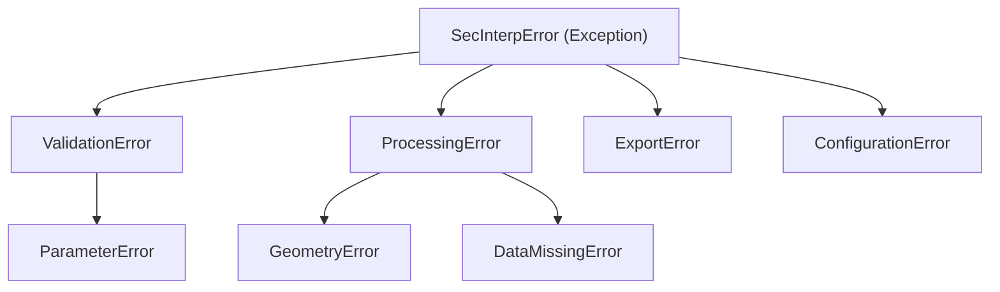

---
tags:
  - secinterp
  - code-walkthrough
  - core
  - exceptions
aliases:
  - exceptions.py
  - SecInterpError
  - ValidationError
  - ProcessingError
cssclass: secinterp-note
---

# `core/exceptions.py`

> [!abstract] One-line summary
> Defines the SecInterp **exception hierarchy**, with a common base `SecInterpError(message, details)` distinguishing validation, processing, geometry, export and configuration.

**Path**: `core/exceptions.py` (65 lines)
**Main class**: `SecInterpError`
**Layer**: Core (QGIS-agnostic)
**Tags**: #secinterp #core #exceptions

---

## 🎯 Why does this file exist?

Catching a generic `Exception` prevents the code from distinguishing a validation error
from a processing or export error. A dedicated hierarchy allows:

| Problem | Solution |
|---------|----------|
| Distinguish error types without magic strings | Subclass hierarchy |
| Attach technical context to an error | `SecInterpError(message, details)` |
| Handle expected vs unexpected errors | Selective catch (`except ValidationError`) |

> [!important] Base with `message` + `details`
> `SecInterpError` stores `self.message` and `self.details` (dict). This lets the log
> and the UI show the readable message and, optionally, the technical context.

---

## 🧬 Full hierarchy



| Branch | Subclasses | Domain |
|--------|-----------|--------|
| `ValidationError` | `ParameterError` | Input validation |
| `ProcessingError` | `GeometryError`, `DataMissingError` | Processing failures |
| `ExportError` | — | Export |
| `ConfigurationError` | — | Configuration |

---

## 📦 Imports — architectural reading

```python
# core/exceptions.py
from __future__ import annotations
```

| # | Observation |
|---|-------------|
| ① | **Zero imports**: depends only on the builtin `Exception`. Maximum portability. |

---

## 🏗️ Structure inventory

**Classes:** 8 (1 base + 7 subclasses)

- `SecInterpError` (base, with `__init__`)
- `ValidationError`, `ParameterError`, `ProcessingError`, `GeometryError`, `DataMissingError`, `ExportError`, `ConfigurationError`

All subclasses use `pass`: they add **no behaviour**, only type identity.

---

## 📖 Class-by-class walkthrough

### `SecInterpError` — base

```python
class SecInterpError(Exception):
    def __init__(self, message: str, details: dict | None = None) -> None:
        super().__init__(message)
        self.message = message
        self.details = details or {}
```

| Member | Role |
|--------|------|
| `message` | Readable message (what the UI shows) |
| `details` | Optional dict with technical context (e.g. `{"layer": "geology"}`) |

> [!tip] `details or {}` guarantees a non-None dict
> Avoids `if details is not None` checks in consumers.

### `ValidationError` / `ParameterError` — input

```python
class ValidationError(SecInterpError):
    """Raised when input validation fails."""

class ParameterError(ValidationError):
    """Raised when an invalid parameter is provided to a service or tool."""
```

`ParameterError` is a specific case of `ValidationError` (a concrete parameter, not
general validation). Catching `ValidationError` catches both.

### `ProcessingError` / `GeometryError` / `DataMissingError` — processing

```python
class ProcessingError(SecInterpError):
    """Raised when data processing fails."""

class GeometryError(ProcessingError):
    """Raised for geometry-related errors (invalid, null, etc.)."""

class DataMissingError(ProcessingError):
    """Raised when required data (e.g. from a layer) is missing."""
```

The richest sub-branch: `GeometryError` (invalid/null geometry) and `DataMissingError`
(missing data) are two concrete forms of processing failure.

### `ExportError` / `ConfigurationError` — infrastructure

```python
class ExportError(SecInterpError):
    """Raised when data export fails."""

class ConfigurationError(SecInterpError):
    """Raised for configuration-related issues."""
```

Infrastructure errors (export and configuration), separated from data processing. They
let exporters fail without being confused with the geological core.

---

## 🔄 Data flow

| Phase | Who raises | Who catches |
|-------|-----------|-------------|
| Validation | `ProjectValidator`, `PreviewParams.validate` | GUI (shows error) |
| Processing | core services (`ProcessingError`) | `controller` / tasks |
| Export | exporters (`ExportError`) | `dialog_export_manager` |
| Config | `ConfigService` (`ConfigurationError`) | GUI |

---

## 🏛️ Design patterns present

| Pattern | Where | Purpose |
|---------|-------|---------|
| **Exception hierarchy** | whole module | Error typing per domain |
| **Marker classes** | `pass` subclasses | Type identity without behaviour |
| **Error context object** | `details` dict | Attach technical context |

---

## 🧾 API summary

| Symbol | Inherits from | Typical use |
|--------|---------------|-------------|
| `SecInterpError` | `Exception` | Base for all domain errors |
| `ValidationError` | `SecInterpError` | Failed validation |
| `ParameterError` | `ValidationError` | Invalid parameter |
| `ProcessingError` | `SecInterpError` | Failed processing |
| `GeometryError` | `ProcessingError` | Invalid/null geometry |
| `DataMissingError` | `ProcessingError` | Missing data |
| `ExportError` | `SecInterpError` | Failed export |
| `ConfigurationError` | `SecInterpError` | Wrong configuration |

---

## 🛡️ Error handling

Recommended usage in the core:

```python
try:
    result = service.process(context)
except DataMissingError as e:
    logger.warning(f"Insufficient data: {e.message}")
    return None
except ProcessingError as e:
    logger.error(f"Process failure: {e.message} ({e.details})")
    raise
```

> [!tip] Catch from specific to general
> `DataMissingError` (specific) before `ProcessingError` (general), before
> `SecInterpError` (base). Each layer handles only what concerns it.

---

## 🧭 Which exception to raise

Quick decision table to choose the right exception:

| Situation | Exception |
|-----------|-----------|
| Invalid user input | `ValidationError` |
| One concrete wrong parameter | `ParameterError` |
| Generic compute failure | `ProcessingError` |
| Invalid or null geometry | `GeometryError` |
| Missing layer data | `DataMissingError` |
| Failure writing a file | `ExportError` |
| Wrong configuration | `ConfigurationError` |

> [!important] Golden rule
> Raise the **most specific** exception that describes the failure. Consumers catch the
> most general one they care about; the hierarchy does the rest.

---

## 📝 Logging conventions

```python
except DataMissingError as e:
    logger.warning("Missing data: %s", e.message)   # expected, no traceback
except ProcessingError as e:
    logger.error("Process failure: %s (%s)", e.message, e.details)
    raise                                           # unexpected, re-raise
```

| Error type | Log level | Traceback |
|------------|-----------|-----------|
| `ValidationError` / `DataMissingError` | `warning` | no |
| `ProcessingError` / `GeometryError` | `error` | yes (re-raise) |
| `ExportError` / `ConfigurationError` | `error` | yes |

---

## 🧪 Associated tests

Pure cases mapped to `tests/core/test_exceptions.py`:

- `test_base_error_message` — `message` propagates to `str(exc)`.
- `test_base_error_details_default` — `details` defaults to `{}`.
- `test_hierarchy_isinstance` — `ParameterError` is `ValidationError` and `SecInterpError`.
- `test_geometry_error_is_processing` — `GeometryError` is `ProcessingError`.

---

## 🌐 i18n and migration notes

- **Messages**: messages are passed when raising (`raise ProcessingError(self.tr(...))`),
  not translated inside `exceptions.py`.
- **Extension**: adding an exception is a 2-line `pass` subclass.
- **Stability**: the hierarchy is stable; catching `SecInterpError` is backward-compatible
  with new subclasses.

---

## 👀 Observations and notes

> [!success] Strengths
> - Clean hierarchy with no dependencies (only `Exception`).
> - `message` + `details` separates the readable from the technical context.
> - `pass` subclasses = pure type identity, easy to extend.

> [!warning] Points of attention
> - `details` typed as `dict` without a schema: consumers must know the keys.
> - `PreviewParams.validate()` (in `dtos.py`) raises `ValueError` instead of `ValidationError`.
> - No specific *cancellation* exception (uses `feedback` in services).

> [!question] Open questions
> - Migrate `ValueError` from `dtos.validate()` to `ValidationError`?
> - Add a typed `details` (`TypedDict`) to document the expected keys?

---

## 🔗 Related notes

- [[Index]] — vault index
- [[controller]] — raises `ProcessingError` in topography
- [[core_validation]] — `ValidationError` from the validation framework
- [[geology_service]] / [[drillhole_service]] — consume/raise these exceptions
- [[dtos]] — `PreviewParams.validate()` (uses `ValueError` for now)

---

*Note of the SecInterp Code Walkthrough v2 vault — v3.8.0*
