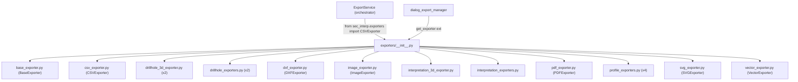

---
tags:
  - secinterp
  - code-walkthrough
  - exporters
aliases:
  - __init__.py
  - exporters
  - get_exporter
cssclass: secinterp-note
---

# `exporters/__init__.py`

> [!abstract] One-line summary
> Facade of the `exporters/` package: re-exports the 16 writer classes and offers `get_exporter()` as a factory by file extension.

**Path**: `exporters/__init__.py` (81 lines)
**Main symbols**: `get_exporter`, `__all__` (17 names)
**Layer**: Exporters (GUI · QGIS-dependent; the `__init__` itself imports no QGIS)
**Tags**: #secinterp #exporters

---

## 🎯 Why does this file exist?

The package holds 12 writer modules. Without a facade, every consumer would memorise
internal paths (`from sec_interp.exporters.profile_exporters import GeologyVectorExporter`).
With a facade, one import point plus a factory picking the class by extension:

| Problem | Solution |
|---------|----------|
| 12 modules with unstable internal paths | Re-exports + 17-name `__all__`: `from sec_interp.exporters import X` |
| Picking a writer by extension at each call | `get_exporter(extension, settings)` centralises the dispatch |
| Circular imports between writers and package | Writers import relative `.base_exporter`; the `__init__` only re-exports leaves |

> [!important] Architectural note — Facade + minimal Factory
> This `__init__` is **pure re-export** (no logic besides `get_exporter`). It does not
> register the drillhole/interpretation 2D/3D writers in the factory: those are picked by
> the core handlers (`exp_drill`, `exp_interp`) by entity, not by extension.

---

## 🧬 Relationship diagram



> [!tip] How to read
> The 12 outgoing arrows are re-exports (the `__init__` wraps nothing). The
> [[orchestrator]] imports `CSVExporter` from here with a lazy import; the GUI can ask
> for a generic writer with `get_exporter()`.

---

## 📦 Imports — architectural reading

```python
# exporters/__init__.py
from __future__ import annotations

"""Exporters package for Sec Interp plugin.

Provides specialized exporters for different file formats.
"""

from .base_exporter import BaseExporter
from .csv_exporter import CSVExporter
from .drillhole_3d_exporter import (
    DrillholeInterval3DExporter,
    DrillholeTrace3DExporter,
)
from .drillhole_exporters import (
    DrillholeIntervalVectorExporter,
    DrillholeTraceVectorExporter,
)
from .dxf_exporter import DXFExporter
from .image_exporter import ImageExporter
from .interpretation_3d_exporter import Interpretation3DExporter
from .interpretation_exporters import Interpretation2DExporter
from .pdf_exporter import PDFExporter
from .profile_exporters import (
    AxesVectorExporter,
    GeologyVectorExporter,
    ProfileLineVectorExporter,
    StructureVectorExporter,
)
from .svg_exporter import SVGExporter
from .vector_exporter import VectorExporter
```

| # | Observation |
|---|-------------|
| ① | `from __future__ import annotations` before the docstring: unusual but valid order (the future-import must come first). |
| ② | Relative imports (`from .x import Y`): the package is self-contained and relocatable. |
| ③ | Only imports **leaves** (concrete classes), never submodules between each other: no cycles. |
| ④ | Alphabetical by module (`base_`, `csv_`, `drillhole_`, `dxf_`, `image_`, `interpretation_`, `pdf_`, `profile_`, `svg_`, `vector_`). |
| ⑤ | The `__init__` touches no `qgis.*`: importing the package is cheap; QGIS loads when writers instantiate. |

---

## 🏗️ Structure inventory

**Symbols:** 1 function (`get_exporter`) + `__all__` with 17 names (16 classes + `get_exporter`).

| Name in `__all__` | Source module | Note |
|---|---|---|
| `AxesVectorExporter` | `profile_exporters` | Profile axes |
| `BaseExporter` | `base_exporter` | Abstract base class |
| `CSVExporter` | `csv_exporter` | Profile tables |
| `DXFExporter` | `dxf_exporter` | CAD output |
| `DrillholeInterval3DExporter` | `drillhole_3d_exporter` | `LineStringZ` intervals |
| `DrillholeIntervalVectorExporter` | `drillhole_exporters` | 2D intervals |
| `DrillholeTrace3DExporter` | `drillhole_3d_exporter` | `LineStringZ` traces |
| `DrillholeTraceVectorExporter` | `drillhole_exporters` | 2D traces |
| `GeologyVectorExporter` | `profile_exporters` | Geological segments |
| `ImageExporter` | `image_exporter` | Canvas PNG/JPG |
| `Interpretation2DExporter` | `interpretation_exporters` | 2D polygons |
| `Interpretation3DExporter` | `interpretation_3d_exporter` | `PolygonZ` polygons + QML |
| `PDFExporter` | `pdf_exporter` | PDF report |
| `ProfileLineVectorExporter` | `profile_exporters` | Topographic line |
| `SVGExporter` | `svg_exporter` | SVG output |
| `StructureVectorExporter` | `profile_exporters` | Structural ticks |
| `VectorExporter` | `vector_exporter` | Generic SHP/GPKG/DXF |

> [!note] Alphabetical `__all__`
> With one apparent exception: `get_exporter` closes the list (functions after classes).
> Alphabetical order makes duplicates and absences visible at a glance.

---

## 📁 Files in the package `exporters/`

| File | Lines | Role |
|---|--:|---|
| `__init__.py` | 81 | This note: facade + `get_exporter()` |
| `base_exporter.py` | 137 | `BaseExporter` (`export()` contract + path validation) |
| `csv_exporter.py` | — | `CSVExporter` (profile tables) |
| `drillhole_3d_exporter.py` | 243 | `LineStringZ` traces and intervals |
| `drillhole_exporters.py` | 239 | 2D traces and intervals |
| `dxf_exporter.py` | — | CAD output |
| `image_exporter.py` | — | PNG/JPG |
| `interpretation_3d_exporter.py` | 465 | `PolygonZ` + QML style |
| `interpretation_exporters.py` | 146 | 2D polygons |
| `pdf_exporter.py` | — | PDF report |
| `profile_exporters.py` | 362 | Topography, geology, structures, axes |
| `svg_exporter.py` | — | SVG output |
| `vector_exporter.py` | — | Generic SHP/GPKG/DXF |

Notes with exact lines were read as sources for this phase; the rest is covered in
their own notes (`[[csv_exporter]]`, `[[dxf_exporter]]`, `[[image_exporter]]`,
`[[pdf_exporter]]`, `[[svg_exporter]]`, `[[vector_exporter]]`, [[base_exporter]]).

---

## 📖 Function-by-function walkthrough

### `get_exporter` — factory by extension

```python
def get_exporter(extension: str, settings: dict) -> BaseExporter:
    """Get the appropriate exporter instance for the file extension.

    Args:
        extension: File extension (e.g., '.png', '.svg', '.dxf')
        settings: Export settings dictionary

    Returns:
        Appropriate exporter instance

    Raises:
        ValueError: If extension is not supported

    """
    extension = extension.lower()

    if extension in [".png", ".jpg", ".jpeg"]:
        return ImageExporter(settings)
    if extension == ".svg":
        return SVGExporter(settings)
    if extension == ".pdf":
        return PDFExporter(settings)
    if extension == ".csv":
        return CSVExporter(settings)
    if extension in [".shp", ".gpkg", ".dxf"]:
        return VectorExporter(settings)

    raise ValueError(f"Unsupported file extension: {extension}")
```

| Branch | Writer | Note |
|--------|--------|------|
| `.png` / `.jpg` / `.jpeg` | `ImageExporter(settings)` | Only one with 3 aliases (normalised with `.lower()`) |
| `.svg` | `SVGExporter(settings)` | Vector output for reports |
| `.pdf` | `PDFExporter(settings)` | Document, not a layer |
| `.csv` | `CSVExporter(settings)` | The one the [[orchestrator]] uses (`CSVExporter({})`) |
| `.shp` / `.gpkg` / `.dxf` | `VectorExporter(settings)` | Generic; per-entity writers do **not** go through here |
| Other | `ValueError` | Standard `ValueError`, not the domain `ExportError` |

> [!important] Limited factory scope
> `get_exporter` covers **file** formats, not geological entities: there is no branch
> for "drillholes" or "interpretations" because those writers need specifically shaped
> `data` and are picked by the handlers (`drillholes`, `interpretations`, …). It is a
> GUI convenience factory, not the main dispatch (that lives in the [[orchestrator]]).

---

## 🔄 Data flow

| Phase | Input | Transformation | Output |
|-------|-------|----------------|--------|
| Re-export | `from sec_interp.exporters import X` | `__all__` exposes 16 classes | Class ready to instantiate |
| Factory | `extension` + `settings` | `lower()` + `if` chain | Configured writer |
| Unknown extension | `".tif"`, `""`, … | no branch matches | `ValueError` |
| Consumption | writer + per-entity `data` | `writer.export(path, data)` | `bool` (`BaseExporter` contract) |

---

## 🏛️ Design patterns present

| Pattern | Where | Purpose |
|---------|-------|---------|
| **Facade** | Re-exports + `__all__` | One import point for 12 modules |
| **Factory (simple)** | `get_exporter` | Pick writer by extension |
| **Implicit registry** | `if` chain by extension | Extension → class map without a separate dict |
| **Fail fast** | Trailing `ValueError` | Bad extension caught at request time, not at write time |

---

## 🧾 API summary

| Symbol | Signature | Typical use |
|--------|-----------|-------------|
| `get_exporter` | `(extension: str, settings: dict) -> BaseExporter` | `get_exporter(".pdf", settings).export(path, data)` |
| `__all__` | 17 names | Controlled `from sec_interp.exporters import *` |
| Re-exports | 16 classes | `from sec_interp.exporters import GeologyVectorExporter` |

---

## 🛡️ Error handling

| Situation | Behaviour |
|-----------|-----------|
| Uppercase extension (`".SHP"`) | Normalised with `.lower()` → works |
| Unknown extension | `ValueError(f"Unsupported file extension: {extension}")` |
| Key-less `settings` | Propagated to the writer (`get_setting` with defaults in `BaseExporter`) |
| Package import | No side effects: instantiates nothing, touches no QGIS or disk |

> [!note] `ValueError`, not `ExportError`
> The factory fails **before** exporting (bad caller request), so it uses Python's
> standard error. `ExportError` (see [[exceptions]]) is reserved for failures during
> the write.

---

## 🧪 Associated tests

**Package unit tests** (see `tests/exporters/`):

- `tests/exporters/test_exporters.py::test_get_supported_extensions` — extension contract.
- `tests/exporters/test_exporters.py::test_export_valid_data` / `test_export_empty_data` — `export() -> bool` contract.
- `tests/exporters/test_vector_exporter.py`, `test_svg_exporter.py`, `test_pdf_exporter.py`, `test_image_exporter.py` — factory writers.
- `tests/exporters/test_drillhole_3d_exporter.py`, `test_drillhole_export_objects.py` — per-entity writers.
- `tests/exporters/test_interpretation_exporters.py`, `test_interpretation_3d_exporter.py` — per-entity writers.

**Integration**:

- `tests/integration/test_export_service_e2e.py` — the [[orchestrator]] consuming `CSVExporter` via this package.
- `tests/integration/test_vector_drivers_integration.py` — real SHP/GPKG/DXF drivers.

> [!tip] Coverage gap
> There is no dedicated `get_exporter()` test (branches per extension + `ValueError`):
> the cheapest test to add for this file (no QGIS, just a `settings` dict).

---

## 👀 Observations and notes

> [!success] Strengths
> - One import for the whole package; alphabetical, complete `__all__`.
> - The `__init__` imports no QGIS: importing the package never breaks QGIS-less tests.
> - Case-normalising factory (`lower()`) with a clear error for the unknown.

> [!warning] Points of attention
> - The factory ignores 9 of the 16 classes (the whole per-entity 2D/3D family).
> - `settings: dict` unparametrised (`dict[str, Any]` would match `BaseExporter`).
> - `from __future__` before the docstring: valid but against convention.
> - No dynamic `__all__`: adding a writer means touching imports + list (forgettable).

> [!question] Open questions
> - Extend `get_exporter` with entity dispatch (`kind="drillholes_3d"`) or keep it file-based?
> - Unit test for `get_exporter` (all branches + `ValueError`)?
> - Type `settings` as `dict[str, Any]`?

---

## 🔗 Related notes

- [[Index]] — vault index
- [[base_exporter]] — `BaseExporter`, contract shared by all 16 writers
- [[drillhole_exporters]] / [[drillhole_3d_exporter]] — drillhole writers
- [[interpretation_exporters]] / [[interpretation_3d_exporter]] — interpretation writers
- [[profile_exporters]] — profile writers (topography, geology, structures, axes)
- [[csv_exporter]] / [[vector_exporter]] / [[dxf_exporter]] — factory writers
- [[image_exporter]] / [[svg_exporter]] / [[pdf_exporter]] — document/image writers
- [[orchestrator]] — main consumer (`CSVExporter` + per-entity handlers)
- [[dialog_export_manager]] — GUI using the factory and the handlers

---

*Note of the SecInterp Code Walkthrough v2 vault — v3.9.0*
