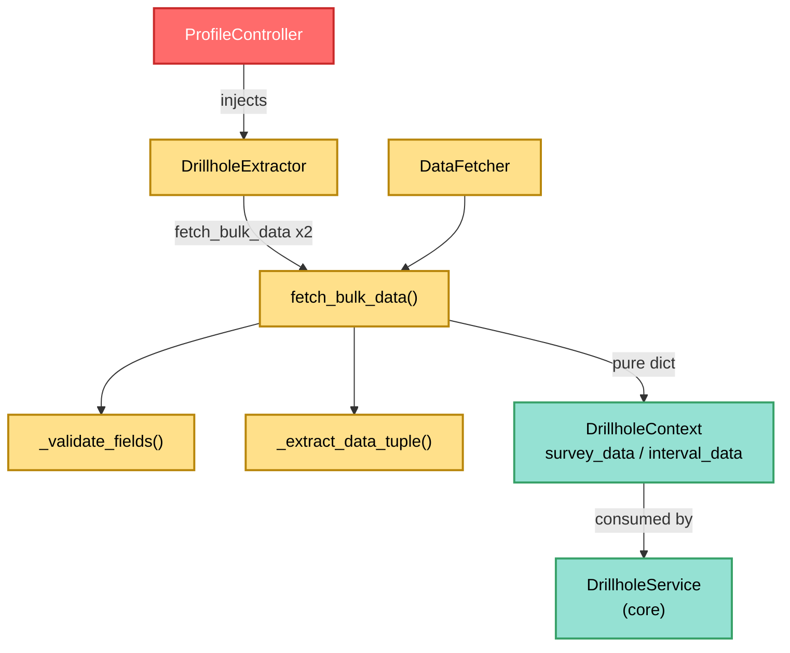

---
tags:
  - secinterp
  - code-walkthrough
  - gui
  - adapters
aliases:
  - feature_fetcher.py
  - DataFetcher
cssclass: secinterp-note
---

# `gui/adapters/feature_fetcher.py`

> [!abstract] One-line summary
> Minimalist **Extract** adapter (`DataFetcher`, 84 lines) reading drillhole child layers (surveys and intervals) in a single pass per layer with an `IN` expression and returning plain depth-ordered tuples, so the core never sees a `QgsFeatureRequest`.

**Path**: `gui/adapters/feature_fetcher.py` (84 lines)
**Main class**: `DataFetcher`
**Layer**: GUI · Adapter (Extract side, depends on QGIS)
**Tags**: #secinterp #gui #adapters

---

## 🎯 Why does this file exist?

Surveys (deviations) and intervals (lithologies) hang off collars via `hole_id`.
Reading them hole-by-hole would be one query per collar (N+1 pattern); this
fetcher inverts the read: one pass per child layer with an `IN` filter:

| Problem | Solution |
|---------|----------|
| N collars × 2 child layers = 2N queries | `fetch_bulk_data` runs 2 queries total (one per child) with `"id" IN (...)` |
| The core cannot import `QgsFeatureRequest` | The fetcher returns a pure `dict[hole_id, list[tuple]]` |
| Unordered surveys break the trajectory | Sorts each survey list by depth (`sort(key=x[0])`) |
| Corrupt rows (text in depth) must not kill the batch | `_extract_data_tuple` returns `None` and the row is skipped |

> [!important] Architectural note
> It is the **child sub-adapter** of `DrillholeExtractor`: no dialog calls it
> directly — `extract_context` does (via the `data_fetcher` injected by
> `ProfileController`). Its output feeds `DrillholeContext.survey_data` and
> `interval_data` as-is.

---

## 🧬 Relationship diagram



> [!tip] How to read
> `DataFetcher` exists only to serve `DrillholeExtractor`: two calls per
> extraction (survey + intervals). The `QgsFeatureRequest` with the `IN` filter
> is the heart of the query saving.

---

## 📦 Imports — architectural reading

```python
# gui/adapters/feature_fetcher.py
from __future__ import annotations

from typing import Any

from qgis.core import QgsFeature, QgsFeatureRequest, QgsVectorLayer
```

| # | Observation |
|---|-------------|
| ① | Three `qgis.core` classes and nothing else: the smallest module of the package (no `math`, no `QgsGeometry`, no raster). |
| ② | No `qgis.PyQt`, no `tr()`, no logger, no core imports: silent extraction; failure is expressed as `{}` or `None`. |
| ③ | `QgsFeature` only annotates `_extract_data_tuple`; `QgsFeatureRequest` builds the `IN` filter; `QgsVectorLayer` annotates the child layers. |
| ④ | `Any` covers `hole_id` (may be `int` or `str` depending on the layer) and tuple items. |

---

## 🏗️ Structure inventory

**Class:** `class DataFetcher` — 3 methods (1 public + 2 private), no `__init__`, no state.

**Methods:**
- `fetch_bulk_data(layer, hole_ids, fields)` — one pass with `IN` filter; sorts surveys by depth; returns `dict[Any, list[tuple]]`.
- `_validate_fields(layer, fields)` — valid layer + `id` field + role-required fields (`depth/azim/incl` or `from/to/lith`).
- `_extract_data_tuple(feat, fields, is_survey)` — numeric `(depth, azim, incl)` or mixed `(from, to, lith)`; `None` on corrupt rows.

**`fields` convention:**
- `"id"` key always (collar link).
- Presence of the `"depth"` key → **survey** role; absence → **interval** role.
- Survey requires `depth/azim/incl`; interval requires `from/to/lith`.

---

## 📁 Files in the package

The fetcher lives in the `gui/adapters/` package (the full Extract phase):

| File | Lines | Role |
|---|--:|---|
| `__init__.py` | 7 | Package docstring: Extract-then-Compute contract |
| `drillhole_extractor.py` | 369 | `DrillholeExtractor` → `DrillholeContext` (client of this note) |
| `geology_extractor.py` | 235 | `GeologyExtractor` → `GeologyContext` |
| `geometry.py` | 226 | QGIS geometry helpers and DEM sampling |
| `layer_resolver.py` | 113 | `LayerResolver` + `resolve_layer` (layer cache) |
| `structure_extractor.py` | 226 | `SectionContext` + `StructureExtractor` |
| `validation_extractor.py` | 176 | `resolve_layer_metadata`, `build_validation_params` |
| `feature_fetcher.py` | 84 | `DataFetcher` (this note) |
| `profile_extractor.py` | 86 | `ProfileExtractor` → `ProfileData` |

---

## 📖 Method-by-method walkthrough

### `fetch_bulk_data` — one pass per child layer

```python
def fetch_bulk_data(
    self, layer: QgsVectorLayer, hole_ids: set[Any], fields: dict[str, str]
) -> dict[Any, list[tuple[Any, ...]]]:
    if not self._validate_fields(layer, fields):
        return {}
    result_map: dict[Any, list[tuple]] = {}
    if not hole_ids:
        return {}
    id_f = fields["id"]
    is_survey = "depth" in fields
    ids_str = ", ".join([f"'{hid!s}'" for hid in hole_ids])
    request = QgsFeatureRequest().setFilterExpression(f'"{id_f}" IN ({ids_str})')
    for feat in layer.getFeatures(request):
        hole_id = feat[id_f]
        data = self._extract_data_tuple(feat, fields, is_survey)
        if data:
            result_map.setdefault(hole_id, []).append(data)
    # Sort surveys by depth
    if is_survey:
        for h_id in result_map:
            result_map[h_id].sort(key=lambda x: x[0])
    return result_map
```

| Step | Detail |
|------|--------|
| **Validation** | Mis-mapped fields → immediate `{}` (layer never queried). |
| **Empty guard** | Empty `hole_ids` → `{}` (avoids an invalid `IN ()`). |
| **Filter** | `"<id>" IN ('a', 'b', ...)` expression with each id string-quoted (`'{hid!s}'`). |
| **Aggregation** | `setdefault(hole_id, [])` groups by hole; corrupt rows (`None`) skipped. |
| **Ordering** | Surveys only: `sort` by `x[0]` (depth) — `TrajectoryEngine` assumes ordered deviations. |

> [!note] Key-based role detection
> `is_survey = "depth" in fields` decides the tuple schema and ordering. An
> implicit convention between the dialog (building `survey_fields` /
> `interval_fields` from `PreviewParams`) and this method: documented here and in
> `_validate_fields`, but with no constant or enum backing it.

### `_validate_fields` — role-based fields

```python
def _validate_fields(self, layer: QgsVectorLayer, fields: dict[str, str]) -> bool:
    if not layer or not layer.isValid():
        return False
    id_f = fields.get("id")
    if not id_f or layer.fields().indexFromName(id_f) == -1:
        return False
    is_survey = "depth" in fields
    required = ["depth", "azim", "incl"] if is_survey else ["from", "to", "lith"]
    for field_key in required:
        f_name = fields.get(field_key)
        if not f_name or layer.fields().indexFromName(f_name) == -1:
            return False
    return True
```

Three cascading checks (layer → `id` → role fields) with `indexFromName == -1`
as "missing field". Returns `bool`, not an exception: the caller translates
`False` into `{}`. Note it validates **layer field names** (`fields.get("depth")`
→ real name), not the mapping keys.

### `_extract_data_tuple` — row to tuple

```python
def _extract_data_tuple(
    self, feat: QgsFeature, fields: dict[str, str], is_survey: bool
) -> tuple[float, float, Any] | None:
    try:
        if is_survey:
            return (
                float(feat[fields["depth"]]),
                float(feat[fields["azim"]]),
                float(feat[fields["incl"]]),
            )
        else:
            return (
                float(feat[fields["from"]]),
                float(feat[fields["to"]]),
                str(feat[fields["lith"]]),
            )
    except (ValueError, TypeError, KeyError):
        return None
```

Survey: numeric triple `(depth, azimuth, inclination)`. Interval: `(from, to,
lithology)` with lithology as `str` (alphanumeric codes valid). Any
non-convertible cell or missing key → `None` (row dropped, rest of the hole
intact).

---

## 🔄 Data flow

| Phase | Input | Transformation | Output |
|-------|-------|----------------|--------|
| Validation | layer + mapping | `_validate_fields` | `True` or `{}` |
| Filter | `hole_ids` | `"id" IN (...)` | `QgsFeatureRequest` |
| Read | child features | `_extract_data_tuple` per row | tuples (or drop) |
| Aggregation | tuples | `setdefault(hole_id, [])` | `dict[hole_id, list]` |
| Ordering | survey lists | `sort(key=depth)` | ordered deviations |
| Delivery | pure dict | (via `DrillholeExtractor`) | `DrillholeContext.survey_data` / `interval_data` |

---

## 🏛️ Design patterns present

| Pattern | Where | Purpose |
|---------|-------|---------|
| **Bulk fetch (anti N+1)** | `fetch_bulk_data` | 2 queries instead of 2N |
| **Role by convention** | `"depth" in fields` | one method for survey and interval |
| **Tolerant row** | `_extract_data_tuple → None` | corrupt rows do not kill the hole |
| **Boolean validator** | `_validate_fields` | fail without exceptions |

---

## 🧾 API summary

| Symbol | Signature | Typical use |
|--------|-----------|-------------|
| `DataFetcher` | stateless class | `DataFetcher()` (injected into `DrillholeExtractor`) |
| `fetch_bulk_data` | `(layer, hole_ids: set, fields: dict) -> dict[Any, list[tuple]]` | surveys or intervals of N holes |
| `_validate_fields` | `(layer, fields) -> bool` | mapping guard |
| `_extract_data_tuple` | `(feat, fields, is_survey) -> tuple \| None` | one child row |

---

## 🛡️ Error handling

| Situation | Behaviour |
|-----------|-----------|
| Invalid / missing layer | `{}` |
| Missing `id` or role field | `{}` |
| Empty `hole_ids` | `{}` (no query) |
| Row with non-numeric values | row skipped (`None`) |
| Missing mapping key (`KeyError`) | row skipped |

> [!tip] Silent but bounded failure
> The `{}` propagates as `survey_data={}` in the context and the core treats it
> as "vertical hole without deviations" — geologically sensible degradation, not
> just any masked error.

---

## 🧪 Associated tests

No dedicated tests (neither `test_feature_fetcher.py` nor `test_data_fetcher.py`
exists); indirect coverage:

- `tests/gui/tasks/test_drillhole_task.py` — the task consuming extracted surveys/intervals.
- `tests/core/test_drillhole_service.py` — the core with already-aggregated `survey_data`/`interval_data` (the format produced here).
- `tests/core/test_drillhole_service_optional.py` — service with empty children (`{}`).
- `tests/integration/test_async_orchestrators.py` — orchestration with a real injected `DataFetcher`.
- `tests/base_test.py` — QGIS mocks for a future mock-first test of the `IN` filter.

> [!warning] Coverage gap
> The `IN` filter (quoted ids, field names with spaces), depth sorting and corrupt-row
> dropping are three ideal cases for a `test_feature_fetcher.py` with a fake layer.

---

## 🧵 Thread-safety and i18n

| Aspect | Detail |
|--------|--------|
| **Thread** | `getFeatures` with a live `QgsFeatureRequest` → main thread, inside `DrillholeExtractor.extract_context`. The resulting dict (primitives) is the only thing travelling to the `QgsTask`. |
| **`IN` expression** | Built by string interpolation: `hole_id`s with a single quote (`O'Brien`) would break the expression — see observations. |
| **i18n** | Nothing to translate: no user messages. |

---

## 📐 Output format (contract with the core)

| Role | Tuple | Example |
|-----|-------|---------|
| Survey | `(depth: float, azim: float, incl: float)` ordered by `depth` | `(30.0, 145.0, 62.5)` |
| Interval | `(from: float, to: float, lith: str)` in read order | `(0.0, 12.5, "AND")` |
| Key | raw `hole_id` (`feat[id_f]`, unnormalized) | `101` or `"DH-01"` |

> [!note] Ids are not normalized
> `feat[id_f]` keeps the layer type (`int` vs `str`): the core groups by direct
> equality with `collar_data` ids. Mixing types across layers (collar `101` int
> vs survey `"101"` str) would silently break the link.

---

## 👀 Observations and notes

> [!success] Strengths
> - Kills the N+1 with a single `IN` expression per child.
> - Survey ordering guaranteed for `TrajectoryEngine`.
> - Stateless: thread-safe by construction (if QGIS objects were).
> - Geologically sensible degradation (`{}` = vertical hole).

> [!warning] Points of attention
> - Raw id interpolation into the expression: quotes in the id break the filter (`QgsExpression.quotedString` would be robust).
> - Layers with thousands of collars build a giant `IN (...)`: no pagination or limit.
> - Implicit role via `"depth" in fields`: no enum or unknown-mapping validation.
> - Unnormalized `hole_id` across collar/survey/interval (`int` vs `str` risk).

> [!question] Open questions
> - Escape ids with `QgsExpression.quotedString` or bound parameters?
> - Paginate the `IN` in chunks (e.g. 500 ids) for massive layers?
> - Normalize `hole_id` to `str` when aggregating to harden the link?

---

## 🔗 Related notes

- [[Index]] — vault index
- [[gui_adapters]] — Extract adapters package note
- [[drillhole_extractor]] — direct client (injects and calls `fetch_bulk_data` ×2)
- [[task_inputs]] — `DrillholeContext.survey_data` / `interval_data` (produced format)
- [[drillhole_service]] — core consumer of the ordered tuples
- [[controller]] — `ProfileController` (fetcher composition root)
- [[dtos]] — `PreviewParams` (origin of `survey_fields` / `interval_fields`)

---

*Note of the SecInterp Code Walkthrough v2 vault — v3.9.0*
