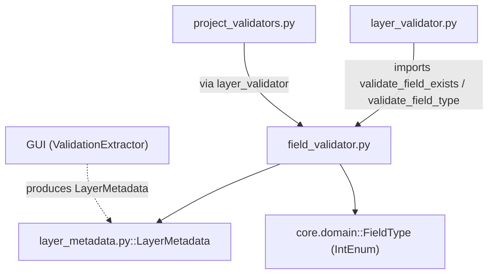

---
tags:
  - secinterp
  - code-walkthrough
  - core
  - validation
aliases:
  - field_validator.py
  - validate_numeric_input
  - validate_integer_input
  - validate_angle_range
  - validate_field_exists
  - validate_field_type
cssclass: secinterp-note
---

# `core/validation/field_validator.py`

> [!abstract] One-line summary
> A set of **QGIS-agnostic** level-1 validators for layer fields and attributes: they convert input strings into numbers/integers and check field existence and type against a detached `LayerMetadata`.

**Path**: `core/validation/field_validator.py` (184 lines)
**Main functions**: `validate_numeric_input`, `validate_integer_input`, `validate_angle_range`, `validate_field_exists`, `validate_field_type`
**Layer**: Core (QGIS-agnostic)
**Tags**: #secinterp #core #validation

---

## 🎯 Why does this file exist?

Field validation is the first line of defense before a malformed value reaches the
geological computation. This module groups the **atomic** validators that depend on
neither QGIS nor global state:

| Problem | Solution |
|---------|----------|
| Convert a QLineEdit string to a number without crashing | `validate_numeric_input` / `validate_integer_input` return `(bool, str, value)` |
| Check that a field exists in a layer | `validate_field_exists` against `LayerMetadata.field_names` |
| Check that a field has the expected type | `validate_field_type` against a list of `FieldType` |
| Validate angles (dip/strike) within range | `validate_angle_range` with default bounds `0..360` |

> [!important] Architectural note
> **Fully QGIS-agnostic.** It imports neither `qgis.core` nor `PyQt`. It works with
> `LayerMetadata` (a detached DTO produced by the GUI) and `FieldType` (an `IntEnum`
> mapping `QVariant.Type` values without importing Qt). This allows pure `unittest`
> testing in `tests/core/`.

---

## 🧬 Relationship diagram



> [!tip] How to read
> Solid arrow = imports; dashed = produced by. `field_validator` is the lowest
> validation layer: other validators (`layer_validator`) reuse it as building blocks,
> and the GUI only hands over `LayerMetadata` without exposing QGIS objects.

---

## 📦 Imports — architectural reading

```python
# core/validation/field_validator.py
from __future__ import annotations

from sec_interp.core.domain import FieldType
from sec_interp.core.validation.layer_metadata import LayerMetadata
```

| # | Observation |
|---|-------------|
| ① | `from __future__ import annotations` — deferred annotations, mandatory project-wide. |
| ② | `FieldType` — domain `IntEnum` replacing `QVariant.Type`; avoids importing Qt. |
| ③ | `LayerMetadata` — detached metadata DTO; **never** imports `QgsVectorLayer`. |
| ④ | Only 2 local imports plus a builtin: minimal dependency surface, maximum testability. |

---

## 🏗️ Structure inventory

**Functions (5, all module-level public):**

- `validate_numeric_input(value, min_val, max_val, field_name, allow_empty) -> (bool, str, float|None)`
- `validate_integer_input(value, min_val, max_val, field_name, allow_empty) -> (bool, str, int|None)`
- `validate_angle_range(value, field_name, min_angle, max_angle) -> (bool, str)`
- `validate_field_exists(metadata, field_name) -> (bool, str)`
- `validate_field_type(metadata, field_name, expected_types) -> (bool, str)`

**Local constants (not module-level):**

- `MAX_FIELDS_TO_SHOW = 5` — inside `validate_field_exists`, truncates the available-fields list.
- `type_names` — internal dict of `validate_field_type` translating `FieldType` to a readable name.

> [!note] No classes, no state
> The module is 100% functional: five pure functions with no shared state ⇒
> thread-safe and side-effect-free (apart from building error messages).

---

## 📁 Files in the package

`field_validator.py` belongs to the `core/validation/` package; together with its
neighbours it composes the 3-level validation chain:

| File | Role |
|------|------|
| `field_validator.py` | Atomic field and attribute validation (this file) |
| `layer_validator.py` | Spatial validation (geometry, bands, CRS) that reuses this module |
| `path_validator.py` | Secure output path validation |
| `validation_helpers.py` | `ValidationContext`, `RichValidationError`, `DependencyRule` |
| `project_validator.py` | `ProjectValidator` orchestrator + `ValidationParams` DTO |
| `project_validators.py` | Per-component specialized validators (Section/DEM/…) |
| `validators.py` | Reusable dataclass field validator factories |
| `layer_metadata.py` | `LayerMetadata` DTO + geometry/kind constants |
| `base_validator.py` | `IValidator` interface (ABC) |
| `pipeline.py` | `ValidationPipeline` (sequential execution) |

---

## 📖 Method-by-method walkthrough

### `validate_numeric_input`

```python
def validate_numeric_input(
    value: str,
    min_val: float | None = None,
    max_val: float | None = None,
    field_name: str = "Value",
    allow_empty: bool = False,
) -> tuple[bool, str, float | None]:
    if not value or value.strip() == "":
        if allow_empty:
            return True, "", None
        return False, f"{field_name} is required", None

    try:
        num_value = float(value)
    except (ValueError, TypeError):
        return False, f"{field_name} must be a valid number", None

    if min_val is not None and num_value < min_val:
        return False, f"{field_name} must be at least {min_val}", None
    if max_val is not None and num_value > max_val:
        return False, f"{field_name} must be at most {max_val}", None
    return True, "", num_value
```

Converts a string to `float` and optionally applies `min_val`/`max_val` bounds. The
decision flow is: empty → parse → range → success. It returns the parsed number in the
third tuple slot, saving the caller a second `float()`.

| Parameter | Role |
|-----------|------|
| `allow_empty` | If `True`, an empty string is valid and returns `(True, "", None)` |
| `min_val`/`max_val` | Inclusive bounds; `None` disables them |
| `field_name` | Name used to personalize the error messages |

### `validate_integer_input`

```python
def validate_integer_input(
    value: str,
    min_val: int | None = None,
    max_val: int | None = None,
    field_name: str = "Value",
    allow_empty: bool = False,
) -> tuple[bool, str, int | None]:
    if not value or value.strip() == "":
        if allow_empty:
            return True, "", None
        return False, f"{field_name} is required", None

    try:
        int_value = int(value)
    except (ValueError, TypeError):
        return False, f"{field_name} must be a valid integer", None
    ...
    return True, "", int_value
```

Mirror of `validate_numeric_input` but using `int()`. A string like `"123.45"` fails
here (unlike the numeric case), which is the desired behaviour for fields that require
integers (e.g. band number, identifiers).

### `validate_angle_range`

```python
def validate_angle_range(
    value: float, field_name: str, min_angle: float = 0.0, max_angle: float = 360.0
) -> tuple[bool, str]:
    if value < min_angle or value > max_angle:
        return (
            False,
            f"{field_name} must be between {min_angle} and {max_angle} degrees",
        )
    return True, ""
```

Validates an already **numeric** angle (dip, strike). Default bounds `0.0..360.0` cover
azimuth/bearing; a dip can call with `max_angle=90.0`. Note the bounds are inclusive, so
`360.0` is valid.

### `validate_field_exists`

```python
def validate_field_exists(metadata: LayerMetadata, field_name: str | None) -> tuple[bool, str]:
    if not metadata or not metadata.is_valid:
        return False, "Layer is not valid"
    if not field_name:
        return False, "Field name is required"
    if metadata.kind != "vector":
        return False, f"Layer '{metadata.name}' is not a vector layer"

    if field_name not in metadata.field_names:
        MAX_FIELDS_TO_SHOW = 5
        return False, (
            f"Field '{field_name}' not found in layer '{metadata.name}'. "
            f"Available fields: {', '.join(metadata.field_names[:MAX_FIELDS_TO_SHOW])}"
            f"{', ...' if len(metadata.field_names) > MAX_FIELDS_TO_SHOW else ''}"
        )
    return True, ""
```

Checks that a field exists in the `LayerMetadata`. The error message is **useful**: it
lists up to 5 available fields and appends `, ...` when there are more. It validates the
precondition first (valid layer, present name, vector layer) before looking at fields.

### `validate_field_type`

```python
def validate_field_type(
    metadata: LayerMetadata, field_name: str, expected_types: list[FieldType]
) -> tuple[bool, str]:
    if not metadata or not metadata.is_valid:
        return False, "Layer is not valid"
    if metadata.kind != "vector":
        return False, f"Layer '{metadata.name}' is not a vector layer"
    if field_name not in metadata.field_types:
        return False, f"Field '{field_name}' not found in layer '{metadata.name}'"

    actual = metadata.field_types[field_name]
    if actual not in expected_types:
        type_names = {
            FieldType.INT: "Integer",
            FieldType.DOUBLE: "Double",
            FieldType.STRING: "String",
            FieldType.LONG_LONG: "Long Integer",
            FieldType.DATE: "Date",
            FieldType.DATE_TIME: "DateTime",
        }
        expected_names = [type_names.get(t, str(t)) for t in expected_types]
        actual_name = type_names.get(actual, f"Type ID {actual}")
        return False, (
            f"Invalid data type for field '{field_name}' in layer '{metadata.name}'. "
            f"Found: {actual_name}. Expected one of: {', '.join(expected_names)}. "
            f"Please check your attribute table."
        )
    return True, ""
```

Checks that the actual field type (`metadata.field_types[field_name]`) is in
`expected_types`. Translates enums to readable names ("Integer", "Double", …) for an
actionable error message. `type_names` only covers 6 of the 8 `FieldType` values
(omitting `NULL` and `BOOL`), falling back to `str(t)` / `Type ID {actual}` for the rest.

| `FieldType` | Readable name |
|-------------|---------------|
| `INT` | Integer |
| `DOUBLE` | Double |
| `STRING` | String |
| `LONG_LONG` | Long Integer |
| `DATE` | Date |
| `DATE_TIME` | DateTime |

---

## 🔄 Data flow

| Phase | Input | Transformation | Output |
|-------|-------|----------------|--------|
| Numeric | `str` from a text field | `float()` + bounds | `(bool, str, float\|None)` |
| Integer | `str` from a text field | `int()` + bounds | `(bool, str, int\|None)` |
| Angle | `float` already parsed | range comparison | `(bool, str)` |
| Existence | `LayerMetadata` + `field_name` | lookup in `field_names` | `(bool, str)` |
| Type | `LayerMetadata` + `field_name` + `list[FieldType]` | enum comparison | `(bool, str)` |

> [!tip] Uniform return convention
> All return `(bool, str, optional_value)` or `(bool, str)`. `bool=True` means valid;
> the empty string `""` is the "success message". This enables cascade composition
> without exceptions.

---

## 🏛️ Design patterns present

| Pattern | Where | Purpose |
|---------|-------|---------|
| **Pure function** | all 5 functions | No state or side effects ⇒ thread-safe |
| **Result tuple** | all returns | Success + message + value, without raising |
| **DTO as boundary** | `LayerMetadata` | Decouple validation from QGIS |
| **Domain enum** | `FieldType` | Validate types without `QVariant.Type` |
| **Actionable message** | `validate_field_exists` | Show the real available fields to the user |

---

## 🧾 API summary

| Symbol | Signature / Inherits | Typical use |
|--------|----------------------|-------------|
| `validate_numeric_input` | `(value, min_val=None, max_val=None, field_name="Value", allow_empty=False) -> (bool, str, float\|None)` | Validate buffer, scale, exaggeration |
| `validate_integer_input` | `(value, min_val=None, max_val=None, field_name="Value", allow_empty=False) -> (bool, str, int\|None)` | Validate band number, integers |
| `validate_angle_range` | `(value, field_name, min_angle=0.0, max_angle=360.0) -> (bool, str)` | Validate dip/strike/azimuth |
| `validate_field_exists` | `(metadata, field_name) -> (bool, str)` | Check a layer field |
| `validate_field_type` | `(metadata, field_name, expected_types) -> (bool, str)` | Check a field type |

---

## 🛡️ Error handling

This module **does not raise exceptions** during normal validation: it uses the
`(bool, str, value)` tuple pattern. It only lets through the `float()`/`int()` errors it
already catches (`ValueError`, `TypeError`). Key points:

| Situation | Behaviour |
|-----------|-----------|
| Empty string and `allow_empty=False` | `(False, "... is required", None)` |
| Empty string and `allow_empty=True` | `(True, "", None)` |
| Not parseable to number/integer | `(False, "... must be a valid number/integer", None)` |
| Outside `min_val`/`max_val` | `(False, "... at least/at most ...", None)` |
| Invalid / non-vector layer | `(False, "Layer is not valid" / "not a vector layer", ...)` |
| Field not found | `(False, "Field 'X' not found...", ...)` |

> [!note] No `ValidationError` here
> Unlike `validators.py`, this module uses tuples instead of raising `ValidationError`.
> It is the project-validation convention (level 1/2), where accumulating several
> errors is preferred over failing fast. `ValidationContext` in `validation_helpers.py`
> is what finally aggregates and raises if needed.

---

## 🧪 Associated tests

Pure cases mapped to `tests/core/test_field_validator.py` (plus `test_validation.py` /
`test_validation_refactor.py`, which test the re-exports from `core.validation`):

- `test_validate_numeric_input` — parsing, empty with/without `allow_empty`, min/max bounds.
- `test_validate_integer_input` — valid integer, `"123.45"` invalid, `max_val` bound.
- `test_validate_angle_range` — `45.0` valid, `400.0` invalid with `"between 0.0 and 360.0"`.
- `test_validate_field_exists` — field `id` found, `missing_field` → `"not found"`.
- `test_validate_field_type` — correct vs incorrect type (`"Invalid data type"`).
- `test_validate_field_type_not_found` — missing field → `"not found"`.

---

## 🔢 Composite usage example

In practice, `validate_field_exists` + `validate_field_type` are chained to validate a
field before using it:

```python
metadata = LayerMetadata(
    name="outcrops",
    is_valid=True,
    kind=KIND_VECTOR,
    field_names=["unit", "age"],
    field_types={"unit": FieldType.STRING, "age": FieldType.INT},
)

ok, msg = validate_field_exists(metadata, "unit")
# ok -> True, msg -> ""

ok, msg = validate_field_type(metadata, "unit", [FieldType.STRING])
# ok -> True, msg -> ""

ok, msg = validate_field_type(metadata, "age", [FieldType.STRING])
# ok -> False
# msg -> "Invalid data type for field 'age' in layer 'outcrops'. Found: Integer. Expected one of: String. ..."
```

Note that `validate_field_type` translates `FieldType.INT` to `"Integer"` in the message
thanks to the internal `type_names`, offering a readable diagnostic instead of a numeric
enum value.

## 🎚️ Defaults vs explicit validation

The default parameters make the functions usable without configuration, but it is worth
knowing them:

| Function | Relevant defaults | Effect |
|----------|-------------------|--------|
| `validate_numeric_input` | `field_name="Value"`, `allow_empty=False`, `min_val/max_val=None` | generic message, empty invalid, no bounds |
| `validate_integer_input` | idem | idem for integers |
| `validate_angle_range` | `min_angle=0.0`, `max_angle=360.0` | azimuth/bearing range |
| `validate_field_exists` | — | no sensible defaults, requires `field_name` |
| `validate_field_type` | — | requires an explicit `expected_types` |

> [!tip] `allow_empty` and `field_name` are the two most-used levers
> Optional forms pass `allow_empty=True`; UI messages pass `field_name` with the
> human-readable field label ("Buffer distance", etc.).

---

## 👀 Observations and notes

> [!success] Strengths
> - 100% QGIS-agnostic: `FieldType` + `LayerMetadata` replace Qt/QGIS.
> - Pure, stateless functions: trivially thread-safe and testable.
> - User-oriented error messages (list of available fields, readable types).

> [!warning] Points of attention
> - `type_names` in `validate_field_type` omits `FieldType.NULL` and `FieldType.BOOL`.
> - Duplicated code between `validate_numeric_input` and `validate_integer_input` (they differ only in `float`/`int`).
> - Messages are fixed English strings (no `TranslatableMixin`), unlike `project_validators.py`.

> [!question] Open questions
> - Unify the two numeric validators with a helper parameterized by `float`/`int`?
> - Move `type_names` to a module-level map for reuse in `layer_validator`?

---

## 🔗 Related notes

- [[Index]] — vault index
- [[core_validation]] — package note for the `validation/` directory
- [[core_validation]] — package that includes `layer_metadata.py` (the `LayerMetadata` DTO)
- [[layer_validator]] — reuses `validate_field_exists`/`validate_field_type`
- [[domain]] — `FieldType` (IntEnum) imported from the domain
- [[project_validators]] — final consumer via the layer validators
- [[validators]] — dataclass validation factories (alternative exception-based style)

---

*Note of the SecInterp Code Walkthrough v2 vault — v3.9.0*
