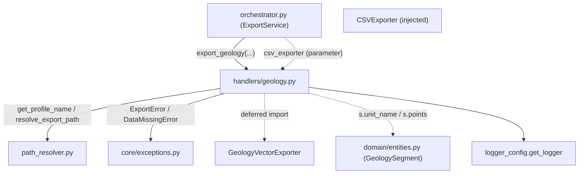

---
tags:
  - secinterp
  - code-walkthrough
  - core
  - export
  - handlers
aliases:
  - geology.py
  - export_geology
cssclass: secinterp-note
---

# `core/services/export/handlers/geology.py`

> [!abstract] One-line summary
> **Geology** export handler: dumps lithological segments to CSV (dist, elev, unit) and to a vector layer, deriving rows from a `GeologySegment` and normalizing errors to `ExportError`.

**Path**: `core/services/export/handlers/geology.py` (66 lines)
**Main function**: `export_geology`
**Layer**: Core (QGIS-agnostic)
**Tags**: #secinterp #core #export #handlers

---

## 🎯 Why does this file exist?

The geological profile (a list of `GeologySegment`) is exported in **two formats**: a
tabular CSV for analysis (dist, elev, unit) and a vector layer for the GIS. The handler
isolates that domain→format transformation from the rest of the core.

| Problem | Solution |
|---------|----------|
| Generate CSV rows from nested segments (`segment.points`) | List comprehension `[(p[0], p[1], s.unit_name) ...]` |
| Export the same dataset in two formats | CSV (via injected `csv_exporter`) + vector (`GeologyVectorExporter`) |
| Normalize failures of both formats | `try/except → ExportError` |

> [!important] Architectural note
> QGIS-agnostic: `data` are decoupled `GeologySegment`s (via `Any` in the signature). The
> `csv_exporter` is **injected** as a parameter from the orchestrator (created once and
> shared across handlers), while the vector exporter is imported deferred.

---

## 🧬 Relationship diagram



> [!tip] How to read
> `csv_exporter` arrives **injected** (the orchestrator creates and shares it), while
> `GeologyVectorExporter` is imported deferred. `s.points`/`s.unit_name` are real fields
> of `GeologySegment`.

---

## 📦 Imports — architectural reading

```python
# core/services/export/handlers/geology.py
from __future__ import annotations

from pathlib import Path
from typing import Any

from sec_interp.core.exceptions import DataMissingError, ExportError
from sec_interp.core.services.export.path_resolver import get_profile_name, resolve_export_path
from sec_interp.logger_config import get_logger
```

```python
# deferred import (inside export_geology)
from sec_interp.exporters import GeologyVectorExporter
```

| # | Observation |
|---|-------------|
| ① | `DataMissingError`/`ExportError` from the project's own hierarchy; no `qgis.*` import. |
| ② | `csv_exporter` is not imported here: it arrives as an `Any` parameter (shared). |
| ③ | `GeologyVectorExporter` deferred import: loaded only when there are segments. |
| ④ | The `data: list[Any]` hides that it is really `GeologyData` (`list[GeologySegment]`). |

---

## 🏗️ Structure inventory

**Functions/Methods:**
- `export_geology(folder, data, crs, csv_exporter, msg, controller, settings, ext) -> None`

**Domain dependencies:**
- `GeologySegment` (fields `points`, `unit_name`) — accessed by duck-typing via `Any`.
- `GeologyVectorExporter` (from `sec_interp.exporters`)

One public function. The key transformation is the list comprehension that flattens
`segment.points` into `(dist, elev, unit_name)` tuples.

---

## 📖 Method-by-method walkthrough

### `export_geology`

```python
def export_geology(
    folder: Path,
    data: list[Any] | None,
    crs: Any,
    csv_exporter: Any,
    msg: list[str],
    controller: Any | None,
    settings: Any | None,
    ext: str,
) -> None:
    """Export geological data."""
    if not data:
        return
    from sec_interp.exporters import GeologyVectorExporter

    logger.info("✓ Saving geological profile...")
```

**Guard + deferred import**: without segments there is nothing to do. The vector
exporter import is delayed until data is confirmed.

```python
    try:
        profile_name = get_profile_name(controller)
        pattern = getattr(settings, "naming_pattern", None) if settings else None
        rows = [(p[0], p[1], s.unit_name) for s in data for p in s.points]

        csv_path, csv_layer = resolve_export_path(
            folder, "geol_profile", profile_name, pattern, ".csv"
        )
        csv_ok = csv_exporter.export(
            csv_path,
            {"headers": ["dist", "elev", "geology"], "rows": rows},
            layer_name=csv_layer,
        )
        if csv_ok:
            msg.append(f"  - {csv_path.relative_to(folder)}")
```

**Tabular CSV**: the comprehension `[(p[0], p[1], s.unit_name) for s in data for p in
s.points]` flattens each segment into its points, associating each point with the
lithological unit. The CSV payload is `{"headers": [...], "rows": rows}` with the fixed
extension `.csv`.

```python
        vec_path, vec_layer = resolve_export_path(
            folder, "geol_profile", profile_name, pattern, ext
        )
        vector_exporter = GeologyVectorExporter({})
        vec_ok = vector_exporter.export(
            vec_path, {"geology_data": data, "crs": crs}, layer_name=vec_layer
        )
        if vec_ok:
            msg.append(f"  - {vec_path.relative_to(folder)}")
        else:
            logger.warning(
                f"Failed to write vector geology to {vec_path} (likely no intersections)"
            )
```

**Vector**: same `base_name="geol_profile"` but with the user extension (`ext`). The
payload `{"geology_data": data, "crs": crs}` passes the full segments. The specific
`warning` suggests that a `False` here usually means "no intersections" rather than a
write error.

```python
    except (OSError, ValueError, TypeError, DataMissingError) as e:
        logger.exception(f"Geology export failed: {e}")
        raise ExportError(f"Geology export failed: {e!s}") from e
    except Exception as e:
        logger.exception("Unexpected system error during geology export")
        raise ExportError(f"Critical error exporting geology: {e}") from e
```

**Normalization**: identical error contract to `drillholes.py` — two `except` levels
that convert to `ExportError` with cause.

---

## 🔄 Data flow

| Phase | Input | Transformation | Output |
|-------|-------|----------------|--------|
| Guard | `data` (`None`/empty) | early return | — |
| Flatten | `list[GeologySegment]` | `[(p[0], p[1], s.unit_name) ...]` | `rows` |
| CSV | `rows`, headers | `csv_exporter.export` | `geol_profile.csv` + `msg` |
| Vector | `data`, `crs` | `GeologyVectorExporter.export` | geological layer + `msg` |

---

## 🏛️ Design patterns present

| Pattern | Where | Purpose |
|---------|-------|---------|
| **Guard clause** | `if not data: return` | early exit |
| **Lazy import (deferred)** | `GeologyVectorExporter` | save loading without data |
| **Dependency injection** | `csv_exporter` as parameter | share an exporter across handlers |
| **Exception translation** | `except → ExportError` | normalize failures |
| **Data mapping** | list comprehension | domain (`GeologySegment`) → CSV rows |

---

## 🧾 API summary

| Symbol | Signature / Inherits | Typical use |
|--------|----------------------|-------------|
| `export_geology` | `(folder, data, crs, csv_exporter, msg, controller, settings, ext) -> None` | Export geology CSV + vector |
| `rows` (internal) | `list[tuple[float, float, str]]` | `(dist, elev, geology)` rows for CSV |
| `GeologyVectorExporter` | `BaseExporter` (deferred import) | Write segments as vector |

---

## 📐 Handler signature contract

Eight parameters; distinguished by receiving the **injected** `csv_exporter` (shared by
the orchestrator across several handlers):

| Parameter | Type | Role |
|-----------|------|------|
| `folder` | `Path` | Base output directory |
| `data` | `list[Any] \| None` | Decoupled `GeologyData` (`list[GeologySegment]`) |
| `crs` | `Any` | Section CRS |
| `csv_exporter` | `Any` | `CSVExporter` instance injected by the orchestrator |
| `msg` | `list[str]` | Message accumulator |
| `controller` | `Any \| None` | Profile-name source |
| `settings` | `Any \| None` | Export settings (`naming_pattern`) |
| `ext` | `str` | Output extension |

> [!note] Dependency injection
> `csv_exporter` is not created here: the orchestrator instantiates it once
> (`CSVExporter({})`) and shares it with `topography.py` and `structures.py`. This avoids
> rebuilding the object in each handler.

## 🔁 Invocation from the orchestrator

```python
"exp_geol": lambda: geo_h.export_geology(
    folder, geol_data, line_crs, csv_exporter, msg,
    self.controller, export_settings, format_ext,
),
```

The `geol_data` comes from `PreviewResult.geol` (`GeologyData`), the list of
`GeologySegment` computed by `GeologyService.build_segments`.

---

## 🛡️ Error handling

| Caught type | Action | Result |
|-------------|--------|--------|
| `OSError`, `ValueError`, `TypeError`, `DataMissingError` | `logger.exception` + `raise ExportError(...) from e` | domain error |
| `Exception` (rest) | `logger.exception` + `raise ExportError(...) from e` | critical error |

> [!note] A vector `False` is not an exception
> If `GeologyVectorExporter.export` returns `False`, the handler does **not** raise: it
> only logs a `warning` indicating "likely no intersections". It is an expected result,
> not a write failure.

---

## 🧪 Associated tests

- `tests/core/test_export_service.py::test_export_geology_error` — an exporter failure
  is translated to `ExportError`.
- `tests/core/test_profile_exporters.py::test_geology_exporter_success` — real logic of
  `GeologyVectorExporter`.
- `tests/core/test_profile_exporters.py::test_geology_exporter_short_segment` — short
  segments (edge case).
- `tests/integration/test_export_service_e2e.py::test_export_geology_creates_csv_and_shp` —
  real CSV + shapefile export.

---

## 👀 Observations and notes

> [!success] Strengths
> - Domain→CSV transformation in a single declarative and readable expression.
> - Injected `csv_exporter` avoids recreating the object in each handler.
> - Uniform error contract (`ExportError` with cause).

> [!warning] Points of attention
> - `data: list[Any]` hides the real type `GeologyData`; loses contract documentation.
> - `rows` uses `p[0]`/`p[1]` (positional tuple) instead of named point fields.
> - The "likely no intersections" warning is a heuristic, not a certainty.

> [!question] Open questions
> - Type `data` as `GeologyData` and `csv_exporter` as `CSVExporter`?
> - Distinguish "no intersections" from "write error" with a typed result?

---

## 🔗 Related notes

- [[Index]] — vault index
- [[core_services_export_handlers]] — `handlers/` package it belongs to
- [[orchestrator]] — delegates to `export_geology` under the `exp_geol` flag
- [[geology_service]] — service producing the `GeologySegment`s exported here
- [[path_resolver]] — `get_profile_name` / `resolve_export_path`
- [[compat]] — `_export_geology` compatibility wrapper
- [[entities]] — `GeologySegment` (`.points`, `.unit_name`)

---

*Note of the SecInterp Code Walkthrough v2 vault — v3.8.0*
