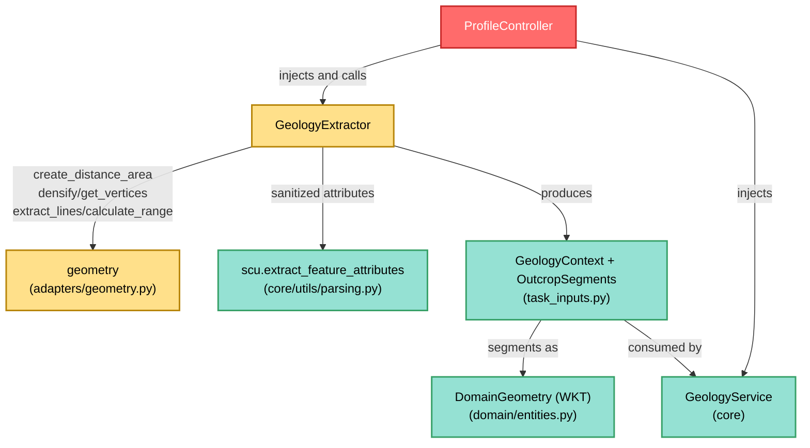

---
tags:
  - secinterp
  - code-walkthrough
  - gui
  - adapters
aliases:
  - geology_extractor.py
  - GeologyExtractor
cssclass: secinterp-note
---

# `gui/adapters/geology_extractor.py`

> [!abstract] One-line summary
> **Extract** adapter for geology that densifies the section line over the DEM, samples the master topographic profile, and intersects the line with outcrop polygons to return a detached `GeologyContext` to `GeologyService`.

**Path**: `gui/adapters/geology_extractor.py` (235 lines)
**Main class**: `GeologyExtractor`
**Layer**: GUI · Adapter (Extract side, depends on QGIS)
**Tags**: #secinterp #gui #adapters

---

## 🎯 Why does this file exist?

Building the geological segments of a section combines three QGIS worlds (line,
DEM raster, outcrop polygons) that the core cannot read. Without an adapter that
reading would be scattered between the dialog and the service:

| Problem | Solution |
|---------|----------|
| The core cannot densify lines or sample rasters | `_generate_master_profile` does it here with `QgsDistanceArea` and `dataProvider().sample` |
| Line↔polygon intersection needs a live `QgsGeometry` | `_intersect_outcrop` intersects and converts each run to detached WKT |
| Reading outcrops without a spatial filter scans the whole layer | `_extract_outcrop_data` pre-filters by the line bbox (`QgsFeatureRequest`) |
| The core must receive accumulated distances, not geometries | `master_profile_data` and `OutcropSegments` travel as `(dist, elev)` and WKT |

> [!important] Architectural note
> Pure **Extract Adapter**: produces `GeologyContext(master_profile_data,
> master_grid_dists, outcrops, tolerance)`. The key detail is that
> `master_grid_dists` converts every `QgsPointXY` to an `(x, y)` tuple before
> crossing the boundary — no live QGIS object leaves this module.

---

## 🧬 Relationship diagram



> [!tip] How to read
> `GeologyExtractor` is the heaviest consumer of the `geometry` helper: it uses
> five of its functions. Everything leaving for the core is tuples, WKT and dicts.

---

## 📦 Imports — architectural reading

```python
# gui/adapters/geology_extractor.py
from __future__ import annotations

from typing import Any

from qgis.core import (
    QgsDistanceArea,
    QgsFeatureRequest,
    QgsGeometry,
    QgsPointXY,
    QgsRasterLayer,
    QgsVectorLayer,
)
from qgis.PyQt.QtCore import QCoreApplication

from sec_interp.core import utils as scu
from sec_interp.core.domain import DomainGeometry
from sec_interp.core.domain.task_inputs import GeologyContext, OutcropSegments
from sec_interp.core.exceptions import DataMissingError, GeometryError, ValidationError
from sec_interp.gui.adapters import geometry
from sec_interp.logger_config import get_logger
```

| # | Observation |
|---|-------------|
| ① | Six `qgis.core` classes including `QgsDistanceArea` and `QgsPointXY`: ellipsoidal measurement and sampling live in the GUI. |
| ② | `qgis.PyQt.QtCore.QCoreApplication` for `self.tr()` (Qt5/Qt6 agnostic). |
| ③ | Imports **three** domain symbols (`DomainGeometry`, `GeologyContext`, `OutcropSegments`): the output contract is fully typed. |
| ④ | Three domain exceptions cover the three possible failures: invalid layer (`DataMissingError`), invalid line (`GeometryError`), parameters (`ValidationError`). |
| ⑤ | `geometry` provides the toolkit (densify, vertices, ranges); `scu` sanitizes attributes. |

---

## 🏗️ Structure inventory

**Class:** `class GeologyExtractor` — 6 methods (1 main public + `tr` + 4 private).

**Public methods:**
- `tr(message)` — translation via `QCoreApplication.translate("GeologyExtractor", ...)`.
- `extract_context(line_lyr, raster_lyr, outcrop_lyr, outcrop_name_field, band_number=1)` — orchestrator returning `GeologyContext`.

**Private methods:**
- `_validate_inputs(line_lyr, raster_lyr, outcrop_lyr, outcrop_name_field, band_number)` — valid layers, band in range, unit field present.
- `_extract_line_info(line_lyr)` — `(line_geom, line_start)` from the first feature.
- `_generate_master_profile(line_geom, raster_lyr, band_number, da, line_start)` — densifies, accumulates distances and samples elevations; returns `(master_profile_data, master_grid_dists_raw)`.
- `_extract_outcrop_data(line_geom, outcrop_lyr, outcrop_name_field)` — candidate features as `{"wkt", "attrs", "unit_name"}`.
- `_intersect_outcrop(line_geom, line_start, da, item)` — one-outcrop intersection → `list[tuple[float, float, DomainGeometry]]`.

---

## 📁 Files in the package

The extractor lives in the `gui/adapters/` package (the full Extract phase):

| File | Lines | Role |
|---|--:|---|
| `__init__.py` | 7 | Package docstring: Extract-then-Compute contract |
| `drillhole_extractor.py` | 369 | `DrillholeExtractor` → `DrillholeContext` |
| `geology_extractor.py` | 235 | `GeologyExtractor` → `GeologyContext` (this note) |
| `geometry.py` | 226 | QGIS geometry helpers and DEM sampling |
| `layer_resolver.py` | 113 | `LayerResolver` + `resolve_layer` (layer cache) |
| `structure_extractor.py` | 226 | `SectionContext` + `StructureExtractor` |
| `validation_extractor.py` | 176 | `resolve_layer_metadata`, `build_validation_params` |
| `feature_fetcher.py` | 84 | `DataFetcher` (bulk child reads) |
| `profile_extractor.py` | 86 | `ProfileExtractor` → `ProfileData` |

---

## 📖 Method-by-method walkthrough

### `tr` — adapter i18n

```python
def tr(self, message: str) -> str:
    return QCoreApplication.translate("GeologyExtractor", message)
```

`"GeologyExtractor"` context for Qt Linguist. Every `raise` in the module formats
an already-translated string (`self.tr("...").format(...)`).

### `extract_context` — Extract orchestrator

```python
def extract_context(
    self,
    line_lyr: QgsVectorLayer,
    raster_lyr: QgsRasterLayer,
    outcrop_lyr: QgsVectorLayer,
    outcrop_name_field: str,
    band_number: int = 1,
) -> GeologyContext:
    self._validate_inputs(line_lyr, raster_lyr, outcrop_lyr, outcrop_name_field, band_number)
    line_geom, line_start = self._extract_line_info(line_lyr)
    crs = line_lyr.crs()
    da = geometry.create_distance_area(crs)
    master_profile_data, master_grid_dists_raw = self._generate_master_profile(
        line_geom, raster_lyr, band_number, da, line_start
    )
    master_grid_dists = [(d, (pt.x(), pt.y()), e) for d, pt, e in master_grid_dists_raw]
    outcrops: list[OutcropSegments] = []
    if outcrop_lyr:
        for item in self._extract_outcrop_data(line_geom, outcrop_lyr, outcrop_name_field):
            segments = self._intersect_outcrop(line_geom, line_start, da, item)
            outcrops.append(
                OutcropSegments(
                    unit_name=item["unit_name"],
                    attributes=item["attrs"],
                    segments=segments,
                )
            )
    return GeologyContext(
        master_profile_data=master_profile_data,
        master_grid_dists=master_grid_dists,
        outcrops=outcrops,
        tolerance=0.001,
    )
```

| Step | Detail |
|------|--------|
| **Validation** | `_validate_inputs` before any reading. |
| **Measurement datum** | `QgsDistanceArea` built with the line CRS (ellipsoidal distances). |
| **De-QGIS-ification** | The `[(d, (pt.x(), pt.y()), e) ...]` comprehension removes `QgsPointXY` before building the context. |
| **Optional outcrops** | When `outcrop_lyr` is `None`/falsy, `outcrops` stays empty without error. |
| **Fixed tolerance** | `tolerance=0.001` is fixed here (map units); the core consumes it as-is. |

> [!note] Line 71 is the boundary
> That comprehension is literally where QGIS objects stop existing: from there on
> everything is `float` and tuples.

### `_validate_inputs` — layers, band and field

```python
def _validate_inputs(self, line_lyr, raster_lyr, outcrop_lyr, outcrop_name_field, band_number):
    for lyr, name in [(line_lyr, "Line layer"), (raster_lyr, "Raster layer")]:
        if not lyr or not lyr.isValid():
            raise DataMissingError(
                self.tr("Invalid layer: {0}. Please check input layers.").format(name),
                {"layer": name},
            )
    if outcrop_lyr and not outcrop_lyr.isValid():
        raise DataMissingError(
            self.tr("Invalid layer: Outcrop layer. Please check input layers."),
            {"layer": "Outcrop layer"},
        )
    if band_number < 1:
        raise ValidationError(self.tr("Band number must be positive."))
    if band_number > raster_lyr.bandCount():
        raise ValidationError(
            self.tr("Band number {0} exceeds raster band count ({1}).").format(
                band_number, raster_lyr.bandCount()
            )
        )
    if outcrop_lyr:
        idx = outcrop_lyr.fields().indexFromName(outcrop_name_field)
        if idx == -1:
            raise ValidationError(
                self.tr("Field '{0}' not found in outcrop layer.").format(outcrop_name_field)
            )
```

Line and raster are **mandatory**; outcrops are **optional** (but when given, the
layer must be valid and contain the unit field). Note the `DataMissingError`s
carry `details={"layer": ...}` so the GUI can highlight the offending layer.

### `_extract_line_info` — geometry and start point

```python
def _extract_line_info(self, line_lyr: QgsVectorLayer) -> tuple[QgsGeometry, QgsPointXY]:
    line_feat = next(line_lyr.getFeatures(), None)
    if not line_feat:
        raise DataMissingError(
            self.tr("Line layer has no features"), {"layer": line_lyr.name()}
        )
    line_geom = line_feat.geometry()
    if not line_geom or line_geom.isNull():
        raise GeometryError(self.tr("Line geometry is not valid"), {"layer": line_lyr.name()})
    if line_geom.isMultipart():
        line_start = line_geom.asMultiPolyline()[0][0]
    else:
        line_start = line_geom.asPolyline()[0]
    return line_geom, line_start
```

Unlike the drillhole extractor (which returns `None`), a null line here is a
`GeometryError`: without a line there is no master profile. `line_start` is the
origin of all accumulated distances.

### `_generate_master_profile` — densify and sample

```python
def _generate_master_profile(self, line_geom, raster_lyr, band_number, da, line_start):
    try:
        interval = raster_lyr.rasterUnitsPerPixelX()
        master_densified = geometry.densify_line_by_interval(line_geom, interval)
        grid_points = geometry.get_line_vertices(master_densified)
    except (AttributeError, ValueError, TypeError) as e:
        logger.warning(f"Failed to densify line, using original vertices: {e}")
        grid_points = geometry.get_line_vertices(line_geom)
    master_profile_data: list[tuple[float, float]] = []
    master_grid_dists: list[tuple[float, QgsPointXY, float]] = []
    current_dist = 0.0
    for i, pt in enumerate(grid_points):
        if i > 0:
            current_dist += da.measureLine(grid_points[i - 1], pt)
        val, ok = raster_lyr.dataProvider().sample(pt, band_number)
        elev = val if ok else 0.0
        master_profile_data.append((current_dist, elev))
        master_grid_dists.append((current_dist, pt, elev))
    return master_profile_data, master_grid_dists
```

The densify interval is the raster resolution (`rasterUnitsPerPixelX`): roughly
one vertex per pixel. If densifying fails it degrades to the original vertices
with a `logger.warning` (no exception). Each point is sampled with
`dataProvider().sample(pt, band)`; `ok=False` → elevation `0.0`. Distances
accumulate with `da.measureLine` (ellipsoidal).

### `_extract_outcrop_data` — bbox candidates

```python
def _extract_outcrop_data(self, line_geom, outcrop_lyr, outcrop_name_field):
    outcrop_data: list[dict[str, Any]] = []
    line_bbox = line_geom.boundingBox()
    request = QgsFeatureRequest().setFilterRect(line_bbox)
    for feature in outcrop_lyr.getFeatures(request):
        if not feature.hasGeometry():
            continue
        attrs = scu.extract_feature_attributes(feature)
        try:
            unit_name = str(feature[outcrop_name_field])
        except KeyError:
            unit_name = "Unknown"
        outcrop_data.append(
            {
                "wkt": feature.geometry().asWkt(),
                "attrs": attrs,
                "unit_name": unit_name,
            }
        )
    return outcrop_data
```

Cheap bbox pre-filter; geometry travels as **WKT** (`asWkt()`), which is the
core's `DomainGeometry` type. A per-feature missing unit field yields `"Unknown"`
instead of aborting (field existence was already validated in `_validate_inputs`).

### `_intersect_outcrop` — detached intersection

```python
def _intersect_outcrop(self, line_geom, line_start, da, item):
    outcrop_geom = QgsGeometry.fromWkt(item["wkt"])
    intersection = line_geom.intersection(outcrop_geom)
    if intersection.isEmpty():
        return []
    segments: list[tuple[float, float, DomainGeometry]] = []
    for seg_geom in geometry.extract_lines_from_geometry(intersection):
        rng = geometry.calculate_segment_range(seg_geom, line_start, da)
        if not rng:
            continue
        dist_start, dist_end = rng
        segments.append((dist_start, dist_end, seg_geom.asWkt()))
    return segments
```

Rebuilds the geometry from its WKT (a round-trip guaranteeing serializability),
intersects with the line, and converts each run to `(dist_start, dist_end, wkt)`.
Runs without a measurable range are silently dropped (`continue`).

---

## 🔄 Data flow

| Phase | Input | Transformation | Output |
|-------|-------|----------------|--------|
| Validation | 3 layers + band + field | `_validate_inputs` | nothing (or exception) |
| Line | 1st feature | `_extract_line_info` | `line_geom`, `line_start` |
| Master profile | line + DEM | densify → accumulate → `sample` | `master_profile_data`, `master_grid_dists` |
| Candidates | line bbox | `QgsFeatureRequest` + WKT | `{"wkt", "attrs", "unit_name"}` |
| Intersection | line × WKT | `intersection` → ranges → WKT | `OutcropSegments` |
| Context | all of the above | constructor + `tolerance=0.001` | Pure `GeologyContext` |

---

## 🏛️ Design patterns present

| Pattern | Where | Purpose |
|---------|-------|---------|
| **Adapter (Extract)** | whole module | QGIS in, primitives out |
| **Fail-fast validation** | `_validate_inputs` first | Not a single `sample` before validating |
| **Graceful degradation** | densify, `ok=False`, `"Unknown"` | Imperfect data does not abort |
| **WKT as currency** | `asWkt()` / `fromWkt()` | Serializable, thread-safe geometries |

---

## 🧾 API summary

| Symbol | Signature / Inherits | Typical use |
|--------|----------------------|-------------|
| `GeologyExtractor` | GUI class | `GeologyExtractor()` (no dependencies) |
| `extract_context` | `(line_lyr, raster_lyr, outcrop_lyr, outcrop_name_field, band_number=1) -> GeologyContext` | Extract entry point |
| `tr` | `(message: str) -> str` | Message i18n |
| `_generate_master_profile` | `(line_geom, raster_lyr, band_number, da, line_start) -> tuple[list, list]` | Topographic profile |
| `_intersect_outcrop` | `(line_geom, line_start, da, item) -> list[tuple[float, float, DomainGeometry]]` | Per-outcrop runs |

---

## 🛡️ Error handling

| Situation | Behaviour |
|-----------|-----------|
| Invalid/missing line or raster | `DataMissingError` with `details={"layer": ...}` |
| Invalid outcrop layer (when given) | `DataMissingError` |
| `band_number < 1` or above `bandCount()` | `ValidationError` |
| Missing unit field | `ValidationError("Field '{x}' not found...")` |
| Line without features / null geometry | `DataMissingError` / `GeometryError` |
| Densify fails | `logger.warning` + original vertices |
| `sample` with `ok=False` | elevation `0.0` |
| Empty intersection | `[]` (outcrop does not touch the section) |

---

## 🧪 Associated tests

No dedicated unit tests under `tests/gui/` (there is no
`test_geology_extractor.py`); indirect coverage:

- `tests/gui/tasks/test_geology_task.py` — the task consuming the `GeologyContext`.
- `tests/integration/test_geology_structure_workflow.py` — integrated geology→structure flow.
- `tests/integration/test_async_orchestrators.py` — orchestration with injected extractors.
- `tests/core/test_geology_service.py` — core consumer with a mocked context.
- `tests/core/test_geology_service_optional.py` — service without optionals.
- `tests/core/test_geometry_utils.py` — mirror utilities of the ones used here (densify, distances).

> [!warning] Coverage gap
> `_generate_master_profile` (densify + `sample` + accumulation) and
> `_intersect_outcrop` (WKT ranges) deserve a mock-first `test_geology_extractor.py`
> with fake layers from `tests/base_test.py`.

---

## 🧵 Thread-safety and i18n

| Aspect | Detail |
|--------|--------|
| **Thread** | Runs on the main thread: `dataProvider().sample`, `intersection` and `QgsFeatureRequest` use live QGIS objects. Only the `GeologyContext` travels to the `QgsTask`. |
| **Attributes** | `scu.extract_feature_attributes` sanitizes `QVariant` → primitives (Qt6 safe). |
| **i18n** | `self.tr()` with the `"GeologyExtractor"` context via `qgis.PyQt`; distances and WKT are not translated (data, not messages). |

---

## 📐 The `GeologyContext` produced

| Field | Type | Origin in this module |
|-------|------|----------------------|
| `master_profile_data` | `list[Point2D]` = `(dist, elev)` | `_generate_master_profile` (accumulated ellipsoidal distances) |
| `master_grid_dists` | `list[tuple[float, Point2D, float]]` | same, with `(x, y)` already converted in `extract_context` |
| `outcrops` | `list[OutcropSegments]` | `_extract_outcrop_data` + `_intersect_outcrop` |
| `tolerance` | `float = 0.001` | constant fixed in `extract_context` |

> [!tip] Dual profile representation
> `master_profile_data` (dist/elev only) feeds rendering; `master_grid_dists`
> (with coordinates) feeds `GeologyService` interpolation. See
> [[task_inputs]] and [[geology_service]].

---

## 👀 Observations and notes

> [!success] Strengths
> - Explicit de-QGIS-ification in a single line (`QgsPointXY` → tuple comprehension).
> - WKT as exchange format: serializable, thread-safe, testable without QGIS.
> - Optional outcrops without error branches: `if outcrop_lyr` and done.
> - Rich validation with per-layer `details` for precise GUI messages.

> [!warning] Points of attention
> - `tolerance=0.001` hardcoded: not configurable from the GUI or project.
> - `elev = 0.0` when `sample` fails pollutes the profile (a DEM void looks like sea level).
> - `asMultiPolyline()[0][0]` assumes a non-empty multiline: an empty multipart geometry would raise an uncaught `IndexError`.
> - First line feature only; extra sections in one layer are silently ignored.

> [!question] Open questions
> - Expose `tolerance` as a defaulted `0.001` parameter?
> - Distinguish DEM "void" (`None`/`NaN`) from a `0.0` elevation in the master profile?
> - Guard `asMultiPolyline()[0][0]` against empty parts?

---

## 🔗 Related notes

- [[Index]] — vault index
- [[gui_adapters]] — Extract adapters package note
- [[geometry]] — toolkit used (densify, vertices, ranges, `QgsDistanceArea`)
- [[task_inputs]] — `GeologyContext` and `OutcropSegments` DTOs
- [[geology_service]] — core consumer of the context
- [[controller]] — `ProfileController` injecting and orchestrating the extractor
- [[drillhole_extractor]] — sibling extractor (analogous level-3 validation)
- [[dtos]] — `PreviewParams` providing `band_num` and `outcrop_name_field`

---

*Note of the SecInterp Code Walkthrough v2 vault — v3.9.0*
