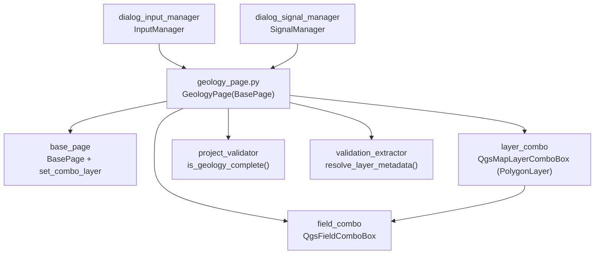

---
tags:
  - secinterp
  - code-walkthrough
  - gui
  - pages
aliases:
  - geology_page.py
  - GeologyPage
cssclass: secinterp-note
---

# `gui/ui/pages/geology_page.py`

> [!abstract] One-line summary
> Geological outcrops page: polygon-layer combo with modern/classic filter, unit-name field combo with automatic refresh, and a `dataChanged` signal for the dialog.

**Path**: `gui/ui/pages/geology_page.py` (120 lines)
**Main class**: `GeologyPage(BasePage)`
**Layer**: GUI (programmatic presentation · Extract into `ValidationParams`)
**Tags**: #secinterp #gui #pages

---

## 🎯 Why does this file exist?

Outcrop polygons supply the unit names the section intersects and that
interpretation can inherit. The page reduces that configuration to two controls:
layer and name field.

| Problem | Solution |
|---------|----------|
| Users must pick the polygon layer and which field holds the unit name | `layer_combo` (polygons) + `field_combo` (name field) |
| Switching layers may leave a selected field that does not exist in the new one | `layerChanged → field_combo.setLayer` refreshes fields automatically |
| The dialog must revalidate when layer or field changes | Dedicated `dataChanged` signal emitted from both selections |

> [!important] Architectural note
> Minimal Extract: `get_data()` hands over the live layer + field name; `is_complete()`
> detaches with `resolve_layer_metadata` and delegates to
> `ProjectValidator.is_geology_complete`. Geology is optional (no layer → the dialog
> skips it), but with a layer the field is mandatory.

---

## 🧬 Relationship diagram



> [!tip] How to read
> Solid arrow = imports/delegates; `LC → FC` is the `layerChanged → setLayer` cascade.

---

## 📦 Imports — architectural reading

```python
# gui/ui/pages/geology_page.py
from __future__ import annotations

import contextlib
from typing import Any

from qgis.core import QgsMapLayerProxyModel
from qgis.gui import QgsFieldComboBox, QgsMapLayerComboBox
from qgis.PyQt.QtCore import QCoreApplication, pyqtSignal
from qgis.PyQt.QtWidgets import QGridLayout, QLabel, QWidget

from sec_interp.core.validation.project_validator import ProjectValidator, ValidationParams
from sec_interp.gui.adapters.validation_extractor import resolve_layer_metadata

from .base_page import BasePage, set_combo_layer
```

| # | Observation |
|---|-------------|
| ① | `QgsMapLayerProxyModel` is the filter fallback (see `_setup_ui`): compatibility with QGIS < 3.32. |
| ② | Classic layer→field duo: `QgsMapLayerComboBox` + `QgsFieldComboBox`, shared with [[structure_page]] (two fields) and the drillhole tabs. |
| ③ | `pyqtSignal` for `dataChanged`; `contextlib` for one-by-one shielded disconnects. |
| ④ | No `DialogDefaults`: this page has no numeric defaults to persist (empty layer + empty field is the default). |
| ⑤ | Extract boundary in two imports: core validator + metadata extractor; no geology service here. |

---

## 🏗️ Structure inventory

**`GeologyPage(BasePage)` class:**

- `dataChanged = pyqtSignal()` signal and `layer_keys = frozenset({"geol_layer"})`
- `__init__(self, parent: QWidget | None = None) -> None`
- `_setup_ui(self) -> None` — 2-row grid (layer + field)
- `get_data(self) -> dict[str, Any]` — `outcrop_layer / outcrop_name_field`
- `dump(self) -> dict[str, Any]` — `geol_layer / geol_field`
- `load(self, data: dict[str, Any]) -> None`
- `reset(self) -> None`
- `is_complete(self) -> bool` — via `is_geology_complete`
- `connect_signals(self) / disconnect_signals(self) -> None`

**Widgets:**

| Widget | Type | Role |
|--------|------|------|
| `layer_combo` | `QgsMapLayerComboBox` | Polygon layer (modern or classic filter, empty allowed) |
| `field_combo` | `QgsFieldComboBox` | Field holding the unit name |
| `group_layout` | `QGridLayout` (spacing 6) | 2-row grid on the inherited `group_box` |

---

## 📖 Method-by-method walkthrough

### `__init__` — outcrops title

```python
def __init__(self, parent: QWidget | None = None) -> None:
    super().__init__(QCoreApplication.translate("GeologyPage", "Geological Outcrops"), parent)
```

No `iface`, no own state: `_setup_ui` builds everything. The `"GeologyPage"`
translation context groups the title with both row labels.

### `_setup_ui` — modern filter with classic fallback

```python
def _setup_ui(self) -> None:
    super()._setup_ui()

    self.group_layout = QGridLayout(self.group_box)
    self.group_layout.setSpacing(6)

    # Row 0: Outcrop Layer
    self.group_layout.addWidget(QLabel(self.tr("Outcrops Layer")), 0, 0)

    self.layer_combo = QgsMapLayerComboBox()

    # Use modern flags if available (QGIS 3.32+)
    try:
        from qgis.core import Qgis  # noqa: PLC0415

        self.layer_combo.setFilters(Qgis.LayerFilters(Qgis.LayerFilter.PolygonLayer))
    except (ImportError, AttributeError, TypeError):
        self.layer_combo.setFilters(QgsMapLayerProxyModel.Filter.PolygonLayer)

    self.layer_combo.setAllowEmptyLayer(True)
    # ... tooltip, index 0, row 1: "Name Field" + field_combo ...
```

The `try/except` lazily imports `Qgis` (with `noqa: PLC0415` for ruff) and uses the
modern `Qgis.LayerFilter.PolygonLayer` flags; on failure (old QGIS or test
environments without that symbol) it falls back to the classic
`QgsMapLayerProxyModel.Filter.PolygonLayer`. [[section_page]] (lines) and
[[structure_page]] (points) repeat the same idiom with their geometry. Row 1 adds
`"Name Field"` + `field_combo` with a name-field tooltip.

### `get_data` — two keys

```python
def get_data(self) -> dict[str, Any]:
    return {
        "outcrop_layer": self.layer_combo.currentLayer(),
        "outcrop_name_field": self.field_combo.currentField(),
    }
```

The dialog's smallest `get_data` alongside [[section_page]]. `currentField()`
returns `""` with no selection: `is_complete` treats that as incomplete when a
layer exists. `InputManager` re-maps them into the global `ValidationParams`.

### `dump` / `load` — `outcrop_` → `geol_` renaming

```python
def dump(self) -> dict[str, Any]:
    return {
        "geol_layer": self.layer_combo.currentLayer(),
        "geol_field": self.field_combo.currentField(),
    }

def load(self, data: dict[str, Any]) -> None:
    geol_layer = data.get("geol_layer")
    if geol_layer is not None:
        set_combo_layer(self.layer_combo, geol_layer)
        self.field_combo.setLayer(geol_layer)
    field = data.get("geol_field")
    if field:
        self.field_combo.setField(field)
```

As in [[dem_page]] and [[structure_page]], sessions use `geol_*` keys while reading
uses `outcrop_*`. `load` pins the layer silently, propagates to the field combo
**in the same step** (never waits for `layerChanged`, which is blocked) and only
applies a non-empty field: a field-less session leaves the combo untouched instead
of selecting garbage.

### `reset` — empty both combos

```python
def reset(self) -> None:
    self.layer_combo.setLayer(None)
    self.field_combo.setField("")
```

`setLayer(None)` deliberately fires `layerChanged` (clearing the associated combo's
fields) and `setField("")` leaves the field unselected. No `DialogDefaults`: the
default is "no geology", consistent with the block being optional.

### `is_complete` — optional but coherent

```python
def is_complete(self) -> bool:
    data = self.get_data()
    params = ValidationParams(
        outcrop_layer=resolve_layer_metadata(data["outcrop_layer"]),
        outcrop_field=data["outcrop_name_field"],
    )
    return ProjectValidator.is_geology_complete(params)
```

`is_geology_complete` returns `False` when layer or field is missing, and with a
layer validates the block via `GeologyValidator`. The [[dialog_input_manager]] rule
mirrors it: `is_geology_complete(p) if p.outcrop_layer else True` — no layer means
the block is skipped without error.

### `connect_signals` / `disconnect_signals` — cascade + double emission

```python
def connect_signals(self) -> None:
    self.layer_combo.layerChanged.connect(self.field_combo.setLayer)
    self.layer_combo.layerChanged.connect(self.dataChanged.emit)
    self.field_combo.fieldChanged.connect(self.dataChanged.emit)
# disconnect_signals reverts all three + a global self.dataChanged.disconnect(),
# each under contextlib.suppress(TypeError, RuntimeError).
```

`layerChanged` feeds two slots (field refresh + dialog notice) and `fieldChanged`
feeds the notice. Three connections, three individually suppressed disconnections,
plus a global `self.dataChanged.disconnect()` — the fullest pattern among simple
pages; [[structure_page]] replicates it with two fields.

---

## 🗂️ Read keys vs session keys

| Source | Layer | Name field |
|--------|-------|------------|
| `get_data` | `outcrop_layer` (live) | `outcrop_name_field` |
| `dump` / `load` | `geol_layer` | `geol_field` |
| `layer_keys` | `{"geol_layer"}` | — (fields travel as primitives) |
| `InputManager` | `outcrop_layer` | `outcrop_field` (in `ValidationParams`) |

Field keys are not renamed between reading and sessions: only the layer changes
namespace (`outcrop_layer → geol_layer`), just like `raster_layer → dem_layer`
in [[dem_page]] and `structural_layer → struct_layer` in [[structure_page]].

---

## 🧩 Dialog lifecycle

| Moment | Who | What it does with the page |
|--------|-----|----------------------------|
| Construction | [[main_window]] / dialog | `GeologyPage()` in the `QStackedWidget`, "Geology" entry in [[sidebar]] |
| Wiring | `SignalManager` | `connect_signals()` + subscribes `dataChanged` to refresh validity |
| Editing | user | layer or field change → `dataChanged` → dialog revalidates |
| Preview | `InputManager` | optional block: omitted from the pipeline with no layer |
| Full validation | `validate_inputs` | `outcrop_layer/outcrop_field` enter the global `ValidationParams` |
| Session | persistence | `dump()` stores `geol_*`; `load()` restores silently |
| Teardown | `SignalManager` | `disconnect_signals()` with individual + global `suppress` |

---

## 🔄 Data flow

| Phase | Input | Transformation | Output |
|-------|-------|----------------|--------|
| Selection | QGIS project | polygon filter + empty allowed | `layer_combo.currentLayer()` |
| Cascade | `layerChanged` | `field_combo.setLayer` + `dataChanged.emit` | fresh fields + notified dialog |
| Field | active layer | `fieldChanged → dataChanged.emit` | dialog revalidates |
| Reading | combos | `get_data()` | `outcrop_layer/outcrop_name_field` |
| Completeness | live layer + field | `resolve_layer_metadata` + `is_geology_complete` | `bool` (skipped with no layer) |
| Persistence | combos | `dump()` | `geol_layer/geol_field` |
| Restoration | dict + resolved layer | `set_combo_layer` + `setLayer/setField` | silently restored combos |

---

## 🏛️ Design patterns present

| Pattern | Where | Purpose |
|---------|-------|---------|
| **Observer (Qt signals)** | `layerChanged` → field + notice | Cascade and notification in one signal |
| **Compat / fallback** | modern → classic filter | Support QGIS < 3.32 without forking code |
| **Signal relay** | `dataChanged.emit` as slot | Re-emission with no middle method |
| **Extract-then-Compute** | `is_complete` detaches the layer | Core validates without QGIS |

---

## 🧾 API summary

| Symbol | Signature / Inherits | Typical use |
|--------|----------------------|-------------|
| `GeologyPage` | `(BasePage)` | "Geology" tab of the `QStackedWidget` |
| `dataChanged` | `pyqtSignal()` | dialog revalidates on emit |
| `layer_keys` | `frozenset({"geol_layer"})` | persistence namespace |
| `get_data` | `outcrop_layer/outcrop_name_field` | reading for `InputManager` |
| `dump` | `geol_layer/geol_field` | multi-session state |
| `is_complete` | via `is_geology_complete` | optional-but-coherent |

---

## 🛡️ Error handling

- No layer: inherited `validate` `(True, "")` (optional block); `is_complete` is `False` only when queried with a half-configured layer; the dialog rule skips the block when `outcrop_layer` is null.
- `load` with an empty/missing field (`""` or absent): never touches `field_combo`, avoiding phantom selections.
- Missing modern filter: silent fallback to `QgsMapLayerProxyModel`, invisible to the user.
- Individually suppressed disconnects plus a global one: repeated rewires and closes never raise.

---

## 🧪 Associated tests

No dedicated `tests/gui/test_geology_page.py` exists; coverage is indirect but real:

- `tests/gui/test_dialog_input_manager.py` — `get_validation_params()` includes `outcrop_layer/outcrop_name_field`; `geology` rule (`… if p.outcrop_layer else True`).
- `tests/gui/test_main_dialog_validation_manager.py` — `"Geology configuration is incomplete"` message.
- `tests/gui/test_main_dialog_core.py` — dialog construction with the geology page.
- `tests/gui/test_multi_session_persistence.py` — `dump/load` round-trip with `geol_layer/geol_field`.
- `tests/gui/test_signal_restoration.py` — `test_page_signals_survive_connect_all` covers the layer→field cascade.

| Aspect to test | Status |
|----------------|--------|
| `get_data/dump/load/reset` | no dedicated test; covered via dialog |
| Classic-filter fallback | untested (requires faking a missing `Qgis` import) |
| `is_complete` without field | covered via `GeologyValidator` in `tests/core/` |
| `dataChanged` on `layerChanged/fieldChanged` | covered via `test_signal_restoration.py` |
| Inherited `validate` | `(True, "")`: the block is optional by design |
| `outcrop_*` → `geol_*` renaming | only dialog tests pin it; contract-test candidate |

---

## 🌐 i18n and migration notes

- Labels with `self.tr("Outcrops Layer"/"Name Field")`, translated tooltips, and a `"GeologyPage"`-context title.
- The filter fallback is itself a migration measure: works on QGIS 3.22–3.42 and uses no API deprecated for 4.x.
- `QgsFieldComboBox`/`QgsMapLayerComboBox` from `qgis.gui` are stable across versions.
- The empty-layer entry has no translatable text of its own: nothing extra enters the catalogue.

---

## 👀 Observations and notes

> [!success] Strengths
> - The dialog's smallest end-to-end working page (120 lines: filter, cascade, protocol, validation).
> - `load` propagates the layer to the field combo in the same step: never depends on blocked signals to stay consistent.
> - Modern/classic filter pattern reused across 3 pages: codebase consistency.
> - No numeric values or toggles: `reset()` is complete in two lines.

> [!warning] Points of attention
> - No custom `validate()`: a layer without field passes Level 1; the error surfaces in `is_complete`/core validator with less visual context.
> - `setCurrentIndex(0)` with an allowed empty layer selects the empty entry: correct, but coupled to combo ordering.
> - No dedicated test: the likeliest regression (a `geol_*` key change) is only caught by dialog tests.
> - Empty-layer `setCurrentIndex(0)` couples the default state to combo ordering.

> [!question] Open questions
> - Add `tests/gui/test_geology_page.py` mirroring `test_dem_page.py` (key contract + cascade + toggle)?
> - Level-1 validate "layer without field" with a message next to the combo, as [[dem_page]] does for the raster?
> - Share the modern/classic filter helper across geology, section and structure instead of triplicating it?

---

## 🔗 Related notes

- [[Index]] — vault index
- [[base_page]] — protocol and `set_combo_layer` used in `load`
- [[gui_ui_pages]] — pages package
- [[main_window]] — "Geology" tab of the `QStackedWidget`
- [[sidebar]] — "Geology" entry (`mIconPolygonLayer.svg`)
- [[dialog_input_manager]] — `geology` rule and `ValidationParams`
- [[project_validator]] — `is_geology_complete` / `GeologyValidator`
- [[validation_extractor]] — `resolve_layer_metadata`
- [[layer_validator]] — Level-3 validation over the live layer
- [[structure_page]] — sibling page (points + two fields + `dataChanged`)
- [[section_page]] — the dialog's other minimal `get_data`

---

*Note of the SecInterp Code Walkthrough v2 vault — v3.8.0*
