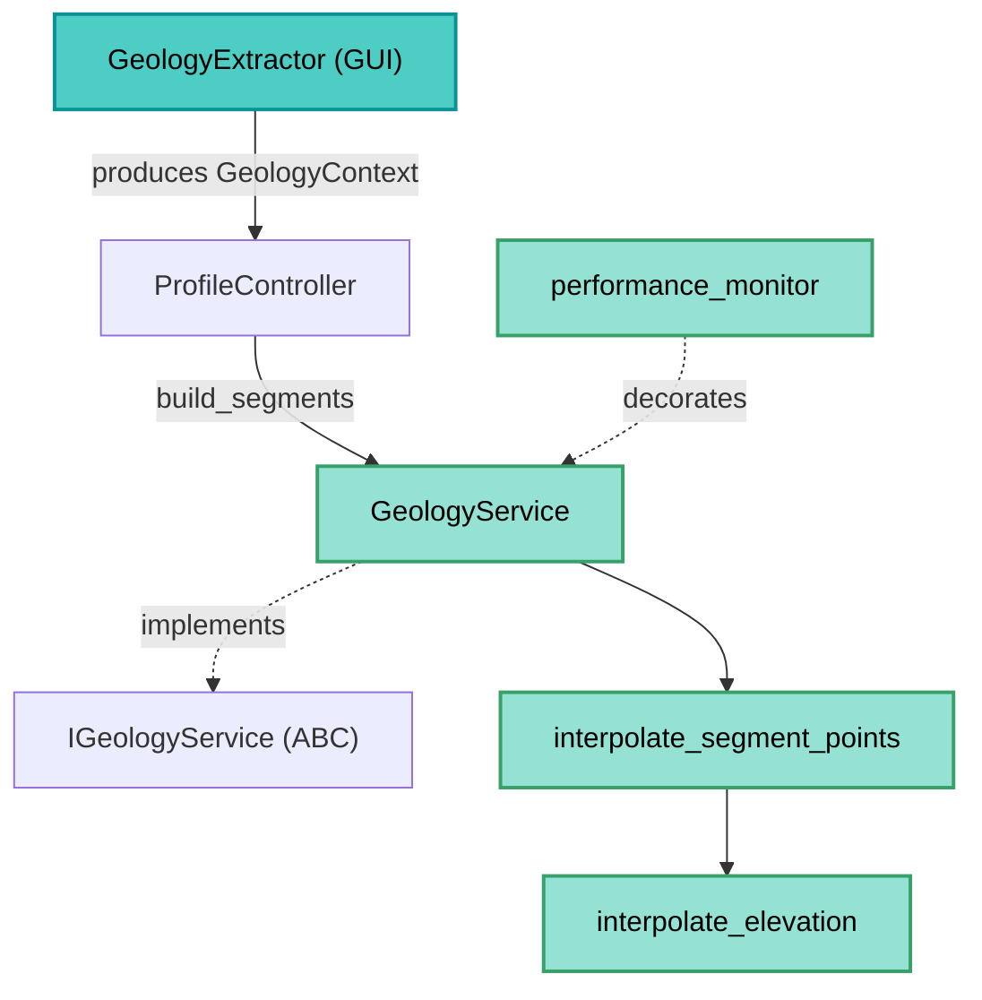

---
tags:
  - secinterp
  - code-walkthrough
  - core
  - services
aliases:
  - geology_service.py
  - GeologyService
  - IGeologyService
cssclass: secinterp-note
---

# `core/services/geology_service.py`

> [!abstract] One-line summary
> **Pure computation** service that builds geological segments (`GeologySegment`) of a section from a detached `GeologyContext`, interpolating elevations over the master profile.

**Path**: `core/services/geology_service.py` (87 lines)
**Main class**: `GeologyService(IGeologyService)`
**Layer**: Core (QGIS-agnostic)
**Tags**: #secinterp #core #services

---

## 🎯 Why does this file exist?

Outcrops crossing a section must become segments with sampled elevations along the
profile. That calculation does not depend on QGIS and is concentrated here:

| Problem | Solution |
|---------|----------|
| Turn intersections (dist_start, dist_end, WKT) into elevation-aware segments | `interpolate_segment_points` + `GeologySegment` |
| Keep the core QGIS-free | Receives `GeologyContext` (output of `GeologyExtractor`), not layers |
| Report progress without Qt | `feedback: Any | None` (duck-typed) |
| Measure performance of the hot path | `@performance_monitor` decorator |

> [!important] Architectural note
> **QGIS-agnostic**: zero `qgis.*`. This is the canonical example of the
> **Extract-then-Compute** pattern: `build_segments` is pure Compute over an already
> extracted context. The `@performance_monitor` decorator adds telemetry without
> breaking the signature.

---

## 🧬 Relationship diagram



> [!tip] How to read
> Solid arrow = imports/delegates; dashed = implements/decorates. The GUI produces the
> `GeologyContext`; the service only reads `outcrops`, `master_grid_dists` and
> `master_profile_data` to interpolate.

---

## 📦 Imports — architectural reading

```python
# core/services/geology_service.py
from typing import Any

from sec_interp.core.domain import GeologyData, GeologySegment
from sec_interp.core.domain.task_inputs import GeologyContext
from sec_interp.core.interfaces.geology_interface import IGeologyService
from sec_interp.core.performance_metrics import performance_monitor
from sec_interp.core.utils.geometry_utils.processing import interpolate_segment_points
from sec_interp.logger_config import get_logger
```

| # | Observation |
|---|-------------|
| ① | **Zero `qgis.*`**: only `typing`, domain, interfaces and pure utilities. |
| ② | Imports the `IGeologyService` contract and **implements** it (nominal inheritance). |
| ③ | `performance_monitor` is the telemetry decorator from `core/performance_metrics.py`. |
| ④ | `interpolate_segment_points` lives in `geometry_utils/processing.py` (pure math). |
| ⑤ | `GeologyContext` and `GeologySegment`/`GeologyData` define the domain input and output. |

---

## 🏗️ Structure inventory

**Classes:** `class GeologyService(IGeologyService)` — 1 method

**Methods:**
- `build_segments(context: GeologyContext, feedback: Any | None = None) -> GeologyData`

> [!note] Stateless
> The class defines no `__init__`: it is **stateless**, therefore trivially thread-safe
> and suitable for background `QgsTask`.

---

## 📖 Method-by-method walkthrough

### `build_segments` — Main computation

```python
@performance_monitor
def build_segments(self, context: GeologyContext, feedback: Any | None = None) -> GeologyData:
    segments: list[GeologySegment] = []
    total = len(context.outcrops)

    for i, outcrop in enumerate(context.outcrops):
        if feedback and feedback.isCanceled():
            return []

        for dist_start, dist_end, wkt in outcrop.segments:
            segment_points = interpolate_segment_points(
                dist_start,
                dist_end,
                context.master_grid_dists,
                context.master_profile_data,
                context.tolerance,
            )
            segments.append(
                GeologySegment(
                    unit_name=outcrop.unit_name,
                    geometry_wkt=wkt,
                    attributes=outcrop.attributes,
                    points=[(float(d), float(e)) for d, e in segment_points],
                )
            )

        if feedback:
            feedback.setProgress((i / total) * 100)

    segments.sort(key=lambda x: x.points[0][0] if x.points else 0)
    return segments
```

| Step | Detail |
|------|--------|
| **Cancellation** | `feedback.isCanceled()` at the start of each outcrop → `return []` |
| **Iteration** | Two loops: outcrops → intersection segments (`(dist_start, dist_end, wkt)`) |
| **Interpolation** | `interpolate_segment_points` combines inner grid + boundary elevations |
| **DTO** | `GeologySegment` with `points=[(dist, elev)]` (pure float) |
| **Sort** | `sort` by `points[0][0]` (start distance), guarded for empty segments |
| **Progress** | `setProgress((i/total)*100)` |

> [!tip] The `wkt` is kept as `geometry_wkt`
> The `GeologySegment` DTO stores the original WKT geometry alongside the sampled
> points: it allows rendering/exporting both the exact boundary and the simplified
> profile.

---

## 🔄 Data flow

| Phase | Input | Transformation | Output |
|-------|-------|----------------|--------|
| Context | `GeologyContext` | — | — |
| Per outcrop | `outcrop.segments` | `interpolate_segment_points` | `list[(dist, elev)]` |
| DTO | `unit_name`, `wkt`, `attributes`, points | constructor | `GeologySegment` |
| Sorting | list of segments | `sort` by distance | `GeologyData` |

---

## 🏛️ Design patterns present

| Pattern | Where | Purpose |
|---------|-------|---------|
| **Template (contract)** | `IGeologyService` | Fixes the `build_segments` signature |
| **Extract-then-Compute** | `GeologyContext` | Pure context, pure compute |
| **Stateless service** | `GeologyService` | No `__init__`, thread-safe |
| **Decorator (telemetry)** | `@performance_monitor` | Measure without altering logic |

---

## 🧾 API summary

| Symbol | Signature / Inherits | Typical use |
|--------|----------------------|-------------|
| `GeologyService` | `IGeologyService` | Geology service |
| `build_segments` | `(context: GeologyContext, feedback=None) -> GeologyData` | Geological segments |

---

## 🛡️ Error handling

| Situation | Behaviour |
|-----------|-----------|
| Cancellation (`feedback.isCanceled()`) | `return []` (empty list) |
| Outcrop without segments | inner loop does not iterate; nothing added |
| Segment without points | sort key uses `if x.points else 0` (does not crash) |

> [!note] Almost no explicit handling
> Unlike `drillhole_service`, there is no `try/except` here: the context already arrives
> validated by the `GeologyExtractor`. The only alternative flow is cancellation.

---

## 🧪 Associated tests

Mapped to `tests/core/test_geology_service.py` (mock-first, no QGIS):

- `test_geology_service.py` — segment construction and sorting.
- `test_geology_service_optional.py` — behaviour with optional outcrops.
- A **mocked** `GeologyContext` is injected (never a real QGIS layer).

---

## 👀 Observations and notes

> [!success] Strengths
> - **Zero QGIS** and stateless: trivially testable and thread-safe.
> - Clean separation of responsibilities with the extractor.
> - `@performance_monitor` gives visibility of the hot path without coupling.
> - Sorting by distance guarantees a consistent geological profile.

> [!warning] Points of attention
> - Cancellation returns `[]` instead of `None`: ambiguity "cancelled" vs "no data".
> - `interpolate_segment_points` imports `interpolate_elevation` **inside** the function (deferred import).
> - `total = len(context.outcrops)` could divide by zero if there are no outcrops (although the loop does not iterate).

> [!question] Open questions
> - Return `None` on cancel to distinguish it from "no segments"?
> - Move the `interpolate_elevation` import to module level to avoid lazy loading?

---

## 📐 Context and domain DTOs

`build_segments` receives a `GeologyContext` (`core/domain/task_inputs.py`), produced by
the GUI's `GeologyExtractor`:

| Field | Type | Meaning |
|-------|------|---------|
| `master_profile_data` | `list[Point2D]` | Sampled topography elevations `(dist, elev)` |
| `master_grid_dists` | `list[tuple[float, Point2D, float]]` | Grid `(dist, (x, y), elev)` for interpolation |
| `outcrops` | `list[OutcropSegments]` | Outcrop intersections |
| `tolerance` | `float` (default `0.001`) | Intersection sampling tolerance |

Each `OutcropSegments` groups `unit_name`, `attributes` and `segments`
(`list[(dist_start, dist_end, wkt)]`).

> [!important] No QGIS objects
> The context is 100% primitive/WKT. The service never sees a real outcrop layer.

## 🔬 The interpolation chain

`interpolate_segment_points` (in `geometry_utils/processing.py`) is the mathematical core:

```python
inner_points = [
    (d, e) for d, _, e in master_grid_dists
    if dist_start + tolerance < d < dist_end - tolerance
]
elev_start = interpolate_elevation(master_profile_data, dist_start)
elev_end = interpolate_elevation(master_profile_data, dist_end)
return [(dist_start, elev_start), *inner_points, (dist_end, elev_end)]
```

| Step | Detail |
|------|--------|
| **Inner points** | grid with distance in `(start+tol, end-tol)` |
| **Start boundary** | `interpolate_elevation` over the master profile |
| **End boundary** | same at `dist_end` |
| **Result** | `[(dist_start, e), ..., (dist_end, e)]` ordered |

> [!note] `interpolate_elevation` imported lazily
> The `import` is **inside** `interpolate_segment_points` (see observations note).

## 🔄 Comparison with other services

| Aspect | `GeologyService` | `DrillholeService` |
|--------|------------------|--------------------|
| State | stateless (no `__init__`) | with DI of 4 collaborators |
| Error handling | no `try/except` | `try/except` per hole |
| Cancellation | `return []` | `return None` |
| Telemetry | `@performance_monitor` | no decorator |
| Feedback | `isCanceled`/`setProgress` | `isCanceled`/`setProgress` |

> [!note] Two service styles
> Geology is the "minimal" case (pure compute, no collaborators); drillholes are the
> "orchestrator" case (facade over a subsystem). Both comply with the QGIS-agnostic rule.

## 🔗 Related notes

- [[Index]] — vault index
- [[controller]] — calls `geology_service.build_segments(context)` after extracting the context
- [[core_interfaces]] — `IGeologyService` contract
- [[task_inputs]] — `GeologyContext` and `OutcropSegments` DTOs
- [[entities]] — `GeologySegment`, `GeologyData`
- [[geology]] — geology domain notes
- [[performance_metrics]] — `performance_monitor`
- [[core_utils_geometry_utils]] — `interpolate_segment_points`

---

*Note of the SecInterp Code Walkthrough v2 vault — v3.8.0*
