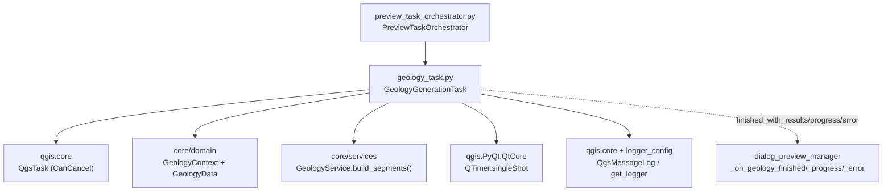
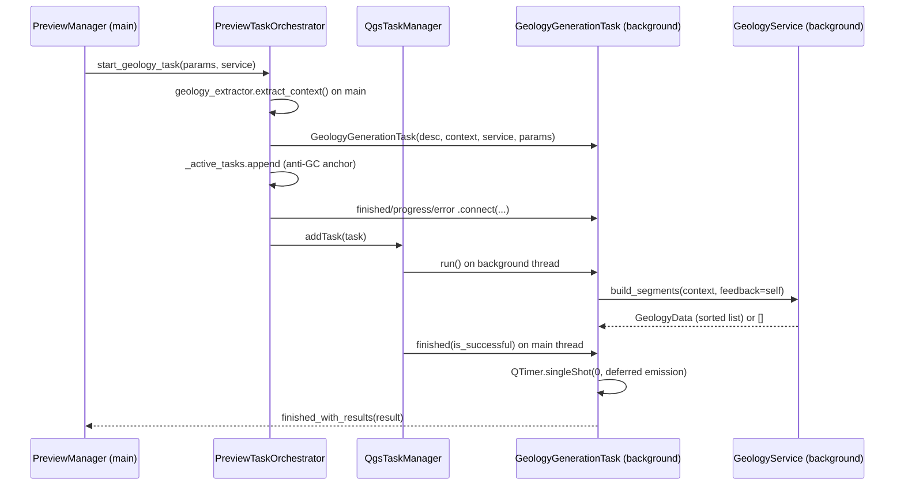

---
tags:
  - secinterp
  - code-walkthrough
  - gui
  - tasks
aliases:
  - geology_task.py
  - GeologyGenerationTask
cssclass: secinterp-note
---

# `gui/tasks/geology_task.py`

> [!abstract] One-line summary
> Cancelable `QgsTask` building geological segments in the background (`GeologyContext` + `GeologyService.build_segments()`), with deferred delivery to the main thread and a worker free of live QGIS objects.

**Path**: `gui/tasks/geology_task.py` (101 lines)
**Main class**: `GeologyGenerationTask(QgsTask)`
**Layer**: GUI · Tasks (background→main bridge; intersections in `core/`)
**Tags**: #secinterp #gui #tasks

---

## 🎯 Why does this file exist?

Intersecting the section line with outcrops plus raster sampling is the preview's heaviest compute: on the main thread it would freeze the canvas.

| Problem | Solution |
|---------|----------|
| `build_segments()` is slow and blocks the UI | Background `run()` with `GeologyService.build_segments()` |
| QGIS is not thread-safe: no layers or features in the worker | Only the `GeologyContext` DTO + a stateless service travel |
| Progress, cancellation, results, and errors must be observable | `feedback=self`, 3 signals, main-thread `finished()` |
| Hot delivery races drillhole task management | `QTimer.singleShot(0, ...)` defers emission by one cycle |

> [!important] Architectural note
> Twin of [[drillhole_task]] with three differences: service (`GeologyService`), input (`GeologyContext` with line, raster, outcrops), and output (`GeologyData`: a segment list, not a tuple). Same launcher: `PreviewTaskOrchestrator.start_geology_task()`. See [[preview_task_orchestrator]] and [[geology_service]].

---

## 🧬 Relationship diagram



> [!tip] How to read
> Solid arrow = imports/delegates; dashed = signals to the manager. The orchestrator extracts the context with `geology_extractor`, anchors the task, and queues it on `QgsApplication.taskManager()`.

---

## 📦 Imports — architectural reading

```python
# gui/tasks/geology_task.py
from __future__ import annotations

from typing import TYPE_CHECKING, Any

from qgis.core import Qgis, QgsMessageLog, QgsTask
from qgis.PyQt.QtCore import QTimer, pyqtSignal

from sec_interp.core.domain import GeologyContext, GeologyData
from sec_interp.logger_config import get_logger

if TYPE_CHECKING:
    from sec_interp.core.services.geology_service import GeologyService
```

| # | Observation |
|---|-------------|
| ① | Same import skeleton as `drillhole_task.py`: deliberate twin symmetry. |
| ② | `GeologyData` is imported at runtime to annotate `self.result`: unlike the drillhole task (`Any`), the result **has** a type here (segment list). |
| ③ | `GeologyService` under `TYPE_CHECKING`: no GUI↔core cycle; the worker only requires `build_segments()`. |
| ④ | `QTimer` + `pyqtSignal` + `QgsMessageLog`: the same trio of deferred delivery, observation, and visible reporting. |
| ⑤ | `Any` narrowed to `params`: the result is typed, only historical params stay loose. |

---

## 🏗️ Structure inventory

**Classes (1):** `GeologyGenerationTask(QgsTask)` — 3 signals + 4 methods.

**Signals:**

| Signal | Payload | Who connects (orchestrator) |
|-------|---------|-----------------------------|
| `finished_with_results` | `object` (`GeologyData`: segment list) | `manager._on_geology_finished` |
| `error_occurred` | `str` | `manager._on_geology_error` |
| `progress_changed` | `float` | `manager._on_geology_progress` |

**State:**

| Attribute | Type | Role |
|----------|------|-----|
| `service` | `GeologyService` | Injected stateless logic |
| `context` | `GeologyContext` | Detached DTO (line, raster, outcrops) |
| `params` | `Any` | Original params (compatibility) |
| `result` | `GeologyData \| None` | Segment list or `None` |
| `exception` | `Exception \| None` | `run()` exception |

**Methods:**

| Method | Signature | Thread | Role |
|--------|-------|------|-----|
| `__init__` | `(description: str, context: GeologyContext, service: GeologyService, params: Any) -> None` | Main | `CanCancel` + stores DTO/service |
| `run` | `() -> bool` | **Background** | `build_segments(context, feedback=self)` |
| `finished` | `(is_successful: bool) -> None` | Main | Normalizes to `[]`, emits deferred or reports |
| `setProgress` | `(progress: float) -> None` | Background→Main | Bridges to `progress_changed` |

---

## 📁 Files in the package

| File | Lines | Role |
|---|--:|---|
| `geology_task.py` | 101 | This note: geology task |
| `drillhole_task.py` | 107 | Twin: drillhole task (tuple result) |
| `__init__.py` | — | Package marker |

---

## 📖 Method-by-method walkthrough

### `__init__`

```python
def __init__(
    self,
    description: str,
    context: GeologyContext,
    service: GeologyService,
    params: Any,
) -> None:
    super().__init__(description, QgsTask.Flag.CanCancel)
    self.service = service
    self.context = context
    self.params = params

    self.result: GeologyData | None = None
    self.exception: Exception | None = None
```

A carbon copy of the twin except `result`'s type: `GeologyData | None` instead of `Any | None`. That single annotation documents the output contract (segment list) and lets the manager consume the payload without guessing.

### `run` (background thread)

```python
def run(self) -> bool:
    try:
        logger.info("GeologyGenerationTask started (Background Thread)")
        # Passing self as feedback object (has isCanceled and setProgress)
        self.result = self.service.build_segments(self.context, feedback=self)
        logger.info(f"GeologyGenerationTask finished with {len(self.result)} segments")
        return True

    except Exception as e:
        logger.error(f"Error in GeologyGenerationTask: {e}", exc_info=True)
        self.exception = e
        return False
```

The source comment makes the `feedback=self` trick explicit. Unlike the twin, the log counts `len(self.result)` directly: since the service guarantees a list, no `len(...) > 1` guard is needed. If the service returned `None` here, `len()` would throw inside the `try` and land in the error branch: fail-fast instead of silently delivering `None`.

> [!warning] No GUI in `run()`
> Same ban as the twin: no `iface`, no widgets, no layers. Everything visual waits for `finished()` and the `PreviewManager`.

### `finished` (main thread)

```python
def finished(self, is_successful: bool) -> None:
    try:
        if is_successful:
            if self.result is None:
                self.result = []

            res_type = type(self.result)
            res_len = len(self.result) if isinstance(self.result, list) else "N/A"
            # Defer emission to avoid race conditions during task management overhead
            QTimer.singleShot(0, lambda: self.finished_with_results.emit(self.result))
        elif self.exception:
            error_msg = str(self.exception)
            QgsMessageLog.logMessage(
                f"Geology Task Failed: {error_msg}",  # no-i18n: developer log tag
                "SecInterp",
                Qgis.MessageLevel.Critical,
            )
            self.error_occurred.emit(error_msg)
    except Exception as e:
        logger.exception(f"Critical error in GeologyGenerationTask.finished: {e}")
```

Normalizes `None` to `[]` (the manager always iterates a list), logs type/length for diagnostics, and defers emission: the comment cites races "during task management overhead", i.e. against the drillhole task running in parallel. Error branch identical to the twin with its `no-i18n` tag (developer log tags are not translated).

### `setProgress`

```python
def setProgress(self, progress: float) -> None:
    """Override to emit signal."""
    super().setProgress(progress)
    self.progress_changed.emit(progress)
```

Identical to the twin: `super()` first (native `QgsTask` state), then the signal feeding `_on_geology_progress` and the dialog bar.

## ⏱️ Full lifecycle



| Phase | Thread | Owner | Detail |
|-------|------|-------------|---------|
| Extraction | Main | `geology_extractor` | Line, raster, outcrops → `GeologyContext` |
| Construction | Main | `PreviewTaskOrchestrator` | Task + anchor + 3 connections + `addTask()` |
| Compute | Background | `GeologyService` | Per-outcrop loop with `isCanceled()` and `setProgress()` |
| Delivery | Main | `finished()` | `None` → `[]`, defers with `singleShot(0)`, emits |
| Presentation | Main | `PreviewManager` | `_on_geology_finished` → factory → `GeologyRenderer` |

> [!note] Cancellation returns an empty list, not `None`
> Unlike the drillhole twin (whose core returns `None` when canceled), `build_segments()` returns `[]` on `isCanceled()`. `finished()` normalizes anyway (`if self.result is None`), so both cooperative cancellations end as `[]` emitted like an empty success.

## 📡 Feedback: what the core does with `self`

The loop lives in `core/services/geology_service.py` (lines 62–86), decorated with `@performance_monitor` and implementing `IGeologyService`:

```python
for i, outcrop in enumerate(context.outcrops):
    if feedback and feedback.isCanceled():
        return []

    for dist_start, dist_end, wkt in outcrop.segments:
        segment_points = interpolate_segment_points(
            dist_start, dist_end,
            context.master_grid_dists,
            context.master_profile_data,
            context.tolerance,
        )
        segments.append(
            GeologySegment(
                unit_name=outcrop.unit_name,
                geometry_wkt=wkt,
                attributes=outcrop.attributes,
                points=[(float(d), float(e)) for d, e in segment_points],
            )
        )

    if feedback:
        feedback.setProgress((i / total) * 100)

segments.sort(key=lambda x: x.points[0][0] if x.points else 0)
return segments
```

| Detail | Reading |
|---------|---------|
| Cancel/progress granularity | per outcrop (not per segment): batches with one giant outcrop report little |
| `interpolate_segment_points()` | Elevates each `(dist_start, dist_end)` span over the master profile with `tolerance` |
| `GeologySegment` | `unit_name` + `geometry_wkt` + `attributes` inherited from the outcrop; `points` as plain tuples |
| Final `sort` | Ordered by distance (`points[0][0]`); point-less segments sort first (key 0) |
| `@performance_monitor` | Times the background compute without touching the UI |

## 📦 The `GeologyContext` field by field

The DTO the task carries (`core/domain/task_inputs.py`, lines 29–46), with its pieces:

| Field | Type | Content |
|-------|------|-----------|
| `master_profile_data` | `list[Point2D]` | Sampled master-profile `(dist, elev)` elevations |
| `master_grid_dists` | `list[tuple[float, Point2D, float]]` | `(dist, (x, y), elev)` grid for interpolation |
| `outcrops` | `list[OutcropSegments]` | Per-outcrop spans: `unit_name` + `attributes` + `segments` |
| `tolerance` | `float = 0.001` | Intersection sampling tolerance |

Each `OutcropSegments` contributes `segments: list[tuple[float, float, DomainGeometry]]` = `(dist_start, dist_end, wkt)` per span. Nothing live from QGIS: the worker only sees tuples, WKT, and dicts.

### Drillhole twin: differences that matter

| Aspect | `geology_task` | `drillhole_task` |
|---------|----------------|------------------|
| Service | `build_segments()` | `process_context()` |
| Core cancellation | `[]` | `None` |
| `finished()` normalization | `None` → `[]` | `None` → `([], [])` |
| `result` type | `GeologyData` (list) | `Any` (tuple) |
| Count logging | direct `len(result)` | defensive `len(...) > 1` |
| Per-entity errors | none (core catches nothing per outcrop) | per collar (`ValueError/TypeError/KeyError`, `SecInterpError`) |

The last row is the real asymmetry: a corrupt outcrop aborts the whole geology task, while a corrupt collar only skips that drillhole. The twin is more resilient per entity.

---

## 🔄 Data flow

| Phase | Thread | Input | Transformation | Output |
|-------|------|-------|----------------|--------|
| Extraction | Main | layers (line, raster, outcrops + name field, band) | `geology_extractor.extract_context()` | `GeologyContext` |
| Launch | Main | context + service | `GeologyGenerationTask("Geology Preview (Async)", ...)` + anchor + `addTask()` | queued task |
| Compute | Background | `GeologyContext`, `feedback=self` | intersections + sampling with progress/cancel | `GeologyData` or `exception` |
| Delivery | Main | `result` / `exception` | `[]` when `None` + `singleShot(0)` / `QgsMessageLog` | signals to `PreviewManager` |
| Presentation | Main | segment list | factory → layer → `GeologyRenderer` | drawn units |

---

## 🏛️ Design patterns present

| Pattern | Where | Purpose |
|---------|-------|---------|
| **Background Task (QGIS)** | `QgsTask` + `taskManager()` | Fluid UI during intersections |
| **Detached DTO** | `GeologyContext` | Worker thread safety |
| **Feedback-as-self** | `build_segments(ctx, feedback=self)` | Progress/cancel without Qt in the core |
| **Deferred emission** | `QTimer.singleShot(0, ...)` | No races with the drillhole task |
| **Observer** | 3 signals | Results, progress, errors |
| **Twin symmetry** | Same shape as `drillhole_task.py` | One mental model for both tasks |

---

## 🧾 API summary

| Symbol | Signature / Inherits | Typical use |
|--------|----------------------|-------------|
| `GeologyGenerationTask` | `QgsTask` (`CanCancel`) | `GeologyGenerationTask("Geology Preview (Async)", context, service, params)` |
| `finished_with_results` | `pyqtSignal(object)` | `GeologyData` (segment list) |
| `error_occurred` | `pyqtSignal(str)` | `str(exception)` |
| `progress_changed` | `pyqtSignal(float)` | Progress bar |
| `run` / `finished` / `setProgress` | `() -> bool` / `(bool) -> None` / `(float) -> None` | `QgsTask` lifecycle |

---

## 🛡️ Error handling

| Situation | Behavior |
|-----------|----------|
| Exception in `run()` (including `len(None)`) | Log with `exc_info`, stored `exception`, `False` |
| `result is None` on success | Normalized to `[]` |
| `finished()` itself throws | `logger.exception`, never propagates |
| Cancellation | No emission; orchestrator unwires and cleans up |
| Visible error | `QgsMessageLog` + `error_occurred` |

---

## 🧪 Associated tests

In `tests/gui/tasks/test_geology_task.py` (`TestGeologyGenerationTask`, Mock-first) and the historical mirror `tests/gui/test_geology_task.py`:

- `test_initialization` — `description()`, `context`, `service`, `result`/`exception` as `None`.
- `test_run_success` — `build_segments` returns `["segment1", "segment2"]`; asserts `True`, `result`, and the `build_segments(mock_input, feedback=task)` call.
- `test_run_error` — `side_effect = RuntimeError("Database connection failed")`; asserts `False` and stored `exception`.
- `test_finished_success` and the error branch: (deferred) emission and `QgsMessageLog`.

Related: `tests/gui/test_preview_task_orchestrator.py` (launch and cancellation), `tests/core/test_geology_service.py` + `test_geology_service_optional.py` (the worker's compute), `tests/core/test_algorithms.py` (intersections).

---

## 👀 Observations and notes

> [!success] Strengths
> - Typed `result` (`GeologyData`): a better contract than the drillhole twin's `Any`.
> - Total symmetry with `drillhole_task.py`: learning one means learning both.
> - Cooperative cancellation plus deferred emission against races.
> - Triple error reporting with no exceptions escaping the worker.

> [!warning] Points of attention
> - The log's `len(self.result)` assumes a list: a `None` from the service becomes an error (fail-fast; debatable but visible).
> - No explicit cancellation signal, like the twin.
> - Unused `params` in the worker: shared historical baggage.
> - Near-literal duplication with `drillhole_task.py`: a common `BaseGenerationTask` would remove ~80 twin lines.

> [!question] Open questions
> - Extract a `BaseGenerationTask` with `run`/`finished`/`setProgress`, parameterizing service, normalization (`[]` vs `([], [])`), and log tag?
> - An explicit cancellation signal so the preview UI can restore itself?

---

## 🔗 Related notes

- [[Index]] — vault index
- [[gui_tasks]] — family note for tasks
- [[drillhole_task]] — twin task (tuple result, same shape)
- [[preview_task_orchestrator]] — launches, anchors, and wires this task
- [[geology_service]] — `build_segments()`: background intersections
- [[geology_extractor]] — produces the `GeologyContext` on the main thread
- [[preview_layer_factory]] — turns segments into a styled layer
- [[controller]] — core orchestration and cache

---

*Note of the SecInterp Code Walkthrough v2 vault — v3.8.0*
